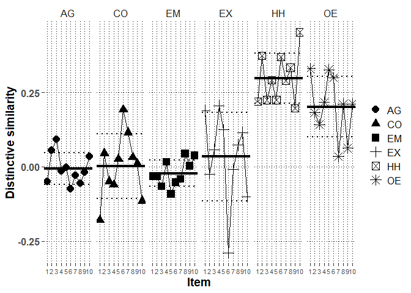

# Packages


```r
library(lme4)
library(rio)
library(lmerTest)
library(emmeans)
library(dplyr)
library(ggplot2)
library(metafor)
library(finalfit)
library(psych)
#custom functions
source("../../custom functions/custom_functions.R")
```

# Data


```r
Brit_long_fdat<-
  import("../../../data/processed/British/Brit_long_fdat.xlsx")
```

# Descriptive analysis

## Profile distinctive and normative similarity correlations


```r
mod.dat<-Brit_long_fdat %>%
  group_by(ID) %>%
  summarize(satis.z=mean(satis.z),
            commit.z=mean(commit.z),
            cor.SRc.zc=transf.rtoz(cor(PR.z,SRc.zc)),
            cor.Norm_sr.z=transf.rtoz(cor(PR.z,Norm_sr.z)),
            cor.SR=transf.rtoz(cor(PR,SR)))
```

```
## `summarise()` ungrouping output (override with `.groups` argument)
```

```r
# mean distinctive similarity
(mean.dist.sim<-transf.ztor(mean(mod.dat$cor.SRc.zc)))
```

```
## [1] 0.09934669
```

```r
# mean normative similarity
(mean.norm.sim<-transf.ztor(mean(mod.dat$cor.Norm_sr.z)))
```

```
## [1] 0.1737047
```

```r
# mean overall profile similarity
(mean.over.sim<-transf.ztor(mean(mod.dat$cor.SR)))
```

```
## [1] 0.1651043
```

```r
#correlations with moderators
print(corr.test(mod.dat[,c("cor.SRc.zc",
                     "cor.Norm_sr.z",
                     "cor.SR",
                     "satis.z",
                     "commit.z")],adjust="none"),short=F)
```

```
## Call:corr.test(x = mod.dat[, c("cor.SRc.zc", "cor.Norm_sr.z", "cor.SR", 
##     "satis.z", "commit.z")], adjust = "none")
## Correlation matrix 
##               cor.SRc.zc cor.Norm_sr.z cor.SR satis.z commit.z
## cor.SRc.zc          1.00          0.14   0.87    0.20     0.17
## cor.Norm_sr.z       0.14          1.00   0.59    0.34     0.28
## cor.SR              0.87          0.59   1.00    0.33     0.28
## satis.z             0.20          0.34   0.33    1.00     0.72
## commit.z            0.17          0.28   0.28    0.72     1.00
## Sample Size 
## [1] 292
## Probability values (Entries above the diagonal are adjusted for multiple tests.) 
##               cor.SRc.zc cor.Norm_sr.z cor.SR satis.z commit.z
## cor.SRc.zc          0.00          0.02      0       0        0
## cor.Norm_sr.z       0.02          0.00      0       0        0
## cor.SR              0.00          0.00      0       0        0
## satis.z             0.00          0.00      0       0        0
## commit.z            0.00          0.00      0       0        0
## 
##  Confidence intervals based upon normal theory.  To get bootstrapped values, try cor.ci
##             raw.lower raw.r raw.upper raw.p lower.adj upper.adj
## c.SR.-c.N_.      0.02  0.14      0.25  0.02     -0.03      0.29
## c.SR.-cr.SR      0.84  0.87      0.90  0.00      0.83      0.91
## c.SR.-sts.z      0.08  0.20      0.30  0.00      0.03      0.35
## c.SR.-cmmt.      0.06  0.17      0.28  0.00      0.01      0.33
## c.N_.-cr.SR      0.51  0.59      0.66  0.00      0.47      0.68
## c.N_.-sts.z      0.23  0.34      0.44  0.00      0.18      0.48
## c.N_.-cmmt.      0.17  0.28      0.38  0.00      0.12      0.42
## cr.SR-sts.z      0.22  0.33      0.43  0.00      0.17      0.47
## cr.SR-cmmt.      0.17  0.28      0.38  0.00      0.12      0.43
## sts.z-cmmt.      0.66  0.72      0.77  0.00      0.63      0.79
```

```r
#partial correlations with moderators

#distinctive (normative partialed)

partial.r(data=mod.dat,
          x=c("cor.SRc.zc",
                     "satis.z",
                     "commit.z"),
          y=c("cor.Norm_sr.z"))
```

```
## partial correlations 
##            cor.SRc.zc satis.z commit.z
## cor.SRc.zc       1.00    0.16     0.14
## satis.z          0.16    1.00     0.69
## commit.z         0.14    0.69     1.00
```

```r
#normative (distinctive partialed)

partial.r(data=mod.dat,
          x=c("cor.Norm_sr.z",
                     "satis.z",
                     "commit.z"),
          y=c("cor.SRc.zc"))
```

```
## partial correlations 
##               cor.Norm_sr.z satis.z commit.z
## cor.Norm_sr.z          1.00    0.32     0.26
## satis.z                0.32    1.00     0.71
## commit.z               0.26    0.71     1.00
```


# Multilevel profile analysis

## mod0: Baseline model without random effects


```r
mod0<-lmer(PR.z~SRc.zc+Norm_sr.z+(1|ID),
           data=Brit_long_fdat,
           REML=F,
           control=lmerControl(optimizer="bobyqa",
                               optCtrl=list(maxfun=2e8)))
getMOD(mod0)
```

```
## $Fixed
##               Est   SE       df     t     p    LL   UL
## (Intercept) -0.00 0.01   292.00 -0.21 0.838 -0.02 0.01
## SRc.zc       0.08 0.01 17228.00 11.29 0.000  0.07 0.10
## Norm_sr.z    0.16 0.01 17228.00 21.47 0.000  0.15 0.18
## 
## $Random
##        grp        var1 var2 est_SD est_VAR
## 1       ID (Intercept) <NA>   0.04    0.00
## 2 Residual        <NA> <NA>   1.00    0.99
## 
## $Deviance
##      Deviance n.pars
## [1,]    49588      4
```

## mod1: Baseline model with random effects


```r
mod1<-lmer(PR.z~SRc.zc+Norm_sr.z+(0+SRc.zc+Norm_sr.z|ID),
           data=Brit_long_fdat,
           REML=F,
           control=lmerControl(optimizer="bobyqa",
                               optCtrl=list(maxfun=2e8)))

getMOD(mod1)
```

```
## $Fixed
##               Est   SE       df     t     p    LL   UL
## (Intercept) -0.00 0.01 16956.77 -0.23 0.820 -0.02 0.01
## SRc.zc       0.09 0.01   297.95  6.41 0.000  0.06 0.12
## Norm_sr.z    0.16 0.02   291.94  9.39 0.000  0.13 0.19
## 
## $Random
##        grp      var1      var2 est_SD est_VAR
## 1       ID    SRc.zc      <NA>   0.20    0.04
## 2       ID Norm_sr.z      <NA>   0.26    0.07
## 3       ID    SRc.zc Norm_sr.z   0.19    0.01
## 4 Residual      <NA>      <NA>   0.94    0.88
## 
## $Deviance
##      Deviance n.pars
## [1,] 48376.89      6
```

```r
#check the CIs for random effects as well
confint(mod1, oldNames=FALSE)
```

```
## Computing profile confidence intervals ...
```

```
##                               2.5 %     97.5 %
## sd_SRc.zc|ID             0.17562390 0.22031435
## cor_Norm_sr.z.SRc.zc|ID  0.03941456 0.32564507
## sd_Norm_sr.z|ID          0.23935539 0.29190657
## sigma                    0.92907546 0.94906388
## (Intercept)             -0.01552281 0.01228674
## SRc.zc                   0.06101738 0.11504476
## Norm_sr.z                0.12678772 0.19397563
```

```r
#obtain random slope SDs for scaling purposes
(Dist.SD.mod1<-
    getREVAR(model=mod1,par="SRc.zc",
             grp="ID",type="sdcor"))
```

```
## [1] 0.1967907
```

```r
(Norm.SD.mod1<-
    getREVAR(model=mod1,par="Norm_sr.z",
             grp="ID",type="sdcor"))
```

```
## [1] 0.2640945
```

```r
#save estimates
export(summary(mod1)$coefficients,
       "../../../output/British/Brit.main.xlsx",row.names=T)

#save slope-SD estimates
export(cbind(Dist.SD.mod1,Norm.SD.mod1),
       "../../../output/British/Brit.slope.SD.xlsx",row.names=T)
```


## mod2: Moderation of similarity by relationship satisfaction


```r
mod2<-lmer(PR.z~SRc.zc+Norm_sr.z+
             satis.z+satis.z:SRc.zc+satis.z:Norm_sr.z+
             (0+SRc.zc+Norm_sr.z|ID),
           data=Brit_long_fdat,
           REML=F,
           control=lmerControl(optimizer="bobyqa",
                               optCtrl=list(maxfun=2e8)))

getMOD(mod2)
```

```
## $Fixed
##                     Est   SE       df     t     p    LL   UL
## (Intercept)       -0.00 0.01 16957.08 -0.23 0.820 -0.02 0.01
## SRc.zc             0.09 0.01   297.15  6.49 0.000  0.06 0.11
## Norm_sr.z          0.16 0.02   292.02  9.98 0.000  0.13 0.19
## satis.z           -0.00 0.01 16957.09 -0.51 0.608 -0.02 0.01
## SRc.zc:satis.z     0.05 0.01   295.81  3.46 0.001  0.02 0.07
## Norm_sr.z:satis.z  0.10 0.02   293.75  6.37 0.000  0.07 0.13
## 
## $Random
##        grp      var1      var2 est_SD est_VAR
## 1       ID    SRc.zc      <NA>   0.19    0.04
## 2       ID Norm_sr.z      <NA>   0.24    0.06
## 3       ID    SRc.zc Norm_sr.z   0.11    0.01
## 4 Residual      <NA>      <NA>   0.94    0.88
## 
## $Deviance
##      Deviance n.pars
## [1,] 48331.29      9
```

```r
#save estimates
export(summary(mod2)$coefficients,
       "../../../output/British/Brit.satis.xlsx",row.names=T)
```

### Simple slopes for distinctive similarity by satisfaction


```r
(slopes.Dist.satis.mod2<-emtrends(mod2,
         var="SRc.zc",
         specs="satis.z",
         at=list(satis.z=c(-1,0,1)),
         lmerTest.limit = 17760,
         disable.pbkrtest=T,infer=c(T,T)))
```

```
##  satis.z SRc.zc.trend     SE  df lower.CL upper.CL t.ratio p.value
##       -1       0.0407 0.0190 296  0.00321   0.0781 2.137   0.0334 
##        0       0.0873 0.0135 297  0.06082   0.1138 6.485   <.0001 
##        1       0.1340 0.0190 297  0.09647   0.1714 7.032   <.0001 
## 
## Degrees-of-freedom method: satterthwaite 
## Confidence level used: 0.95
```

```r
export(slopes.Dist.satis.mod2,
       "../../../output/British/Brit.satis.slopes.xlsx",row.names=T)
```

### Model-based effect size for relationship satisfaction in association with distinctive similarity


```r
#obtain effect by scaling the contrast between mean and mean+1SD
eff.Dist.satis.mod2<-emtrends(mod2,
         var="SRc.zc",
         specs="satis.z",
         at=list(satis.z=c(1,0,-1)),
         lmerTest.limit = 17760,
         disable.pbkrtest=T,infer=c(T,T))
pairs(eff.Dist.satis.mod2,
      scale=1/Dist.SD.mod1,adjust="none",infer=c(T,T))
```

```
##  contrast estimate     SE  df lower.CL upper.CL t.ratio p.value
##  1 - 0       0.237 0.0684 296    0.102    0.372 3.465   0.0006 
##  1 - (-1)    0.474 0.1368 296    0.205    0.743 3.465   0.0006 
##  0 - (-1)    0.237 0.0684 296    0.102    0.372 3.465   0.0006 
## 
## Degrees-of-freedom method: satterthwaite 
## Confidence level used: 0.95
```


## mod3: Moderation of similarity by relationship commitment


```r
mod3<-lmer(PR.z~SRc.zc+Norm_sr.z+
             commit.z+commit.z:SRc.zc+commit.z:Norm_sr.z+
             (0+SRc.zc+Norm_sr.z|ID),
           data=Brit_long_fdat,
           REML=F,
           control=lmerControl(optimizer="bobyqa",
                               optCtrl=list(maxfun=2e8)))

getMOD(mod3)
```

```
## $Fixed
##                      Est   SE       df     t     p    LL   UL
## (Intercept)        -0.00 0.01 16956.84 -0.23 0.820 -0.02 0.01
## SRc.zc              0.09 0.01   297.39  6.46 0.000  0.06 0.11
## Norm_sr.z           0.16 0.02   292.25  9.69 0.000  0.13 0.19
## commit.z           -0.00 0.01 16956.85 -0.48 0.634 -0.02 0.01
## SRc.zc:commit.z     0.04 0.01   292.52  3.08 0.002  0.01 0.07
## Norm_sr.z:commit.z  0.08 0.02   295.74  4.78 0.000  0.05 0.11
## 
## $Random
##        grp      var1      var2 est_SD est_VAR
## 1       ID    SRc.zc      <NA>   0.19    0.04
## 2       ID Norm_sr.z      <NA>   0.25    0.06
## 3       ID    SRc.zc Norm_sr.z   0.14    0.01
## 4 Residual      <NA>      <NA>   0.94    0.88
## 
## $Deviance
##      Deviance n.pars
## [1,] 48348.83      9
```

```r
#save estimates
export(summary(mod3)$coefficients,
       "../../../output/British/Brit.commit.xlsx",row.names=T)
```

### Simple slopes for distinctive similarity by commitment


```r
(slopes.Dist.commit.mod3<-emtrends(mod3,
         var="SRc.zc",
         specs="commit.z",
         at=list(commit.z=c(-1,0,1)),
         lmerTest.limit = 17760,
         disable.pbkrtest=T,infer=c(T,T)))
```

```
##  commit.z SRc.zc.trend     SE  df lower.CL upper.CL t.ratio p.value
##        -1       0.0458 0.0191 294  0.00828   0.0833 2.402   0.0169 
##         0       0.0873 0.0135 297  0.06069   0.1139 6.457   <.0001 
##         1       0.1288 0.0191 296  0.09117   0.1664 6.739   <.0001 
## 
## Degrees-of-freedom method: satterthwaite 
## Confidence level used: 0.95
```

```r
export(slopes.Dist.commit.mod3,
       "../../../output/British/Brit.commit.slopes.xlsx",row.names=T)
```

### Model-based effect size for relationship commitment in association with distinctive similarity


```r
#obtain effect by scaling the contrast between mean and mean+1SD
eff.Dist.commit.mod3<-emtrends(mod3,
         var="SRc.zc",
         specs="commit.z",
         at=list(commit.z=c(1,0,-1)),
         lmerTest.limit = 17760,infer=c(T,T),
         disable.pbkrtest=T)
pairs(eff.Dist.commit.mod3,scale=1/Dist.SD.mod1,
      adjust="none",infer=c(T,T))
```

```
##  contrast estimate     SE  df lower.CL upper.CL t.ratio p.value
##  1 - 0       0.211 0.0685 293    0.076    0.346 3.078   0.0023 
##  1 - (-1)    0.422 0.1370 293    0.152    0.691 3.078   0.0023 
##  0 - (-1)    0.211 0.0685 293    0.076    0.346 3.078   0.0023 
## 
## Degrees-of-freedom method: satterthwaite 
## Confidence level used: 0.95
```


## mod9: HEXACO-domain fixed main effects


```r
mod9<-lmer(PR.z~SRc.zc+Norm_sr.z+
             (0+SRc.zc+Norm_sr.z|ID)+
             domain+domain:SRc.zc+domain:Norm_sr.z,
           data=Brit_long_fdat,
           REML=F,
           control=lmerControl(optimizer="bobyqa",
                               optCtrl=list(maxfun=2e8)))

getMOD(mod9)
```

```
## $Fixed
##                      Est   SE       df     t     p    LL    UL
## (Intercept)        -0.04 0.02 17054.99 -2.54 0.011 -0.08 -0.01
## SRc.zc             -0.01 0.02  1724.43 -0.37 0.714 -0.05  0.03
## Norm_sr.z           0.27 0.03  4165.78  8.07 0.000  0.21  0.34
## domainCO            0.08 0.02 17072.30  3.08 0.002  0.03  0.12
## domainEM            0.00 0.02 17063.70  0.13 0.899 -0.04  0.05
## domainEX            0.05 0.02 17077.81  1.96 0.050 -0.00  0.10
## domainHH            0.08 0.02 17075.58  3.31 0.001  0.03  0.13
## domainOE            0.09 0.02 17058.38  3.77 0.000  0.04  0.14
## SRc.zc:domainCO     0.00 0.03 17277.68  0.04 0.966 -0.05  0.05
## SRc.zc:domainEM    -0.02 0.02 17315.63 -0.63 0.531 -0.06  0.03
## SRc.zc:domainEX     0.04 0.02 17195.89  1.80 0.072 -0.00  0.09
## SRc.zc:domainHH     0.31 0.02 17261.30 12.80 0.000  0.26  0.36
## SRc.zc:domainOE     0.22 0.03 17339.19  8.60 0.000  0.17  0.27
## Norm_sr.z:domainCO  0.05 0.03 17111.52  1.51 0.132 -0.02  0.12
## Norm_sr.z:domainEM -0.21 0.03 17123.30 -6.39 0.000 -0.27 -0.15
## Norm_sr.z:domainEX -0.28 0.05 17129.24 -6.09 0.000 -0.37 -0.19
## Norm_sr.z:domainHH  0.00 0.03 17115.72  0.13 0.893 -0.06  0.07
## Norm_sr.z:domainOE -0.18 0.03 17131.28 -5.37 0.000 -0.24 -0.11
## 
## $Random
##        grp      var1      var2 est_SD est_VAR
## 1       ID    SRc.zc      <NA>   0.19    0.04
## 2       ID Norm_sr.z      <NA>   0.26    0.07
## 3       ID    SRc.zc Norm_sr.z   0.19    0.01
## 4 Residual      <NA>      <NA>   0.92    0.85
## 
## $Deviance
##      Deviance n.pars
## [1,] 47790.35     21
```

```r
anova(mod9)
```

```
## Type III Analysis of Variance Table with Satterthwaite's method
##                   Sum Sq Mean Sq NumDF   DenDF F value    Pr(>F)    
## SRc.zc            35.211  35.211     1   299.1 41.2625 5.229e-10 ***
## Norm_sr.z         79.189  79.189     1   366.4 92.7987 < 2.2e-16 ***
## domain            23.075   4.615     5 17067.6  5.4082 5.648e-05 ***
## SRc.zc:domain    271.189  54.238     5 17302.8 63.5592 < 2.2e-16 ***
## Norm_sr.z:domain 215.525  43.105     5 17170.9 50.5131 < 2.2e-16 ***
## ---
## Signif. codes:  0 '***' 0.001 '**' 0.01 '*' 0.05 '.' 0.1 ' ' 1
```

```r
anova(mod1,mod9)
```

```
## Data: Brit_long_fdat
## Models:
## mod1: PR.z ~ SRc.zc + Norm_sr.z + (0 + SRc.zc + Norm_sr.z | ID)
## mod9: PR.z ~ SRc.zc + Norm_sr.z + (0 + SRc.zc + Norm_sr.z | ID) + domain + 
## mod9:     domain:SRc.zc + domain:Norm_sr.z
##      npar   AIC   BIC logLik deviance  Chisq Df Pr(>Chisq)    
## mod1    7 48391 48445 -24188    48377                         
## mod9   22 47834 48005 -23895    47790 586.53 15  < 2.2e-16 ***
## ---
## Signif. codes:  0 '***' 0.001 '**' 0.01 '*' 0.05 '.' 0.1 ' ' 1
```

### Marginal effects for distinctive similarity in HEXACO-domains


```r
Dist.HEXACO.mod9<-emtrends(mod9,var="SRc.zc",specs="domain",
                          lmerTest.limit = 21540,
                          disable.pbkrtest=T,infer=c(T,T))
Dist.HEXACO.mod9
```

```
##  domain SRc.zc.trend     SE   df lower.CL upper.CL t.ratio p.value
##  AG         -0.00768 0.0209 1724 -0.04876   0.0334 -0.367  0.7139 
##  CO         -0.00661 0.0212 1807 -0.04825   0.0350 -0.312  0.7554 
##  EM         -0.02328 0.0209 1679 -0.06418   0.0176 -1.117  0.2643 
##  EX          0.03600 0.0201 1472 -0.00337   0.0754  1.794  0.0730 
##  HH          0.30444 0.0203 1532  0.26469   0.3442 15.023  <.0001 
##  OE          0.21003 0.0212 1801  0.16838   0.2517  9.891  <.0001 
## 
## Degrees-of-freedom method: satterthwaite 
## Confidence level used: 0.95
```

```r
#export the domain-specific estimates
export(data.frame(test(Dist.HEXACO.mod9)),
       "../../../output/British/Brit.HEXACO.Dist.xlsx")
contrast(Dist.HEXACO.mod9,"eff",adjust="holm")
```

```
##  contrast  estimate     SE    df t.ratio p.value
##  AG effect  -0.0932 0.0161 17232 -5.787  <.0001 
##  CO effect  -0.0921 0.0164 17338 -5.633  <.0001 
##  EM effect  -0.1088 0.0160 17343 -6.815  <.0001 
##  EX effect  -0.0495 0.0153 17241 -3.225  0.0013 
##  HH effect   0.2190 0.0155 17320 14.141  <.0001 
##  OE effect   0.1245 0.0164 17320  7.587  <.0001 
## 
## Degrees-of-freedom method: satterthwaite 
## P value adjustment: holm method for 6 tests
```

```r
contrast(Dist.HEXACO.mod9,"del.eff",adjust="holm")
```

```
##  contrast  estimate     SE    df t.ratio p.value
##  AG effect  -0.1118 0.0193 17232 -5.787  <.0001 
##  CO effect  -0.1105 0.0196 17338 -5.633  <.0001 
##  EM effect  -0.1305 0.0192 17343 -6.815  <.0001 
##  EX effect  -0.0594 0.0184 17241 -3.225  0.0013 
##  HH effect   0.2627 0.0186 17320 14.141  <.0001 
##  OE effect   0.1495 0.0197 17320  7.587  <.0001 
## 
## Degrees-of-freedom method: satterthwaite 
## P value adjustment: holm method for 6 tests
```

```r
pairs(Dist.HEXACO.mod9,adjust="holm")
```

```
##  contrast estimate     SE    df t.ratio p.value
##  AG - CO  -0.00107 0.0252 17278  -0.042 1.0000 
##  AG - EM   0.01560 0.0249 17316   0.627 1.0000 
##  AG - EX  -0.04368 0.0243 17196  -1.799 0.3599 
##  AG - HH  -0.31212 0.0244 17261 -12.796 <.0001 
##  AG - OE  -0.21771 0.0253 17339  -8.605 <.0001 
##  CO - EM   0.01667 0.0251 17335   0.664 1.0000 
##  CO - EX  -0.04262 0.0246 17309  -1.734 0.3599 
##  CO - HH  -0.31106 0.0246 17310 -12.644 <.0001 
##  CO - OE  -0.21664 0.0256 17354  -8.463 <.0001 
##  EM - EX  -0.05928 0.0241 17299  -2.460 0.0833 
##  EM - HH  -0.32772 0.0243 17348 -13.479 <.0001 
##  EM - OE  -0.23331 0.0252 17340  -9.271 <.0001 
##  EX - HH  -0.26844 0.0237 17286 -11.325 <.0001 
##  EX - OE  -0.17402 0.0245 17359  -7.089 <.0001 
##  HH - OE   0.09441 0.0247 17335   3.819 0.0009 
## 
## Degrees-of-freedom method: satterthwaite 
## P value adjustment: holm method for 15 tests
```

```r
pairs(Dist.HEXACO.mod9,adjust="none")
```

```
##  contrast estimate     SE    df t.ratio p.value
##  AG - CO  -0.00107 0.0252 17278  -0.042 0.9663 
##  AG - EM   0.01560 0.0249 17316   0.627 0.5309 
##  AG - EX  -0.04368 0.0243 17196  -1.799 0.0720 
##  AG - HH  -0.31212 0.0244 17261 -12.796 <.0001 
##  AG - OE  -0.21771 0.0253 17339  -8.605 <.0001 
##  CO - EM   0.01667 0.0251 17335   0.664 0.5065 
##  CO - EX  -0.04262 0.0246 17309  -1.734 0.0829 
##  CO - HH  -0.31106 0.0246 17310 -12.644 <.0001 
##  CO - OE  -0.21664 0.0256 17354  -8.463 <.0001 
##  EM - EX  -0.05928 0.0241 17299  -2.460 0.0139 
##  EM - HH  -0.32772 0.0243 17348 -13.479 <.0001 
##  EM - OE  -0.23331 0.0252 17340  -9.271 <.0001 
##  EX - HH  -0.26844 0.0237 17286 -11.325 <.0001 
##  EX - OE  -0.17402 0.0245 17359  -7.089 <.0001 
##  HH - OE   0.09441 0.0247 17335   3.819 0.0001 
## 
## Degrees-of-freedom method: satterthwaite
```

### Marginal effects for normative similarity in HEXACO-domains


```r
Norm.HEXACO.mod9<-emtrends(mod9,var="Norm_sr.z",
                           specs="domain",
                          lmerTest.limit = 21540,
                          disable.pbkrtest=T,infer=c(T,T))
Norm.HEXACO.mod9
```

```
##  domain Norm_sr.z.trend     SE   df lower.CL upper.CL t.ratio p.value
##  AG             0.27166 0.0337 4166   0.2057   0.3376  8.073  <.0001 
##  CO             0.32356 0.0226  968   0.2793   0.3679 14.335  <.0001 
##  EM             0.06143 0.0201  611   0.0220   0.1009  3.059  0.0023 
##  EX            -0.00588 0.0374 5771  -0.0792   0.0674 -0.157  0.8749 
##  HH             0.27633 0.0230 1036   0.2313   0.3214 12.030  <.0001 
##  OE             0.09312 0.0207  691   0.0525   0.1338  4.497  <.0001 
## 
## Degrees-of-freedom method: satterthwaite 
## Confidence level used: 0.95
```

```r
test(Norm.HEXACO.mod9)
```

```
##  domain Norm_sr.z.trend     SE   df t.ratio p.value
##  AG             0.27166 0.0337 4166  8.073  <.0001 
##  CO             0.32356 0.0226  968 14.335  <.0001 
##  EM             0.06143 0.0201  611  3.059  0.0023 
##  EX            -0.00588 0.0374 5771 -0.157  0.8749 
##  HH             0.27633 0.0230 1036 12.030  <.0001 
##  OE             0.09312 0.0207  691  4.497  <.0001 
## 
## Degrees-of-freedom method: satterthwaite
```

```r
export(data.frame(test(Norm.HEXACO.mod9)),
       "../../../output/British/Brit.HEXACO.Norm.xlsx")
contrast(Norm.HEXACO.mod9,"eff",adjust="holm")
```

```
##  contrast  estimate     SE    df t.ratio p.value
##  AG effect   0.1016 0.0262 17103  3.875  0.0001 
##  CO effect   0.1535 0.0165 17186  9.295  <.0001 
##  EM effect  -0.1086 0.0142 17147 -7.658  <.0001 
##  EX effect  -0.1759 0.0294 17141 -5.984  <.0001 
##  HH effect   0.1063 0.0168 17179  6.309  <.0001 
##  OE effect  -0.0769 0.0148 17224 -5.188  <.0001 
## 
## Degrees-of-freedom method: satterthwaite 
## P value adjustment: holm method for 6 tests
```

```r
contrast(Norm.HEXACO.mod9,"del.eff",adjust="holm")
```

```
##  contrast  estimate     SE    df t.ratio p.value
##  AG effect   0.1219 0.0315 17103  3.875  0.0001 
##  CO effect   0.1842 0.0198 17186  9.295  <.0001 
##  EM effect  -0.1303 0.0170 17147 -7.658  <.0001 
##  EX effect  -0.2111 0.0353 17141 -5.984  <.0001 
##  HH effect   0.1276 0.0202 17179  6.309  <.0001 
##  OE effect  -0.0923 0.0178 17224 -5.188  <.0001 
## 
## Degrees-of-freedom method: satterthwaite 
## P value adjustment: holm method for 6 tests
```

```r
pairs(Norm.HEXACO.mod9,adjust="holm")
```

```
##  contrast estimate     SE    df t.ratio p.value
##  AG - CO  -0.05190 0.0344 17112 -1.507  0.3101 
##  AG - EM   0.21023 0.0329 17123  6.389  <.0001 
##  AG - EX   0.27754 0.0456 17129  6.090  <.0001 
##  AG - HH  -0.00467 0.0347 17116 -0.135  0.8929 
##  AG - OE   0.17854 0.0333 17131  5.366  <.0001 
##  CO - EM   0.26214 0.0214 17181 12.246  <.0001 
##  CO - EX   0.32945 0.0381 17166  8.636  <.0001 
##  CO - HH   0.04723 0.0241 17181  1.960  0.2502 
##  CO - OE   0.23044 0.0221 17226 10.448  <.0001 
##  EM - EX   0.06731 0.0366 17106  1.839  0.2638 
##  EM - HH  -0.21490 0.0218 17202 -9.841  <.0001 
##  EM - OE  -0.03170 0.0195 17220 -1.629  0.3101 
##  EX - HH  -0.28221 0.0383 17151 -7.362  <.0001 
##  EX - OE  -0.09901 0.0371 17170 -2.671  0.0454 
##  HH - OE   0.18321 0.0224 17219  8.174  <.0001 
## 
## Degrees-of-freedom method: satterthwaite 
## P value adjustment: holm method for 15 tests
```

```r
pairs(Norm.HEXACO.mod9,adjust="none")
```

```
##  contrast estimate     SE    df t.ratio p.value
##  AG - CO  -0.05190 0.0344 17112 -1.507  0.1318 
##  AG - EM   0.21023 0.0329 17123  6.389  <.0001 
##  AG - EX   0.27754 0.0456 17129  6.090  <.0001 
##  AG - HH  -0.00467 0.0347 17116 -0.135  0.8929 
##  AG - OE   0.17854 0.0333 17131  5.366  <.0001 
##  CO - EM   0.26214 0.0214 17181 12.246  <.0001 
##  CO - EX   0.32945 0.0381 17166  8.636  <.0001 
##  CO - HH   0.04723 0.0241 17181  1.960  0.0500 
##  CO - OE   0.23044 0.0221 17226 10.448  <.0001 
##  EM - EX   0.06731 0.0366 17106  1.839  0.0660 
##  EM - HH  -0.21490 0.0218 17202 -9.841  <.0001 
##  EM - OE  -0.03170 0.0195 17220 -1.629  0.1034 
##  EX - HH  -0.28221 0.0383 17151 -7.362  <.0001 
##  EX - OE  -0.09901 0.0371 17170 -2.671  0.0076 
##  HH - OE   0.18321 0.0224 17219  8.174  <.0001 
## 
## Degrees-of-freedom method: satterthwaite
```


## mod10: HEXACO-domain fixed interactions with commitment 


```r
mod10<-lmer(PR.z~SRc.zc+Norm_sr.z+
             domain+domain:SRc.zc+domain:Norm_sr.z+
             commit.z+commit.z:SRc.zc+commit.z:Norm_sr.z+
             domain:commit.z+
             domain:commit.z:SRc.zc+
             domain:commit.z:Norm_sr.z+
              (0+SRc.zc+Norm_sr.z|ID),
           data=Brit_long_fdat,
           REML=F,
           control=lmerControl(optimizer="bobyqa",
                               optCtrl=list(maxfun=2e8)))

getMOD(mod10)
```

```
## $Fixed
##                               Est   SE       df     t     p    LL    UL
## (Intercept)                 -0.04 0.02 17056.07 -2.56 0.010 -0.08 -0.01
## SRc.zc                      -0.01 0.02  1788.53 -0.37 0.713 -0.05  0.03
## Norm_sr.z                    0.27 0.03  4539.01  8.13 0.000  0.21  0.34
## domainCO                     0.08 0.02 17074.30  3.10 0.002  0.03  0.12
## domainEM                     0.00 0.02 17064.90  0.15 0.884 -0.04  0.05
## domainEX                     0.05 0.02 17079.57  1.99 0.047  0.00  0.10
## domainHH                     0.08 0.02 17077.16  3.33 0.001  0.03  0.13
## domainOE                     0.09 0.02 17059.69  3.80 0.000  0.04  0.14
## commit.z                    -0.01 0.02 17052.95 -0.40 0.692 -0.04  0.03
## SRc.zc:domainCO             -0.00 0.03 17282.95 -0.10 0.918 -0.05  0.05
## SRc.zc:domainEM             -0.01 0.02 17323.38 -0.49 0.624 -0.06  0.04
## SRc.zc:domainEX              0.04 0.02 17200.21  1.84 0.065 -0.00  0.09
## SRc.zc:domainHH              0.31 0.02 17267.47 12.49 0.000  0.26  0.35
## SRc.zc:domainOE              0.22 0.03 17349.30  8.64 0.000  0.17  0.27
## Norm_sr.z:domainCO           0.05 0.03 17114.37  1.57 0.116 -0.01  0.12
## Norm_sr.z:domainEM          -0.21 0.03 17127.24 -6.43 0.000 -0.28 -0.15
## Norm_sr.z:domainEX          -0.28 0.05 17131.79 -6.12 0.000 -0.37 -0.19
## Norm_sr.z:domainHH           0.01 0.03 17118.32  0.21 0.832 -0.06  0.08
## Norm_sr.z:domainOE          -0.18 0.03 17133.94 -5.35 0.000 -0.24 -0.11
## SRc.zc:commit.z              0.04 0.02  1583.72  2.13 0.033  0.00  0.08
## Norm_sr.z:commit.z           0.10 0.03  4560.36  3.08 0.002  0.04  0.17
## domainCO:commit.z           -0.02 0.02 17115.33 -0.82 0.413 -0.07  0.03
## domainEM:commit.z            0.03 0.02 17049.44  1.34 0.179 -0.02  0.08
## domainEX:commit.z            0.01 0.02 17092.96  0.58 0.563 -0.03  0.06
## domainHH:commit.z            0.00 0.02 17057.83  0.14 0.885 -0.04  0.05
## domainOE:commit.z            0.02 0.02 17046.45  0.74 0.459 -0.03  0.07
## SRc.zc:domainCO:commit.z    -0.03 0.02 17277.53 -1.29 0.197 -0.08  0.02
## SRc.zc:domainEM:commit.z     0.01 0.02 17300.83  0.27 0.784 -0.04  0.05
## SRc.zc:domainEX:commit.z     0.00 0.02 17227.27  0.13 0.894 -0.04  0.05
## SRc.zc:domainHH:commit.z    -0.03 0.02 17233.62 -1.29 0.199 -0.08  0.02
## SRc.zc:domainOE:commit.z     0.02 0.02 17352.86  0.87 0.385 -0.03  0.07
## Norm_sr.z:domainCO:commit.z -0.01 0.03 17134.24 -0.32 0.749 -0.08  0.06
## Norm_sr.z:domainEM:commit.z -0.07 0.03 17155.77 -2.11 0.035 -0.13 -0.00
## Norm_sr.z:domainEX:commit.z -0.11 0.05 17152.88 -2.38 0.017 -0.20 -0.02
## Norm_sr.z:domainHH:commit.z  0.02 0.03 17151.22  0.68 0.494 -0.04  0.09
## Norm_sr.z:domainOE:commit.z -0.01 0.03 17116.23 -0.25 0.802 -0.07  0.06
## 
## $Random
##        grp      var1      var2 est_SD est_VAR
## 1       ID    SRc.zc      <NA>   0.18    0.03
## 2       ID Norm_sr.z      <NA>   0.25    0.06
## 3       ID    SRc.zc Norm_sr.z   0.14    0.01
## 4 Residual      <NA>      <NA>   0.92    0.85
## 
## $Deviance
##      Deviance n.pars
## [1,] 47720.18     39
```

```r
anova(mod10)
```

```
## Type III Analysis of Variance Table with Satterthwaite's method
##                            Sum Sq Mean Sq NumDF   DenDF F value    Pr(>F)    
## SRc.zc                     35.625  35.625     1   298.6 41.8503 4.025e-10 ***
## Norm_sr.z                  84.150  84.150     1   372.3 98.8535 < 2.2e-16 ***
## domain                     23.189   4.638     5 17069.4  5.4483 5.164e-05 ***
## commit.z                    0.027   0.027     1 16959.7  0.0314  0.859453    
## SRc.zc:domain             260.170  52.034     5 17311.5 61.1260 < 2.2e-16 ***
## Norm_sr.z:domain          218.895  43.779     5 17174.9 51.4286 < 2.2e-16 ***
## SRc.zc:commit.z             7.164   7.164     1   294.0  8.4157  0.004001 ** 
## Norm_sr.z:commit.z         15.836  15.836     1   375.3 18.6035 2.060e-05 ***
## domain:commit.z             4.640   0.928     5 17075.6  1.0901  0.363474    
## SRc.zc:domain:commit.z      6.524   1.305     5 17294.1  1.5328  0.175821    
## Norm_sr.z:domain:commit.z  23.315   4.663     5 17172.7  5.4777 4.834e-05 ***
## ---
## Signif. codes:  0 '***' 0.001 '**' 0.01 '*' 0.05 '.' 0.1 ' ' 1
```

```r
#model with manually defined interactions


Brit_long_fdat$commit.z_SRc.zc<-
  Brit_long_fdat$commit.z*Brit_long_fdat$SRc.zc

Brit_long_fdat$commit.z_Norm_sr.z<-
  Brit_long_fdat$commit.z*Brit_long_fdat$Norm_sr.z

mod10.alt<-lmer(PR.z~SRc.zc+Norm_sr.z+
             domain+domain:SRc.zc+domain:Norm_sr.z+
             commit.z+commit.z_SRc.zc+commit.z_Norm_sr.z+
             domain:commit.z+
             domain:commit.z_SRc.zc+
             domain:commit.z_Norm_sr.z+
               (0+SRc.zc+Norm_sr.z|ID),
           data=Brit_long_fdat,
           REML=F,
           control=lmerControl(optimizer="bobyqa",
                               optCtrl=list(maxfun=2e8)))

#confirm that the models are identical
anova(mod10,mod10.alt)
```

```
## Data: Brit_long_fdat
## Models:
## mod10: PR.z ~ SRc.zc + Norm_sr.z + domain + domain:SRc.zc + domain:Norm_sr.z + 
## mod10:     commit.z + commit.z:SRc.zc + commit.z:Norm_sr.z + domain:commit.z + 
## mod10:     domain:commit.z:SRc.zc + domain:commit.z:Norm_sr.z + (0 + 
## mod10:     SRc.zc + Norm_sr.z | ID)
## mod10.alt: PR.z ~ SRc.zc + Norm_sr.z + domain + domain:SRc.zc + domain:Norm_sr.z + 
## mod10.alt:     commit.z + commit.z_SRc.zc + commit.z_Norm_sr.z + domain:commit.z + 
## mod10.alt:     domain:commit.z_SRc.zc + domain:commit.z_Norm_sr.z + (0 + 
## mod10.alt:     SRc.zc + Norm_sr.z | ID)
##           npar   AIC   BIC logLik deviance Chisq Df Pr(>Chisq)    
## mod10       40 47800 48111 -23860    47720                        
## mod10.alt   40 47800 48111 -23860    47720     0  0  < 2.2e-16 ***
## ---
## Signif. codes:  0 '***' 0.001 '**' 0.01 '*' 0.05 '.' 0.1 ' ' 1
```


### Marginal effects for commitment on distinctive similarity for each HEXACO domain


```r
#commitment effect on distinctive similarity separately for domains

#unscaled

(Dist.commit.domain.mod10.alt<-
  emtrends(mod10.alt,
           var="commit.z_SRc.zc",
           #by="domain",
           specs=c("domain"),
           lmerTest.limit = 17760,
           disable.pbkrtest=T,infer=c(T,T)))
```

```
##  domain commit.z_SRc.zc.trend     SE   df lower.CL upper.CL t.ratio p.value
##  AG                    0.0430 0.0202 1584  0.00347   0.0826 2.134   0.0330 
##  CO                    0.0111 0.0211 1897 -0.03036   0.0525 0.524   0.6002 
##  EM                    0.0497 0.0205 1701  0.00941   0.0900 2.419   0.0156 
##  EX                    0.0462 0.0201 1557  0.00684   0.0856 2.302   0.0215 
##  HH                    0.0129 0.0196 1448 -0.02553   0.0514 0.660   0.5094 
##  OE                    0.0640 0.0205 1670  0.02383   0.1041 3.126   0.0018 
## 
## Degrees-of-freedom method: satterthwaite 
## Confidence level used: 0.95
```

```r
export(Dist.commit.domain.mod10.alt,
       "../../../output/British/Brit.HEXACO.Dist.by.commit.xlsx")

pairs(Dist.commit.domain.mod10.alt,adjust="holm")
```

```
##  contrast estimate     SE    df t.ratio p.value
##  AG - CO   0.03197 0.0248 17278  1.291  1.0000 
##  AG - EM  -0.00664 0.0242 17301 -0.275  1.0000 
##  AG - EX  -0.00318 0.0239 17227 -0.133  1.0000 
##  AG - HH   0.03010 0.0234 17234  1.285  1.0000 
##  AG - OE  -0.02093 0.0241 17353 -0.868  1.0000 
##  CO - EM  -0.03861 0.0250 17307 -1.545  1.0000 
##  CO - EX  -0.03516 0.0247 17266 -1.424  1.0000 
##  CO - HH  -0.00187 0.0243 17302 -0.077  1.0000 
##  CO - OE  -0.05290 0.0250 17372 -2.116  0.4811 
##  EM - EX   0.00346 0.0240 17278  0.144  1.0000 
##  EM - HH   0.03674 0.0236 17286  1.557  1.0000 
##  EM - OE  -0.01429 0.0244 17363 -0.586  1.0000 
##  EX - HH   0.03328 0.0234 17260  1.424  1.0000 
##  EX - OE  -0.01775 0.0242 17382 -0.733  1.0000 
##  HH - OE  -0.05103 0.0237 17330 -2.153  0.4703 
## 
## Degrees-of-freedom method: satterthwaite 
## P value adjustment: holm method for 15 tests
```

```r
contrast(Dist.commit.domain.mod10.alt,"eff",adjust="holm")
```

```
##  contrast  estimate     SE    df t.ratio p.value
##  AG effect  0.00522 0.0155 17238  0.337  1.0000 
##  CO effect -0.02675 0.0163 17314 -1.638  0.5769 
##  EM effect  0.01186 0.0157 17314  0.756  1.0000 
##  EX effect  0.00840 0.0154 17269  0.545  1.0000 
##  HH effect -0.02488 0.0150 17278 -1.664  0.5769 
##  OE effect  0.02615 0.0157 17340  1.661  0.5769 
## 
## Degrees-of-freedom method: satterthwaite 
## P value adjustment: holm method for 6 tests
```

```r
contrast(Dist.commit.domain.mod10.alt,"del.eff",adjust="holm")
```

```
##  contrast  estimate     SE    df t.ratio p.value
##  AG effect  0.00626 0.0186 17238  0.337  1.0000 
##  CO effect -0.03210 0.0196 17314 -1.638  0.5769 
##  EM effect  0.01423 0.0188 17314  0.756  1.0000 
##  EX effect  0.01008 0.0185 17269  0.545  1.0000 
##  HH effect -0.02986 0.0179 17278 -1.664  0.5769 
##  OE effect  0.03138 0.0189 17340  1.661  0.5769 
## 
## Degrees-of-freedom method: satterthwaite 
## P value adjustment: holm method for 6 tests
```

```r
#scaled with common SD

Dist.var.common.scaled<-paste0("commit.z_SRc.zc*c(",
                        Dist.SD.mod1,")")

(Dist.commit.domain.mod10.alt.scaled<-
  emtrends(mod10.alt,
           var=Dist.var.common.scaled,
           #by="domain",
           specs=c("domain"),
           lmerTest.limit = 17760,
           disable.pbkrtest=T,infer=c(T,T)))
```

```
##  domain commit.z_SRc.zc*c(0.196790688208473).trend     SE   df lower.CL
##  AG                                         0.2187 0.1025 1584   0.0176
##  CO                                         0.0563 0.1073 1897  -0.1543
##  EM                                         0.2525 0.1044 1701   0.0478
##  EX                                         0.2349 0.1020 1557   0.0348
##  HH                                         0.0658 0.0997 1448  -0.1297
##  OE                                         0.3251 0.1040 1670   0.1211
##  upper.CL t.ratio p.value
##     0.420 2.134   0.0330 
##     0.267 0.524   0.6002 
##     0.457 2.419   0.0156 
##     0.435 2.302   0.0215 
##     0.261 0.660   0.5094 
##     0.529 3.126   0.0018 
## 
## Degrees-of-freedom method: satterthwaite 
## Confidence level used: 0.95
```

```r
export(Dist.commit.domain.mod10.alt.scaled,
       "../../../output/British/Brit.HEXACO.Dist.by.commit.scaled.xlsx")


#simple slopes

(Dist.commit.slopes.domain.mod10<-
  emtrends(mod10,
           var="SRc.zc",
           by="domain",
           specs=c("commit.z"),
           at=list(commit.z=c(-1,0,1)),      
           lmerTest.limit = 17760,
           disable.pbkrtest=T,infer=c(T,T)))
```

```
## domain = AG:
##  commit.z SRc.zc.trend     SE   df lower.CL upper.CL t.ratio p.value
##        -1    -0.050697 0.0285 1586  -0.1067  0.00526 -1.777  0.0757 
##         0    -0.007652 0.0208 1789  -0.0484  0.03314 -0.368  0.7130 
##         1     0.035392 0.0294 1786  -0.0223  0.09309  1.203  0.2291 
## 
## domain = CO:
##  commit.z SRc.zc.trend     SE   df lower.CL upper.CL t.ratio p.value
##        -1    -0.021323 0.0299 1911  -0.0800  0.03738 -0.712  0.4763 
##         0    -0.010251 0.0211 1894  -0.0517  0.03122 -0.485  0.6279 
##         1     0.000822 0.0298 1880  -0.0577  0.05936  0.028  0.9780 
## 
## domain = EM:
##  commit.z SRc.zc.trend     SE   df lower.CL upper.CL t.ratio p.value
##        -1    -0.069546 0.0290 1686  -0.1264 -0.01270 -2.400  0.0165 
##         0    -0.019859 0.0207 1744  -0.0605  0.02078 -0.958  0.3380 
##         1     0.029828 0.0294 1759  -0.0278  0.08742  1.016  0.3099 
## 
## domain = EX:
##  commit.z SRc.zc.trend     SE   df lower.CL upper.CL t.ratio p.value
##        -1    -0.009181 0.0282 1512  -0.0645  0.04609 -0.326  0.7446 
##         0     0.037047 0.0199 1520  -0.0020  0.07609  1.861  0.0629 
##         1     0.083276 0.0284 1566   0.0276  0.13892  2.935  0.0034 
## 
## domain = HH:
##  commit.z SRc.zc.trend     SE   df lower.CL upper.CL t.ratio p.value
##        -1     0.284509 0.0280 1506   0.2296  0.33944 10.160  <.0001 
##         0     0.297454 0.0202 1600   0.2579  0.33699 14.755  <.0001 
##         1     0.310398 0.0283 1540   0.2550  0.36581 10.987  <.0001 
## 
## domain = OE:
##  commit.z SRc.zc.trend     SE   df lower.CL upper.CL t.ratio p.value
##        -1     0.146843 0.0294 1775   0.0892  0.20451  4.994  <.0001 
##         0     0.210817 0.0211 1860   0.1695  0.25213 10.007  <.0001 
##         1     0.274791 0.0293 1754   0.2173  0.33233  9.367  <.0001 
## 
## Degrees-of-freedom method: satterthwaite 
## Confidence level used: 0.95
```

```r
export(data.frame(Dist.commit.slopes.domain.mod10),
       "../../../output/British/Brit.HEXACO.Dist.by.commit.slopes.xlsx")
```


## mod11: HEXACO-domain fixed interactions with commitment 


```r
mod11<-lmer(PR.z~SRc.zc+Norm_sr.z+
             domain+domain:SRc.zc+domain:Norm_sr.z+
             commit.z+commit.z:SRc.zc+commit.z:Norm_sr.z+
             domain:commit.z+
             domain:commit.z:SRc.zc+
             domain:commit.z:Norm_sr.z+
              (0+SRc.zc+Norm_sr.z|ID),
           data=Brit_long_fdat,
           REML=F,
           control=lmerControl(optimizer="bobyqa",
                               optCtrl=list(maxfun=2e8)))

getMOD(mod11)
```

```
## $Fixed
##                               Est   SE       df     t     p    LL    UL
## (Intercept)                 -0.04 0.02 17056.07 -2.56 0.010 -0.08 -0.01
## SRc.zc                      -0.01 0.02  1788.53 -0.37 0.713 -0.05  0.03
## Norm_sr.z                    0.27 0.03  4539.01  8.13 0.000  0.21  0.34
## domainCO                     0.08 0.02 17074.30  3.10 0.002  0.03  0.12
## domainEM                     0.00 0.02 17064.90  0.15 0.884 -0.04  0.05
## domainEX                     0.05 0.02 17079.57  1.99 0.047  0.00  0.10
## domainHH                     0.08 0.02 17077.16  3.33 0.001  0.03  0.13
## domainOE                     0.09 0.02 17059.69  3.80 0.000  0.04  0.14
## commit.z                    -0.01 0.02 17052.95 -0.40 0.692 -0.04  0.03
## SRc.zc:domainCO             -0.00 0.03 17282.95 -0.10 0.918 -0.05  0.05
## SRc.zc:domainEM             -0.01 0.02 17323.38 -0.49 0.624 -0.06  0.04
## SRc.zc:domainEX              0.04 0.02 17200.21  1.84 0.065 -0.00  0.09
## SRc.zc:domainHH              0.31 0.02 17267.47 12.49 0.000  0.26  0.35
## SRc.zc:domainOE              0.22 0.03 17349.30  8.64 0.000  0.17  0.27
## Norm_sr.z:domainCO           0.05 0.03 17114.37  1.57 0.116 -0.01  0.12
## Norm_sr.z:domainEM          -0.21 0.03 17127.24 -6.43 0.000 -0.28 -0.15
## Norm_sr.z:domainEX          -0.28 0.05 17131.79 -6.12 0.000 -0.37 -0.19
## Norm_sr.z:domainHH           0.01 0.03 17118.32  0.21 0.832 -0.06  0.08
## Norm_sr.z:domainOE          -0.18 0.03 17133.94 -5.35 0.000 -0.24 -0.11
## SRc.zc:commit.z              0.04 0.02  1583.72  2.13 0.033  0.00  0.08
## Norm_sr.z:commit.z           0.10 0.03  4560.36  3.08 0.002  0.04  0.17
## domainCO:commit.z           -0.02 0.02 17115.33 -0.82 0.413 -0.07  0.03
## domainEM:commit.z            0.03 0.02 17049.44  1.34 0.179 -0.02  0.08
## domainEX:commit.z            0.01 0.02 17092.96  0.58 0.563 -0.03  0.06
## domainHH:commit.z            0.00 0.02 17057.83  0.14 0.885 -0.04  0.05
## domainOE:commit.z            0.02 0.02 17046.45  0.74 0.459 -0.03  0.07
## SRc.zc:domainCO:commit.z    -0.03 0.02 17277.53 -1.29 0.197 -0.08  0.02
## SRc.zc:domainEM:commit.z     0.01 0.02 17300.83  0.27 0.784 -0.04  0.05
## SRc.zc:domainEX:commit.z     0.00 0.02 17227.27  0.13 0.894 -0.04  0.05
## SRc.zc:domainHH:commit.z    -0.03 0.02 17233.62 -1.29 0.199 -0.08  0.02
## SRc.zc:domainOE:commit.z     0.02 0.02 17352.86  0.87 0.385 -0.03  0.07
## Norm_sr.z:domainCO:commit.z -0.01 0.03 17134.24 -0.32 0.749 -0.08  0.06
## Norm_sr.z:domainEM:commit.z -0.07 0.03 17155.77 -2.11 0.035 -0.13 -0.00
## Norm_sr.z:domainEX:commit.z -0.11 0.05 17152.88 -2.38 0.017 -0.20 -0.02
## Norm_sr.z:domainHH:commit.z  0.02 0.03 17151.22  0.68 0.494 -0.04  0.09
## Norm_sr.z:domainOE:commit.z -0.01 0.03 17116.23 -0.25 0.802 -0.07  0.06
## 
## $Random
##        grp      var1      var2 est_SD est_VAR
## 1       ID    SRc.zc      <NA>   0.18    0.03
## 2       ID Norm_sr.z      <NA>   0.25    0.06
## 3       ID    SRc.zc Norm_sr.z   0.14    0.01
## 4 Residual      <NA>      <NA>   0.92    0.85
## 
## $Deviance
##      Deviance n.pars
## [1,] 47720.18     39
```

```r
anova(mod11)
```

```
## Type III Analysis of Variance Table with Satterthwaite's method
##                            Sum Sq Mean Sq NumDF   DenDF F value    Pr(>F)    
## SRc.zc                     35.625  35.625     1   298.6 41.8503 4.025e-10 ***
## Norm_sr.z                  84.150  84.150     1   372.3 98.8535 < 2.2e-16 ***
## domain                     23.189   4.638     5 17069.4  5.4483 5.164e-05 ***
## commit.z                    0.027   0.027     1 16959.7  0.0314  0.859453    
## SRc.zc:domain             260.170  52.034     5 17311.5 61.1260 < 2.2e-16 ***
## Norm_sr.z:domain          218.895  43.779     5 17174.9 51.4286 < 2.2e-16 ***
## SRc.zc:commit.z             7.164   7.164     1   294.0  8.4157  0.004001 ** 
## Norm_sr.z:commit.z         15.836  15.836     1   375.3 18.6035 2.060e-05 ***
## domain:commit.z             4.640   0.928     5 17075.6  1.0901  0.363474    
## SRc.zc:domain:commit.z      6.524   1.305     5 17294.1  1.5328  0.175821    
## Norm_sr.z:domain:commit.z  23.315   4.663     5 17172.7  5.4777 4.834e-05 ***
## ---
## Signif. codes:  0 '***' 0.001 '**' 0.01 '*' 0.05 '.' 0.1 ' ' 1
```

```r
#model with manually defined interactions


Brit_long_fdat$commit.z_SRc.zc<-
  Brit_long_fdat$commit.z*Brit_long_fdat$SRc.zc

Brit_long_fdat$commit.z_Norm_sr.z<-
  Brit_long_fdat$commit.z*Brit_long_fdat$Norm_sr.z

mod11.alt<-lmer(PR.z~SRc.zc+Norm_sr.z+
             domain+domain:SRc.zc+domain:Norm_sr.z+
             commit.z+commit.z_SRc.zc+commit.z_Norm_sr.z+
             domain:commit.z+
             domain:commit.z_SRc.zc+
             domain:commit.z_Norm_sr.z+
               (0+SRc.zc+Norm_sr.z|ID),
           data=Brit_long_fdat,
           REML=F,
           control=lmerControl(optimizer="bobyqa",
                               optCtrl=list(maxfun=2e8)))

#confirm that the models are identical
anova(mod11,mod11.alt)
```

```
## Data: Brit_long_fdat
## Models:
## mod11: PR.z ~ SRc.zc + Norm_sr.z + domain + domain:SRc.zc + domain:Norm_sr.z + 
## mod11:     commit.z + commit.z:SRc.zc + commit.z:Norm_sr.z + domain:commit.z + 
## mod11:     domain:commit.z:SRc.zc + domain:commit.z:Norm_sr.z + (0 + 
## mod11:     SRc.zc + Norm_sr.z | ID)
## mod11.alt: PR.z ~ SRc.zc + Norm_sr.z + domain + domain:SRc.zc + domain:Norm_sr.z + 
## mod11.alt:     commit.z + commit.z_SRc.zc + commit.z_Norm_sr.z + domain:commit.z + 
## mod11.alt:     domain:commit.z_SRc.zc + domain:commit.z_Norm_sr.z + (0 + 
## mod11.alt:     SRc.zc + Norm_sr.z | ID)
##           npar   AIC   BIC logLik deviance Chisq Df Pr(>Chisq)    
## mod11       40 47800 48111 -23860    47720                        
## mod11.alt   40 47800 48111 -23860    47720     0  0  < 2.2e-16 ***
## ---
## Signif. codes:  0 '***' 0.001 '**' 0.01 '*' 0.05 '.' 0.1 ' ' 1
```


### Marginal effects for commitment on distinctive similarity for entire profile and for each HEXACO domain


```r
#commitment effect on distinctive similarity separately for domains

#unscaled

(Dist.commit.domain.mod11.alt<-
  emtrends(mod11.alt,
           var="commit.z_SRc.zc",
           #by="domain",
           specs=c("domain"),
           lmerTest.limit = 17760,
           disable.pbkrtest=T,infer=c(T,T)))
```

```
##  domain commit.z_SRc.zc.trend     SE   df lower.CL upper.CL t.ratio p.value
##  AG                    0.0430 0.0202 1584  0.00347   0.0826 2.134   0.0330 
##  CO                    0.0111 0.0211 1897 -0.03036   0.0525 0.524   0.6002 
##  EM                    0.0497 0.0205 1701  0.00941   0.0900 2.419   0.0156 
##  EX                    0.0462 0.0201 1557  0.00684   0.0856 2.302   0.0215 
##  HH                    0.0129 0.0196 1448 -0.02553   0.0514 0.660   0.5094 
##  OE                    0.0640 0.0205 1670  0.02383   0.1041 3.126   0.0018 
## 
## Degrees-of-freedom method: satterthwaite 
## Confidence level used: 0.95
```

```r
export(Dist.commit.domain.mod11.alt,
       "../../../output/British/Brit.HEXACO.Dist.by.commit.xlsx")

pairs(Dist.commit.domain.mod11.alt,adjust="holm")
```

```
##  contrast estimate     SE    df t.ratio p.value
##  AG - CO   0.03197 0.0248 17278  1.291  1.0000 
##  AG - EM  -0.00664 0.0242 17301 -0.275  1.0000 
##  AG - EX  -0.00318 0.0239 17227 -0.133  1.0000 
##  AG - HH   0.03010 0.0234 17234  1.285  1.0000 
##  AG - OE  -0.02093 0.0241 17353 -0.868  1.0000 
##  CO - EM  -0.03861 0.0250 17307 -1.545  1.0000 
##  CO - EX  -0.03516 0.0247 17266 -1.424  1.0000 
##  CO - HH  -0.00187 0.0243 17302 -0.077  1.0000 
##  CO - OE  -0.05290 0.0250 17372 -2.116  0.4811 
##  EM - EX   0.00346 0.0240 17278  0.144  1.0000 
##  EM - HH   0.03674 0.0236 17286  1.557  1.0000 
##  EM - OE  -0.01429 0.0244 17363 -0.586  1.0000 
##  EX - HH   0.03328 0.0234 17260  1.424  1.0000 
##  EX - OE  -0.01775 0.0242 17382 -0.733  1.0000 
##  HH - OE  -0.05103 0.0237 17330 -2.153  0.4703 
## 
## Degrees-of-freedom method: satterthwaite 
## P value adjustment: holm method for 15 tests
```

```r
contrast(Dist.commit.domain.mod11.alt,"eff",adjust="holm")
```

```
##  contrast  estimate     SE    df t.ratio p.value
##  AG effect  0.00522 0.0155 17238  0.337  1.0000 
##  CO effect -0.02675 0.0163 17314 -1.638  0.5769 
##  EM effect  0.01186 0.0157 17314  0.756  1.0000 
##  EX effect  0.00840 0.0154 17269  0.545  1.0000 
##  HH effect -0.02488 0.0150 17278 -1.664  0.5769 
##  OE effect  0.02615 0.0157 17340  1.661  0.5769 
## 
## Degrees-of-freedom method: satterthwaite 
## P value adjustment: holm method for 6 tests
```

```r
contrast(Dist.commit.domain.mod11.alt,"del.eff",adjust="holm")
```

```
##  contrast  estimate     SE    df t.ratio p.value
##  AG effect  0.00626 0.0186 17238  0.337  1.0000 
##  CO effect -0.03210 0.0196 17314 -1.638  0.5769 
##  EM effect  0.01423 0.0188 17314  0.756  1.0000 
##  EX effect  0.01008 0.0185 17269  0.545  1.0000 
##  HH effect -0.02986 0.0179 17278 -1.664  0.5769 
##  OE effect  0.03138 0.0189 17340  1.661  0.5769 
## 
## Degrees-of-freedom method: satterthwaite 
## P value adjustment: holm method for 6 tests
```

```r
#scaled with common SD

Dist.var.common.scaled<-paste0("commit.z_SRc.zc*c(",
                        Dist.SD.mod1,")")

(Dist.commit.domain.mod11.alt.scaled<-
  emtrends(mod11.alt,
           var=Dist.var.common.scaled,
           #by="domain",
           specs=c("domain"),
           lmerTest.limit = 17760,
           disable.pbkrtest=T,infer=c(T,T)))
```

```
##  domain commit.z_SRc.zc*c(0.196790688208473).trend     SE   df lower.CL
##  AG                                         0.2187 0.1025 1584   0.0176
##  CO                                         0.0563 0.1073 1897  -0.1543
##  EM                                         0.2525 0.1044 1701   0.0478
##  EX                                         0.2349 0.1020 1557   0.0348
##  HH                                         0.0658 0.0997 1448  -0.1297
##  OE                                         0.3251 0.1040 1670   0.1211
##  upper.CL t.ratio p.value
##     0.420 2.134   0.0330 
##     0.267 0.524   0.6002 
##     0.457 2.419   0.0156 
##     0.435 2.302   0.0215 
##     0.261 0.660   0.5094 
##     0.529 3.126   0.0018 
## 
## Degrees-of-freedom method: satterthwaite 
## Confidence level used: 0.95
```

```r
export(Dist.commit.domain.mod11.alt.scaled,
       "../../../output/British/Brit.HEXACO.Dist.by.commit.scaled.xlsx")


#simple slopes

(Dist.commit.slopes.domain.mod11<-
  emtrends(mod11,
           var="SRc.zc",
           by="domain",
           specs=c("commit.z"),
           at=list(commit.z=c(-1,0,1)),      
           lmerTest.limit = 17760,
           disable.pbkrtest=T,infer=c(T,T)))
```

```
## domain = AG:
##  commit.z SRc.zc.trend     SE   df lower.CL upper.CL t.ratio p.value
##        -1    -0.050697 0.0285 1586  -0.1067  0.00526 -1.777  0.0757 
##         0    -0.007652 0.0208 1789  -0.0484  0.03314 -0.368  0.7130 
##         1     0.035392 0.0294 1786  -0.0223  0.09309  1.203  0.2291 
## 
## domain = CO:
##  commit.z SRc.zc.trend     SE   df lower.CL upper.CL t.ratio p.value
##        -1    -0.021323 0.0299 1911  -0.0800  0.03738 -0.712  0.4763 
##         0    -0.010251 0.0211 1894  -0.0517  0.03122 -0.485  0.6279 
##         1     0.000822 0.0298 1880  -0.0577  0.05936  0.028  0.9780 
## 
## domain = EM:
##  commit.z SRc.zc.trend     SE   df lower.CL upper.CL t.ratio p.value
##        -1    -0.069546 0.0290 1686  -0.1264 -0.01270 -2.400  0.0165 
##         0    -0.019859 0.0207 1744  -0.0605  0.02078 -0.958  0.3380 
##         1     0.029828 0.0294 1759  -0.0278  0.08742  1.016  0.3099 
## 
## domain = EX:
##  commit.z SRc.zc.trend     SE   df lower.CL upper.CL t.ratio p.value
##        -1    -0.009181 0.0282 1512  -0.0645  0.04609 -0.326  0.7446 
##         0     0.037047 0.0199 1520  -0.0020  0.07609  1.861  0.0629 
##         1     0.083276 0.0284 1566   0.0276  0.13892  2.935  0.0034 
## 
## domain = HH:
##  commit.z SRc.zc.trend     SE   df lower.CL upper.CL t.ratio p.value
##        -1     0.284509 0.0280 1506   0.2296  0.33944 10.160  <.0001 
##         0     0.297454 0.0202 1600   0.2579  0.33699 14.755  <.0001 
##         1     0.310398 0.0283 1540   0.2550  0.36581 10.987  <.0001 
## 
## domain = OE:
##  commit.z SRc.zc.trend     SE   df lower.CL upper.CL t.ratio p.value
##        -1     0.146843 0.0294 1775   0.0892  0.20451  4.994  <.0001 
##         0     0.210817 0.0211 1860   0.1695  0.25213 10.007  <.0001 
##         1     0.274791 0.0293 1754   0.2173  0.33233  9.367  <.0001 
## 
## Degrees-of-freedom method: satterthwaite 
## Confidence level used: 0.95
```

```r
export(data.frame(Dist.commit.slopes.domain.mod11),
       "../../../output/British/Brit.HEXACO.Dist.by.commit.slopes.xlsx")
```


## mod12: Extract item specific effects


```r
mod12<-lmer(PR.z~SRc.zc+Norm_sr.z+
             (0+SRc.zc+Norm_sr.z|ID)+
             item:SRc.zc,
           data=Brit_long_fdat,
           REML=F,
           control=lmerControl(optimizer="bobyqa",
                               optCtrl=list(maxfun=2e8)))
Brit.Dist.item.effs<-
  emtrends(mod12,var="SRc.zc",specs="item",
         lmerTest.limit = 21540,
         disable.pbkrtest=T)

#contrasts for items within domain
#OE

contrast(Brit.Dist.item.effs,
         "del.eff",include=seq(1,60,6),adjust="holm")
```

```
##  contrast     estimate     SE    df t.ratio p.value
##  hex01 effect   0.1419 0.0606 17215  2.341  0.1349 
##  hex07 effect  -0.0215 0.0584 17172 -0.368  1.0000 
##  hex13 effect  -0.0662 0.0588 17289 -1.127  1.0000 
##  hex19 effect   0.0169 0.0734 17187  0.230  1.0000 
##  hex25 effect   0.1395 0.0498 17192  2.803  0.0405 
##  hex31 effect   0.1088 0.0529 17222  2.055  0.2395 
##  hex37 effect  -0.1867 0.0643 17283 -2.902  0.0334 
##  hex43 effect   0.0109 0.0768 17225  0.142  1.0000 
##  hex49 effect  -0.1550 0.0507 17179 -3.059  0.0223 
##  hex55 effect   0.0115 0.0628 17284  0.183  1.0000 
## 
## Degrees-of-freedom method: satterthwaite 
## P value adjustment: holm method for 10 tests
```

```r
#CO
contrast(Brit.Dist.item.effs,
         "del.eff",include=seq(2,60,6),adjust="holm")
```

```
##  contrast     estimate     SE    df t.ratio p.value
##  hex02 effect -0.20238 0.0560 17191 -3.616  0.0030 
##  hex08 effect  0.04893 0.0652 17241  0.750  1.0000 
##  hex14 effect -0.05666 0.0683 17297 -0.829  1.0000 
##  hex20 effect -0.06893 0.0573 17114 -1.202  1.0000 
##  hex26 effect  0.02625 0.0519 17123  0.506  1.0000 
##  hex32 effect  0.21244 0.0629 17241  3.378  0.0066 
##  hex38 effect  0.12610 0.0707 17261  1.784  0.5207 
##  hex44 effect  0.03381 0.0585 17132  0.578  1.0000 
##  hex50 effect  0.00985 0.0522 17140  0.189  1.0000 
##  hex56 effect -0.12941 0.0626 17115 -2.067  0.3098 
## 
## Degrees-of-freedom method: satterthwaite 
## P value adjustment: holm method for 10 tests
```

```r
#AG
contrast(Brit.Dist.item.effs,
         "del.eff",include=seq(3,60,6),adjust="holm")
```

```
##  contrast     estimate     SE    df t.ratio p.value
##  hex03 effect -0.04894 0.0542 17118 -0.903  1.0000 
##  hex09 effect  0.06938 0.0596 17169  1.164  1.0000 
##  hex15 effect  0.10980 0.0592 17184  1.856  0.6344 
##  hex21 effect -0.00923 0.0526 17130 -0.175  1.0000 
##  hex27 effect  0.00353 0.0594 17099  0.059  1.0000 
##  hex33 effect -0.07590 0.0681 17148 -1.114  1.0000 
##  hex39 effect -0.02539 0.0647 17143 -0.392  1.0000 
##  hex45 effect -0.05540 0.0562 17103 -0.985  1.0000 
##  hex51 effect -0.01316 0.0586 17091 -0.225  1.0000 
##  hex57 effect  0.04530 0.0623 17067  0.727  1.0000 
## 
## Degrees-of-freedom method: satterthwaite 
## P value adjustment: holm method for 10 tests
```

```r
#EX
contrast(Brit.Dist.item.effs,
         "del.eff",include=seq(4,60,6),adjust="holm")
```

```
##  contrast     estimate     SE    df t.ratio p.value
##  hex04 effect   0.1722 0.0550 17085  3.130  0.0140 
##  hex10 effect  -0.0651 0.0566 17154 -1.150  1.0000 
##  hex16 effect   0.0254 0.0561 17123  0.453  1.0000 
##  hex22 effect   0.1899 0.0557 17101  3.408  0.0059 
##  hex28 effect   0.1019 0.0544 17082  1.872  0.3672 
##  hex34 effect  -0.3602 0.0561 17095 -6.417  <.0001 
##  hex40 effect  -0.0467 0.0598 17063 -0.781  1.0000 
##  hex46 effect   0.0436 0.0549 17070  0.795  1.0000 
##  hex52 effect   0.0901 0.0542 17266  1.664  0.4808 
##  hex58 effect  -0.1511 0.0520 17106 -2.908  0.0255 
## 
## Degrees-of-freedom method: satterthwaite 
## P value adjustment: holm method for 10 tests
```

```r
#EM
contrast(Brit.Dist.item.effs,
         "del.eff",include=seq(5,60,6),adjust="holm")
```

```
##  contrast     estimate     SE    df t.ratio p.value
##  hex05 effect  -0.0124 0.0569 17243 -0.219  1.0000 
##  hex11 effect  -0.0130 0.0750 17254 -0.173  1.0000 
##  hex17 effect  -0.0494 0.0550 17201 -0.899  1.0000 
##  hex23 effect   0.0421 0.0559 17192  0.752  1.0000 
##  hex29 effect  -0.0775 0.0542 17183 -1.430  1.0000 
##  hex35 effect  -0.0340 0.0604 17302 -0.563  1.0000 
##  hex41 effect  -0.0221 0.0520 17191 -0.424  1.0000 
##  hex47 effect   0.0731 0.0714 17308  1.024  1.0000 
##  hex53 effect   0.0274 0.0524 17176  0.522  1.0000 
##  hex59 effect   0.0660 0.0576 17224  1.146  1.0000 
## 
## Degrees-of-freedom method: satterthwaite 
## P value adjustment: holm method for 10 tests
```

```r
#HH
contrast(Brit.Dist.item.effs,
         "del.eff",include=seq(6,60,6),adjust="holm")
```

```
##  contrast     estimate     SE    df t.ratio p.value
##  hex06 effect -0.08669 0.0536 17140 -1.618  0.7391 
##  hex12 effect  0.08460 0.0482 17148  1.755  0.6336 
##  hex18 effect -0.08119 0.0591 17120 -1.374  0.9516 
##  hex24 effect -0.00613 0.0726 17276 -0.084  1.0000 
##  hex30 effect -0.08090 0.0608 17147 -1.332  0.9516 
##  hex36 effect  0.07981 0.0566 17145  1.410  0.9516 
##  hex42 effect -0.00961 0.0541 17134 -0.178  1.0000 
##  hex48 effect  0.03986 0.0660 17284  0.604  1.0000 
##  hex54 effect -0.11224 0.0530 17229 -2.119  0.3069 
##  hex60 effect  0.17251 0.0487 17162  3.546  0.0039 
## 
## Degrees-of-freedom method: satterthwaite 
## P value adjustment: holm method for 10 tests
```

```r
#combine to same frame
Brit.Dist.item.effs<-cbind(data.frame(Brit.Dist.item.effs),
      t.ratio=data.frame(test(Brit.Dist.item.effs))$t.ratio,
      p.value=data.frame(test(Brit.Dist.item.effs))$p.value,
      adj.p.value=
        data.frame(test(Brit.Dist.item.effs,adjust="holm"))$p.value)

Brit.Dist.item.effs$domain<-
  rep(c("OE","CO","AG","EX","EM","HH"),10)

Brit.Dist.item.effs$item.number<-rep(1:10,each=6)

Brit.Dist.item.effs
```

```
##     item SRc.zc.trend         SE       df    lower.CL     upper.CL     t.ratio
## 1  hex01  0.330196760 0.05885879 15711.23  0.21482676  0.445566759  5.60998197
## 2  hex02 -0.180398651 0.05382374 14917.61 -0.28589980 -0.074897498 -3.35165578
## 3  hex03 -0.050303150 0.05201373 14617.30 -0.15225662  0.051650322 -0.96711299
## 4  hex04  0.189357999 0.05338438 14945.45  0.08471807  0.293997931  3.54706766
## 5  hex05 -0.032817137 0.05448976 15102.62 -0.13962366  0.073989390 -0.60226246
## 6  hex06  0.220101544 0.05166482 14668.61  0.11883200  0.321371093  4.26018191
## 7  hex07  0.183082548 0.05623036 15365.08  0.07286438  0.293300714  3.25593761
## 8  hex08  0.045785368 0.06366251 16300.13 -0.07900012  0.170570856  0.71918889
## 9  hex09  0.056184958 0.05774476 15608.52 -0.05700148  0.169371393  0.97298793
## 10 hex10 -0.024161663 0.05494470 15133.58 -0.13185991  0.083536589 -0.43974508
## 11 hex11 -0.033321467 0.07429882 16366.73 -0.17895525  0.112312314 -0.44847908
## 12 hex12  0.374264463 0.04580439 13028.78  0.28448116  0.464047766  8.17092924
## 13 hex13  0.142871971 0.05716737 15304.93  0.03081712  0.254926825  2.49918726
## 14 hex14 -0.049247190 0.06689295 16526.61 -0.18036457  0.081870189 -0.73620896
## 15 hex15  0.092564483 0.05715891 15528.88 -0.01947365  0.204602616  1.61942357
## 16 hex16  0.057263365 0.05454476 15078.40 -0.04965098  0.164177713  1.04984172
## 17 hex17 -0.066124457 0.05284026 14762.66 -0.16969795  0.037449035 -1.25140302
## 18 hex18  0.225052108 0.05736710 15556.62  0.11260590  0.337498313  3.92301678
## 19 hex19  0.217645819 0.07183251 16832.04  0.07684655  0.358445085  3.02990674
## 20 hex20 -0.060288368 0.05515367 15216.35 -0.16839618  0.047819442 -1.09309799
## 21 hex21 -0.014565567 0.05034067 14300.75 -0.11323982  0.084108684 -0.28933995
## 22 hex22  0.205292686 0.05409918 15037.16  0.09925170  0.311333674  3.79474642
## 23 hex23  0.016220705 0.05377791 15023.73 -0.08919056  0.121631970  0.30162392
## 24 hex24  0.292607855 0.07166503 16900.73  0.15213692  0.433078792  4.08299357
## 25 hex25  0.327993383 0.04688466 13310.71  0.23609278  0.419893991  6.99575006
## 26 hex26  0.025374662 0.04943257 14097.58 -0.07151972  0.122269047  0.51331865
## 27 hex27 -0.003085922 0.05744725 15567.89 -0.11568921  0.109517364 -0.05371749
## 28 hex28  0.126101357 0.05278321 14844.96  0.02263974  0.229562974  2.38904316
## 29 hex29 -0.091407803 0.05189325 14619.56 -0.19312512  0.010309515 -1.76145850
## 30 hex30  0.225317345 0.05911928 15846.98  0.10943684  0.341197848  3.81123317
## 31 hex31  0.300347624 0.05029032 14171.26  0.20177198  0.398923264  5.97227476
## 32 hex32  0.192939945 0.06114869 16057.73  0.07308168  0.312798215  3.15525870
## 33 hex33 -0.074568233 0.06660492 16482.81 -0.20512106  0.055984592 -1.11956049
## 34 hex34 -0.289799714 0.05458546 15180.35 -0.39679379 -0.182805641 -5.30910055
## 35 hex35 -0.052225979 0.05910047 15411.73 -0.16806987  0.063617908 -0.88368131
## 36 hex36  0.369958957 0.05492580 15240.53  0.26229783  0.477620087  6.73561401
## 37 hex37  0.034423709 0.06277194 16102.47 -0.08861629  0.157463706  0.54839324
## 38 hex38  0.115233879 0.06927782 16695.08 -0.02055799  0.251025748  1.66335900
## 39 hex39 -0.029108948 0.06301778 16159.58 -0.15263078  0.094412884 -0.46191643
## 40 hex40 -0.007648554 0.05837872 15737.31 -0.12207755  0.106780439 -0.13101613
## 41 hex41 -0.041495516 0.04951935 14089.32 -0.13856000  0.055568964 -0.83796569
## 42 hex42  0.289477841 0.05205906 14694.27  0.18743556  0.391520126  5.56056620
## 43 hex43  0.212280452 0.07541682 17010.86  0.06445569  0.360105214  2.81476285
## 44 hex44  0.032173482 0.05642515 15451.14 -0.07842645  0.142773409  0.57019753
## 45 hex45 -0.056115269 0.05420640 15059.47 -0.16236641  0.050135872 -1.03521473
## 46 hex46  0.073680364 0.05329837 14962.93 -0.03079097  0.178151693  1.38241317
## 47 hex47  0.044119644 0.07042989 16698.24 -0.09393041  0.182169698  0.62643352
## 48 hex48  0.333995886 0.06483267 16401.17  0.20691682  0.461074953  5.15166061
## 49 hex49  0.062933759 0.04824666 13683.43 -0.03163632  0.157503842  1.30441687
## 50 hex50  0.010608845 0.04968987 14116.79 -0.08678986  0.108007547  0.21350117
## 51 hex51 -0.018106249 0.05662715 15500.93 -0.12910210  0.092889601 -0.31974499
## 52 hex52  0.115500908 0.05249909 14610.37  0.01259605  0.218405762  2.20005537
## 53 hex53  0.003017177 0.05022711 14215.73 -0.09543454  0.101468892  0.06007068
## 54 hex54  0.197106382 0.05108073 14414.70  0.09698159  0.297231178  3.85872297
## 55 hex55  0.212772118 0.06122249 15961.63  0.09276915  0.332775085  3.47539170
## 56 hex56 -0.114721044 0.06060535 15959.48 -0.23351436  0.004072268 -1.89291944
## 57 hex57  0.034515550 0.06052410 16011.64 -0.08411847  0.153149572  0.57027779
## 58 hex58 -0.101574744 0.05018873 14251.59 -0.19995121 -0.003198282 -2.02385556
## 59 hex59  0.037755848 0.05588129 15374.96 -0.07177809  0.147289789  0.67564380
## 60 hex60  0.453381104 0.04642320 13233.85  0.36238499  0.544377222  9.76626187
##         p.value  adj.p.value domain item.number
## 1  2.057610e-08 1.131685e-06     OE           1
## 2  8.052935e-04 3.462762e-02     CO           1
## 3  3.335036e-01 1.000000e+00     AG           1
## 4  3.907373e-04 1.758318e-02     EX           1
## 5  5.470085e-01 1.000000e+00     EM           1
## 6  2.055342e-05 1.048224e-03     HH           1
## 7  1.132634e-03 4.757062e-02     OE           2
## 8  4.720349e-01 1.000000e+00     CO           2
## 9  3.305744e-01 1.000000e+00     AG           2
## 10 6.601280e-01 1.000000e+00     EX           2
## 11 6.538134e-01 1.000000e+00     EM           2
## 12 3.340995e-16 1.971187e-14     HH           2
## 13 1.245824e-02 4.734133e-01     OE           3
## 14 4.616140e-01 1.000000e+00     CO           3
## 15 1.053765e-01 1.000000e+00     AG           3
## 16 2.938077e-01 1.000000e+00     EX           3
## 17 2.108073e-01 1.000000e+00     EM           3
## 18 8.782282e-05 4.303318e-03     HH           3
## 19 2.450005e-03 9.800019e-02     OE           4
## 20 2.743681e-01 1.000000e+00     CO           4
## 21 7.723254e-01 1.000000e+00     AG           4
## 22 1.483739e-04 6.825201e-03     EX           4
## 23 7.629429e-01 1.000000e+00     EM           4
## 24 4.466385e-05 2.233193e-03     HH           4
## 25 2.764558e-12 1.603444e-10     OE           5
## 26 6.077365e-01 1.000000e+00     CO           5
## 27 9.571609e-01 1.000000e+00     AG           5
## 28 1.690473e-02 6.254749e-01     EX           5
## 29 7.818173e-02 1.000000e+00     EM           5
## 30 1.387982e-04 6.523514e-03     HH           5
## 31 2.395670e-09 1.341575e-07     OE           6
## 32 1.606518e-03 6.586725e-02     CO           6
## 33 2.629174e-01 1.000000e+00     AG           6
## 34 1.117188e-07 5.921096e-06     EX           6
## 35 3.768821e-01 1.000000e+00     EM           6
## 36 1.690822e-11 9.637686e-10     HH           6
## 37 5.834295e-01 1.000000e+00     OE           7
## 38 9.625937e-02 1.000000e+00     CO           7
## 39 6.441475e-01 1.000000e+00     AG           7
## 40 8.957642e-01 1.000000e+00     EX           7
## 41 4.020642e-01 1.000000e+00     EM           7
## 42 2.735879e-08 1.477375e-06     HH           7
## 43 4.886932e-03 1.905903e-01     OE           8
## 44 5.685520e-01 1.000000e+00     CO           8
## 45 3.005853e-01 1.000000e+00     AG           8
## 46 1.668655e-01 1.000000e+00     EX           8
## 47 5.310392e-01 1.000000e+00     EM           8
## 48 2.611819e-07 1.358146e-05     HH           8
## 49 1.921134e-01 1.000000e+00     OE           9
## 50 8.309392e-01 1.000000e+00     CO           9
## 51 7.491660e-01 1.000000e+00     AG           9
## 52 2.781857e-02 1.000000e+00     EX           9
## 53 9.521002e-01 1.000000e+00     EM           9
## 54 1.144777e-04 5.494928e-03     HH           9
## 55 5.114629e-04 2.250437e-02     OE          10
## 56 5.838666e-02 1.000000e+00     CO          10
## 57 5.684973e-01 1.000000e+00     AG          10
## 58 4.300364e-02 1.000000e+00     EX          10
## 59 4.992770e-01 1.000000e+00     EM          10
## 60 1.871233e-22 1.122740e-20     HH          10
```

```r
#save
export(Brit.Dist.item.effs,
       "../../../output/British/Brit.Dist.item.effs.xlsx")
```

### Plot item specific effects


```r
#save the domain means to different frames
Brit.Dist.dom.means<-Brit.Dist.item.effs %>%
  group_by(domain) %>%
  summarize(SRc.zc.trend=mean(SRc.zc.trend))
```

```
## `summarise()` ungrouping output (override with `.groups` argument)
```

```r
Brit.Dist.dom.sds<-Brit.Dist.item.effs %>%
  group_by(domain) %>%
  summarize(SRc.zc.trend.sd=sd(SRc.zc.trend))
```

```
## `summarise()` ungrouping output (override with `.groups` argument)
```

```r
Brit.Dist.dom.means$LL<-
  Brit.Dist.dom.means$SRc.zc.trend-
  Brit.Dist.dom.sds$SRc.zc.trend.sd

Brit.Dist.dom.means$UL<-
  Brit.Dist.dom.means$SRc.zc.trend+
  Brit.Dist.dom.sds$SRc.zc.trend.sd

Brit.Dist.dom.means
```

```
## # A tibble: 6 x 4
##   domain SRc.zc.trend      LL     UL
##   <chr>         <dbl>   <dbl>  <dbl>
## 1 AG         -0.00626 -0.0591 0.0466
## 2 CO          0.00175 -0.107  0.110 
## 3 EM         -0.0216  -0.0668 0.0235
## 4 EX          0.0344  -0.114  0.183 
## 5 HH          0.298    0.214  0.382 
## 6 OE          0.202    0.100  0.305
```

```r
#Distinctive similarity
Fig1<-ggplot(data=Brit.Dist.item.effs,
             aes(x=as.factor(item.number),y=SRc.zc.trend,group=domain))+
  geom_point(size=4,aes(shape=domain))+
  geom_line()+
  ylab("Distinctive similarity")+
  xlab("Item")+
  geom_hline(aes(yintercept=SRc.zc.trend),
             Brit.Dist.dom.means,linetype=1,size=1.5)+
  geom_hline(aes(yintercept=LL),
             Brit.Dist.dom.means,linetype=3,size=1)+
  geom_hline(aes(yintercept=UL),
             Brit.Dist.dom.means,linetype=3,size=1)+
  theme(axis.text.y=element_text(size=12,face="bold",family="sans"),
        axis.title.y=element_text(size=14,face="bold",family="sans"),
        axis.text.x=element_text(size=8,family="sans"),
        axis.title.x=element_text(size=14,face="bold",family="sans"),
        strip.background =element_rect(fill="white"),
        panel.grid.major = element_line(linetype=3,color="black"),
        legend.title=element_blank(),
        legend.text=element_text(size=12,family="sans"),
        panel.background = element_rect(fill="white"),
        legend.key = element_rect(colour = NA, fill = NA))+
  facet_wrap(~domain,ncol=6)+ 
  theme(strip.text.x = element_text(size = 12))

Fig1
```

<!-- -->


# Custom functions


```r
getFE<-function(model){
  require(finalfit) #install this package first (it helps having the correct sign for rounded numbers that are near zero)
  coefs<-data.frame(summary(model)$coefficients) #obtain fixed effects
  names.temp<-rownames(coefs) #save the names of the fixed effects
  coefs$lower<-coefs[,1]-qt(p=.975,df=coefs[,"df"])*coefs[,2] #lower confidence 
  coefs$upper<-coefs[,1]+qt(p=.975,df=coefs[,"df"])*coefs[,2] #upper confidence
  coefs<-cbind.data.frame(Est=round_tidy(coefs[,1],2),
                          SE=round_tidy(coefs[,2],2),
                          df=round_tidy(coefs[,3],2),
                          t=round_tidy(coefs[,4],2),
                          p=round_tidy(coefs[,5],3),
                          LL=round_tidy(coefs$lower,2),
                          UL=round_tidy(coefs$upper,2)) #construct new output frame
  rownames(coefs)<-names.temp #add effect names
  
  return(coefs) #print the output
}


getVC<-function(model){
  require(finalfit)
  VC<-as.data.frame(VarCorr(model))
  VC<-cbind(VC[,c(1:3)],
            est_SD=round_tidy(VC[,5],2),
            est_VAR=round_tidy(VC[,4],2))
  return(VC)
}

getDEV<-function(model){
  DEV<-unname(summary(model)$devcomp$cmp["dev"])
  n.pars<-sum(getME(model,"p"),
              getME(model,"m"))
  output<-cbind(Deviance=DEV,n.pars=n.pars)
  return(output)
}

getMOD<-function(model){
  Fixed<-getFE(model)
  Random<-getVC(model)
  Deviance<-getDEV(model)
  output<-list(Fixed=Fixed,
               Random=Random,
               Deviance=Deviance)
  return(output)
}

getREVAR<-function(model,par,grp,type){
  d<-as.data.frame(VarCorr(model))
  d[d$var1==par & is.na(d$var2) & d$grp==grp,type][1]
  
}


getR2Dist_satisSlope<-function(model,cl.par){
  v.full<-as.numeric(r2mlm(model)$R2["v","within"])
  red.mod<-update(model,.~.-satis.z:SRc.zc)
  v.red<-as.numeric(r2mlm(red.mod)$R2["v","within"])
  R2.slope<-(v.red-v.full)/v.red
  output<-c(v.red=v.red,
            v.full=v.full,
            R2.slope=R2.slope,
            R.slope=sqrt(R2.slope))
  return(output)
}


getR2Norm_satisSlope<-function(model,cl.par){
  v.full<-as.numeric(r2mlm(model)$R2["v","within"])
  red.mod<-update(model,.~.-satis.z:Norm_sr.z)
  v.red<-as.numeric(r2mlm(red.mod)$R2["v","within"])
  R2.slope<-(v.red-v.full)/v.red
  output<-c(v.red=v.red,
            v.full=v.full,
            R2.slope=R2.slope,
            R.slope=sqrt(R2.slope))
  return(output)
}


getR2Dist_commitSlope<-function(model,cl.par){
  v.full<-as.numeric(r2mlm(model)$R2["v","within"])
  red.mod<-update(model,.~.-commit.z:SRc.zc)
  v.red<-as.numeric(r2mlm(red.mod)$R2["v","within"])
  R2.slope<-(v.red-v.full)/v.red
  output<-c(v.red=v.red,
            v.full=v.full,
            R2.slope=R2.slope,
            R.slope=sqrt(R2.slope))
  return(output)
}


getR2Norm_commitSlope<-function(model,cl.par){
  v.full<-as.numeric(r2mlm(model)$R2["v","within"])
  red.mod<-update(model,.~.-commit.z:Norm_sr.z)
  v.red<-as.numeric(r2mlm(red.mod)$R2["v","within"])
  R2.slope<-(v.red-v.full)/v.red
  output<-c(v.red=v.red,
            v.full=v.full,
            R2.slope=R2.slope,
            R.slope=sqrt(R2.slope))
  return(output)
}


#function to rescale from 1 to 9 to 1 to 5

rescale.commit<-function(var){
  var[var==2]<-1.5
  var[var==3]<-2
  var[var==4]<-2.5
  var[var==5]<-3
  var[var==6]<-3.5
  var[var==7]<-4
  var[var==8]<-4.5
  var[var==9]<-5
  return(var)
  
}

#get rid of commas as decimals

commas.to.dots<-function(var){
  as.numeric(sub(",",".",var))
}

#obtain item deviations from domain means from the pooled estimates

test.item.mod<-function(model){
  items<-attr(model$yi,which = "slab")
  estimates<-model$yi[1:length(items)]
  vi<-model$vi
  
  mdat<-data.frame(items=items,
                   estimates=estimates,
                   vi=vi)
  
  mod.effs<-data.frame(matrix(ncol=7,nrow=length(items)))
  del.effs<-data.frame(matrix(ncol=7,nrow=length(items)))
  
  for (i in 1:length(items)){
    
    mod.effs[i,1]<-items[i]
    del.effs[i,1]<-items[i]
    
    mdat$mod<-ifelse(mdat$items==items[i],1,0)
    
    mod.mod<-rma.uni(yi=estimates,
                     vi=vi,
                     mods=~mod,
                     data=mdat,
                     method="ML")
    
    mod.effs[i,2:7]<-
      c(summary(mod.mod)$beta[2],
        summary(mod.mod)$se[2],
        summary(mod.mod)$zval[2],
        summary(mod.mod)$pval[2],
        summary(mod.mod)$ci.lb[2],
        summary(mod.mod)$ci.ub[2])
    
    del.effs[i,2:7]<-
      c(summary(mod.mod)$beta[1],
        summary(mod.mod)$se[1],
        summary(mod.mod)$zval[1],
        summary(mod.mod)$pval[1],
        summary(mod.mod)$ci.lb[1],
        summary(mod.mod)$ci.ub[1])
  }
  
  colnames(mod.effs)<-
    c("item","mod.est","se","z","p","LL","UL")
  
  colnames(del.effs)<-
    c("item","del.est","se","z","p","LL","UL")
  
  mod.effs$p.adj<-p.adjust(mod.effs$p,method = "holm")
  
  output<-list(mod.effs,del.effs)
  return(output)
}

#simulation function that generates item responses based on weighting
#and individual dispersion

## for single items

gen.std<-function(weight){
  sr<-rnorm(1)
  pr<-weight*sr+rnorm(1,sd=sqrt(1-weight^2))
  output<-c(sr,pr)
  return(output)
}

## for entire profile

gen.std.prof<-function(weight,n.items){
  sr<-rnorm(n.items)
  pr<-weight*sr+rnorm(n.items,sd=sqrt(1-weight^2))
  output<-cbind(sr,pr)
  return(output)
}


#fixed effects without rounding (for simulations)

getFEraw<-function(model){
  #require(finalfit) #install this package first (it helps having the correct sign for rounded numbers that are near zero)
  coefs<-data.frame(summary(model)$coefficients) #obtain fixed effects
  names.temp<-rownames(coefs) #save the names of the fixed effects
  coefs$lower<-coefs[,1]-qt(p=.975,df=coefs[,"df"])*coefs[,2] #lower confidence 
  coefs$upper<-coefs[,1]+qt(p=.975,df=coefs[,"df"])*coefs[,2] #upper confidence
  coefs<-cbind.data.frame(Est=coefs[,1],
                          SE=coefs[,2],
                          df=coefs[,3],
                          t=coefs[,4],
                          p=coefs[,5],
                          LL=coefs$lower,
                          UL=coefs$upper) #construct new output frame
  rownames(coefs)<-names.temp #add effect names
  
  return(coefs) #print the output
}

#power simulation function

prof_mod_power<-function(n,
                         n.item,
                         CL.cor,
                         mean.Dist,
                         sd.Dist,
                         wi.rand=F,
                         sd.Dist.wi){
  require(dplyr)
  require(metafor)
  require(lme4)
  require(lmerTest)
  #generate moderator that with standard normal distribution
  Rel<-rnorm(n,mean=0,sd=1)
  #generate similarity correlations for each participant
  #that is dependent on the moderator
  Dist<-CL.cor*Rel+rnorm(n,mean=mean.Dist/sd.Dist,sd=sqrt(1-CL.cor^2))
  #scale similarity correlations to given parameters
  Dist<-Dist*sd.Dist
  
  #generate individual level data
  
  #data list to save the individually generated data frames
  dat.list<-list()
  
  if (wi.rand) {
    for (i in 1:n){
      #generate item-specific distribution of similarity
      #based on person's mean similarity, and some dispersion
      item.Dist<-rnorm(n.item,mean=Dist[i],sd=sd.Dist.wi)
      #save to a frame alongside ID-variable and the moderator
      dat.list[[i]]<-
        cbind.data.frame(ID=paste0("ID",i),Rel=Rel[i],
                         t(sapply(item.Dist,gen.std)))
    }
  } else {
    for (i in 1:n){
      #generate general distribution of similarity
      #for each subject
      
      #save to a frame alongside ID-variable and the moderator
      dat.list[[i]]<-
        cbind.data.frame(ID=paste0("ID",i),Rel=Rel[i],
                         gen.std.prof(weight=Dist[i],
                                      n.item = n.item))
    }
  }
  
  
  
  #combine all participants to same long format data file
  dat<-do.call(rbind.data.frame,dat.list)
  #name the columns in the data
  colnames(dat)<-c("ID","Rel","sr","pr")
  
  #fit model without cross-level interaction
  mod1<-lmerTest::lmer(pr~sr+Rel+(0+sr|ID),data=dat,REML=F)
  #obtain the slope SD for scaling
  slope.SD<-getREVAR(mod1,par="sr",grp="ID",type="sdcor")
  #obtain the slope var for effect size
  slope.var.mod1<-getREVAR(mod1,par="sr",grp="ID",type="vcov")
  
  #fit model with the cross-level interaction
  mod2<-lmerTest::lmer(pr~sr+Rel+sr:Rel+(0+sr|ID),data=dat,REML=F)
  #obtain estimate and p-value
  CL.eff<-getFEraw(mod2)[4,c("Est","p")]
  #obtain the slope var for effect size
  slope.var.mod2<-getREVAR(mod2,par="sr",grp="ID",type="vcov")
  #scale the fixed slope with slope SD from the reduced model
  CL.eff$scaled<-CL.eff$Est/slope.SD
  #obtain empirical correlations
  emp.cor.dat<-dat %>%
    group_by(ID) %>%
    summarise(emp.cor=cor(sr,pr),
              emp.cor.z=transf.rtoz(cor(sr,pr)),
              Rel=mean(Rel))
  emp.cors<-cor(emp.cor.dat[,2:4])[3,1:2]
  
  #reduction in slope variance
  R2=(slope.var.mod1-slope.var.mod2)/slope.var.mod1
  R=sqrt(R2)
  
  #correlation between moderator and posterior mode slopes from the reduced model
  re.mod1<-data.frame(ranef(mod1)$ID)
  re.mod1$ID<-rownames(re.mod1)
  re.mod1<-left_join(re.mod1,emp.cor.dat,by="ID")
  re.cor<-cor(re.mod1$sr,re.mod1$Rel)
  
  #scaling that accounts for residual
  res.SD.mod2<-as.data.frame(VarCorr(mod2))[2,5]
  CL.eff$scaled.res<-CL.eff$Est/(slope.SD/res.SD.mod2)
  
  #combine results
  results<-cbind(CL.eff,
                 slope.SD,
                 lvl.2.cor=cor(Rel,Dist),
                 emp.cor=emp.cors[1],
                 emp.cor.z=emp.cors[2],
                 R2,
                 R,
                 re.cor)
  #export
  return(results)
  
}
```


# Session information


```r
sI <- sessionInfo()
print(sI, locale = FALSE)
```

```
## R version 4.0.3 (2020-10-10)
## Platform: x86_64-w64-mingw32/x64 (64-bit)
## Running under: Windows 10 x64 (build 19041)
## 
## Matrix products: default
## 
## attached base packages:
## [1] stats     graphics  grDevices utils     datasets  methods   base     
## 
## other attached packages:
##  [1] psych_2.0.9        finalfit_1.0.2     metafor_2.4-0      ggplot2_3.3.2     
##  [5] dplyr_1.0.2        emmeans_1.5.5-9004 lmerTest_3.1-2     rio_0.5.16        
##  [9] lme4_1.1-23        Matrix_1.2-18     
## 
## loaded via a namespace (and not attached):
##  [1] Rcpp_1.0.5          mvtnorm_1.1-1       lattice_0.20-41    
##  [4] tidyr_1.1.2         zoo_1.8-8           digest_0.6.25      
##  [7] utf8_1.2.1          plyr_1.8.6          R6_2.4.1           
## [10] cellranger_1.1.0    backports_1.1.10    evaluate_0.14      
## [13] coda_0.19-4         pillar_1.5.1        rlang_0.4.10       
## [16] curl_4.3            multcomp_1.4-14     readxl_1.3.1       
## [19] rstudioapi_0.11     minqa_1.2.4         data.table_1.14.0  
## [22] nloptr_1.2.2.2      rmarkdown_2.5       labeling_0.3       
## [25] splines_4.0.3       statmod_1.4.34      stringr_1.4.0      
## [28] foreign_0.8-80      munsell_0.5.0       broom_0.7.1        
## [31] compiler_4.0.3      numDeriv_2016.8-1.1 xfun_0.19          
## [34] pkgconfig_2.0.3     mnormt_2.0.2        tmvnsim_1.0-2      
## [37] htmltools_0.5.0     tidyselect_1.1.0    tibble_3.0.3       
## [40] codetools_0.2-16    fansi_0.4.1         crayon_1.4.1       
## [43] withr_2.2.0         MASS_7.3-53         grid_4.0.3         
## [46] nlme_3.1-149        xtable_1.8-4        gtable_0.3.0       
## [49] lifecycle_1.0.0     magrittr_1.5        scales_1.1.1       
## [52] zip_2.1.1           cli_2.4.0           estimability_1.3   
## [55] stringi_1.5.3       farver_2.0.3        mice_3.11.0        
## [58] ellipsis_0.3.1      generics_0.0.2      vctrs_0.3.7        
## [61] boot_1.3-25         sandwich_3.0-0      openxlsx_4.2.2     
## [64] TH.data_1.0-10      tools_4.0.3         forcats_0.5.0      
## [67] glue_1.4.2          purrr_0.3.4         hms_0.5.3          
## [70] parallel_4.0.3      survival_3.2-7      yaml_2.2.1         
## [73] colorspace_1.4-1    knitr_1.30          haven_2.3.1
```
