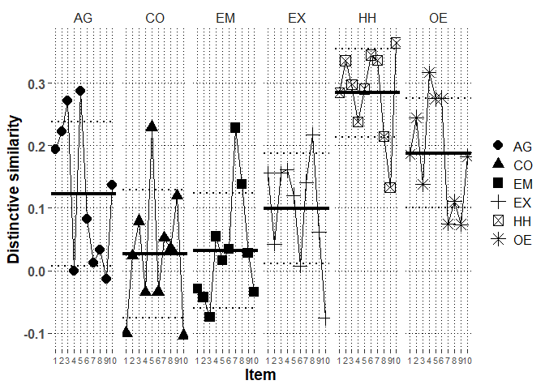

# Packages


```r
library(lme4)
library(rio)
library(lmerTest)
library(emmeans)
library(dplyr)
library(ggplot2)
library(metafor)
library(finalfit)
library(psych)
#custom functions
source("../../custom functions/custom_functions.R")
```

# Data


```r
Chi1_long_fdat<-
  import("../../../data/processed/Chinese 1/Chi1_long_fdat.xlsx")
```

# Descriptive analysis

## Profile distinctive and normative similarity correlations


```r
mod.dat<-Chi1_long_fdat %>%
  group_by(ID) %>%
  summarize(satis.z=mean(satis.z),
            commit.z=mean(commit.z),
            cor.SRc.zc=transf.rtoz(cor(PR.z,SRc.zc)),
            cor.Norm_sr.z=transf.rtoz(cor(PR.z,Norm_sr.z)),
            cor.SR=transf.rtoz(cor(PR,SR)))
```

```
## `summarise()` ungrouping output (override with `.groups` argument)
```

```r
# mean distinctive similarity
(mean.dist.sim<-transf.ztor(mean(mod.dat$cor.SRc.zc)))
```

```
## [1] 0.1427909
```

```r
# mean normative similarity
(mean.norm.sim<-transf.ztor(mean(mod.dat$cor.Norm_sr.z)))
```

```
## [1] 0.3847468
```

```r
# mean overall profile similarity
(mean.over.sim<-transf.ztor(mean(mod.dat$cor.SR)))
```

```
## [1] 0.3196184
```

```r
#correlations with moderators
print(corr.test(mod.dat[,c("cor.SRc.zc",
                     "cor.Norm_sr.z",
                     "cor.SR",
                     "satis.z",
                     "commit.z")],adjust="none"),short=F)
```

```
## Call:corr.test(x = mod.dat[, c("cor.SRc.zc", "cor.Norm_sr.z", "cor.SR", 
##     "satis.z", "commit.z")], adjust = "none")
## Correlation matrix 
##               cor.SRc.zc cor.Norm_sr.z cor.SR satis.z commit.z
## cor.SRc.zc          1.00          0.39   0.94    0.37     0.26
## cor.Norm_sr.z       0.39          1.00   0.64    0.40     0.36
## cor.SR              0.94          0.64   1.00    0.40     0.32
## satis.z             0.37          0.40   0.40    1.00     0.65
## commit.z            0.26          0.36   0.32    0.65     1.00
## Sample Size 
## [1] 141
## Probability values (Entries above the diagonal are adjusted for multiple tests.) 
##               cor.SRc.zc cor.Norm_sr.z cor.SR satis.z commit.z
## cor.SRc.zc             0             0      0       0        0
## cor.Norm_sr.z          0             0      0       0        0
## cor.SR                 0             0      0       0        0
## satis.z                0             0      0       0        0
## commit.z               0             0      0       0        0
## 
##  Confidence intervals based upon normal theory.  To get bootstrapped values, try cor.ci
##             raw.lower raw.r raw.upper raw.p lower.adj upper.adj
## c.SR.-c.N_.      0.24  0.39      0.52     0      0.17      0.57
## c.SR.-cr.SR      0.92  0.94      0.96     0      0.90      0.96
## c.SR.-sts.z      0.22  0.37      0.51     0      0.15      0.56
## c.SR.-cmmt.      0.10  0.26      0.41     0      0.03      0.47
## c.N_.-cr.SR      0.54  0.64      0.73     0      0.48      0.76
## c.N_.-sts.z      0.25  0.40      0.53     0      0.18      0.58
## c.N_.-cmmt.      0.21  0.36      0.50     0      0.14      0.55
## cr.SR-sts.z      0.25  0.40      0.53     0      0.18      0.58
## cr.SR-cmmt.      0.16  0.32      0.46     0      0.09      0.52
## sts.z-cmmt.      0.54  0.65      0.73     0      0.48      0.76
```

```r
#partial correlations with moderators

#distinctive (normative partialed)

partial.r(data=mod.dat,
          x=c("cor.SRc.zc",
                     "satis.z",
                     "commit.z"),
          y=c("cor.Norm_sr.z"))
```

```
## partial correlations 
##            cor.SRc.zc satis.z commit.z
## cor.SRc.zc       1.00    0.26     0.14
## satis.z          0.26    1.00     0.59
## commit.z         0.14    0.59     1.00
```

```r
#normative (distinctive partialed)

partial.r(data=mod.dat,
          x=c("cor.Norm_sr.z",
                     "satis.z",
                     "commit.z"),
          y=c("cor.SRc.zc"))
```

```
## partial correlations 
##               cor.Norm_sr.z satis.z commit.z
## cor.Norm_sr.z           1.0    0.30     0.30
## satis.z                 0.3    1.00     0.61
## commit.z                0.3    0.61     1.00
```


# Multilevel profile analysis

## mod0: Baseline model without random effects


```r
mod0<-lmer(PR.z~SRc.zc+Norm_sr.z+(1|ID),
           data=Chi1_long_fdat,
           REML=F,
           control=lmerControl(optimizer="bobyqa",
                               optCtrl=list(maxfun=2e8)))
getMOD(mod0)
```

```
## $Fixed
##               Est   SE      df     t     p    LL    UL
## (Intercept) -0.03 0.01  141.18 -2.16 0.033 -0.06 -0.00
## SRc.zc       0.14 0.01 8319.00 13.70 0.000  0.12  0.16
## Norm_sr.z    0.37 0.01 8319.00 35.97 0.000  0.35  0.39
## 
## $Random
##        grp        var1 var2 est_SD est_VAR
## 1       ID (Intercept) <NA>   0.13    0.02
## 2 Residual        <NA> <NA>   0.94    0.88
## 
## $Deviance
##      Deviance n.pars
## [1,] 23041.75      4
```

## mod1: Baseline model with random effects


```r
mod1<-lmer(PR.z~SRc.zc+Norm_sr.z+(1+SRc.zc+Norm_sr.z|ID),
           data=Chi1_long_fdat,
           REML=F,
           control=lmerControl(optimizer="bobyqa",
                               optCtrl=list(maxfun=2e8)))

getMOD(mod1)
```

```
## $Fixed
##               Est   SE     df     t     p    LL    UL
## (Intercept) -0.03 0.01 141.00 -2.12 0.036 -0.06 -0.00
## SRc.zc       0.13 0.02 147.60  6.71 0.000  0.10  0.17
## Norm_sr.z    0.36 0.02 140.42 22.33 0.000  0.32  0.39
## 
## $Random
##        grp        var1      var2 est_SD est_VAR
## 1       ID (Intercept)      <NA>   0.13    0.02
## 2       ID      SRc.zc      <NA>   0.20    0.04
## 3       ID   Norm_sr.z      <NA>   0.15    0.02
## 4       ID (Intercept)    SRc.zc  -0.31   -0.01
## 5       ID (Intercept) Norm_sr.z  -0.13   -0.00
## 6       ID      SRc.zc Norm_sr.z   0.55    0.02
## 7 Residual        <NA>      <NA>   0.90    0.81
## 
## $Deviance
##      Deviance n.pars
## [1,] 22651.42      9
```

```r
#check the CIs for random effects as well
confint(mod1, oldNames=FALSE)
```

```
## Computing profile confidence intervals ...
```

```
##                                    2.5 %       97.5 %
## sd_(Intercept)|ID             0.10596028  0.161311898
## cor_SRc.zc.(Intercept)|ID    -0.52864551 -0.054861374
## cor_Norm_sr.z.(Intercept)|ID -0.40079081  0.148265512
## sd_SRc.zc|ID                  0.17535988  0.238644198
## cor_Norm_sr.z.SRc.zc|ID       0.33042274  0.721983399
## sd_Norm_sr.z|ID               0.12020823  0.177762613
## sigma                         0.88672570  0.914547195
## (Intercept)                  -0.06070772 -0.002169466
## SRc.zc                        0.09522138  0.174515495
## Norm_sr.z                     0.32485171  0.387867546
```

```r
#obtain random slope SDs for scaling purposes
(Dist.SD.mod1<-
    getREVAR(model=mod1,par="SRc.zc",
             grp="ID",type="sdcor"))
```

```
## [1] 0.2044571
```

```r
(Norm.SD.mod1<-
    getREVAR(model=mod1,par="Norm_sr.z",
             grp="ID",type="sdcor"))
```

```
## [1] 0.1473187
```

```r
#save estimates
export(summary(mod1)$coefficients,
       "../../../output/Chinese 1/Chi1.main.xlsx",row.names=T)

#save slope-SD estimates
export(cbind(Dist.SD.mod1,Norm.SD.mod1),
       "../../../output/Chinese 1/Chi1.slope.SD.xlsx",row.names=T)
```


## mod2: Moderation of similarity by relationship satisfaction


```r
mod2<-lmer(PR.z~SRc.zc+Norm_sr.z+
             satis.z+satis.z:SRc.zc+satis.z:Norm_sr.z+
             (1+SRc.zc+Norm_sr.z|ID),
           data=Chi1_long_fdat,
           REML=F,
           control=lmerControl(optimizer="bobyqa",
                               optCtrl=list(maxfun=2e8)))

getMOD(mod2)
```

```
## $Fixed
##                     Est   SE     df     t     p    LL    UL
## (Intercept)       -0.03 0.01 141.00 -2.13 0.035 -0.06 -0.00
## SRc.zc             0.13 0.02 147.58  7.12 0.000  0.10  0.17
## Norm_sr.z          0.36 0.01 140.51 25.43 0.000  0.33  0.38
## satis.z           -0.02 0.01 141.00 -1.12 0.263 -0.05  0.01
## SRc.zc:satis.z     0.08 0.02 135.46  4.57 0.000  0.05  0.12
## Norm_sr.z:satis.z  0.09 0.01 140.91  6.46 0.000  0.06  0.12
## 
## $Random
##        grp        var1      var2 est_SD est_VAR
## 1       ID (Intercept)      <NA>   0.13    0.02
## 2       ID      SRc.zc      <NA>   0.18    0.03
## 3       ID   Norm_sr.z      <NA>   0.12    0.01
## 4       ID (Intercept)    SRc.zc  -0.28   -0.01
## 5       ID (Intercept) Norm_sr.z  -0.07   -0.00
## 6       ID      SRc.zc Norm_sr.z   0.40    0.01
## 7 Residual        <NA>      <NA>   0.90    0.81
## 
## $Deviance
##      Deviance n.pars
## [1,] 22607.64     12
```

```r
#save estimates
export(summary(mod2)$coefficients,
       "../../../output/Chinese 1/Chi1.satis.xlsx",row.names=T)
```

### Simple slopes for distinctive similarity by satisfaction


```r
(slopes.Dist.satis.mod2<-emtrends(mod2,
         var="SRc.zc",
         specs="satis.z",
         at=list(satis.z=c(-1,0,1)),
         lmerTest.limit = 17760,
         disable.pbkrtest=T,infer=c(T,T)))
```

```
##  satis.z SRc.zc.trend     SE  df lower.CL upper.CL t.ratio p.value
##       -1       0.0492 0.0263 146 -0.00279    0.101 1.870   0.0634 
##        0       0.1328 0.0186 148  0.09592    0.170 7.123   <.0001 
##        1       0.2163 0.0259 137  0.16507    0.267 8.355   <.0001 
## 
## Degrees-of-freedom method: satterthwaite 
## Confidence level used: 0.95
```

```r
export(slopes.Dist.satis.mod2,
       "../../../output/Chinese 1/Chi1.satis.slopes.xlsx",row.names=T)
```

### Model-based effect size for relationship satisfaction in association with distinctive similarity


```r
#obtain effect by scaling the contrast between mean and mean+1SD
eff.Dist.satis.mod2<-emtrends(mod2,
         var="SRc.zc",
         specs="satis.z",
         at=list(satis.z=c(1,0,-1)),
         lmerTest.limit = 17760,
         disable.pbkrtest=T,infer=c(T,T))
pairs(eff.Dist.satis.mod2,
      scale=1/Dist.SD.mod1,adjust="none",infer=c(T,T))
```

```
##  contrast estimate     SE  df lower.CL upper.CL t.ratio p.value
##  1 - 0       0.408 0.0894 135    0.232    0.585 4.567   <.0001 
##  1 - (-1)    0.817 0.1789 135    0.463    1.171 4.567   <.0001 
##  0 - (-1)    0.408 0.0894 135    0.232    0.585 4.567   <.0001 
## 
## Degrees-of-freedom method: satterthwaite 
## Confidence level used: 0.95
```


## mod3: Moderation of similarity by relationship commitment


```r
mod3<-lmer(PR.z~SRc.zc+Norm_sr.z+
             commit.z+commit.z:SRc.zc+commit.z:Norm_sr.z+
             (1+SRc.zc+Norm_sr.z|ID),
           data=Chi1_long_fdat,
           REML=F,
           control=lmerControl(optimizer="bobyqa",
                               optCtrl=list(maxfun=2e8)))

getMOD(mod3)
```

```
## $Fixed
##                      Est   SE     df     t     p    LL    UL
## (Intercept)        -0.03 0.01 141.00 -2.12 0.035 -0.06 -0.00
## SRc.zc              0.13 0.02 148.16  7.04 0.000  0.10  0.17
## Norm_sr.z           0.36 0.01 140.06 24.83 0.000  0.33  0.39
## commit.z           -0.01 0.01 141.00 -0.64 0.523 -0.04  0.02
## SRc.zc:commit.z     0.07 0.02 143.42  3.66 0.000  0.03  0.11
## Norm_sr.z:commit.z  0.08 0.01 140.09  5.76 0.000  0.05  0.11
## 
## $Random
##        grp        var1      var2 est_SD est_VAR
## 1       ID (Intercept)      <NA>   0.13    0.02
## 2       ID      SRc.zc      <NA>   0.19    0.04
## 3       ID   Norm_sr.z      <NA>   0.12    0.01
## 4       ID (Intercept)    SRc.zc  -0.30   -0.01
## 5       ID (Intercept) Norm_sr.z  -0.11   -0.00
## 6       ID      SRc.zc Norm_sr.z   0.46    0.01
## 7 Residual        <NA>      <NA>   0.90    0.81
## 
## $Deviance
##      Deviance n.pars
## [1,] 22618.41     12
```

```r
#save estimates
export(summary(mod3)$coefficients,
       "../../../output/Chinese 1/Chi1.commit.xlsx",row.names=T)
```

### Simple slopes for distinctive similarity by commitment


```r
(slopes.Dist.commit.mod3<-emtrends(mod3,
         var="SRc.zc",
         specs="commit.z",
         at=list(commit.z=c(-1,0,1)),
         lmerTest.limit = 17760,
         disable.pbkrtest=T,infer=c(T,T)))
```

```
##  commit.z SRc.zc.trend     SE  df lower.CL upper.CL t.ratio p.value
##        -1        0.065 0.0271 148   0.0114    0.119 2.397   0.0178 
##         0        0.135 0.0191 148   0.0969    0.173 7.038   <.0001 
##         1        0.204 0.0269 144   0.1513    0.258 7.600   <.0001 
## 
## Degrees-of-freedom method: satterthwaite 
## Confidence level used: 0.95
```

```r
export(slopes.Dist.commit.mod3,
       "../../../output/Chinese 1/Chi1.commit.slopes.xlsx",row.names=T)
```

### Model-based effect size for relationship commitment in association with distinctive similarity


```r
#obtain effect by scaling the contrast between mean and mean+1SD
eff.Dist.commit.mod3<-emtrends(mod3,
         var="SRc.zc",
         specs="commit.z",
         at=list(commit.z=c(1,0,-1)),
         lmerTest.limit = 17760,infer=c(T,T),
         disable.pbkrtest=T)
pairs(eff.Dist.commit.mod3,scale=1/Dist.SD.mod1,
      adjust="none",infer=c(T,T))
```

```
##  contrast estimate     SE  df lower.CL upper.CL t.ratio p.value
##  1 - 0       0.341 0.0932 143    0.157    0.525 3.660   0.0004 
##  1 - (-1)    0.682 0.1864 143    0.314    1.051 3.660   0.0004 
##  0 - (-1)    0.341 0.0932 143    0.157    0.525 3.660   0.0004 
## 
## Degrees-of-freedom method: satterthwaite 
## Confidence level used: 0.95
```


## mod9: HEXACO-domain fixed main effects


```r
mod9<-lmer(PR.z~SRc.zc+Norm_sr.z+
             (1+SRc.zc+Norm_sr.z|ID)+
             domain+domain:SRc.zc+domain:Norm_sr.z,
           data=Chi1_long_fdat,
           REML=F,
           control=lmerControl(optimizer="bobyqa",
                               optCtrl=list(maxfun=2e8)))

getMOD(mod9)
```

```
## $Fixed
##                      Est   SE      df     t     p    LL    UL
## (Intercept)         0.01 0.03 1311.26  0.20 0.841 -0.05  0.06
## SRc.zc              0.14 0.03  739.12  4.74 0.000  0.08  0.19
## Norm_sr.z           0.49 0.03 1519.87 16.66 0.000  0.43  0.54
## domainCO           -0.11 0.03 8116.78 -3.35 0.001 -0.18 -0.05
## domainEM            0.01 0.03 8113.61  0.21 0.832 -0.06  0.07
## domainEX            0.04 0.03 8124.38  1.18 0.239 -0.03  0.11
## domainHH           -0.05 0.03 8119.42 -1.42 0.156 -0.11  0.02
## domainOE           -0.02 0.03 8120.09 -0.49 0.621 -0.08  0.05
## SRc.zc:domainCO    -0.12 0.03 8325.53 -3.37 0.001 -0.19 -0.05
## SRc.zc:domainEM    -0.10 0.03 8179.45 -2.97 0.003 -0.17 -0.03
## SRc.zc:domainEX    -0.04 0.03 8313.79 -1.18 0.239 -0.11  0.03
## SRc.zc:domainHH     0.15 0.03 8310.97  4.55 0.000  0.09  0.21
## SRc.zc:domainOE     0.05 0.03 8310.33  1.61 0.108 -0.01  0.12
## Norm_sr.z:domainCO -0.14 0.04 8131.41 -3.85 0.000 -0.21 -0.07
## Norm_sr.z:domainEM -0.23 0.03 8163.24 -6.84 0.000 -0.29 -0.16
## Norm_sr.z:domainEX  0.09 0.04 8127.35  2.35 0.019  0.02  0.17
## Norm_sr.z:domainHH -0.11 0.04 8128.96 -3.18 0.001 -0.18 -0.04
## Norm_sr.z:domainOE -0.27 0.04 8121.97 -7.45 0.000 -0.35 -0.20
## 
## $Random
##        grp        var1      var2 est_SD est_VAR
## 1       ID (Intercept)      <NA>   0.13    0.02
## 2       ID      SRc.zc      <NA>   0.19    0.04
## 3       ID   Norm_sr.z      <NA>   0.14    0.02
## 4       ID (Intercept)    SRc.zc  -0.30   -0.01
## 5       ID (Intercept) Norm_sr.z  -0.11   -0.00
## 6       ID      SRc.zc Norm_sr.z   0.54    0.02
## 7 Residual        <NA>      <NA>   0.89    0.79
## 
## $Deviance
##      Deviance n.pars
## [1,] 22410.24     24
```

```r
anova(mod9)
```

```
## Type III Analysis of Variance Table with Satterthwaite's method
##                  Sum Sq Mean Sq NumDF  DenDF  F value    Pr(>F)    
## SRc.zc            35.05   35.05     1  148.0  44.4474 4.844e-10 ***
## Norm_sr.z        437.99  437.99     1  149.9 555.4084 < 2.2e-16 ***
## domain            19.38    3.88     5 8117.2   4.9153 0.0001706 ***
## SRc.zc:domain     70.87   14.17     5 8275.9  17.9751 < 2.2e-16 ***
## Norm_sr.z:domain 109.80   21.96     5 8144.0  27.8464 < 2.2e-16 ***
## ---
## Signif. codes:  0 '***' 0.001 '**' 0.01 '*' 0.05 '.' 0.1 ' ' 1
```

```r
anova(mod1,mod9)
```

```
## Data: Chi1_long_fdat
## Models:
## mod1: PR.z ~ SRc.zc + Norm_sr.z + (1 + SRc.zc + Norm_sr.z | ID)
## mod9: PR.z ~ SRc.zc + Norm_sr.z + (1 + SRc.zc + Norm_sr.z | ID) + domain + 
## mod9:     domain:SRc.zc + domain:Norm_sr.z
##      npar   AIC   BIC logLik deviance  Chisq Df Pr(>Chisq)    
## mod1   10 22671 22742 -11326    22651                         
## mod9   25 22460 22636 -11205    22410 241.18 15  < 2.2e-16 ***
## ---
## Signif. codes:  0 '***' 0.001 '**' 0.01 '*' 0.05 '.' 0.1 ' ' 1
```

### Marginal effects for distinctive similarity in HEXACO-domains


```r
Dist.HEXACO.mod9<-emtrends(mod9,var="SRc.zc",specs="domain",
                          lmerTest.limit = 21540,
                          disable.pbkrtest=T,infer=c(T,T))
Dist.HEXACO.mod9
```

```
##  domain SRc.zc.trend     SE  df lower.CL upper.CL t.ratio p.value
##  AG           0.1375 0.0290 739   0.0805   0.1944  4.736  <.0001 
##  CO           0.0200 0.0304 870  -0.0397   0.0796  0.657  0.5111 
##  EM           0.0349 0.0299 809  -0.0238   0.0935  1.167  0.2435 
##  EX           0.0976 0.0291 746   0.0404   0.1548  3.351  0.0008 
##  HH           0.2875 0.0282 653   0.2322   0.3428 10.209  <.0001 
##  OE           0.1903 0.0280 642   0.1354   0.2452  6.803  <.0001 
## 
## Degrees-of-freedom method: satterthwaite 
## Confidence level used: 0.95
```

```r
#export the domain-specific estimates
export(data.frame(test(Dist.HEXACO.mod9)),
       "../../../output/Chinese 1/Chi1.HEXACO.Dist.xlsx")
contrast(Dist.HEXACO.mod9,"eff",adjust="holm")
```

```
##  contrast  estimate     SE   df t.ratio p.value
##  AG effect  0.00951 0.0218 8326  0.437  0.6624 
##  CO effect -0.10797 0.0230 8288 -4.696  <.0001 
##  EM effect -0.09307 0.0226 7912 -4.112  0.0002 
##  EX effect -0.03034 0.0219 8310 -1.387  0.3308 
##  HH effect  0.15953 0.0210 8295  7.597  <.0001 
##  OE effect  0.06235 0.0209 8307  2.982  0.0086 
## 
## Degrees-of-freedom method: satterthwaite 
## P value adjustment: holm method for 6 tests
```

```r
contrast(Dist.HEXACO.mod9,"del.eff",adjust="holm")
```

```
##  contrast  estimate     SE   df t.ratio p.value
##  AG effect   0.0114 0.0261 8326  0.437  0.6624 
##  CO effect  -0.1296 0.0276 8288 -4.696  <.0001 
##  EM effect  -0.1117 0.0272 7912 -4.112  0.0002 
##  EX effect  -0.0364 0.0262 8310 -1.387  0.3308 
##  HH effect   0.1914 0.0252 8295  7.597  <.0001 
##  OE effect   0.0748 0.0251 8307  2.982  0.0086 
## 
## Degrees-of-freedom method: satterthwaite 
## P value adjustment: holm method for 6 tests
```

```r
pairs(Dist.HEXACO.mod9,adjust="holm")
```

```
##  contrast estimate     SE   df t.ratio p.value
##  AG - CO    0.1175 0.0349 8326  3.367  0.0069 
##  AG - EM    0.1026 0.0346 8179  2.968  0.0210 
##  AG - EX    0.0399 0.0338 8314  1.178  0.4775 
##  AG - HH   -0.1500 0.0329 8311 -4.555  0.0001 
##  AG - OE   -0.0528 0.0329 8310 -1.608  0.3234 
##  CO - EM   -0.0149 0.0357 8145 -0.418  0.6761 
##  CO - EX   -0.0776 0.0350 8306 -2.220  0.1323 
##  CO - HH   -0.2675 0.0342 8294 -7.825  <.0001 
##  CO - OE   -0.1703 0.0341 8293 -4.997  <.0001 
##  EM - EX   -0.0627 0.0346 8200 -1.810  0.2811 
##  EM - HH   -0.2526 0.0338 8158 -7.483  <.0001 
##  EM - OE   -0.1554 0.0337 8131 -4.607  <.0001 
##  EX - HH   -0.1899 0.0330 8308 -5.746  <.0001 
##  EX - OE   -0.0927 0.0329 8298 -2.817  0.0292 
##  HH - OE    0.0972 0.0321 8301  3.024  0.0200 
## 
## Degrees-of-freedom method: satterthwaite 
## P value adjustment: holm method for 15 tests
```

```r
pairs(Dist.HEXACO.mod9,adjust="none")
```

```
##  contrast estimate     SE   df t.ratio p.value
##  AG - CO    0.1175 0.0349 8326  3.367  0.0008 
##  AG - EM    0.1026 0.0346 8179  2.968  0.0030 
##  AG - EX    0.0399 0.0338 8314  1.178  0.2387 
##  AG - HH   -0.1500 0.0329 8311 -4.555  <.0001 
##  AG - OE   -0.0528 0.0329 8310 -1.608  0.1078 
##  CO - EM   -0.0149 0.0357 8145 -0.418  0.6761 
##  CO - EX   -0.0776 0.0350 8306 -2.220  0.0265 
##  CO - HH   -0.2675 0.0342 8294 -7.825  <.0001 
##  CO - OE   -0.1703 0.0341 8293 -4.997  <.0001 
##  EM - EX   -0.0627 0.0346 8200 -1.810  0.0703 
##  EM - HH   -0.2526 0.0338 8158 -7.483  <.0001 
##  EM - OE   -0.1554 0.0337 8131 -4.607  <.0001 
##  EX - HH   -0.1899 0.0330 8308 -5.746  <.0001 
##  EX - OE   -0.0927 0.0329 8298 -2.817  0.0049 
##  HH - OE    0.0972 0.0321 8301  3.024  0.0025 
## 
## Degrees-of-freedom method: satterthwaite
```

### Marginal effects for normative similarity in HEXACO-domains


```r
Norm.HEXACO.mod9<-emtrends(mod9,var="Norm_sr.z",
                           specs="domain",
                          lmerTest.limit = 21540,
                          disable.pbkrtest=T,infer=c(T,T))
Norm.HEXACO.mod9
```

```
##  domain Norm_sr.z.trend     SE   df lower.CL upper.CL t.ratio p.value
##  AG               0.487 0.0292 1520    0.429    0.544 16.665  <.0001 
##  CO               0.347 0.0277 1257    0.293    0.401 12.543  <.0001 
##  EM               0.258 0.0237  704    0.211    0.304 10.887  <.0001 
##  EX               0.579 0.0314 1931    0.517    0.640 18.461  <.0001 
##  HH               0.375 0.0263 1040    0.323    0.426 14.271  <.0001 
##  OE               0.212 0.0285 1390    0.156    0.268  7.443  <.0001 
## 
## Degrees-of-freedom method: satterthwaite 
## Confidence level used: 0.95
```

```r
test(Norm.HEXACO.mod9)
```

```
##  domain Norm_sr.z.trend     SE   df t.ratio p.value
##  AG               0.487 0.0292 1520 16.665  <.0001 
##  CO               0.347 0.0277 1257 12.543  <.0001 
##  EM               0.258 0.0237  704 10.887  <.0001 
##  EX               0.579 0.0314 1931 18.461  <.0001 
##  HH               0.375 0.0263 1040 14.271  <.0001 
##  OE               0.212 0.0285 1390  7.443  <.0001 
## 
## Degrees-of-freedom method: satterthwaite
```

```r
export(data.frame(test(Norm.HEXACO.mod9)),
       "../../../output/Chinese 1/Chi1.HEXACO.Norm.xlsx")
contrast(Norm.HEXACO.mod9,"eff",adjust="holm")
```

```
##  contrast  estimate     SE   df t.ratio p.value
##  AG effect  0.11058 0.0239 8126  4.623  <.0001 
##  CO effect -0.02904 0.0227 8136 -1.282  0.3996 
##  EM effect -0.11858 0.0196 8181 -6.059  <.0001 
##  EX effect  0.20263 0.0256 8137  7.900  <.0001 
##  HH effect -0.00131 0.0215 8142 -0.061  0.9515 
##  OE effect -0.16428 0.0233 8136 -7.038  <.0001 
## 
## Degrees-of-freedom method: satterthwaite 
## P value adjustment: holm method for 6 tests
```

```r
contrast(Norm.HEXACO.mod9,"del.eff",adjust="holm")
```

```
##  contrast  estimate     SE   df t.ratio p.value
##  AG effect  0.13270 0.0287 8126  4.623  <.0001 
##  CO effect -0.03485 0.0272 8136 -1.282  0.3996 
##  EM effect -0.14229 0.0235 8181 -6.059  <.0001 
##  EX effect  0.24316 0.0308 8137  7.900  <.0001 
##  HH effect -0.00157 0.0258 8142 -0.061  0.9515 
##  OE effect -0.19714 0.0280 8136 -7.038  <.0001 
## 
## Degrees-of-freedom method: satterthwaite 
## P value adjustment: holm method for 6 tests
```

```r
pairs(Norm.HEXACO.mod9,adjust="holm")
```

```
##  contrast estimate     SE   df t.ratio p.value
##  AG - CO    0.1396 0.0363 8131  3.849  0.0010 
##  AG - EM    0.2292 0.0335 8163  6.844  <.0001 
##  AG - EX   -0.0921 0.0391 8127 -2.352  0.0560 
##  AG - HH    0.1119 0.0352 8129  3.179  0.0074 
##  AG - OE    0.2749 0.0369 8122  7.452  <.0001 
##  CO - EM    0.0895 0.0321 8160  2.791  0.0210 
##  CO - EX   -0.2317 0.0380 8136 -6.097  <.0001 
##  CO - HH   -0.0277 0.0339 8135 -0.818  0.4134 
##  CO - OE    0.1352 0.0357 8138  3.788  0.0010 
##  EM - EX   -0.3212 0.0354 8169 -9.081  <.0001 
##  EM - HH   -0.1173 0.0309 8167 -3.797  0.0010 
##  EM - OE    0.0457 0.0328 8159  1.393  0.3274 
##  EX - HH    0.2039 0.0369 8132  5.520  <.0001 
##  EX - OE    0.3669 0.0386 8132  9.507  <.0001 
##  HH - OE    0.1630 0.0347 8150  4.701  <.0001 
## 
## Degrees-of-freedom method: satterthwaite 
## P value adjustment: holm method for 15 tests
```

```r
pairs(Norm.HEXACO.mod9,adjust="none")
```

```
##  contrast estimate     SE   df t.ratio p.value
##  AG - CO    0.1396 0.0363 8131  3.849  0.0001 
##  AG - EM    0.2292 0.0335 8163  6.844  <.0001 
##  AG - EX   -0.0921 0.0391 8127 -2.352  0.0187 
##  AG - HH    0.1119 0.0352 8129  3.179  0.0015 
##  AG - OE    0.2749 0.0369 8122  7.452  <.0001 
##  CO - EM    0.0895 0.0321 8160  2.791  0.0053 
##  CO - EX   -0.2317 0.0380 8136 -6.097  <.0001 
##  CO - HH   -0.0277 0.0339 8135 -0.818  0.4134 
##  CO - OE    0.1352 0.0357 8138  3.788  0.0002 
##  EM - EX   -0.3212 0.0354 8169 -9.081  <.0001 
##  EM - HH   -0.1173 0.0309 8167 -3.797  0.0001 
##  EM - OE    0.0457 0.0328 8159  1.393  0.1637 
##  EX - HH    0.2039 0.0369 8132  5.520  <.0001 
##  EX - OE    0.3669 0.0386 8132  9.507  <.0001 
##  HH - OE    0.1630 0.0347 8150  4.701  <.0001 
## 
## Degrees-of-freedom method: satterthwaite
```


## mod10: HEXACO-domain fixed interactions with satisfaction 


```r
mod10<-lmer(PR.z~SRc.zc+Norm_sr.z+
             domain+domain:SRc.zc+domain:Norm_sr.z+
             satis.z+satis.z:SRc.zc+satis.z:Norm_sr.z+
             domain:satis.z+
             domain:satis.z:SRc.zc+
             domain:satis.z:Norm_sr.z+
              (1+SRc.zc+Norm_sr.z|ID),
           data=Chi1_long_fdat,
           REML=F,
           control=lmerControl(optimizer="bobyqa",
                               optCtrl=list(maxfun=2e8)))

getMOD(mod10)
```

```
## $Fixed
##                              Est   SE      df     t     p    LL    UL
## (Intercept)                 0.01 0.03 1304.12  0.22 0.824 -0.05  0.06
## SRc.zc                      0.12 0.03  904.24  4.44 0.000  0.07  0.18
## Norm_sr.z                   0.48 0.03 2093.95 17.12 0.000  0.43  0.54
## domainCO                   -0.11 0.03 8119.01 -3.39 0.001 -0.18 -0.05
## domainEM                    0.01 0.03 8115.57  0.27 0.785 -0.06  0.08
## domainEX                    0.04 0.03 8126.62  1.20 0.231 -0.03  0.11
## domainHH                   -0.05 0.03 8121.74 -1.42 0.155 -0.11  0.02
## domainOE                   -0.02 0.03 8122.28 -0.55 0.585 -0.08  0.05
## satis.z                     0.06 0.03 1305.03  2.23 0.026  0.01  0.11
## SRc.zc:domainCO            -0.11 0.04 8335.70 -3.25 0.001 -0.18 -0.05
## SRc.zc:domainEM            -0.08 0.03 8161.78 -2.44 0.015 -0.15 -0.02
## SRc.zc:domainEX            -0.02 0.03 8327.01 -0.71 0.480 -0.09  0.04
## SRc.zc:domainHH             0.16 0.03 8325.11  4.84 0.000  0.10  0.23
## SRc.zc:domainOE             0.06 0.03 8321.72  1.93 0.054 -0.00  0.13
## Norm_sr.z:domainCO         -0.13 0.04 8135.72 -3.73 0.000 -0.21 -0.06
## Norm_sr.z:domainEM         -0.23 0.03 8164.37 -6.88 0.000 -0.30 -0.16
## Norm_sr.z:domainEX          0.10 0.04 8131.08  2.56 0.011  0.02  0.18
## Norm_sr.z:domainHH         -0.11 0.04 8132.98 -3.10 0.002 -0.18 -0.04
## Norm_sr.z:domainOE         -0.27 0.04 8124.28 -7.39 0.000 -0.34 -0.20
## SRc.zc:satis.z              0.14 0.03  801.77  5.10 0.000  0.09  0.19
## Norm_sr.z:satis.z           0.14 0.03 2108.81  4.91 0.000  0.08  0.19
## domainCO:satis.z           -0.11 0.03 8117.58 -3.17 0.002 -0.17 -0.04
## domainEM:satis.z           -0.05 0.03 8109.54 -1.42 0.155 -0.12  0.02
## domainEX:satis.z           -0.04 0.03 8120.30 -1.29 0.196 -0.11  0.02
## domainHH:satis.z           -0.13 0.03 8111.54 -3.88 0.000 -0.20 -0.06
## domainOE:satis.z           -0.11 0.03 8121.77 -3.11 0.002 -0.17 -0.04
## SRc.zc:domainCO:satis.z    -0.06 0.03 8319.98 -1.73 0.084 -0.12  0.01
## SRc.zc:domainEM:satis.z    -0.14 0.03 8183.95 -4.31 0.000 -0.20 -0.08
## SRc.zc:domainEX:satis.z    -0.09 0.03 8303.12 -2.66 0.008 -0.15 -0.02
## SRc.zc:domainHH:satis.z    -0.05 0.03 8313.72 -1.50 0.135 -0.11  0.01
## SRc.zc:domainOE:satis.z    -0.03 0.03 8324.84 -0.94 0.346 -0.09  0.03
## Norm_sr.z:domainCO:satis.z  0.02 0.04 8130.22  0.64 0.520 -0.05  0.09
## Norm_sr.z:domainEM:satis.z -0.13 0.03 8162.77 -3.81 0.000 -0.19 -0.06
## Norm_sr.z:domainEX:satis.z -0.09 0.04 8135.81 -2.18 0.029 -0.16 -0.01
## Norm_sr.z:domainHH:satis.z -0.06 0.04 8128.01 -1.79 0.073 -0.13  0.01
## Norm_sr.z:domainOE:satis.z -0.02 0.04 8130.23 -0.54 0.591 -0.09  0.05
## 
## $Random
##        grp        var1      var2 est_SD est_VAR
## 1       ID (Intercept)      <NA>   0.13    0.02
## 2       ID      SRc.zc      <NA>   0.17    0.03
## 3       ID   Norm_sr.z      <NA>   0.11    0.01
## 4       ID (Intercept)    SRc.zc  -0.28   -0.01
## 5       ID (Intercept) Norm_sr.z  -0.05   -0.00
## 6       ID      SRc.zc Norm_sr.z   0.37    0.01
## 7 Residual        <NA>      <NA>   0.88    0.78
## 
## $Deviance
##      Deviance n.pars
## [1,] 22292.91     42
```

```r
anova(mod10)
```

```
## Type III Analysis of Variance Table with Satterthwaite's method
##                          Sum Sq Mean Sq NumDF  DenDF  F value    Pr(>F)    
## SRc.zc                    39.48   39.48     1  148.0  50.4835 4.710e-11 ***
## Norm_sr.z                554.02  554.02     1  153.8 708.4857 < 2.2e-16 ***
## domain                    19.86    3.97     5 8119.1   5.0788 0.0001188 ***
## satis.z                    0.68    0.68     1  144.4   0.8738 0.3514797    
## SRc.zc:domain             69.32   13.86     5 8294.6  17.7304 < 2.2e-16 ***
## Norm_sr.z:domain         111.67   22.33     5 8147.4  28.5605 < 2.2e-16 ***
## SRc.zc:satis.z            16.41   16.41     1  135.5  20.9816 1.040e-05 ***
## Norm_sr.z:satis.z         34.02   34.02     1  155.1  43.5112 6.285e-10 ***
## domain:satis.z            16.75    3.35     5 8110.6   4.2843 0.0006814 ***
## SRc.zc:domain:satis.z     17.87    3.57     5 8282.0   4.5710 0.0003642 ***
## Norm_sr.z:domain:satis.z  23.41    4.68     5 8145.6   5.9880 1.550e-05 ***
## ---
## Signif. codes:  0 '***' 0.001 '**' 0.01 '*' 0.05 '.' 0.1 ' ' 1
```

```r
#model with manually defined interactions


Chi1_long_fdat$satis.z_SRc.zc<-
  Chi1_long_fdat$satis.z*Chi1_long_fdat$SRc.zc

Chi1_long_fdat$satis.z_Norm_sr.z<-
  Chi1_long_fdat$satis.z*Chi1_long_fdat$Norm_sr.z

mod10.alt<-lmer(PR.z~SRc.zc+Norm_sr.z+
             domain+domain:SRc.zc+domain:Norm_sr.z+
             satis.z+satis.z_SRc.zc+satis.z_Norm_sr.z+
             domain:satis.z+
             domain:satis.z_SRc.zc+
             domain:satis.z_Norm_sr.z+
               (0+SRc.zc+Norm_sr.z|ID),
           data=Chi1_long_fdat,
           REML=F,
           control=lmerControl(optimizer="bobyqa",
                               optCtrl=list(maxfun=2e8)))

#confirm that the models are identical
anova(mod10,mod10.alt)
```

```
## Data: Chi1_long_fdat
## Models:
## mod10.alt: PR.z ~ SRc.zc + Norm_sr.z + domain + domain:SRc.zc + domain:Norm_sr.z + 
## mod10.alt:     satis.z + satis.z_SRc.zc + satis.z_Norm_sr.z + domain:satis.z + 
## mod10.alt:     domain:satis.z_SRc.zc + domain:satis.z_Norm_sr.z + (0 + SRc.zc + 
## mod10.alt:     Norm_sr.z | ID)
## mod10: PR.z ~ SRc.zc + Norm_sr.z + domain + domain:SRc.zc + domain:Norm_sr.z + 
## mod10:     satis.z + satis.z:SRc.zc + satis.z:Norm_sr.z + domain:satis.z + 
## mod10:     domain:satis.z:SRc.zc + domain:satis.z:Norm_sr.z + (1 + SRc.zc + 
## mod10:     Norm_sr.z | ID)
##           npar   AIC   BIC logLik deviance  Chisq Df Pr(>Chisq)    
## mod10.alt   40 22445 22726 -11182    22365                         
## mod10       43 22379 22682 -11146    22293 71.571  3  1.967e-15 ***
## ---
## Signif. codes:  0 '***' 0.001 '**' 0.01 '*' 0.05 '.' 0.1 ' ' 1
```


### Marginal effects for satisment on distinctive similarity for each HEXACO domain


```r
#satisment effect on distinctive similarity separately for domains

#unscaled

(Dist.satis.domain.mod10.alt<-
  emtrends(mod10.alt,
           var="satis.z_SRc.zc",
           #by="domain",
           specs=c("domain"),
           lmerTest.limit = 17760,
           disable.pbkrtest=T,infer=c(T,T)))
```

```
##  domain satis.z_SRc.zc.trend     SE   df lower.CL upper.CL t.ratio p.value
##  AG                 0.135463 0.0273  813  0.08190   0.1890 4.964   <.0001 
##  CO                 0.084047 0.0289 1004  0.02738   0.1407 2.910   0.0037 
##  EM                 0.000224 0.0273  804 -0.05334   0.0538 0.008   0.9934 
##  EX                 0.050998 0.0268  760 -0.00154   0.1035 1.905   0.0571 
##  HH                 0.089760 0.0254  622  0.03983   0.1397 3.530   0.0004 
##  OE                 0.111525 0.0255  626  0.06152   0.1615 4.380   <.0001 
## 
## Degrees-of-freedom method: satterthwaite 
## Confidence level used: 0.95
```

```r
export(Dist.satis.domain.mod10.alt,
       "../../../output/Chinese 1/Chi1.HEXACO.Dist.by.satis.xlsx")

pairs(Dist.satis.domain.mod10.alt,adjust="holm")
```

```
##  contrast estimate     SE   df t.ratio p.value
##  AG - CO   0.05142 0.0339 8368  1.515  1.0000 
##  AG - EM   0.13524 0.0328 8239  4.124  0.0006 
##  AG - EX   0.08446 0.0322 8343  2.623  0.1048 
##  AG - HH   0.04570 0.0311 8376  1.467  1.0000 
##  AG - OE   0.02394 0.0312 8378  0.766  1.0000 
##  CO - EM   0.08382 0.0341 8187  2.456  0.1547 
##  CO - EX   0.03305 0.0335 8353  0.986  1.0000 
##  CO - HH  -0.00571 0.0326 8366 -0.175  1.0000 
##  CO - OE  -0.02748 0.0326 8393 -0.842  1.0000 
##  EM - EX  -0.05077 0.0323 8271 -1.571  1.0000 
##  EM - HH  -0.08954 0.0311 8289 -2.876  0.0525 
##  EM - OE  -0.11130 0.0313 8176 -3.555  0.0053 
##  EX - HH  -0.03876 0.0307 8362 -1.263  1.0000 
##  EX - OE  -0.06053 0.0307 8364 -1.970  0.4883 
##  HH - OE  -0.02177 0.0296 8382 -0.735  1.0000 
## 
## Degrees-of-freedom method: satterthwaite 
## P value adjustment: holm method for 15 tests
```

```r
contrast(Dist.satis.domain.mod10.alt,"eff",adjust="holm")
```

```
##  contrast  estimate     SE   df t.ratio p.value
##  AG effect  0.05679 0.0210 8373  2.704  0.0344 
##  CO effect  0.00538 0.0224 8376  0.240  1.0000 
##  EM effect -0.07845 0.0211 7953 -3.718  0.0012 
##  EX effect -0.02767 0.0205 8347 -1.348  0.5328 
##  HH effect  0.01109 0.0194 8375  0.572  1.0000 
##  OE effect  0.03286 0.0195 8395  1.686  0.3672 
## 
## Degrees-of-freedom method: satterthwaite 
## P value adjustment: holm method for 6 tests
```

```r
contrast(Dist.satis.domain.mod10.alt,"del.eff",adjust="holm")
```

```
##  contrast  estimate     SE   df t.ratio p.value
##  AG effect  0.06815 0.0252 8373  2.704  0.0344 
##  CO effect  0.00645 0.0268 8376  0.240  1.0000 
##  EM effect -0.09413 0.0253 7953 -3.718  0.0012 
##  EX effect -0.03321 0.0246 8347 -1.348  0.5328 
##  HH effect  0.01331 0.0233 8375  0.572  1.0000 
##  OE effect  0.03943 0.0234 8395  1.686  0.3672 
## 
## Degrees-of-freedom method: satterthwaite 
## P value adjustment: holm method for 6 tests
```

```r
#scaled with common SD

Dist.var.common.scaled<-paste0("satis.z_SRc.zc*c(",
                        Dist.SD.mod1,")")

(Dist.satis.domain.mod10.alt.scaled<-
  emtrends(mod10.alt,
           var=Dist.var.common.scaled,
           #by="domain",
           specs=c("domain"),
           lmerTest.limit = 17760,
           disable.pbkrtest=T,infer=c(T,T)))
```

```
##  domain satis.z_SRc.zc*c(0.204457088088292).trend    SE   df lower.CL upper.CL
##  AG                                        0.6625 0.133  813  0.40056    0.925
##  CO                                        0.4111 0.141 1004  0.13392    0.688
##  EM                                        0.0011 0.133  804 -0.26088    0.263
##  EX                                        0.2494 0.131  760 -0.00754    0.506
##  HH                                        0.4390 0.124  622  0.19480    0.683
##  OE                                        0.5455 0.125  626  0.30089    0.790
##  t.ratio p.value
##  4.964   <.0001 
##  2.910   0.0037 
##  0.008   0.9934 
##  1.905   0.0571 
##  3.530   0.0004 
##  4.380   <.0001 
## 
## Degrees-of-freedom method: satterthwaite 
## Confidence level used: 0.95
```

```r
export(Dist.satis.domain.mod10.alt.scaled,
       "../../../output/Chinese 1/Chi1.HEXACO.Dist.by.satis.scaled.xlsx")


#simple slopes

(Dist.satis.slopes.domain.mod10<-
  emtrends(mod10,
           var="SRc.zc",
           by="domain",
           specs=c("satis.z"),
           at=list(satis.z=c(-1,0,1)),      
           lmerTest.limit = 17760,
           disable.pbkrtest=T,infer=c(T,T)))
```

```
## domain = AG:
##  satis.z SRc.zc.trend     SE   df lower.CL upper.CL t.ratio p.value
##       -1      -0.0142 0.0406  976 -0.09378   0.0654 -0.350  0.7264 
##        0       0.1244 0.0280  904  0.06944   0.1794  4.442  <.0001 
##        1       0.2630 0.0375  734  0.18951   0.3366  7.023  <.0001 
## 
## domain = CO:
##  satis.z SRc.zc.trend     SE   df lower.CL upper.CL t.ratio p.value
##       -1      -0.0697 0.0428 1186 -0.15358   0.0142 -1.630  0.1034 
##        0       0.0106 0.0294 1069 -0.04711   0.0683  0.361  0.7184 
##        1       0.0909 0.0394  876  0.01354   0.1683  2.306  0.0213 
## 
## domain = EM:
##  satis.z SRc.zc.trend     SE   df lower.CL upper.CL t.ratio p.value
##       -1       0.0413 0.0417 1058 -0.04059   0.1232  0.989  0.3226 
##        0       0.0396 0.0290 1000 -0.01730   0.0965  1.366  0.1724 
##        1       0.0379 0.0376  740 -0.03604   0.1118  1.006  0.3149 
## 
## domain = EX:
##  satis.z SRc.zc.trend     SE   df lower.CL upper.CL t.ratio p.value
##       -1       0.0470 0.0392  866 -0.02999   0.1240  1.198  0.2312 
##        0       0.1004 0.0282  919  0.04507   0.1558  3.561  0.0004 
##        1       0.1538 0.0384  797  0.07852   0.2292  4.009  0.0001 
## 
## domain = HH:
##  satis.z SRc.zc.trend     SE   df lower.CL upper.CL t.ratio p.value
##       -1       0.1923 0.0375  731  0.11862   0.2660  5.123  <.0001 
##        0       0.2847 0.0271  793  0.23140   0.3379 10.491  <.0001 
##        1       0.3770 0.0367  669  0.30500   0.4490 10.281  <.0001 
## 
## domain = OE:
##  satis.z SRc.zc.trend     SE   df lower.CL upper.CL t.ratio p.value
##       -1       0.0783 0.0370  701  0.00559   0.1511  2.114  0.0348 
##        0       0.1877 0.0268  763  0.13513   0.2403  7.009  <.0001 
##        1       0.2971 0.0367  674  0.22500   0.3691  8.094  <.0001 
## 
## Degrees-of-freedom method: satterthwaite 
## Confidence level used: 0.95
```

```r
export(data.frame(Dist.satis.slopes.domain.mod10),
       "../../../output/Chinese 1/Chi1.HEXACO.Dist.by.satis.slopes.xlsx")
```


## mod11: HEXACO-domain fixed interactions with commitment 


```r
mod11<-lmer(PR.z~SRc.zc+Norm_sr.z+
             domain+domain:SRc.zc+domain:Norm_sr.z+
             commit.z+commit.z:SRc.zc+commit.z:Norm_sr.z+
             domain:commit.z+
             domain:commit.z:SRc.zc+
             domain:commit.z:Norm_sr.z+
              (1+SRc.zc+Norm_sr.z|ID),
           data=Chi1_long_fdat,
           REML=F,
           control=lmerControl(optimizer="bobyqa",
                               optCtrl=list(maxfun=2e8)))

getMOD(mod11)
```

```
## $Fixed
##                               Est   SE      df     t     p    LL    UL
## (Intercept)                  0.01 0.03 1313.23  0.22 0.829 -0.05  0.06
## SRc.zc                       0.14 0.03  846.13  4.88 0.000  0.08  0.19
## Norm_sr.z                    0.49 0.03 2005.73 17.32 0.000  0.43  0.54
## domainCO                    -0.11 0.03 8118.26 -3.38 0.001 -0.18 -0.05
## domainEM                     0.01 0.03 8115.73  0.30 0.761 -0.06  0.08
## domainEX                     0.04 0.03 8126.11  1.17 0.243 -0.03  0.11
## domainHH                    -0.05 0.03 8121.17 -1.41 0.158 -0.11  0.02
## domainOE                    -0.02 0.03 8121.88 -0.48 0.634 -0.08  0.05
## commit.z                     0.04 0.03 1308.10  1.60 0.111 -0.01  0.09
## SRc.zc:domainCO             -0.12 0.03 8332.96 -3.43 0.001 -0.19 -0.05
## SRc.zc:domainEM             -0.10 0.03 8143.42 -2.97 0.003 -0.17 -0.03
## SRc.zc:domainEX             -0.04 0.03 8321.10 -1.08 0.282 -0.10  0.03
## SRc.zc:domainHH              0.15 0.03 8319.13  4.51 0.000  0.08  0.21
## SRc.zc:domainOE              0.06 0.03 8316.84  1.70 0.089 -0.01  0.12
## Norm_sr.z:domainCO          -0.14 0.04 8133.27 -3.89 0.000 -0.21 -0.07
## Norm_sr.z:domainEM          -0.23 0.03 8165.44 -6.94 0.000 -0.30 -0.17
## Norm_sr.z:domainEX           0.10 0.04 8128.39  2.46 0.014  0.02  0.17
## Norm_sr.z:domainHH          -0.12 0.04 8129.58 -3.37 0.001 -0.19 -0.05
## Norm_sr.z:domainOE          -0.28 0.04 8123.87 -7.51 0.000 -0.35 -0.20
## SRc.zc:commit.z              0.07 0.03  999.71  2.51 0.012  0.02  0.13
## Norm_sr.z:commit.z           0.11 0.03 2045.09  3.74 0.000  0.05  0.16
## domainCO:commit.z           -0.06 0.03 8106.72 -1.87 0.062 -0.13  0.00
## domainEM:commit.z           -0.02 0.03 8101.41 -0.70 0.485 -0.09  0.04
## domainEX:commit.z           -0.04 0.03 8093.84 -1.28 0.201 -0.11  0.02
## domainHH:commit.z           -0.08 0.03 8096.02 -2.24 0.025 -0.14 -0.01
## domainOE:commit.z           -0.10 0.03 8109.29 -3.00 0.003 -0.17 -0.04
## SRc.zc:domainCO:commit.z    -0.01 0.04 8296.37 -0.29 0.775 -0.09  0.06
## SRc.zc:domainEM:commit.z    -0.10 0.03 8081.94 -2.92 0.003 -0.17 -0.03
## SRc.zc:domainEX:commit.z    -0.09 0.04 8268.97 -2.46 0.014 -0.16 -0.02
## SRc.zc:domainHH:commit.z     0.06 0.03 8246.87  1.68 0.092 -0.01  0.12
## SRc.zc:domainOE:commit.z     0.07 0.03 8292.82  2.23 0.026  0.01  0.14
## Norm_sr.z:domainCO:commit.z  0.03 0.04 8125.14  0.71 0.480 -0.05  0.10
## Norm_sr.z:domainEM:commit.z -0.10 0.03 8155.14 -2.97 0.003 -0.17 -0.03
## Norm_sr.z:domainEX:commit.z -0.05 0.04 8139.23 -1.26 0.209 -0.13  0.03
## Norm_sr.z:domainHH:commit.z -0.02 0.04 8149.80 -0.56 0.577 -0.09  0.05
## Norm_sr.z:domainOE:commit.z  0.01 0.04 8139.50  0.25 0.804 -0.06  0.08
## 
## $Random
##        grp        var1      var2 est_SD est_VAR
## 1       ID (Intercept)      <NA>   0.13    0.02
## 2       ID      SRc.zc      <NA>   0.18    0.03
## 3       ID   Norm_sr.z      <NA>   0.12    0.01
## 4       ID (Intercept)    SRc.zc  -0.31   -0.01
## 5       ID (Intercept) Norm_sr.z  -0.09   -0.00
## 6       ID      SRc.zc Norm_sr.z   0.43    0.01
## 7 Residual        <NA>      <NA>   0.88    0.78
## 
## $Deviance
##      Deviance n.pars
## [1,] 22298.57     42
```

```r
anova(mod11)
```

```
## Type III Analysis of Variance Table with Satterthwaite's method
##                           Sum Sq Mean Sq NumDF  DenDF  F value    Pr(>F)    
## SRc.zc                     39.86   39.86     1  148.8  50.9892 3.825e-11 ***
## Norm_sr.z                 546.90  546.90     1  152.1 699.5832 < 2.2e-16 ***
## domain                     19.67    3.93     5 8118.7   5.0321 0.0001317 ***
## commit.z                    0.31    0.31     1  144.6   0.3922 0.5321322    
## SRc.zc:domain              70.46   14.09     5 8275.6  18.0267 < 2.2e-16 ***
## Norm_sr.z:domain          112.31   22.46     5 8145.9  28.7318 < 2.2e-16 ***
## SRc.zc:commit.z             9.46    9.46     1  148.5  12.0953 0.0006634 ***
## Norm_sr.z:commit.z         26.86   26.86     1  153.6  34.3528 2.712e-08 ***
## domain:commit.z             9.03    1.81     5 8104.3   2.3092 0.0416643 *  
## SRc.zc:domain:commit.z     39.99    8.00     5 8289.5  10.2309 8.622e-10 ***
## Norm_sr.z:domain:commit.z  16.31    3.26     5 8142.7   4.1725 0.0008685 ***
## ---
## Signif. codes:  0 '***' 0.001 '**' 0.01 '*' 0.05 '.' 0.1 ' ' 1
```

```r
#model with manually defined interactions


Chi1_long_fdat$commit.z_SRc.zc<-
  Chi1_long_fdat$commit.z*Chi1_long_fdat$SRc.zc

Chi1_long_fdat$commit.z_Norm_sr.z<-
  Chi1_long_fdat$commit.z*Chi1_long_fdat$Norm_sr.z

mod11.alt<-lmer(PR.z~SRc.zc+Norm_sr.z+
             domain+domain:SRc.zc+domain:Norm_sr.z+
             commit.z+commit.z_SRc.zc+commit.z_Norm_sr.z+
             domain:commit.z+
             domain:commit.z_SRc.zc+
             domain:commit.z_Norm_sr.z+
               (0+SRc.zc+Norm_sr.z|ID),
           data=Chi1_long_fdat,
           REML=F,
           control=lmerControl(optimizer="bobyqa",
                               optCtrl=list(maxfun=2e8)))

#confirm that the models are identical
anova(mod11,mod11.alt)
```

```
## Data: Chi1_long_fdat
## Models:
## mod11.alt: PR.z ~ SRc.zc + Norm_sr.z + domain + domain:SRc.zc + domain:Norm_sr.z + 
## mod11.alt:     commit.z + commit.z_SRc.zc + commit.z_Norm_sr.z + domain:commit.z + 
## mod11.alt:     domain:commit.z_SRc.zc + domain:commit.z_Norm_sr.z + (0 + 
## mod11.alt:     SRc.zc + Norm_sr.z | ID)
## mod11: PR.z ~ SRc.zc + Norm_sr.z + domain + domain:SRc.zc + domain:Norm_sr.z + 
## mod11:     commit.z + commit.z:SRc.zc + commit.z:Norm_sr.z + domain:commit.z + 
## mod11:     domain:commit.z:SRc.zc + domain:commit.z:Norm_sr.z + (1 + 
## mod11:     SRc.zc + Norm_sr.z | ID)
##           npar   AIC   BIC logLik deviance  Chisq Df Pr(>Chisq)    
## mod11.alt   40 22450 22732 -11185    22370                         
## mod11       43 22385 22687 -11149    22299 71.418  3  2.121e-15 ***
## ---
## Signif. codes:  0 '***' 0.001 '**' 0.01 '*' 0.05 '.' 0.1 ' ' 1
```


### Marginal effects for commitment on distinctive similarity for entire profile and for each HEXACO domain


```r
#commitment effect on distinctive similarity separately for domains

#unscaled

(Dist.commit.domain.mod11.alt<-
  emtrends(mod11.alt,
           var="commit.z_SRc.zc",
           #by="domain",
           specs=c("domain"),
           lmerTest.limit = 17760,
           disable.pbkrtest=T,infer=c(T,T)))
```

```
##  domain commit.z_SRc.zc.trend     SE   df lower.CL upper.CL t.ratio p.value
##  AG                    0.0713 0.0299 1018  0.01253   0.1300  2.381  0.0175 
##  CO                    0.0717 0.0323 1357  0.00835   0.1351  2.220  0.0266 
##  EM                   -0.0279 0.0280  784 -0.08282   0.0270 -0.999  0.3182 
##  EX                   -0.0165 0.0292  951 -0.07381   0.0408 -0.564  0.5727 
##  HH                    0.1286 0.0262  614  0.07716   0.1801  4.908  <.0001 
##  OE                    0.1490 0.0258  586  0.09843   0.1996  5.785  <.0001 
## 
## Degrees-of-freedom method: satterthwaite 
## Confidence level used: 0.95
```

```r
export(Dist.commit.domain.mod11.alt,
       "../../../output/Chinese 1/Chi1.HEXACO.Dist.by.commit.xlsx")

pairs(Dist.commit.domain.mod11.alt,adjust="holm")
```

```
##  contrast estimate     SE   df t.ratio p.value
##  AG - CO  -0.00046 0.0384 8354 -0.012  1.0000 
##  AG - EM   0.09920 0.0350 8148  2.837  0.0503 
##  AG - EX   0.08776 0.0358 8345  2.449  0.1293 
##  AG - HH  -0.05736 0.0335 8333 -1.711  0.4360 
##  AG - OE  -0.07775 0.0332 8370 -2.340  0.1544 
##  CO - EM   0.09966 0.0371 8194  2.687  0.0721 
##  CO - EX   0.08822 0.0379 8355  2.330  0.1544 
##  CO - HH  -0.05690 0.0358 8352 -1.591  0.4463 
##  CO - OE  -0.07729 0.0354 8394 -2.181  0.1751 
##  EM - EX  -0.01144 0.0343 8273 -0.334  1.0000 
##  EM - HH  -0.15656 0.0315 8360 -4.967  <.0001 
##  EM - OE  -0.17695 0.0315 8119 -5.623  <.0001 
##  EX - HH  -0.14512 0.0328 8353 -4.420  0.0001 
##  EX - OE  -0.16550 0.0325 8372 -5.086  <.0001 
##  HH - OE  -0.02039 0.0298 8345 -0.685  1.0000 
## 
## Degrees-of-freedom method: satterthwaite 
## P value adjustment: holm method for 15 tests
```

```r
contrast(Dist.commit.domain.mod11.alt,"eff",adjust="holm")
```

```
##  contrast  estimate     SE   df t.ratio p.value
##  AG effect  0.00856 0.0233 8352  0.368  1.0000 
##  CO effect  0.00902 0.0254 8380  0.356  1.0000 
##  EM effect -0.09063 0.0216 7949 -4.193  0.0001 
##  EX effect -0.07919 0.0226 8341 -3.498  0.0019 
##  HH effect  0.06592 0.0200 8347  3.293  0.0030 
##  OE effect  0.08631 0.0197 8415  4.371  0.0001 
## 
## Degrees-of-freedom method: satterthwaite 
## P value adjustment: holm method for 6 tests
```

```r
contrast(Dist.commit.domain.mod11.alt,"del.eff",adjust="holm")
```

```
##  contrast  estimate     SE   df t.ratio p.value
##  AG effect   0.0103 0.0279 8352  0.368  1.0000 
##  CO effect   0.0108 0.0304 8380  0.356  1.0000 
##  EM effect  -0.1088 0.0259 7949 -4.193  0.0001 
##  EX effect  -0.0950 0.0272 8341 -3.498  0.0019 
##  HH effect   0.0791 0.0240 8347  3.293  0.0030 
##  OE effect   0.1036 0.0237 8415  4.371  0.0001 
## 
## Degrees-of-freedom method: satterthwaite 
## P value adjustment: holm method for 6 tests
```

```r
#scaled with common SD

Dist.var.common.scaled<-paste0("commit.z_SRc.zc*c(",
                        Dist.SD.mod1,")")

(Dist.commit.domain.mod11.alt.scaled<-
  emtrends(mod11.alt,
           var=Dist.var.common.scaled,
           #by="domain",
           specs=c("domain"),
           lmerTest.limit = 17760,
           disable.pbkrtest=T,infer=c(T,T)))
```

```
##  domain commit.z_SRc.zc*c(0.204457088088292).trend    SE   df lower.CL upper.CL
##  AG                                         0.3486 0.146 1018   0.0613    0.636
##  CO                                         0.3508 0.158 1357   0.0408    0.661
##  EM                                        -0.1366 0.137  784  -0.4051    0.132
##  EX                                        -0.0806 0.143  951  -0.3610    0.200
##  HH                                         0.6291 0.128  614   0.3774    0.881
##  OE                                         0.7289 0.126  586   0.4814    0.976
##  t.ratio p.value
##   2.381  0.0175 
##   2.220  0.0266 
##  -0.999  0.3182 
##  -0.564  0.5727 
##   4.908  <.0001 
##   5.785  <.0001 
## 
## Degrees-of-freedom method: satterthwaite 
## Confidence level used: 0.95
```

```r
export(Dist.commit.domain.mod11.alt.scaled,
       "../../../output/Chinese 1/Chi1.HEXACO.Dist.by.commit.scaled.xlsx")


#simple slopes

(Dist.commit.slopes.domain.mod11<-
  emtrends(mod11,
           var="SRc.zc",
           by="domain",
           specs=c("commit.z"),
           at=list(commit.z=c(-1,0,1)),      
           lmerTest.limit = 17760,
           disable.pbkrtest=T,infer=c(T,T)))
```

```
## domain = AG:
##  commit.z SRc.zc.trend     SE   df  lower.CL upper.CL t.ratio p.value
##        -1      0.06337 0.0426 1051 -0.020249   0.1470  1.487  0.1373 
##         0      0.13809 0.0283  846  0.082532   0.1936  4.879  <.0001 
##         1      0.21280 0.0395  799  0.135294   0.2903  5.389  <.0001 
## 
## domain = CO:
##  commit.z SRc.zc.trend     SE   df  lower.CL upper.CL t.ratio p.value
##        -1     -0.04573 0.0460 1388 -0.135885   0.0444 -0.995  0.3199 
##         0      0.01810 0.0298 1010 -0.040308   0.0765  0.608  0.5432 
##         1      0.08194 0.0415  960  0.000415   0.1635  1.972  0.0488 
## 
## domain = EM:
##  commit.z SRc.zc.trend     SE   df  lower.CL upper.CL t.ratio p.value
##        -1      0.06249 0.0409  888 -0.017785   0.1428  1.528  0.1269 
##         0      0.03575 0.0291  915 -0.021337   0.0928  1.229  0.2194 
##         1      0.00901 0.0397  800 -0.068822   0.0868  0.227  0.8202 
## 
## domain = EX:
##  commit.z SRc.zc.trend     SE   df  lower.CL upper.CL t.ratio p.value
##        -1      0.11460 0.0411  934  0.033919   0.1953  2.788  0.0054 
##         0      0.10172 0.0284  846  0.046061   0.1574  3.587  0.0004 
##         1      0.08884 0.0401  845  0.010164   0.1675  2.216  0.0269 
## 
## domain = HH:
##  commit.z SRc.zc.trend     SE   df  lower.CL upper.CL t.ratio p.value
##        -1      0.15573 0.0379  674  0.081253   0.2302  4.106  <.0001 
##         0      0.28642 0.0274  738  0.232675   0.3402 10.462  <.0001 
##         1      0.41711 0.0377  664  0.343122   0.4911 11.070  <.0001 
## 
## domain = OE:
##  commit.z SRc.zc.trend     SE   df  lower.CL upper.CL t.ratio p.value
##        -1      0.04572 0.0369  619 -0.026655   0.1181  1.241  0.2152 
##         0      0.19393 0.0271  722  0.140647   0.2472  7.146  <.0001 
##         1      0.34213 0.0378  676  0.267901   0.4164  9.050  <.0001 
## 
## Degrees-of-freedom method: satterthwaite 
## Confidence level used: 0.95
```

```r
export(data.frame(Dist.commit.slopes.domain.mod11),
       "../../../output/Chinese 1/Chi1.HEXACO.Dist.by.commit.slopes.xlsx")
```


## mod12: Extract item specific effects


```r
mod12<-lmer(PR.z~SRc.zc+Norm_sr.z+
             (1+SRc.zc+Norm_sr.z|ID)+
             item:SRc.zc,
           data=Chi1_long_fdat,
           REML=F,
           control=lmerControl(optimizer="bobyqa",
                               optCtrl=list(maxfun=2e8)))
Chi1.Dist.item.effs<-
  emtrends(mod12,var="SRc.zc",specs="item",
         lmerTest.limit = 21540,
         disable.pbkrtest=T)

#contrasts for items within domain
#OE

contrast(Chi1.Dist.item.effs,
         "del.eff",include=seq(1,60,6),adjust="holm")
```

```
##  contrast     estimate     SE   df t.ratio p.value
##  hex01 effect -0.00200 0.0864 7972 -0.023  1.0000 
##  hex07 effect  0.06280 0.0738 8260  0.850  1.0000 
##  hex13 effect -0.05483 0.0701 8260 -0.782  1.0000 
##  hex19 effect  0.14333 0.0770 8250  1.861  0.6285 
##  hex25 effect  0.09707 0.0707 8252  1.374  1.0000 
##  hex31 effect  0.09754 0.0735 8243  1.326  1.0000 
##  hex37 effect -0.12529 0.0784 8275 -1.598  0.8805 
##  hex43 effect -0.08593 0.1017 7777 -0.845  1.0000 
##  hex49 effect -0.12657 0.0683 8247 -1.854  0.6285 
##  hex55 effect -0.00612 0.0731 8249 -0.084  1.0000 
## 
## Degrees-of-freedom method: satterthwaite 
## P value adjustment: holm method for 10 tests
```

```r
#CO
contrast(Chi1.Dist.item.effs,
         "del.eff",include=seq(2,60,6),adjust="holm")
```

```
##  contrast     estimate     SE   df t.ratio p.value
##  hex02 effect -0.14083 0.0811 8143 -1.736  0.6611 
##  hex08 effect -0.00339 0.0797 8233 -0.043  1.0000 
##  hex14 effect  0.05798 0.0827 8205  0.701  1.0000 
##  hex20 effect -0.06778 0.0870 8232 -0.779  1.0000 
##  hex26 effect  0.22503 0.0986 8243  2.283  0.2246 
##  hex32 effect -0.06731 0.0925 8201 -0.728  1.0000 
##  hex38 effect  0.02801 0.0905 8247  0.310  1.0000 
##  hex44 effect  0.00985 0.0821 8228  0.120  1.0000 
##  hex50 effect  0.10357 0.0820 8251  1.263  1.0000 
##  hex56 effect -0.14514 0.0797 8238 -1.821  0.6178 
## 
## Degrees-of-freedom method: satterthwaite 
## P value adjustment: holm method for 10 tests
```

```r
#AG
contrast(Chi1.Dist.item.effs,
         "del.eff",include=seq(3,60,6),adjust="holm")
```

```
##  contrast     estimate     SE   df t.ratio p.value
##  hex03 effect   0.0793 0.0746 8243  1.062  1.0000 
##  hex09 effect   0.1113 0.0761 8243  1.462  0.8619 
##  hex15 effect   0.1660 0.0729 8274  2.277  0.2051 
##  hex21 effect  -0.1373 0.0829 8150 -1.657  0.6831 
##  hex27 effect   0.1826 0.0742 8250  2.461  0.1388 
##  hex33 effect  -0.0446 0.0942 8210 -0.474  1.0000 
##  hex39 effect  -0.1228 0.1033 8249 -1.189  1.0000 
##  hex45 effect  -0.0991 0.0774 8225 -1.281  1.0000 
##  hex51 effect  -0.1510 0.0774 8246 -1.952  0.4082 
##  hex57 effect   0.0156 0.0817 8252  0.191  1.0000 
## 
## Degrees-of-freedom method: satterthwaite 
## P value adjustment: holm method for 10 tests
```

```r
#EX
contrast(Chi1.Dist.item.effs,
         "del.eff",include=seq(4,60,6),adjust="holm")
```

```
##  contrast     estimate     SE   df t.ratio p.value
##  hex04 effect   0.0636 0.0815 8252  0.779  1.0000 
##  hex10 effect  -0.0623 0.0814 8235 -0.765  1.0000 
##  hex16 effect   0.0636 0.0735 8250  0.866  1.0000 
##  hex22 effect   0.0691 0.0873 8238  0.791  1.0000 
##  hex28 effect   0.0239 0.0995 8074  0.240  1.0000 
##  hex34 effect  -0.1011 0.0798 8238 -1.267  1.0000 
##  hex40 effect   0.0465 0.0856 8223  0.543  1.0000 
##  hex46 effect   0.1318 0.0760 8238  1.734  0.7460 
##  hex52 effect  -0.0412 0.0694 8251 -0.594  1.0000 
##  hex58 effect  -0.1938 0.0804 8234 -2.410  0.1599 
## 
## Degrees-of-freedom method: satterthwaite 
## P value adjustment: holm method for 10 tests
```

```r
#EM
contrast(Chi1.Dist.item.effs,
         "del.eff",include=seq(5,60,6),adjust="holm")
```

```
##  contrast     estimate     SE   df t.ratio p.value
##  hex05 effect -0.06813 0.0744 8273 -0.915  1.0000 
##  hex11 effect -0.08294 0.0843 8241 -0.984  1.0000 
##  hex17 effect -0.11829 0.0919 8176 -1.288  1.0000 
##  hex23 effect  0.02537 0.0759 8280  0.334  1.0000 
##  hex29 effect -0.01726 0.0915 8116 -0.189  1.0000 
##  hex35 effect  0.00286 0.0749 8300  0.038  1.0000 
##  hex41 effect  0.21805 0.0887 8227  2.458  0.1400 
##  hex47 effect  0.11817 0.0801 8096  1.475  1.0000 
##  hex53 effect -0.00477 0.0818 8266 -0.058  1.0000 
##  hex59 effect -0.07306 0.0903 8222 -0.809  1.0000 
## 
## Degrees-of-freedom method: satterthwaite 
## P value adjustment: holm method for 10 tests
```

```r
#HH
contrast(Chi1.Dist.item.effs,
         "del.eff",include=seq(6,60,6),adjust="holm")
```

```
##  contrast     estimate     SE   df t.ratio p.value
##  hex06 effect  0.00106 0.0785 8254  0.013  1.0000 
##  hex12 effect  0.05755 0.0665 8108  0.866  1.0000 
##  hex18 effect  0.01542 0.0762 8153  0.202  1.0000 
##  hex24 effect -0.05141 0.0892 8235 -0.576  1.0000 
##  hex30 effect  0.00707 0.0787 8232  0.090  1.0000 
##  hex36 effect  0.06746 0.0738 8263  0.914  1.0000 
##  hex42 effect  0.05859 0.0791 8248  0.741  1.0000 
##  hex48 effect -0.07673 0.0798 8237 -0.962  1.0000 
##  hex54 effect -0.16814 0.0720 8258 -2.337  0.1949 
##  hex60 effect  0.08913 0.0730 7902  1.221  1.0000 
## 
## Degrees-of-freedom method: satterthwaite 
## P value adjustment: holm method for 10 tests
```

```r
#combine to same frame
Chi1.Dist.item.effs<-cbind(data.frame(Chi1.Dist.item.effs),
      t.ratio=data.frame(test(Chi1.Dist.item.effs))$t.ratio,
      p.value=data.frame(test(Chi1.Dist.item.effs))$p.value,
      adj.p.value=
        data.frame(test(Chi1.Dist.item.effs,adjust="holm"))$p.value)

Chi1.Dist.item.effs$domain<-
  rep(c("OE","CO","AG","EX","EM","HH"),10)

Chi1.Dist.item.effs$item.number<-rep(1:10,each=6)

Chi1.Dist.item.effs
```

```
##     item  SRc.zc.trend         SE       df      lower.CL   upper.CL
## 1  hex01  0.1860188625 0.08477600 7072.647  0.0198325123 0.35220521
## 2  hex02 -0.1002418018 0.07842393 6878.819 -0.2539769216 0.05349332
## 3  hex03  0.1941543679 0.07191525 6759.822  0.0531778344 0.33513090
## 4  hex04  0.1559778055 0.07939444 7226.895  0.0003415034 0.31161411
## 5  hex05 -0.0294366468 0.07174707 6643.305 -0.1700839354 0.11121064
## 6  hex06  0.2850823114 0.07675671 7080.040  0.1346162024 0.43554842
## 7  hex07  0.2443364699 0.07161297 6685.077  0.1039522104 0.38472073
## 8  hex08  0.0234569988 0.07678256 7137.861 -0.1270595703 0.17397357
## 9  hex09  0.2230163306 0.07358766 6820.948  0.0787615656 0.36727110
## 10 hex10  0.0427100993 0.07911180 7218.128 -0.1123721844 0.19779238
## 11 hex11 -0.0427646060 0.08200972 7188.434 -0.2035277692 0.11799856
## 12 hex12  0.3359258459 0.06420959 5644.981  0.2100503641 0.46180133
## 13 hex13  0.1384662466 0.06779475 6302.318  0.0055654461 0.27136705
## 14 hex14  0.0786913660 0.08015993 7148.003 -0.0784458164 0.23582855
## 15 hex15  0.2722202592 0.06997276 6514.549  0.1350506849 0.40938983
## 16 hex16  0.1560409211 0.07081147 6585.348  0.0172274774 0.29485436
## 17 hex17 -0.0745825740 0.09002837 7434.446 -0.2510636691 0.10189852
## 18 hex18  0.2980042908 0.07417479 6782.309  0.1525984309 0.44341015
## 19 hex19  0.3168178079 0.07499501 6972.136  0.1698047640 0.46383085
## 20 hex20 -0.0344935107 0.08454278 7485.790 -0.2002211130 0.13123409
## 21 hex21 -0.0007211582 0.08052799 7182.919 -0.1585797097 0.15713739
## 22 hex22  0.1609513517 0.08539938 7412.458 -0.0064556942 0.32835840
## 23 hex23  0.0547121632 0.07293600 6841.951 -0.0882650666 0.19768939
## 24 hex24  0.2378590841 0.08768781 7633.390  0.0659668748 0.40975129
## 25 hex25  0.2751759841 0.06847371 6191.385  0.1409437436 0.40940822
## 26 hex26  0.2290381358 0.09628747 7843.550  0.0402890356 0.41778724
## 27 hex27  0.2871551798 0.07149491 6687.731  0.1470023596 0.42730800
## 28 hex28  0.1202688920 0.09794874 7664.895 -0.0717374275 0.31227521
## 29 hex29  0.0163496532 0.08963919 7293.550 -0.1593690883 0.19206839
## 30 hex30  0.2904952681 0.07685989 7130.614  0.1398270824 0.44116345
## 31 hex31  0.2755992694 0.07132229 6696.664  0.1357848820 0.41541366
## 32 hex32 -0.0340692121 0.09040800 7635.213 -0.2112937338 0.14315531
## 33 hex33  0.0826513962 0.09266508 7709.087 -0.0989973471 0.26430014
## 34 hex34  0.0078157529 0.07736358 7133.355 -0.1438398152 0.15947132
## 35 hex35  0.0344504200 0.07189384 6749.436 -0.1064841816 0.17538502
## 36 hex36  0.3448437962 0.07183073 6724.140  0.2040328044 0.48565479
## 37 hex37  0.0750600879 0.07636216 7044.070 -0.0746327259 0.22475290
## 38 hex38  0.0517152465 0.08824602 7615.939 -0.1212712688 0.22470176
## 39 hex39  0.0122892419 0.10174138 7985.554 -0.1871504277 0.21172891
## 40 hex40  0.1405916404 0.08344591 7495.141 -0.0229857529 0.30416903
## 41 hex41  0.2281214644 0.08662542 7435.926  0.0583111222 0.39793181
## 42 hex42  0.3368623404 0.07725194 7059.460  0.1854253581 0.48829932
## 43 hex43  0.1104811818 0.10050275 7441.123 -0.0865326328 0.30749500
## 44 hex44  0.0353762951 0.07934089 7281.646 -0.1201548521 0.19090744
## 45 hex45  0.0336528984 0.07493027 6975.971 -0.1132332244 0.18053902
## 46 hex46  0.2173752373 0.07344860 6757.166  0.0733928447 0.36135763
## 47 hex47  0.1382301000 0.07770966 6790.556 -0.0141051951 0.29056540
## 48 hex48  0.2150720002 0.07802973 7174.403  0.0621107373 0.36803326
## 49 hex49  0.0739060978 0.06584179 6163.107 -0.0551667788 0.20297897
## 50 hex50  0.1197174472 0.07915004 7245.201 -0.0354396924 0.27487459
## 51 hex51 -0.0130419323 0.07509537 6948.392 -0.1602517952 0.13416793
## 52 hex52  0.0616779290 0.06646231 6207.671 -0.0686112178 0.19196708
## 53 hex53  0.0275887333 0.07931586 7108.920 -0.1278939659 0.18307143
## 54 hex54  0.1328077847 0.06986127 6429.856 -0.0041435728 0.26975914
## 55 hex55  0.1823057140 0.07095432 6575.924  0.0432121990 0.32139923
## 56 hex56 -0.1041229412 0.07693455 7080.306 -0.2549376632 0.04669178
## 57 hex57  0.1368825869 0.07924492 7270.457 -0.0184604631 0.29222564
## 58 hex58 -0.0756022493 0.07797424 7095.436 -0.2284550321 0.07725053
## 59 hex59 -0.0338764992 0.08823176 7525.145 -0.2068353849 0.13908239
## 60 hex60  0.3643446564 0.07106495 6120.392  0.2250323572 0.50365696
##         t.ratio      p.value  adj.p.value domain item.number
## 1   2.194239627 2.825060e-02 1.000000e+00     OE           1
## 2  -1.278204341 2.012205e-01 1.000000e+00     CO           1
## 3   2.699766458 6.956086e-03 2.991117e-01     AG           1
## 4   1.964593646 4.949955e-02 1.000000e+00     EX           1
## 5  -0.410283636 6.816111e-01 1.000000e+00     EM           1
## 6   3.714102821 2.054943e-04 1.006922e-02     HH           1
## 7   3.411902472 6.489359e-04 3.114893e-02     OE           2
## 8   0.305499058 7.599950e-01 1.000000e+00     CO           2
## 9   3.030621225 2.449664e-03 1.151342e-01     AG           2
## 10  0.539870149 5.893032e-01 1.000000e+00     EX           2
## 11 -0.521457784 6.020640e-01 1.000000e+00     EM           2
## 12  5.231707961 1.740126e-07 1.044075e-05     HH           2
## 13  2.042433046 4.115012e-02 1.000000e+00     OE           3
## 14  0.981679582 3.262910e-01 1.000000e+00     CO           3
## 15  3.890374768 1.010866e-04 5.256503e-03     AG           3
## 16  2.203610823 2.758621e-02 1.000000e+00     EX           3
## 17 -0.828434124 4.074513e-01 1.000000e+00     EM           3
## 18  4.017595508 5.943061e-05 3.256635e-03     HH           3
## 19  4.224518400 2.425017e-05 1.358010e-03     OE           4
## 20 -0.408000662 6.832849e-01 1.000000e+00     CO           4
## 21 -0.008955374 9.928550e-01 1.000000e+00     AG           4
## 22  1.884689917 5.951080e-02 1.000000e+00     EX           4
## 23  0.750139325 4.531966e-01 1.000000e+00     EM           4
## 24  2.712567210 6.691390e-03 2.944211e-01     HH           4
## 25  4.018710200 5.921155e-05 3.256635e-03     OE           5
## 26  2.378690969 1.739803e-02 6.959212e-01     CO           5
## 27  4.016442105 5.973045e-05 3.256635e-03     AG           5
## 28  1.227875864 2.195313e-01 1.000000e+00     EX           5
## 29  0.182394034 8.552786e-01 1.000000e+00     EM           5
## 30  3.779543245 1.583978e-04 7.919891e-03     HH           5
## 31  3.864139448 1.125345e-04 5.739257e-03     OE           6
## 32 -0.376838459 7.063041e-01 1.000000e+00     CO           6
## 33  0.891936793 3.724547e-01 1.000000e+00     AG           6
## 34  0.101026253 9.195325e-01 1.000000e+00     EX           6
## 35  0.479184617 6.318228e-01 1.000000e+00     EM           6
## 36  4.800783619 1.614626e-06 9.364831e-05     HH           6
## 37  0.982948666 3.256665e-01 1.000000e+00     OE           7
## 38  0.586034880 5.578694e-01 1.000000e+00     CO           7
## 39  0.120789023 9.038612e-01 1.000000e+00     AG           7
## 40  1.684823628 9.206424e-02 1.000000e+00     EX           7
## 41  2.633424075 8.470368e-03 3.557554e-01     EM           7
## 42  4.360568096 1.315674e-05 7.499343e-04     HH           7
## 43  1.099285171 2.716793e-01 1.000000e+00     OE           8
## 44  0.445877193 6.556992e-01 1.000000e+00     CO           8
## 45  0.449122855 6.533570e-01 1.000000e+00     AG           8
## 46  2.959556075 3.091521e-03 1.422099e-01     EX           8
## 47  1.778801927 7.531697e-02 1.000000e+00     EM           8
## 48  2.756282822 5.861011e-03 2.637455e-01     HH           8
## 49  1.122480158 2.617021e-01 1.000000e+00     OE           9
## 50  1.512538131 1.304406e-01 1.000000e+00     CO           9
## 51 -0.173671590 8.621286e-01 1.000000e+00     AG           9
## 52  0.928013556 3.534366e-01 1.000000e+00     EX           9
## 53  0.347833758 7.279753e-01 1.000000e+00     EM           9
## 54  1.901021557 5.734386e-02 1.000000e+00     HH           9
## 55  2.569339141 1.021111e-02 4.186556e-01     OE          10
## 56 -1.353396436 1.759722e-01 1.000000e+00     CO          10
## 57  1.727335797 8.414984e-02 1.000000e+00     AG          10
## 58 -0.969579776 3.322890e-01 1.000000e+00     EX          10
## 59 -0.383949047 7.010271e-01 1.000000e+00     EM          10
## 60  5.126924590 3.035595e-07 1.791001e-05     HH          10
```

```r
#save
export(Chi1.Dist.item.effs,
       "../../../output/Chinese 1/Chi1.Dist.item.effs.xlsx")
```

### Plot item specific effects


```r
#save the domain means to different frames
Chi1.Dist.dom.means<-Chi1.Dist.item.effs %>%
  group_by(domain) %>%
  summarize(SRc.zc.trend=mean(SRc.zc.trend))
```

```
## `summarise()` ungrouping output (override with `.groups` argument)
```

```r
Chi1.Dist.dom.sds<-Chi1.Dist.item.effs %>%
  group_by(domain) %>%
  summarize(SRc.zc.trend.sd=sd(SRc.zc.trend))
```

```
## `summarise()` ungrouping output (override with `.groups` argument)
```

```r
Chi1.Dist.dom.means$LL<-
  Chi1.Dist.dom.means$SRc.zc.trend-
  Chi1.Dist.dom.sds$SRc.zc.trend.sd

Chi1.Dist.dom.means$UL<-
  Chi1.Dist.dom.means$SRc.zc.trend+
  Chi1.Dist.dom.sds$SRc.zc.trend.sd

Chi1.Dist.dom.means
```

```
## # A tibble: 6 x 4
##   domain SRc.zc.trend       LL    UL
##   <chr>         <dbl>    <dbl> <dbl>
## 1 AG           0.123   0.00728 0.238
## 2 CO           0.0265 -0.0755  0.129
## 3 EM           0.0319 -0.0598  0.124
## 4 EX           0.0988  0.0107  0.187
## 5 HH           0.284   0.213   0.355
## 6 OE           0.188   0.100   0.276
```

```r
#Distinctive similarity
Fig1<-ggplot(data=Chi1.Dist.item.effs,
             aes(x=as.factor(item.number),y=SRc.zc.trend,group=domain))+
  geom_point(size=4,aes(shape=domain))+
  geom_line()+
  ylab("Distinctive similarity")+
  xlab("Item")+
  geom_hline(aes(yintercept=SRc.zc.trend),
             Chi1.Dist.dom.means,linetype=1,size=1.5)+
  geom_hline(aes(yintercept=LL),
             Chi1.Dist.dom.means,linetype=3,size=1)+
  geom_hline(aes(yintercept=UL),
             Chi1.Dist.dom.means,linetype=3,size=1)+
  theme(axis.text.y=element_text(size=12,face="bold",family="sans"),
        axis.title.y=element_text(size=14,face="bold",family="sans"),
        axis.text.x=element_text(size=8,family="sans"),
        axis.title.x=element_text(size=14,face="bold",family="sans"),
        strip.background =element_rect(fill="white"),
        panel.grid.major = element_line(linetype=3,color="black"),
        legend.title=element_blank(),
        legend.text=element_text(size=12,family="sans"),
        panel.background = element_rect(fill="white"),
        legend.key = element_rect(colour = NA, fill = NA))+
  facet_wrap(~domain,ncol=6)+ 
  theme(strip.text.x = element_text(size = 12))

Fig1
```

<!-- -->


# Custom functions


```r
getFE<-function(model){
  require(finalfit) #install this package first (it helps having the correct sign for rounded numbers that are near zero)
  coefs<-data.frame(summary(model)$coefficients) #obtain fixed effects
  names.temp<-rownames(coefs) #save the names of the fixed effects
  coefs$lower<-coefs[,1]-qt(p=.975,df=coefs[,"df"])*coefs[,2] #lower confidence 
  coefs$upper<-coefs[,1]+qt(p=.975,df=coefs[,"df"])*coefs[,2] #upper confidence
  coefs<-cbind.data.frame(Est=round_tidy(coefs[,1],2),
                          SE=round_tidy(coefs[,2],2),
                          df=round_tidy(coefs[,3],2),
                          t=round_tidy(coefs[,4],2),
                          p=round_tidy(coefs[,5],3),
                          LL=round_tidy(coefs$lower,2),
                          UL=round_tidy(coefs$upper,2)) #construct new output frame
  rownames(coefs)<-names.temp #add effect names
  
  return(coefs) #print the output
}


getVC<-function(model){
  require(finalfit)
  VC<-as.data.frame(VarCorr(model))
  VC<-cbind(VC[,c(1:3)],
            est_SD=round_tidy(VC[,5],2),
            est_VAR=round_tidy(VC[,4],2))
  return(VC)
}

getDEV<-function(model){
  DEV<-unname(summary(model)$devcomp$cmp["dev"])
  n.pars<-sum(getME(model,"p"),
              getME(model,"m"))
  output<-cbind(Deviance=DEV,n.pars=n.pars)
  return(output)
}

getMOD<-function(model){
  Fixed<-getFE(model)
  Random<-getVC(model)
  Deviance<-getDEV(model)
  output<-list(Fixed=Fixed,
               Random=Random,
               Deviance=Deviance)
  return(output)
}

getREVAR<-function(model,par,grp,type){
  d<-as.data.frame(VarCorr(model))
  d[d$var1==par & is.na(d$var2) & d$grp==grp,type][1]
  
}


getR2Dist_satisSlope<-function(model,cl.par){
  v.full<-as.numeric(r2mlm(model)$R2["v","within"])
  red.mod<-update(model,.~.-satis.z:SRc.zc)
  v.red<-as.numeric(r2mlm(red.mod)$R2["v","within"])
  R2.slope<-(v.red-v.full)/v.red
  output<-c(v.red=v.red,
            v.full=v.full,
            R2.slope=R2.slope,
            R.slope=sqrt(R2.slope))
  return(output)
}


getR2Norm_satisSlope<-function(model,cl.par){
  v.full<-as.numeric(r2mlm(model)$R2["v","within"])
  red.mod<-update(model,.~.-satis.z:Norm_sr.z)
  v.red<-as.numeric(r2mlm(red.mod)$R2["v","within"])
  R2.slope<-(v.red-v.full)/v.red
  output<-c(v.red=v.red,
            v.full=v.full,
            R2.slope=R2.slope,
            R.slope=sqrt(R2.slope))
  return(output)
}


getR2Dist_commitSlope<-function(model,cl.par){
  v.full<-as.numeric(r2mlm(model)$R2["v","within"])
  red.mod<-update(model,.~.-commit.z:SRc.zc)
  v.red<-as.numeric(r2mlm(red.mod)$R2["v","within"])
  R2.slope<-(v.red-v.full)/v.red
  output<-c(v.red=v.red,
            v.full=v.full,
            R2.slope=R2.slope,
            R.slope=sqrt(R2.slope))
  return(output)
}


getR2Norm_commitSlope<-function(model,cl.par){
  v.full<-as.numeric(r2mlm(model)$R2["v","within"])
  red.mod<-update(model,.~.-commit.z:Norm_sr.z)
  v.red<-as.numeric(r2mlm(red.mod)$R2["v","within"])
  R2.slope<-(v.red-v.full)/v.red
  output<-c(v.red=v.red,
            v.full=v.full,
            R2.slope=R2.slope,
            R.slope=sqrt(R2.slope))
  return(output)
}


#function to rescale from 1 to 9 to 1 to 5

rescale.commit<-function(var){
  var[var==2]<-1.5
  var[var==3]<-2
  var[var==4]<-2.5
  var[var==5]<-3
  var[var==6]<-3.5
  var[var==7]<-4
  var[var==8]<-4.5
  var[var==9]<-5
  return(var)
  
}

#get rid of commas as decimals

commas.to.dots<-function(var){
  as.numeric(sub(",",".",var))
}

#obtain item deviations from domain means from the pooled estimates

test.item.mod<-function(model){
  items<-attr(model$yi,which = "slab")
  estimates<-model$yi[1:length(items)]
  vi<-model$vi
  
  mdat<-data.frame(items=items,
                   estimates=estimates,
                   vi=vi)
  
  mod.effs<-data.frame(matrix(ncol=7,nrow=length(items)))
  del.effs<-data.frame(matrix(ncol=7,nrow=length(items)))
  
  for (i in 1:length(items)){
    
    mod.effs[i,1]<-items[i]
    del.effs[i,1]<-items[i]
    
    mdat$mod<-ifelse(mdat$items==items[i],1,0)
    
    mod.mod<-rma.uni(yi=estimates,
                     vi=vi,
                     mods=~mod,
                     data=mdat,
                     method="ML")
    
    mod.effs[i,2:7]<-
      c(summary(mod.mod)$beta[2],
        summary(mod.mod)$se[2],
        summary(mod.mod)$zval[2],
        summary(mod.mod)$pval[2],
        summary(mod.mod)$ci.lb[2],
        summary(mod.mod)$ci.ub[2])
    
    del.effs[i,2:7]<-
      c(summary(mod.mod)$beta[1],
        summary(mod.mod)$se[1],
        summary(mod.mod)$zval[1],
        summary(mod.mod)$pval[1],
        summary(mod.mod)$ci.lb[1],
        summary(mod.mod)$ci.ub[1])
  }
  
  colnames(mod.effs)<-
    c("item","mod.est","se","z","p","LL","UL")
  
  colnames(del.effs)<-
    c("item","del.est","se","z","p","LL","UL")
  
  mod.effs$p.adj<-p.adjust(mod.effs$p,method = "holm")
  
  output<-list(mod.effs,del.effs)
  return(output)
}

#simulation function that generates item responses based on weighting
#and individual dispersion

## for single items

gen.std<-function(weight){
  sr<-rnorm(1)
  pr<-weight*sr+rnorm(1,sd=sqrt(1-weight^2))
  output<-c(sr,pr)
  return(output)
}

## for entire profile

gen.std.prof<-function(weight,n.items){
  sr<-rnorm(n.items)
  pr<-weight*sr+rnorm(n.items,sd=sqrt(1-weight^2))
  output<-cbind(sr,pr)
  return(output)
}


#fixed effects without rounding (for simulations)

getFEraw<-function(model){
  #require(finalfit) #install this package first (it helps having the correct sign for rounded numbers that are near zero)
  coefs<-data.frame(summary(model)$coefficients) #obtain fixed effects
  names.temp<-rownames(coefs) #save the names of the fixed effects
  coefs$lower<-coefs[,1]-qt(p=.975,df=coefs[,"df"])*coefs[,2] #lower confidence 
  coefs$upper<-coefs[,1]+qt(p=.975,df=coefs[,"df"])*coefs[,2] #upper confidence
  coefs<-cbind.data.frame(Est=coefs[,1],
                          SE=coefs[,2],
                          df=coefs[,3],
                          t=coefs[,4],
                          p=coefs[,5],
                          LL=coefs$lower,
                          UL=coefs$upper) #construct new output frame
  rownames(coefs)<-names.temp #add effect names
  
  return(coefs) #print the output
}

#power simulation function

prof_mod_power<-function(n,
                         n.item,
                         CL.cor,
                         mean.Dist,
                         sd.Dist,
                         wi.rand=F,
                         sd.Dist.wi){
  require(dplyr)
  require(metafor)
  require(lme4)
  require(lmerTest)
  #generate moderator that with standard normal distribution
  Rel<-rnorm(n,mean=0,sd=1)
  #generate similarity correlations for each participant
  #that is dependent on the moderator
  Dist<-CL.cor*Rel+rnorm(n,mean=mean.Dist/sd.Dist,sd=sqrt(1-CL.cor^2))
  #scale similarity correlations to given parameters
  Dist<-Dist*sd.Dist
  
  #generate individual level data
  
  #data list to save the individually generated data frames
  dat.list<-list()
  
  if (wi.rand) {
    for (i in 1:n){
      #generate item-specific distribution of similarity
      #based on person's mean similarity, and some dispersion
      item.Dist<-rnorm(n.item,mean=Dist[i],sd=sd.Dist.wi)
      #save to a frame alongside ID-variable and the moderator
      dat.list[[i]]<-
        cbind.data.frame(ID=paste0("ID",i),Rel=Rel[i],
                         t(sapply(item.Dist,gen.std)))
    }
  } else {
    for (i in 1:n){
      #generate general distribution of similarity
      #for each subject
      
      #save to a frame alongside ID-variable and the moderator
      dat.list[[i]]<-
        cbind.data.frame(ID=paste0("ID",i),Rel=Rel[i],
                         gen.std.prof(weight=Dist[i],
                                      n.item = n.item))
    }
  }
  
  
  
  #combine all participants to same long format data file
  dat<-do.call(rbind.data.frame,dat.list)
  #name the columns in the data
  colnames(dat)<-c("ID","Rel","sr","pr")
  
  #fit model without cross-level interaction
  mod1<-lmerTest::lmer(pr~sr+Rel+(0+sr|ID),data=dat,REML=F)
  #obtain the slope SD for scaling
  slope.SD<-getREVAR(mod1,par="sr",grp="ID",type="sdcor")
  #obtain the slope var for effect size
  slope.var.mod1<-getREVAR(mod1,par="sr",grp="ID",type="vcov")
  
  #fit model with the cross-level interaction
  mod2<-lmerTest::lmer(pr~sr+Rel+sr:Rel+(0+sr|ID),data=dat,REML=F)
  #obtain estimate and p-value
  CL.eff<-getFEraw(mod2)[4,c("Est","p")]
  #obtain the slope var for effect size
  slope.var.mod2<-getREVAR(mod2,par="sr",grp="ID",type="vcov")
  #scale the fixed slope with slope SD from the reduced model
  CL.eff$scaled<-CL.eff$Est/slope.SD
  #obtain empirical correlations
  emp.cor.dat<-dat %>%
    group_by(ID) %>%
    summarise(emp.cor=cor(sr,pr),
              emp.cor.z=transf.rtoz(cor(sr,pr)),
              Rel=mean(Rel))
  emp.cors<-cor(emp.cor.dat[,2:4])[3,1:2]
  
  #reduction in slope variance
  R2=(slope.var.mod1-slope.var.mod2)/slope.var.mod1
  R=sqrt(R2)
  
  #correlation between moderator and posterior mode slopes from the reduced model
  re.mod1<-data.frame(ranef(mod1)$ID)
  re.mod1$ID<-rownames(re.mod1)
  re.mod1<-left_join(re.mod1,emp.cor.dat,by="ID")
  re.cor<-cor(re.mod1$sr,re.mod1$Rel)
  
  #scaling that accounts for residual
  res.SD.mod2<-as.data.frame(VarCorr(mod2))[2,5]
  CL.eff$scaled.res<-CL.eff$Est/(slope.SD/res.SD.mod2)
  
  #combine results
  results<-cbind(CL.eff,
                 slope.SD,
                 lvl.2.cor=cor(Rel,Dist),
                 emp.cor=emp.cors[1],
                 emp.cor.z=emp.cors[2],
                 R2,
                 R,
                 re.cor)
  #export
  return(results)
  
}
```


# Session information


```r
sI <- sessionInfo()
print(sI, locale = FALSE)
```

```
## R version 4.0.3 (2020-10-10)
## Platform: x86_64-w64-mingw32/x64 (64-bit)
## Running under: Windows 10 x64 (build 19041)
## 
## Matrix products: default
## 
## attached base packages:
## [1] stats     graphics  grDevices utils     datasets  methods   base     
## 
## other attached packages:
##  [1] psych_2.0.9        finalfit_1.0.2     metafor_2.4-0      ggplot2_3.3.2     
##  [5] dplyr_1.0.2        emmeans_1.5.5-9004 lmerTest_3.1-2     rio_0.5.16        
##  [9] lme4_1.1-23        Matrix_1.2-18     
## 
## loaded via a namespace (and not attached):
##  [1] Rcpp_1.0.5          mvtnorm_1.1-1       lattice_0.20-41    
##  [4] tidyr_1.1.2         zoo_1.8-8           digest_0.6.25      
##  [7] utf8_1.2.1          plyr_1.8.6          R6_2.4.1           
## [10] cellranger_1.1.0    backports_1.1.10    evaluate_0.14      
## [13] coda_0.19-4         pillar_1.5.1        rlang_0.4.10       
## [16] curl_4.3            multcomp_1.4-14     readxl_1.3.1       
## [19] rstudioapi_0.11     minqa_1.2.4         data.table_1.14.0  
## [22] nloptr_1.2.2.2      rmarkdown_2.5       labeling_0.3       
## [25] splines_4.0.3       statmod_1.4.34      stringr_1.4.0      
## [28] foreign_0.8-80      munsell_0.5.0       broom_0.7.1        
## [31] compiler_4.0.3      numDeriv_2016.8-1.1 xfun_0.19          
## [34] pkgconfig_2.0.3     mnormt_2.0.2        tmvnsim_1.0-2      
## [37] htmltools_0.5.0     tidyselect_1.1.0    tibble_3.0.3       
## [40] codetools_0.2-16    fansi_0.4.1         crayon_1.4.1       
## [43] withr_2.2.0         MASS_7.3-53         grid_4.0.3         
## [46] nlme_3.1-149        xtable_1.8-4        gtable_0.3.0       
## [49] lifecycle_1.0.0     magrittr_1.5        scales_1.1.1       
## [52] zip_2.1.1           cli_2.4.0           estimability_1.3   
## [55] stringi_1.5.3       farver_2.0.3        mice_3.11.0        
## [58] ellipsis_0.3.1      generics_0.0.2      vctrs_0.3.7        
## [61] boot_1.3-25         sandwich_3.0-0      openxlsx_4.2.2     
## [64] TH.data_1.0-10      tools_4.0.3         forcats_0.5.0      
## [67] glue_1.4.2          purrr_0.3.4         hms_0.5.3          
## [70] parallel_4.0.3      survival_3.2-7      yaml_2.2.1         
## [73] colorspace_1.4-1    knitr_1.30          haven_2.3.1
```
