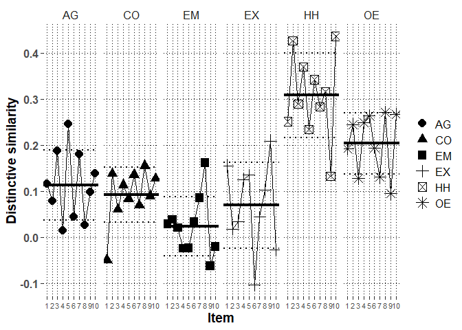

# Packages


```r
library(lme4)
library(rio)
library(lmerTest)
library(emmeans)
library(dplyr)
library(ggplot2)
library(metafor)
library(finalfit)
library(psych)
#custom functions
source("../../custom functions/custom_functions.R")
```

# Data


```r
Chi2_long_fdat<-
  import("../../../data/processed/Chinese 2/Chi2_long_fdat.xlsx")
```

# Descriptive analysis

## Profile distinctive and normative similarity correlations


```r
mod.dat<-Chi2_long_fdat %>%
  group_by(ID) %>%
  summarize(satis.z=mean(satis.z),
            commit.z=mean(commit.z),
            cor.SRc.zc=transf.rtoz(cor(PR.z,SRc.zc)),
            cor.Norm_sr.z=transf.rtoz(cor(PR.z,Norm_sr.z)),
            cor.SR=transf.rtoz(cor(PR,SR)))
```

```
## `summarise()` ungrouping output (override with `.groups` argument)
```

```r
# mean distinctive similarity
(mean.dist.sim<-transf.ztor(mean(mod.dat$cor.SRc.zc)))
```

```
## [1] 0.1455313
```

```r
# mean normative similarity
(mean.norm.sim<-transf.ztor(mean(mod.dat$cor.Norm_sr.z)))
```

```
## [1] 0.4150096
```

```r
# mean overall profile similarity
(mean.over.sim<-transf.ztor(mean(mod.dat$cor.SR)))
```

```
## [1] 0.3279975
```

```r
#correlations with moderators
print(corr.test(mod.dat[,c("cor.SRc.zc",
                     "cor.Norm_sr.z",
                     "cor.SR",
                     "satis.z",
                     "commit.z")],adjust="none"),short=F)
```

```
## Call:corr.test(x = mod.dat[, c("cor.SRc.zc", "cor.Norm_sr.z", "cor.SR", 
##     "satis.z", "commit.z")], adjust = "none")
## Correlation matrix 
##               cor.SRc.zc cor.Norm_sr.z cor.SR satis.z commit.z
## cor.SRc.zc          1.00          0.31   0.91    0.16     0.08
## cor.Norm_sr.z       0.31          1.00   0.63    0.44     0.28
## cor.SR              0.91          0.63   1.00    0.26     0.14
## satis.z             0.16          0.44   0.26    1.00     0.64
## commit.z            0.08          0.28   0.14    0.64     1.00
## Sample Size 
## [1] 356
## Probability values (Entries above the diagonal are adjusted for multiple tests.) 
##               cor.SRc.zc cor.Norm_sr.z cor.SR satis.z commit.z
## cor.SRc.zc          0.00             0   0.00       0     0.13
## cor.Norm_sr.z       0.00             0   0.00       0     0.00
## cor.SR              0.00             0   0.00       0     0.01
## satis.z             0.00             0   0.00       0     0.00
## commit.z            0.13             0   0.01       0     0.00
## 
##  Confidence intervals based upon normal theory.  To get bootstrapped values, try cor.ci
##             raw.lower raw.r raw.upper raw.p lower.adj upper.adj
## c.SR.-c.N_.      0.21  0.31      0.40  0.00      0.17      0.44
## c.SR.-cr.SR      0.89  0.91      0.93  0.00      0.88      0.93
## c.SR.-sts.z      0.05  0.16      0.26  0.00      0.01      0.30
## c.SR.-cmmt.     -0.02  0.08      0.18  0.13     -0.07      0.23
## c.N_.-cr.SR      0.56  0.63      0.69  0.00      0.53      0.71
## c.N_.-sts.z      0.35  0.44      0.52  0.00      0.31      0.55
## c.N_.-cmmt.      0.18  0.28      0.37  0.00      0.14      0.41
## cr.SR-sts.z      0.16  0.26      0.35  0.00      0.12      0.39
## cr.SR-cmmt.      0.04  0.14      0.24  0.01      0.00      0.29
## sts.z-cmmt.      0.57  0.64      0.69  0.00      0.54      0.72
```

```r
#partial correlations with moderators

#distinctive (normative partialed)

partial.r(data=mod.dat,
          x=c("cor.SRc.zc",
                     "satis.z",
                     "commit.z"),
          y=c("cor.Norm_sr.z"))
```

```
## partial correlations 
##            cor.SRc.zc satis.z commit.z
## cor.SRc.zc       1.00    0.03      0.0
## satis.z          0.03    1.00      0.6
## commit.z         0.00    0.60      1.0
```

```r
#normative (distinctive partialed)

partial.r(data=mod.dat,
          x=c("cor.Norm_sr.z",
                     "satis.z",
                     "commit.z"),
          y=c("cor.SRc.zc"))
```

```
## partial correlations 
##               cor.Norm_sr.z satis.z commit.z
## cor.Norm_sr.z          1.00    0.41     0.27
## satis.z                0.41    1.00     0.63
## commit.z               0.27    0.63     1.00
```


# Multilevel profile analysis

## mod0: Baseline model without random effects


```r
mod0<-lmer(PR.z~SRc.zc+Norm_sr.z+(1|ID),
           data=Chi2_long_fdat,
           REML=F,
           control=lmerControl(optimizer="bobyqa",
                               optCtrl=list(maxfun=2e8)))
getMOD(mod0)
```

```
## $Fixed
##               Est   SE       df     t     p    LL    UL
## (Intercept) -0.03 0.01   356.58 -3.90 0.000 -0.05 -0.02
## SRc.zc       0.14 0.01 21004.00 22.55 0.000  0.13  0.15
## Norm_sr.z    0.40 0.01 21004.00 62.80 0.000  0.39  0.42
## 
## $Random
##        grp        var1 var2 est_SD est_VAR
## 1       ID (Intercept) <NA>   0.11    0.01
## 2 Residual        <NA> <NA>   0.93    0.87
## 
## $Deviance
##      Deviance n.pars
## [1,] 57750.91      4
```

## mod1: Baseline model with random effects


```r
mod1<-lmer(PR.z~SRc.zc+Norm_sr.z+(1+SRc.zc+Norm_sr.z|ID),
           data=Chi2_long_fdat,
           REML=F,
           control=lmerControl(optimizer="bobyqa",
                               optCtrl=list(maxfun=2e8)))

getMOD(mod1)
```

```
## $Fixed
##               Est   SE     df     t     p    LL    UL
## (Intercept) -0.03 0.01 356.00 -3.85 0.000 -0.05 -0.02
## SRc.zc       0.14 0.01 364.14 12.69 0.000  0.12  0.16
## Norm_sr.z    0.39 0.01 352.36 36.10 0.000  0.37  0.41
## 
## $Random
##        grp        var1      var2 est_SD est_VAR
## 1       ID (Intercept)      <NA>   0.11    0.01
## 2       ID      SRc.zc      <NA>   0.17    0.03
## 3       ID   Norm_sr.z      <NA>   0.17    0.03
## 4       ID (Intercept)    SRc.zc  -0.24   -0.00
## 5       ID (Intercept) Norm_sr.z  -0.17   -0.00
## 6       ID      SRc.zc Norm_sr.z   0.39    0.01
## 7 Residual        <NA>      <NA>   0.90    0.81
## 
## $Deviance
##      Deviance n.pars
## [1,] 57019.78      9
```

```r
#check the CIs for random effects as well
confint(mod1, oldNames=FALSE)
```

```
## Computing profile confidence intervals ...
```

```
##                                    2.5 %      97.5 %
## sd_(Intercept)|ID             0.09617269  0.13051844
## cor_SRc.zc.(Intercept)|ID    -0.41186468 -0.05870075
## cor_Norm_sr.z.(Intercept)|ID -0.34085055  0.01598466
## sd_SRc.zc|ID                  0.14921894  0.18594560
## cor_Norm_sr.z.SRc.zc|ID       0.24415993  0.52450645
## sd_Norm_sr.z|ID               0.14977399  0.18712502
## sigma                         0.88961141  0.90707585
## (Intercept)                  -0.04988330 -0.01614299
## SRc.zc                        0.11767222  0.16090097
## Norm_sr.z                     0.37180289  0.41464205
```

```r
#obtain random slope SDs for scaling purposes
(Dist.SD.mod1<-
    getREVAR(model=mod1,par="SRc.zc",
             grp="ID",type="sdcor"))
```

```
## [1] 0.1667569
```

```r
(Norm.SD.mod1<-
    getREVAR(model=mod1,par="Norm_sr.z",
             grp="ID",type="sdcor"))
```

```
## [1] 0.1676625
```

```r
#save estimates
export(summary(mod1)$coefficients,
       "../../../output/Chinese 2/Chi2.main.xlsx",row.names=T)

#save slope-SD estimates
export(cbind(Dist.SD.mod1,Norm.SD.mod1),
       "../../../output/Chinese 2/Chi2.slope.SD.xlsx",row.names=T)
```


## mod2: Moderation of similarity by relationship satisfaction


```r
mod2<-lmer(PR.z~SRc.zc+Norm_sr.z+
             satis.z+satis.z:SRc.zc+satis.z:Norm_sr.z+
             (1+SRc.zc+Norm_sr.z|ID),
           data=Chi2_long_fdat,
           REML=F,
           control=lmerControl(optimizer="bobyqa",
                               optCtrl=list(maxfun=2e8)))

getMOD(mod2)
```

```
## $Fixed
##                     Est   SE     df     t     p    LL    UL
## (Intercept)       -0.03 0.01 356.00 -3.87 0.000 -0.05 -0.02
## SRc.zc             0.14 0.01 364.44 12.72 0.000  0.12  0.16
## Norm_sr.z          0.39 0.01 354.14 41.56 0.000  0.37  0.41
## satis.z            0.02 0.01 356.00  2.21 0.028  0.00  0.04
## SRc.zc:satis.z     0.03 0.01 350.58  2.34 0.020  0.00  0.05
## Norm_sr.z:satis.z  0.10 0.01 355.42 10.80 0.000  0.08  0.12
## 
## $Random
##        grp        var1      var2 est_SD est_VAR
## 1       ID (Intercept)      <NA>   0.11    0.01
## 2       ID      SRc.zc      <NA>   0.16    0.03
## 3       ID   Norm_sr.z      <NA>   0.13    0.02
## 4       ID (Intercept)    SRc.zc  -0.27   -0.00
## 5       ID (Intercept) Norm_sr.z  -0.34   -0.01
## 6       ID      SRc.zc Norm_sr.z   0.38    0.01
## 7 Residual        <NA>      <NA>   0.90    0.81
## 
## $Deviance
##      Deviance n.pars
## [1,] 56904.18     12
```

```r
#save estimates
export(summary(mod2)$coefficients,
       "../../../output/Chinese 2/Chi2.satis.xlsx",row.names=T)
```

### Simple slopes for distinctive similarity by satisfaction


```r
(slopes.Dist.satis.mod2<-emtrends(mod2,
         var="SRc.zc",
         specs="satis.z",
         at=list(satis.z=c(-1,0,1)),
         lmerTest.limit = 25000,
         disable.pbkrtest=T,infer=c(T,T)))
```

```
##  satis.z SRc.zc.trend     SE  df lower.CL upper.CL t.ratio p.value
##       -1        0.113 0.0154 370   0.0825    0.143  7.323  <.0001 
##        0        0.138 0.0108 364   0.1165    0.159 12.724  <.0001 
##        1        0.163 0.0151 345   0.1333    0.193 10.797  <.0001 
## 
## Degrees-of-freedom method: satterthwaite 
## Confidence level used: 0.95
```

```r
export(slopes.Dist.satis.mod2,
       "../../../output/Chinese 2/Chi2.satis.slopes.xlsx",row.names=T)
```

### Model-based effect size for relationship satisfaction in association with distinctive similarity


```r
#obtain effect by scaling the contrast between mean and mean+1SD
eff.Dist.satis.mod2<-emtrends(mod2,
         var="SRc.zc",
         specs="satis.z",
         at=list(satis.z=c(1,0,-1)),
         lmerTest.limit = 25000,
         disable.pbkrtest=T,infer=c(T,T))
pairs(eff.Dist.satis.mod2,
      scale=1/Dist.SD.mod1,adjust="none",infer=c(T,T))
```

```
##  contrast estimate     SE  df lower.CL upper.CL t.ratio p.value
##  1 - 0       0.151 0.0643 351   0.0241    0.277 2.341   0.0198 
##  1 - (-1)    0.301 0.1286 351   0.0482    0.554 2.341   0.0198 
##  0 - (-1)    0.151 0.0643 351   0.0241    0.277 2.341   0.0198 
## 
## Degrees-of-freedom method: satterthwaite 
## Confidence level used: 0.95
```


## mod3: Moderation of similarity by relationship commitment


```r
mod3<-lmer(PR.z~SRc.zc+Norm_sr.z+
             commit.z+commit.z:SRc.zc+commit.z:Norm_sr.z+
             (1+SRc.zc+Norm_sr.z|ID),
           data=Chi2_long_fdat,
           REML=F,
           control=lmerControl(optimizer="bobyqa",
                               optCtrl=list(maxfun=2e8)))

getMOD(mod3)
```

```
## $Fixed
##                      Est   SE     df     t     p    LL    UL
## (Intercept)        -0.03 0.01 356.00 -3.85 0.000 -0.05 -0.02
## SRc.zc              0.14 0.01 363.80 12.61 0.000  0.12  0.16
## Norm_sr.z           0.39 0.01 354.07 38.36 0.000  0.37  0.41
## commit.z            0.01 0.01 356.01  0.59 0.556 -0.01  0.02
## SRc.zc:commit.z     0.01 0.01 353.97  0.77 0.440 -0.01  0.03
## Norm_sr.z:commit.z  0.07 0.01 357.18  6.84 0.000  0.05  0.09
## 
## $Random
##        grp        var1      var2 est_SD est_VAR
## 1       ID (Intercept)      <NA>   0.11    0.01
## 2       ID      SRc.zc      <NA>   0.17    0.03
## 3       ID   Norm_sr.z      <NA>   0.15    0.02
## 4       ID (Intercept)    SRc.zc  -0.24   -0.00
## 5       ID (Intercept) Norm_sr.z  -0.20   -0.00
## 6       ID      SRc.zc Norm_sr.z   0.41    0.01
## 7 Residual        <NA>      <NA>   0.90    0.81
## 
## $Deviance
##      Deviance n.pars
## [1,] 56972.84     12
```

```r
#save estimates
export(summary(mod3)$coefficients,
       "../../../output/Chinese 2/Chi2.commit.xlsx",row.names=T)
```

### Simple slopes for distinctive similarity by commitment


```r
(slopes.Dist.commit.mod3<-emtrends(mod3,
         var="SRc.zc",
         specs="commit.z",
         at=list(commit.z=c(-1,0,1)),
         lmerTest.limit = 25000,
         disable.pbkrtest=T,infer=c(T,T)))
```

```
##  commit.z SRc.zc.trend     SE  df lower.CL upper.CL t.ratio p.value
##        -1        0.130 0.0156 367   0.0991    0.160  8.331  <.0001 
##         0        0.138 0.0110 364   0.1166    0.160 12.610  <.0001 
##         1        0.147 0.0153 351   0.1164    0.177  9.560  <.0001 
## 
## Degrees-of-freedom method: satterthwaite 
## Confidence level used: 0.95
```

```r
export(slopes.Dist.commit.mod3,
       "../../../output/Chinese 2/Chi2.commit.slopes.xlsx",row.names=T)
```

### Model-based effect size for relationship commitment in association with distinctive similarity


```r
#obtain effect by scaling the contrast between mean and mean+1SD
eff.Dist.commit.mod3<-emtrends(mod3,
         var="SRc.zc",
         specs="commit.z",
         at=list(commit.z=c(1,0,-1)),
         lmerTest.limit = 25000,infer=c(T,T),
         disable.pbkrtest=T)
pairs(eff.Dist.commit.mod3,scale=1/Dist.SD.mod1,
      adjust="none",infer=c(T,T))
```

```
##  contrast estimate     SE  df lower.CL upper.CL t.ratio p.value
##  1 - 0      0.0505 0.0653 354   -0.078    0.179 0.773   0.4398 
##  1 - (-1)   0.1010 0.1306 354   -0.156    0.358 0.773   0.4398 
##  0 - (-1)   0.0505 0.0653 354   -0.078    0.179 0.773   0.4398 
## 
## Degrees-of-freedom method: satterthwaite 
## Confidence level used: 0.95
```


## mod9: HEXACO-domain fixed main effects


```r
mod9<-lmer(PR.z~SRc.zc+Norm_sr.z+
             (1+SRc.zc+Norm_sr.z|ID)+
             domain+domain:SRc.zc+domain:Norm_sr.z,
           data=Chi2_long_fdat,
           REML=F,
           control=lmerControl(optimizer="bobyqa",
                               optCtrl=list(maxfun=2e8)))

getMOD(mod9)
```

```
## $Fixed
##                      Est   SE       df      t     p    LL    UL
## (Intercept)        -0.01 0.02  4075.16  -0.85 0.394 -0.05  0.02
## SRc.zc              0.12 0.02  2477.49   6.45 0.000  0.08  0.15
## Norm_sr.z           0.47 0.02  2389.73  26.60 0.000  0.44  0.50
## domainCO           -0.09 0.02 20504.28  -4.05 0.000 -0.13 -0.04
## domainEM            0.05 0.02 20485.87   2.15 0.032  0.00  0.09
## domainEX            0.00 0.02 20509.89   0.11 0.912 -0.04  0.04
## domainHH           -0.01 0.02 20509.36  -0.65 0.518 -0.06  0.03
## domainOE            0.00 0.02 20517.64   0.18 0.859 -0.04  0.05
## SRc.zc:domainCO    -0.02 0.02 21061.52  -1.08 0.282 -0.07  0.02
## SRc.zc:domainEM    -0.10 0.02 20976.85  -4.41 0.000 -0.14 -0.05
## SRc.zc:domainEX    -0.05 0.02 21061.51  -2.35 0.019 -0.09 -0.01
## SRc.zc:domainHH     0.19 0.02 21075.51   8.94 0.000  0.15  0.23
## SRc.zc:domainOE     0.08 0.02 21045.51   3.99 0.000  0.04  0.12
## Norm_sr.z:domainCO -0.11 0.02 20553.15  -5.20 0.000 -0.15 -0.07
## Norm_sr.z:domainEM -0.23 0.02 20622.56 -11.08 0.000 -0.27 -0.19
## Norm_sr.z:domainEX  0.10 0.02 20570.50   4.51 0.000  0.06  0.14
## Norm_sr.z:domainHH -0.03 0.02 20589.48  -1.38 0.166 -0.07  0.01
## Norm_sr.z:domainOE -0.19 0.02 20554.82  -8.02 0.000 -0.24 -0.14
## 
## $Random
##        grp        var1      var2 est_SD est_VAR
## 1       ID (Intercept)      <NA>   0.11    0.01
## 2       ID      SRc.zc      <NA>   0.16    0.03
## 3       ID   Norm_sr.z      <NA>   0.17    0.03
## 4       ID (Intercept)    SRc.zc  -0.22   -0.00
## 5       ID (Intercept) Norm_sr.z  -0.14   -0.00
## 6       ID      SRc.zc Norm_sr.z   0.38    0.01
## 7 Residual        <NA>      <NA>   0.89    0.78
## 
## $Deviance
##      Deviance n.pars
## [1,] 56435.74     24
```

```r
anova(mod9)
```

```
## Type III Analysis of Variance Table with Satterthwaite's method
##                   Sum Sq Mean Sq NumDF   DenDF  F value    Pr(>F)    
## SRc.zc            115.94  115.94     1   366.8  147.771 < 2.2e-16 ***
## Norm_sr.z        1018.74 1018.74     1   364.4 1298.417 < 2.2e-16 ***
## domain             31.89    6.38     5 20498.2    8.130 1.124e-07 ***
## SRc.zc:domain     193.67   38.73     5 21019.8   49.368 < 2.2e-16 ***
## Norm_sr.z:domain  251.30   50.26     5 20592.5   64.058 < 2.2e-16 ***
## ---
## Signif. codes:  0 '***' 0.001 '**' 0.01 '*' 0.05 '.' 0.1 ' ' 1
```

```r
anova(mod1,mod9)
```

```
## Data: Chi2_long_fdat
## Models:
## mod1: PR.z ~ SRc.zc + Norm_sr.z + (1 + SRc.zc + Norm_sr.z | ID)
## mod9: PR.z ~ SRc.zc + Norm_sr.z + (1 + SRc.zc + Norm_sr.z | ID) + domain + 
## mod9:     domain:SRc.zc + domain:Norm_sr.z
##      npar   AIC   BIC logLik deviance  Chisq Df Pr(>Chisq)    
## mod1   10 57040 57119 -28510    57020                         
## mod9   25 56486 56685 -28218    56436 584.04 15  < 2.2e-16 ***
## ---
## Signif. codes:  0 '***' 0.001 '**' 0.01 '*' 0.05 '.' 0.1 ' ' 1
```

### Marginal effects for distinctive similarity in HEXACO-domains


```r
Dist.HEXACO.mod9<-emtrends(mod9,var="SRc.zc",specs="domain",
                          lmerTest.limit = 21540,
                          disable.pbkrtest=T,infer=c(T,T))
Dist.HEXACO.mod9
```

```
##  domain SRc.zc.trend     SE   df lower.CL upper.CL t.ratio p.value
##  AG           0.1150 0.0178 2477   0.0801   0.1500  6.454  <.0001 
##  CO           0.0912 0.0182 2676   0.0554   0.1270  4.999  <.0001 
##  EM           0.0192 0.0177 2401  -0.0156   0.0539  1.081  0.2798 
##  EX           0.0638 0.0178 2459   0.0288   0.0987  3.577  0.0004 
##  HH           0.3029 0.0168 2016   0.2699   0.3359 18.000  <.0001 
##  OE           0.1979 0.0165 1867   0.1657   0.2302 12.021  <.0001 
## 
## Degrees-of-freedom method: satterthwaite 
## Confidence level used: 0.95
```

```r
#export the domain-specific estimates
export(data.frame(test(Dist.HEXACO.mod9)),
       "../../../output/Chinese 2/Chi2.HEXACO.Dist.xlsx")
contrast(Dist.HEXACO.mod9,"eff",adjust="holm")
```

```
##  contrast  estimate     SE    df t.ratio p.value
##  AG effect  -0.0166 0.0140 21081 -1.187  0.2351 
##  CO effect  -0.0405 0.0144 21036 -2.818  0.0097 
##  EM effect  -0.1125 0.0139 20799 -8.066  <.0001 
##  EX effect  -0.0679 0.0140 21046 -4.850  <.0001 
##  HH effect   0.1712 0.0132 21049 13.007  <.0001 
##  OE effect   0.0663 0.0129 20969  5.138  <.0001 
## 
## Degrees-of-freedom method: satterthwaite 
## P value adjustment: holm method for 6 tests
```

```r
contrast(Dist.HEXACO.mod9,"del.eff",adjust="holm")
```

```
##  contrast  estimate     SE    df t.ratio p.value
##  AG effect  -0.0200 0.0168 21081 -1.187  0.2351 
##  CO effect  -0.0485 0.0172 21036 -2.818  0.0097 
##  EM effect  -0.1350 0.0167 20799 -8.066  <.0001 
##  EX effect  -0.0815 0.0168 21046 -4.850  <.0001 
##  HH effect   0.2055 0.0158 21049 13.007  <.0001 
##  OE effect   0.0795 0.0155 20969  5.138  <.0001 
## 
## Degrees-of-freedom method: satterthwaite 
## P value adjustment: holm method for 6 tests
```

```r
pairs(Dist.HEXACO.mod9,adjust="holm")
```

```
##  contrast estimate     SE    df t.ratio p.value
##  AG - CO    0.0238 0.0221 21062   1.075 0.4296 
##  AG - EM    0.0959 0.0217 20977   4.411 0.0001 
##  AG - EX    0.0513 0.0218 21062   2.352 0.0748 
##  AG - HH   -0.1879 0.0210 21076  -8.937 <.0001 
##  AG - OE   -0.0829 0.0208 21046  -3.991 0.0004 
##  CO - EM    0.0721 0.0221 20955   3.260 0.0056 
##  CO - EX    0.0274 0.0221 21022   1.241 0.4296 
##  CO - HH   -0.2117 0.0213 21057  -9.918 <.0001 
##  CO - OE   -0.1067 0.0211 21013  -5.059 <.0001 
##  EM - EX   -0.0446 0.0218 20956  -2.051 0.1208 
##  EM - HH   -0.2838 0.0209 21029 -13.560 <.0001 
##  EM - OE   -0.1788 0.0207 20957  -8.639 <.0001 
##  EX - HH   -0.2391 0.0210 21056 -11.388 <.0001 
##  EX - OE   -0.1342 0.0207 21001  -6.471 <.0001 
##  HH - OE    0.1050 0.0199 20982   5.272 <.0001 
## 
## Degrees-of-freedom method: satterthwaite 
## P value adjustment: holm method for 15 tests
```

```r
pairs(Dist.HEXACO.mod9,adjust="none")
```

```
##  contrast estimate     SE    df t.ratio p.value
##  AG - CO    0.0238 0.0221 21062   1.075 0.2822 
##  AG - EM    0.0959 0.0217 20977   4.411 <.0001 
##  AG - EX    0.0513 0.0218 21062   2.352 0.0187 
##  AG - HH   -0.1879 0.0210 21076  -8.937 <.0001 
##  AG - OE   -0.0829 0.0208 21046  -3.991 0.0001 
##  CO - EM    0.0721 0.0221 20955   3.260 0.0011 
##  CO - EX    0.0274 0.0221 21022   1.241 0.2148 
##  CO - HH   -0.2117 0.0213 21057  -9.918 <.0001 
##  CO - OE   -0.1067 0.0211 21013  -5.059 <.0001 
##  EM - EX   -0.0446 0.0218 20956  -2.051 0.0403 
##  EM - HH   -0.2838 0.0209 21029 -13.560 <.0001 
##  EM - OE   -0.1788 0.0207 20957  -8.639 <.0001 
##  EX - HH   -0.2391 0.0210 21056 -11.388 <.0001 
##  EX - OE   -0.1342 0.0207 21001  -6.471 <.0001 
##  HH - OE    0.1050 0.0199 20982   5.272 <.0001 
## 
## Degrees-of-freedom method: satterthwaite
```

### Marginal effects for normative similarity in HEXACO-domains


```r
Norm.HEXACO.mod9<-emtrends(mod9,var="Norm_sr.z",
                           specs="domain",
                          lmerTest.limit = 21540,
                          disable.pbkrtest=T,infer=c(T,T))
Norm.HEXACO.mod9
```

```
##  domain Norm_sr.z.trend     SE   df lower.CL upper.CL t.ratio p.value
##  AG               0.470 0.0177 2390    0.435    0.505 26.598  <.0001 
##  CO               0.361 0.0169 2008    0.328    0.394 21.410  <.0001 
##  EM               0.238 0.0168 1972    0.205    0.271 14.199  <.0001 
##  EX               0.569 0.0181 2621    0.533    0.605 31.403  <.0001 
##  HH               0.440 0.0175 2306    0.406    0.475 25.159  <.0001 
##  OE               0.281 0.0201 3769    0.242    0.320 14.005  <.0001 
## 
## Degrees-of-freedom method: satterthwaite 
## Confidence level used: 0.95
```

```r
test(Norm.HEXACO.mod9)
```

```
##  domain Norm_sr.z.trend     SE   df t.ratio p.value
##  AG               0.470 0.0177 2390 26.598  <.0001 
##  CO               0.361 0.0169 2008 21.410  <.0001 
##  EM               0.238 0.0168 1972 14.199  <.0001 
##  EX               0.569 0.0181 2621 31.403  <.0001 
##  HH               0.440 0.0175 2306 25.159  <.0001 
##  OE               0.281 0.0201 3769 14.005  <.0001 
## 
## Degrees-of-freedom method: satterthwaite
```

```r
export(data.frame(test(Norm.HEXACO.mod9)),
       "../../../output/Chinese 2/Chi2.HEXACO.Norm.xlsx")
contrast(Norm.HEXACO.mod9,"eff",adjust="holm")
```

```
##  contrast  estimate     SE    df t.ratio p.value
##  AG effect   0.0768 0.0140 20565   5.490 <.0001 
##  CO effect  -0.0321 0.0133 20562  -2.418 0.0156 
##  EM effect  -0.1549 0.0133 20650 -11.672 <.0001 
##  EX effect   0.1757 0.0144 20597  12.240 <.0001 
##  HH effect   0.0471 0.0138 20601   3.403 0.0013 
##  OE effect  -0.1125 0.0160 20553  -7.038 <.0001 
## 
## Degrees-of-freedom method: satterthwaite 
## P value adjustment: holm method for 6 tests
```

```r
contrast(Norm.HEXACO.mod9,"del.eff",adjust="holm")
```

```
##  contrast  estimate     SE    df t.ratio p.value
##  AG effect   0.0921 0.0168 20565   5.490 <.0001 
##  CO effect  -0.0386 0.0159 20562  -2.418 0.0156 
##  EM effect  -0.1859 0.0159 20650 -11.672 <.0001 
##  EX effect   0.2109 0.0172 20597  12.240 <.0001 
##  HH effect   0.0565 0.0166 20601   3.403 0.0013 
##  OE effect  -0.1349 0.0192 20553  -7.038 <.0001 
## 
## Degrees-of-freedom method: satterthwaite 
## P value adjustment: holm method for 6 tests
```

```r
pairs(Norm.HEXACO.mod9,adjust="holm")
```

```
##  contrast estimate     SE    df t.ratio p.value
##  AG - CO    0.1089 0.0209 20553   5.202 <.0001 
##  AG - EM    0.2317 0.0209 20623  11.079 <.0001 
##  AG - EX   -0.0990 0.0219 20571  -4.508 <.0001 
##  AG - HH    0.0297 0.0215 20589   1.384 0.1663 
##  AG - OE    0.1892 0.0236 20555   8.023 <.0001 
##  CO - EM    0.1228 0.0202 20628   6.069 <.0001 
##  CO - EX   -0.2078 0.0213 20583  -9.752 <.0001 
##  CO - HH   -0.0792 0.0208 20578  -3.813 0.0006 
##  CO - OE    0.0803 0.0230 20545   3.497 0.0014 
##  EM - EX   -0.3306 0.0213 20644 -15.517 <.0001 
##  EM - HH   -0.2020 0.0207 20633  -9.736 <.0001 
##  EM - OE   -0.0425 0.0230 20604  -1.851 0.1284 
##  EX - HH    0.1287 0.0218 20595   5.900 <.0001 
##  EX - OE    0.2882 0.0239 20565  12.053 <.0001 
##  HH - OE    0.1595 0.0235 20582   6.801 <.0001 
## 
## Degrees-of-freedom method: satterthwaite 
## P value adjustment: holm method for 15 tests
```

```r
pairs(Norm.HEXACO.mod9,adjust="none")
```

```
##  contrast estimate     SE    df t.ratio p.value
##  AG - CO    0.1089 0.0209 20553   5.202 <.0001 
##  AG - EM    0.2317 0.0209 20623  11.079 <.0001 
##  AG - EX   -0.0990 0.0219 20571  -4.508 <.0001 
##  AG - HH    0.0297 0.0215 20589   1.384 0.1663 
##  AG - OE    0.1892 0.0236 20555   8.023 <.0001 
##  CO - EM    0.1228 0.0202 20628   6.069 <.0001 
##  CO - EX   -0.2078 0.0213 20583  -9.752 <.0001 
##  CO - HH   -0.0792 0.0208 20578  -3.813 0.0001 
##  CO - OE    0.0803 0.0230 20545   3.497 0.0005 
##  EM - EX   -0.3306 0.0213 20644 -15.517 <.0001 
##  EM - HH   -0.2020 0.0207 20633  -9.736 <.0001 
##  EM - OE   -0.0425 0.0230 20604  -1.851 0.0642 
##  EX - HH    0.1287 0.0218 20595   5.900 <.0001 
##  EX - OE    0.2882 0.0239 20565  12.053 <.0001 
##  HH - OE    0.1595 0.0235 20582   6.801 <.0001 
## 
## Degrees-of-freedom method: satterthwaite
```


## mod10: HEXACO-domain fixed interactions with satisfaction 


```r
mod10<-lmer(PR.z~SRc.zc+Norm_sr.z+
             domain+domain:SRc.zc+domain:Norm_sr.z+
             satis.z+satis.z:SRc.zc+satis.z:Norm_sr.z+
             domain:satis.z+
             domain:satis.z:SRc.zc+
             domain:satis.z:Norm_sr.z+
              (1+SRc.zc+Norm_sr.z|ID),
           data=Chi2_long_fdat,
           REML=F,
           control=lmerControl(optimizer="bobyqa",
                               optCtrl=list(maxfun=2e8)))

getMOD(mod10)
```

```
## $Fixed
##                              Est   SE       df      t     p    LL    UL
## (Intercept)                -0.01 0.02  4128.58  -0.75 0.451 -0.04  0.02
## SRc.zc                      0.11 0.02  2570.14   6.42 0.000  0.08  0.15
## Norm_sr.z                   0.47 0.02  3331.71  28.03 0.000  0.44  0.51
## domainCO                   -0.09 0.02 20501.73  -4.12 0.000 -0.13 -0.05
## domainEM                    0.05 0.02 20482.40   2.08 0.038  0.00  0.09
## domainEX                    0.00 0.02 20507.86   0.04 0.967 -0.04  0.04
## domainHH                   -0.02 0.02 20507.33  -0.73 0.463 -0.06  0.03
## domainOE                    0.00 0.02 20515.74   0.09 0.926 -0.04  0.04
## satis.z                     0.02 0.02  4142.54   1.54 0.125 -0.01  0.06
## SRc.zc:domainCO            -0.02 0.02 21088.61  -1.12 0.264 -0.07  0.02
## SRc.zc:domainEM            -0.09 0.02 20915.80  -4.22 0.000 -0.13 -0.05
## SRc.zc:domainEX            -0.05 0.02 21098.23  -2.50 0.012 -0.10 -0.01
## SRc.zc:domainHH             0.19 0.02 21107.91   8.89 0.000  0.15  0.23
## SRc.zc:domainOE             0.08 0.02 21089.00   3.86 0.000  0.04  0.12
## Norm_sr.z:domainCO         -0.11 0.02 20561.01  -5.33 0.000 -0.15 -0.07
## Norm_sr.z:domainEM         -0.23 0.02 20624.73 -11.21 0.000 -0.28 -0.19
## Norm_sr.z:domainEX          0.10 0.02 20579.08   4.42 0.000  0.05  0.14
## Norm_sr.z:domainHH         -0.03 0.02 20597.41  -1.50 0.135 -0.07  0.01
## Norm_sr.z:domainOE         -0.19 0.02 20558.27  -8.22 0.000 -0.24 -0.15
## SRc.zc:satis.z             -0.03 0.02  2469.54  -1.55 0.122 -0.06  0.01
## Norm_sr.z:satis.z           0.13 0.02  3329.57   7.90 0.000  0.10  0.17
## domainCO:satis.z           -0.05 0.02 20513.45  -2.41 0.016 -0.09 -0.01
## domainEM:satis.z            0.04 0.02 20490.51   1.97 0.049  0.00  0.09
## domainEX:satis.z            0.01 0.02 20498.58   0.51 0.609 -0.03  0.05
## domainHH:satis.z           -0.02 0.02 20504.12  -0.73 0.466 -0.06  0.03
## domainOE:satis.z           -0.02 0.02 20517.96  -0.82 0.410 -0.06  0.02
## SRc.zc:domainCO:satis.z     0.05 0.02 21144.15   2.55 0.011  0.01  0.10
## SRc.zc:domainEM:satis.z     0.04 0.02 21103.69   1.76 0.079 -0.00  0.08
## SRc.zc:domainEX:satis.z     0.04 0.02 21164.13   1.86 0.062 -0.00  0.08
## SRc.zc:domainHH:satis.z     0.05 0.02 21140.55   2.41 0.016  0.01  0.09
## SRc.zc:domainOE:satis.z     0.10 0.02 21127.09   4.63 0.000  0.05  0.14
## Norm_sr.z:domainCO:satis.z -0.04 0.02 20565.52  -1.82 0.069 -0.08  0.00
## Norm_sr.z:domainEM:satis.z -0.05 0.02 20583.81  -2.57 0.010 -0.09 -0.01
## Norm_sr.z:domainEX:satis.z -0.02 0.02 20560.75  -0.92 0.355 -0.06  0.02
## Norm_sr.z:domainHH:satis.z -0.04 0.02 20571.63  -1.98 0.047 -0.08 -0.00
## Norm_sr.z:domainOE:satis.z -0.06 0.02 20540.13  -2.55 0.011 -0.11 -0.01
## 
## $Random
##        grp        var1      var2 est_SD est_VAR
## 1       ID (Intercept)      <NA>   0.11    0.01
## 2       ID      SRc.zc      <NA>   0.16    0.03
## 3       ID   Norm_sr.z      <NA>   0.13    0.02
## 4       ID (Intercept)    SRc.zc  -0.24   -0.00
## 5       ID (Intercept) Norm_sr.z  -0.30   -0.00
## 6       ID      SRc.zc Norm_sr.z   0.38    0.01
## 7 Residual        <NA>      <NA>   0.88    0.78
## 
## $Deviance
##      Deviance n.pars
## [1,] 56270.68     42
```

```r
anova(mod10)
```

```
## Type III Analysis of Variance Table with Satterthwaite's method
##                           Sum Sq Mean Sq NumDF   DenDF   F value    Pr(>F)    
## SRc.zc                    115.96  115.96     1   367.9  148.1538 < 2.2e-16 ***
## Norm_sr.z                1330.39 1330.39     1   370.8 1699.7350 < 2.2e-16 ***
## domain                     31.91    6.38     5 20496.5    8.1525 1.066e-07 ***
## satis.z                     4.18    4.18     1   365.3    5.3354 0.0214533 *  
## SRc.zc:domain             189.33   37.87     5 21023.7   48.3785 < 2.2e-16 ***
## Norm_sr.z:domain          253.48   50.70     5 20597.7   64.7698 < 2.2e-16 ***
## SRc.zc:satis.z              2.54    2.54     1   354.8    3.2452 0.0724823 .  
## Norm_sr.z:satis.z          81.26   81.26     1   372.7  103.8247 < 2.2e-16 ***
## domain:satis.z             16.52    3.30     5 20492.9    4.2205 0.0007778 ***
## SRc.zc:domain:satis.z      17.62    3.52     5 21034.8    4.5030 0.0004197 ***
## Norm_sr.z:domain:satis.z    7.89    1.58     5 20586.2    2.0165 0.0729742 .  
## ---
## Signif. codes:  0 '***' 0.001 '**' 0.01 '*' 0.05 '.' 0.1 ' ' 1
```

```r
#model with manually defined interactions


Chi2_long_fdat$satis.z_SRc.zc<-
  Chi2_long_fdat$satis.z*Chi2_long_fdat$SRc.zc

Chi2_long_fdat$satis.z_Norm_sr.z<-
  Chi2_long_fdat$satis.z*Chi2_long_fdat$Norm_sr.z

mod10.alt<-lmer(PR.z~SRc.zc+Norm_sr.z+
             domain+domain:SRc.zc+domain:Norm_sr.z+
             satis.z+satis.z_SRc.zc+satis.z_Norm_sr.z+
             domain:satis.z+
             domain:satis.z_SRc.zc+
             domain:satis.z_Norm_sr.z+
               (0+SRc.zc+Norm_sr.z|ID),
           data=Chi2_long_fdat,
           REML=F,
           control=lmerControl(optimizer="bobyqa",
                               optCtrl=list(maxfun=2e8)))

#confirm that the models are identical
anova(mod10,mod10.alt)
```

```
## Data: Chi2_long_fdat
## Models:
## mod10.alt: PR.z ~ SRc.zc + Norm_sr.z + domain + domain:SRc.zc + domain:Norm_sr.z + 
## mod10.alt:     satis.z + satis.z_SRc.zc + satis.z_Norm_sr.z + domain:satis.z + 
## mod10.alt:     domain:satis.z_SRc.zc + domain:satis.z_Norm_sr.z + (0 + SRc.zc + 
## mod10.alt:     Norm_sr.z | ID)
## mod10: PR.z ~ SRc.zc + Norm_sr.z + domain + domain:SRc.zc + domain:Norm_sr.z + 
## mod10:     satis.z + satis.z:SRc.zc + satis.z:Norm_sr.z + domain:satis.z + 
## mod10:     domain:satis.z:SRc.zc + domain:satis.z:Norm_sr.z + (1 + SRc.zc + 
## mod10:     Norm_sr.z | ID)
##           npar   AIC   BIC logLik deviance  Chisq Df Pr(>Chisq)    
## mod10.alt   40 56462 56781 -28191    56382                         
## mod10       43 56357 56699 -28135    56271 111.53  3  < 2.2e-16 ***
## ---
## Signif. codes:  0 '***' 0.001 '**' 0.01 '*' 0.05 '.' 0.1 ' ' 1
```


### Marginal effects for satisment on distinctive similarity for each HEXACO domain


```r
#satisment effect on distinctive similarity separately for domains

#unscaled

(Dist.satis.domain.mod10.alt<-
  emtrends(mod10.alt,
           var="satis.z_SRc.zc",
           #by="domain",
           specs=c("domain"),
           lmerTest.limit = 25000,
           disable.pbkrtest=T,infer=c(T,T)))
```

```
##  domain satis.z_SRc.zc.trend     SE   df lower.CL upper.CL t.ratio p.value
##  AG                  -0.0275 0.0176 2487 -0.06205  0.00705 -1.561  0.1187 
##  CO                   0.0297 0.0175 2416 -0.00467  0.06402  1.694  0.0903 
##  EM                   0.0109 0.0175 2458 -0.02344  0.04531  0.624  0.5329 
##  EX                   0.0159 0.0178 2569 -0.01894  0.05078  0.896  0.3705 
##  HH                   0.0196 0.0162 1825 -0.01209  0.05131  1.213  0.2252 
##  OE                   0.0660 0.0163 1885  0.03409  0.09793  4.056  0.0001 
## 
## Degrees-of-freedom method: satterthwaite 
## Confidence level used: 0.95
```

```r
export(Dist.satis.domain.mod10.alt,
       "../../../output/Chinese 2/Chi2.HEXACO.Dist.by.satis.xlsx")

pairs(Dist.satis.domain.mod10.alt,adjust="holm")
```

```
##  contrast estimate     SE    df t.ratio p.value
##  AG - CO  -0.05718 0.0216 21197 -2.653  0.1039 
##  AG - EM  -0.03843 0.0216 21243 -1.779  0.6022 
##  AG - EX  -0.04342 0.0218 21250 -1.994  0.4158 
##  AG - HH  -0.04711 0.0205 21252 -2.299  0.2153 
##  AG - OE  -0.09351 0.0206 21221 -4.531  0.0001 
##  CO - EM   0.01874 0.0215 20956  0.871  1.0000 
##  CO - EX   0.01375 0.0217 21158  0.634  1.0000 
##  CO - HH   0.01007 0.0204 21126  0.494  1.0000 
##  CO - OE  -0.03633 0.0205 21150 -1.769  0.6022 
##  EM - EX  -0.00499 0.0217 21113 -0.230  1.0000 
##  EM - HH  -0.00868 0.0204 21045 -0.424  1.0000 
##  EM - OE  -0.05508 0.0206 21128 -2.679  0.1033 
##  EX - HH  -0.00369 0.0206 21169 -0.179  1.0000 
##  EX - OE  -0.05009 0.0207 21186 -2.417  0.1881 
##  HH - OE  -0.04640 0.0194 21178 -2.394  0.1881 
## 
## Degrees-of-freedom method: satterthwaite 
## P value adjustment: holm method for 15 tests
```

```r
contrast(Dist.satis.domain.mod10.alt,"eff",adjust="holm")
```

```
##  contrast  estimate     SE    df t.ratio p.value
##  AG effect -0.04661 0.0139 21269 -3.355  0.0040 
##  CO effect  0.01057 0.0138 21057  0.766  1.0000 
##  EM effect -0.00818 0.0138 20991 -0.591  1.0000 
##  EX effect -0.00319 0.0140 21207 -0.228  1.0000 
##  HH effect  0.00050 0.0127 21163  0.040  1.0000 
##  OE effect  0.04690 0.0128 21170  3.667  0.0015 
## 
## Degrees-of-freedom method: satterthwaite 
## P value adjustment: holm method for 6 tests
```

```r
contrast(Dist.satis.domain.mod10.alt,"del.eff",adjust="holm")
```

```
##  contrast  estimate     SE    df t.ratio p.value
##  AG effect -0.05593 0.0167 21269 -3.355  0.0040 
##  CO effect  0.01268 0.0166 21057  0.766  1.0000 
##  EM effect -0.00981 0.0166 20991 -0.591  1.0000 
##  EX effect -0.00382 0.0168 21207 -0.228  1.0000 
##  HH effect  0.00060 0.0152 21163  0.040  1.0000 
##  OE effect  0.05628 0.0154 21170  3.667  0.0015 
## 
## Degrees-of-freedom method: satterthwaite 
## P value adjustment: holm method for 6 tests
```

```r
#scaled with common SD

Dist.var.common.scaled<-paste0("satis.z_SRc.zc*c(",
                        Dist.SD.mod1,")")

(Dist.satis.domain.mod10.alt.scaled<-
  emtrends(mod10.alt,
           var=Dist.var.common.scaled,
           #by="domain",
           specs=c("domain"),
           lmerTest.limit = 25000,
           disable.pbkrtest=T,infer=c(T,T)))
```

```
##  domain satis.z_SRc.zc*c(0.166756893841297).trend     SE   df lower.CL upper.CL
##  AG                                       -0.1649 0.1057 2487  -0.3721   0.0423
##  CO                                        0.1780 0.1050 2416  -0.0280   0.3839
##  EM                                        0.0656 0.1051 2458  -0.1406   0.2717
##  EX                                        0.0955 0.1066 2569  -0.1136   0.3045
##  HH                                        0.1176 0.0969 1825  -0.0725   0.3077
##  OE                                        0.3958 0.0976 1885   0.2044   0.5873
##  t.ratio p.value
##  -1.561  0.1187 
##   1.694  0.0903 
##   0.624  0.5329 
##   0.896  0.3705 
##   1.213  0.2252 
##   4.056  0.0001 
## 
## Degrees-of-freedom method: satterthwaite 
## Confidence level used: 0.95
```

```r
export(Dist.satis.domain.mod10.alt.scaled,
       "../../../output/Chinese 2/Chi2.HEXACO.Dist.by.satis.scaled.xlsx")


#simple slopes

(Dist.satis.slopes.domain.mod10<-
  emtrends(mod10,
           var="SRc.zc",
           by="domain",
           specs=c("satis.z"),
           at=list(satis.z=c(-1,0,1)),      
           lmerTest.limit = 25000,
           disable.pbkrtest=T,infer=c(T,T)))
```

```
## domain = AG:
##  satis.z SRc.zc.trend     SE   df lower.CL upper.CL t.ratio p.value
##       -1       0.1411 0.0256 2736  0.09090   0.1914  5.508  <.0001 
##        0       0.1140 0.0178 2570  0.07918   0.1488  6.421  <.0001 
##        1       0.0868 0.0243 2307  0.03914   0.1345  3.570  0.0004 
## 
## domain = CO:
##  satis.z SRc.zc.trend     SE   df lower.CL upper.CL t.ratio p.value
##       -1       0.0617 0.0255 2675  0.01169   0.1116  2.420  0.0156 
##        0       0.0892 0.0182 2769  0.05358   0.1248  4.911  <.0001 
##        1       0.1167 0.0249 2488  0.06789   0.1656  4.686  <.0001 
## 
## domain = EM:
##  satis.z SRc.zc.trend     SE   df lower.CL upper.CL t.ratio p.value
##       -1       0.0116 0.0256 2745 -0.03850   0.0617  0.454  0.6499 
##        0       0.0222 0.0176 2477 -0.01232   0.0567  1.261  0.2074 
##        1       0.0328 0.0240 2178 -0.01432   0.0800  1.365  0.1723 
## 
## domain = EX:
##  satis.z SRc.zc.trend     SE   df lower.CL upper.CL t.ratio p.value
##       -1       0.0461 0.0255 2672 -0.00391   0.0960  1.807  0.0708 
##        0       0.0593 0.0178 2569  0.02443   0.0942  3.334  0.0009 
##        1       0.0726 0.0247 2441  0.02410   0.1211  2.936  0.0034 
## 
## domain = HH:
##  satis.z SRc.zc.trend     SE   df lower.CL upper.CL t.ratio p.value
##       -1       0.2790 0.0236 2033  0.23284   0.3252 11.845  <.0001 
##        0       0.3012 0.0167 2088  0.26836   0.3340 17.985  <.0001 
##        1       0.3234 0.0229 1865  0.27839   0.3683 14.100  <.0001 
## 
## domain = OE:
##  satis.z SRc.zc.trend     SE   df lower.CL upper.CL t.ratio p.value
##       -1       0.1263 0.0238 2129  0.07970   0.1729  5.314  <.0001 
##        0       0.1943 0.0164 1941  0.16210   0.2264 11.848  <.0001 
##        1       0.2622 0.0223 1687  0.21840   0.3060 11.740  <.0001 
## 
## Degrees-of-freedom method: satterthwaite 
## Confidence level used: 0.95
```

```r
export(data.frame(Dist.satis.slopes.domain.mod10),
       "../../../output/Chinese 2/Chi2.HEXACO.Dist.by.satis.slopes.xlsx")
```


## mod11: HEXACO-domain fixed interactions with commitment 


```r
mod11<-lmer(PR.z~SRc.zc+Norm_sr.z+
             domain+domain:SRc.zc+domain:Norm_sr.z+
             commit.z+commit.z:SRc.zc+commit.z:Norm_sr.z+
             domain:commit.z+
             domain:commit.z:SRc.zc+
             domain:commit.z:Norm_sr.z+
              (1+SRc.zc+Norm_sr.z|ID),
           data=Chi2_long_fdat,
           REML=F,
           control=lmerControl(optimizer="bobyqa",
                               optCtrl=list(maxfun=2e8)))

getMOD(mod11)
```

```
## $Fixed
##                               Est   SE       df      t     p    LL    UL
## (Intercept)                 -0.01 0.02  4100.47  -0.75 0.455 -0.04  0.02
## SRc.zc                       0.12 0.02  2477.05   6.57 0.000  0.08  0.15
## Norm_sr.z                    0.47 0.02  2792.60  27.37 0.000  0.44  0.51
## domainCO                    -0.09 0.02 20502.70  -4.12 0.000 -0.13 -0.05
## domainEM                     0.05 0.02 20482.62   2.08 0.038  0.00  0.09
## domainEX                     0.00 0.02 20508.20   0.03 0.972 -0.04  0.04
## domainHH                    -0.02 0.02 20507.91  -0.73 0.466 -0.06  0.03
## domainOE                     0.00 0.02 20516.10   0.10 0.919 -0.04  0.04
## commit.z                    -0.01 0.02  4131.21  -0.75 0.455 -0.04  0.02
## SRc.zc:domainCO             -0.03 0.02 21073.17  -1.26 0.206 -0.07  0.02
## SRc.zc:domainEM             -0.10 0.02 20937.02  -4.58 0.000 -0.14 -0.06
## SRc.zc:domainEX             -0.06 0.02 21076.65  -2.61 0.009 -0.10 -0.01
## SRc.zc:domainHH              0.19 0.02 21087.32   8.80 0.000  0.14  0.23
## SRc.zc:domainOE              0.08 0.02 21062.94   3.97 0.000  0.04  0.12
## Norm_sr.z:domainCO          -0.11 0.02 20558.47  -5.40 0.000 -0.15 -0.07
## Norm_sr.z:domainEM          -0.23 0.02 20628.45 -11.21 0.000 -0.28 -0.19
## Norm_sr.z:domainEX           0.10 0.02 20575.98   4.33 0.000  0.05  0.14
## Norm_sr.z:domainHH          -0.03 0.02 20596.51  -1.55 0.121 -0.08  0.01
## Norm_sr.z:domainOE          -0.19 0.02 20557.76  -8.13 0.000 -0.24 -0.15
## SRc.zc:commit.z             -0.05 0.02  2424.79  -3.03 0.002 -0.09 -0.02
## Norm_sr.z:commit.z           0.08 0.02  2793.54   4.51 0.000  0.04  0.11
## domainCO:commit.z            0.01 0.02 20553.75   0.27 0.791 -0.04  0.05
## domainEM:commit.z            0.04 0.02 20482.68   1.73 0.083 -0.00  0.08
## domainEX:commit.z            0.02 0.02 20532.22   0.92 0.357 -0.02  0.06
## domainHH:commit.z            0.00 0.02 20495.13   0.13 0.896 -0.04  0.04
## domainOE:commit.z            0.03 0.02 20532.72   1.41 0.160 -0.01  0.07
## SRc.zc:domainCO:commit.z     0.09 0.02 21169.33   4.01 0.000  0.04  0.13
## SRc.zc:domainEM:commit.z     0.07 0.02 21074.24   3.15 0.002  0.03  0.11
## SRc.zc:domainEX:commit.z     0.08 0.02 21158.21   3.56 0.000  0.03  0.12
## SRc.zc:domainHH:commit.z     0.07 0.02 21099.75   3.58 0.000  0.03  0.12
## SRc.zc:domainOE:commit.z     0.05 0.02 21112.23   2.40 0.017  0.01  0.09
## Norm_sr.z:domainCO:commit.z -0.00 0.02 20545.61  -0.18 0.861 -0.04  0.04
## Norm_sr.z:domainEM:commit.z -0.00 0.02 20592.57  -0.15 0.884 -0.04  0.04
## Norm_sr.z:domainEX:commit.z  0.02 0.02 20580.29   1.04 0.299 -0.02  0.07
## Norm_sr.z:domainHH:commit.z -0.02 0.02 20548.74  -1.10 0.271 -0.07  0.02
## Norm_sr.z:domainOE:commit.z -0.06 0.02 20524.66  -2.45 0.014 -0.10 -0.01
## 
## $Random
##        grp        var1      var2 est_SD est_VAR
## 1       ID (Intercept)      <NA>   0.11    0.01
## 2       ID      SRc.zc      <NA>   0.16    0.03
## 3       ID   Norm_sr.z      <NA>   0.15    0.02
## 4       ID (Intercept)    SRc.zc  -0.22   -0.00
## 5       ID (Intercept) Norm_sr.z  -0.17   -0.00
## 6       ID      SRc.zc Norm_sr.z   0.40    0.01
## 7 Residual        <NA>      <NA>   0.88    0.78
## 
## $Deviance
##      Deviance n.pars
## [1,] 56348.73     42
```

```r
anova(mod11)
```

```
## Type III Analysis of Variance Table with Satterthwaite's method
##                            Sum Sq Mean Sq NumDF   DenDF   F value    Pr(>F)    
## SRc.zc                     114.52  114.52     1   366.9  146.2299 < 2.2e-16 ***
## Norm_sr.z                 1152.61 1152.61     1   367.9 1471.7011 < 2.2e-16 ***
## domain                      31.91    6.38     5 20497.3    8.1488 1.075e-07 ***
## commit.z                     0.16    0.16     1   365.5    0.2007 0.6544273    
## SRc.zc:domain              196.43   39.29     5 21014.2   50.1631 < 2.2e-16 ***
## Norm_sr.z:domain           250.59   50.12     5 20598.7   63.9926 < 2.2e-16 ***
## SRc.zc:commit.z              0.18    0.18     1   356.3    0.2301 0.6317452    
## Norm_sr.z:commit.z          33.30   33.30     1   371.3   42.5247 2.284e-10 ***
## domain:commit.z              4.07    0.81     5 20500.5    1.0398 0.3921353    
## SRc.zc:domain:commit.z      16.66    3.33     5 21032.7    4.2535 0.0007239 ***
## Norm_sr.z:domain:commit.z   10.16    2.03     5 20576.4    2.5952 0.0236363 *  
## ---
## Signif. codes:  0 '***' 0.001 '**' 0.01 '*' 0.05 '.' 0.1 ' ' 1
```

```r
#model with manually defined interactions


Chi2_long_fdat$commit.z_SRc.zc<-
  Chi2_long_fdat$commit.z*Chi2_long_fdat$SRc.zc

Chi2_long_fdat$commit.z_Norm_sr.z<-
  Chi2_long_fdat$commit.z*Chi2_long_fdat$Norm_sr.z

mod11.alt<-lmer(PR.z~SRc.zc+Norm_sr.z+
             domain+domain:SRc.zc+domain:Norm_sr.z+
             commit.z+commit.z_SRc.zc+commit.z_Norm_sr.z+
             domain:commit.z+
             domain:commit.z_SRc.zc+
             domain:commit.z_Norm_sr.z+
               (0+SRc.zc+Norm_sr.z|ID),
           data=Chi2_long_fdat,
           REML=F,
           control=lmerControl(optimizer="bobyqa",
                               optCtrl=list(maxfun=2e8)))

#confirm that the models are identical
anova(mod11,mod11.alt)
```

```
## Data: Chi2_long_fdat
## Models:
## mod11.alt: PR.z ~ SRc.zc + Norm_sr.z + domain + domain:SRc.zc + domain:Norm_sr.z + 
## mod11.alt:     commit.z + commit.z_SRc.zc + commit.z_Norm_sr.z + domain:commit.z + 
## mod11.alt:     domain:commit.z_SRc.zc + domain:commit.z_Norm_sr.z + (0 + 
## mod11.alt:     SRc.zc + Norm_sr.z | ID)
## mod11: PR.z ~ SRc.zc + Norm_sr.z + domain + domain:SRc.zc + domain:Norm_sr.z + 
## mod11:     commit.z + commit.z:SRc.zc + commit.z:Norm_sr.z + domain:commit.z + 
## mod11:     domain:commit.z:SRc.zc + domain:commit.z:Norm_sr.z + (1 + 
## mod11:     SRc.zc + Norm_sr.z | ID)
##           npar   AIC   BIC logLik deviance  Chisq Df Pr(>Chisq)    
## mod11.alt   40 56537 56856 -28229    56457                         
## mod11       43 56435 56777 -28174    56349 108.41  3  < 2.2e-16 ***
## ---
## Signif. codes:  0 '***' 0.001 '**' 0.01 '*' 0.05 '.' 0.1 ' ' 1
```


### Marginal effects for commitment on distinctive similarity for entire profile and for each HEXACO domain


```r
#commitment effect on distinctive similarity separately for domains

#unscaled

(Dist.commit.domain.mod11.alt<-
  emtrends(mod11.alt,
           var="commit.z_SRc.zc",
           #by="domain",
           specs=c("domain"),
           lmerTest.limit = 25000,
           disable.pbkrtest=T,infer=c(T,T)))
```

```
##  domain commit.z_SRc.zc.trend     SE   df  lower.CL upper.CL t.ratio p.value
##  AG                  -0.05583 0.0178 2441 -0.090713  -0.0210 -3.139  0.0017 
##  CO                   0.03479 0.0178 2434 -0.000101   0.0697  1.955  0.0507 
##  EM                   0.01356 0.0174 2222 -0.020471   0.0476  0.781  0.4346 
##  EX                   0.02247 0.0172 2112 -0.011212   0.0562  1.308  0.1909 
##  HH                   0.02014 0.0167 1948 -0.012561   0.0528  1.208  0.2272 
##  OE                  -0.00379 0.0167 1957 -0.036577   0.0290 -0.227  0.8205 
## 
## Degrees-of-freedom method: satterthwaite 
## Confidence level used: 0.95
```

```r
export(Dist.commit.domain.mod11.alt,
       "../../../output/Chinese 2/Chi2.HEXACO.Dist.by.commit.xlsx")

pairs(Dist.commit.domain.mod11.alt,adjust="holm")
```

```
##  contrast estimate     SE    df t.ratio p.value
##  AG - CO  -0.09062 0.0217 21191 -4.175  0.0004 
##  AG - EM  -0.06939 0.0214 21210 -3.241  0.0143 
##  AG - EX  -0.07831 0.0212 21201 -3.687  0.0032 
##  AG - HH  -0.07597 0.0209 21197 -3.642  0.0035 
##  AG - OE  -0.05204 0.0210 21183 -2.483  0.1434 
##  CO - EM   0.02123 0.0214 20976  0.991  1.0000 
##  CO - EX   0.01232 0.0212 21122  0.580  1.0000 
##  CO - HH   0.01465 0.0208 21144  0.704  1.0000 
##  CO - OE   0.03859 0.0209 21198  1.843  0.6533 
##  EM - EX  -0.00891 0.0208 21118 -0.428  1.0000 
##  EM - HH  -0.00658 0.0204 21130 -0.322  1.0000 
##  EM - OE   0.01736 0.0206 21176  0.844  1.0000 
##  EX - HH   0.00233 0.0203 21149  0.115  1.0000 
##  EX - OE   0.02627 0.0204 21147  1.289  1.0000 
##  HH - OE   0.02393 0.0200 21135  1.198  1.0000 
## 
## Degrees-of-freedom method: satterthwaite 
## P value adjustment: holm method for 15 tests
```

```r
contrast(Dist.commit.domain.mod11.alt,"eff",adjust="holm")
```

```
##  contrast  estimate     SE    df t.ratio p.value
##  AG effect -0.06106 0.0139 21223 -4.380  0.0001 
##  CO effect  0.02957 0.0139 21159  2.124  0.1685 
##  EM effect  0.00834 0.0136 21031  0.615  0.9805 
##  EX effect  0.01725 0.0134 21132  1.290  0.7885 
##  HH effect  0.01492 0.0130 21124  1.151  0.7885 
##  OE effect -0.00902 0.0131 21157 -0.690  0.9805 
## 
## Degrees-of-freedom method: satterthwaite 
## P value adjustment: holm method for 6 tests
```

```r
contrast(Dist.commit.domain.mod11.alt,"del.eff",adjust="holm")
```

```
##  contrast  estimate     SE    df t.ratio p.value
##  AG effect  -0.0733 0.0167 21223 -4.380  0.0001 
##  CO effect   0.0355 0.0167 21159  2.124  0.1685 
##  EM effect   0.0100 0.0163 21031  0.615  0.9805 
##  EX effect   0.0207 0.0160 21132  1.290  0.7885 
##  HH effect   0.0179 0.0156 21124  1.151  0.7885 
##  OE effect  -0.0108 0.0157 21157 -0.690  0.9805 
## 
## Degrees-of-freedom method: satterthwaite 
## P value adjustment: holm method for 6 tests
```

```r
#scaled with common SD

Dist.var.common.scaled<-paste0("commit.z_SRc.zc*c(",
                        Dist.SD.mod1,")")

(Dist.commit.domain.mod11.alt.scaled<-
  emtrends(mod11.alt,
           var=Dist.var.common.scaled,
           #by="domain",
           specs=c("domain"),
           lmerTest.limit = 25000,
           disable.pbkrtest=T,infer=c(T,T)))
```

```
##  domain commit.z_SRc.zc*c(0.166756893841297).trend    SE   df  lower.CL
##  AG                                        -0.3348 0.107 2441 -0.543983
##  CO                                         0.2086 0.107 2434 -0.000607
##  EM                                         0.0813 0.104 2222 -0.122761
##  EX                                         0.1348 0.103 2112 -0.067236
##  HH                                         0.1208 0.100 1948 -0.075322
##  OE                                        -0.0227 0.100 1957 -0.219344
##  upper.CL t.ratio p.value
##    -0.126 -3.139  0.0017 
##     0.418  1.955  0.0507 
##     0.285  0.781  0.4346 
##     0.337  1.308  0.1909 
##     0.317  1.208  0.2272 
##     0.174 -0.227  0.8205 
## 
## Degrees-of-freedom method: satterthwaite 
## Confidence level used: 0.95
```

```r
export(Dist.commit.domain.mod11.alt.scaled,
       "../../../output/Chinese 2/Chi2.HEXACO.Dist.by.commit.scaled.xlsx")


#simple slopes

(Dist.commit.slopes.domain.mod11<-
  emtrends(mod11,
           var="SRc.zc",
           by="domain",
           specs=c("commit.z"),
           at=list(commit.z=c(-1,0,1)),      
           lmerTest.limit = 25000,
           disable.pbkrtest=T,infer=c(T,T)))
```

```
## domain = AG:
##  commit.z SRc.zc.trend     SE   df lower.CL upper.CL t.ratio p.value
##        -1      0.17098 0.0257 2600  0.12068   0.2213  6.665  <.0001 
##         0      0.11721 0.0178 2477  0.08222   0.1522  6.570  <.0001 
##         1      0.06344 0.0247 2303  0.01505   0.1118  2.571  0.0102 
## 
## domain = CO:
##  commit.z SRc.zc.trend     SE   df lower.CL upper.CL t.ratio p.value
##        -1      0.05610 0.0254 2512  0.00621   0.1060  2.205  0.0275 
##         0      0.08918 0.0183 2683  0.05334   0.1250  4.879  <.0001 
##         1      0.12227 0.0255 2586  0.07222   0.1723  4.791  <.0001 
## 
## domain = EM:
##  commit.z SRc.zc.trend     SE   df lower.CL upper.CL t.ratio p.value
##        -1      0.00449 0.0248 2307 -0.04417   0.0531  0.181  0.8564 
##         0      0.01774 0.0177 2387 -0.01699   0.0525  1.002  0.3166 
##         1      0.03099 0.0247 2278 -0.01746   0.0795  1.254  0.2099 
## 
## domain = EX:
##  commit.z SRc.zc.trend     SE   df lower.CL upper.CL t.ratio p.value
##        -1      0.03871 0.0247 2235 -0.00976   0.0872  1.566  0.1174 
##         0      0.06029 0.0178 2461  0.02530   0.0953  3.379  0.0007 
##         1      0.08187 0.0248 2313  0.03333   0.1304  3.308  0.0010 
## 
## domain = HH:
##  commit.z SRc.zc.trend     SE   df lower.CL upper.CL t.ratio p.value
##        -1      0.28181 0.0239 2052  0.23485   0.3288 11.770  <.0001 
##         0      0.30243 0.0169 2019  0.26938   0.3355 17.946  <.0001 
##         1      0.32305 0.0234 1897  0.27715   0.3690 13.802  <.0001 
## 
## domain = OE:
##  commit.z SRc.zc.trend     SE   df lower.CL upper.CL t.ratio p.value
##        -1      0.20360 0.0242 2123  0.15621   0.2510  8.426  <.0001 
##         0      0.19985 0.0165 1877  0.16749   0.2322 12.112  <.0001 
##         1      0.19611 0.0227 1697  0.15156   0.2407  8.635  <.0001 
## 
## Degrees-of-freedom method: satterthwaite 
## Confidence level used: 0.95
```

```r
export(data.frame(Dist.commit.slopes.domain.mod11),
       "../../../output/Chinese 2/Chi2.HEXACO.Dist.by.commit.slopes.xlsx")
```


## mod12: Extract item specific effects


```r
mod12<-lmer(PR.z~SRc.zc+Norm_sr.z+
             (1+SRc.zc+Norm_sr.z|ID)+
             item:SRc.zc,
           data=Chi2_long_fdat,
           REML=F,
           control=lmerControl(optimizer="bobyqa",
                               optCtrl=list(maxfun=2e8)))
Chi2.Dist.item.effs<-
  emtrends(mod12,var="SRc.zc",specs="item",
         lmerTest.limit = 21540,
         disable.pbkrtest=T)

#contrasts for items within domain
#OE

contrast(Chi2.Dist.item.effs,
         "del.eff",include=seq(1,60,6),adjust="holm")
```

```
##  contrast     estimate     SE    df t.ratio p.value
##  hex01 effect  -0.0128 0.0482 20667 -0.266  1.0000 
##  hex07 effect   0.0457 0.0475 20861  0.963  1.0000 
##  hex13 effect  -0.0845 0.0427 20881 -1.980  0.4292 
##  hex19 effect   0.0504 0.0465 20860  1.084  1.0000 
##  hex25 effect   0.0671 0.0449 20874  1.494  0.8105 
##  hex31 effect  -0.0104 0.0436 20863 -0.240  1.0000 
##  hex37 effect  -0.0812 0.0495 20846 -1.642  0.8056 
##  hex43 effect   0.0753 0.0636 20348  1.185  1.0000 
##  hex49 effect  -0.1203 0.0433 20863 -2.779  0.0545 
##  hex55 effect   0.0707 0.0449 20862  1.573  0.8102 
## 
## Degrees-of-freedom method: satterthwaite 
## P value adjustment: holm method for 10 tests
```

```r
#CO
contrast(Chi2.Dist.item.effs,
         "del.eff",include=seq(2,60,6),adjust="holm")
```

```
##  contrast     estimate     SE    df t.ratio p.value
##  hex02 effect -0.15764 0.0524 20746 -3.009  0.0263 
##  hex08 effect  0.05124 0.0496 20885  1.032  1.0000 
##  hex14 effect -0.03604 0.0505 20843 -0.713  1.0000 
##  hex20 effect  0.02344 0.0558 20830  0.420  1.0000 
##  hex26 effect -0.00997 0.0568 20898 -0.176  1.0000 
##  hex32 effect  0.04798 0.0545 20700  0.880  1.0000 
##  hex38 effect -0.02520 0.0579 20767 -0.435  1.0000 
##  hex44 effect  0.06956 0.0507 20854  1.372  1.0000 
##  hex50 effect -0.00292 0.0504 20926 -0.058  1.0000 
##  hex56 effect  0.03956 0.0522 20834  0.758  1.0000 
## 
## Degrees-of-freedom method: satterthwaite 
## P value adjustment: holm method for 10 tests
```

```r
#AG
contrast(Chi2.Dist.item.effs,
         "del.eff",include=seq(3,60,6),adjust="holm")
```

```
##  contrast     estimate     SE    df t.ratio p.value
##  hex03 effect  0.00283 0.0485 20864  0.058  1.0000 
##  hex09 effect -0.03774 0.0498 20868 -0.758  1.0000 
##  hex15 effect  0.08323 0.0469 20879  1.776  0.5307 
##  hex21 effect -0.10952 0.0530 20642 -2.067  0.3488 
##  hex27 effect  0.14729 0.0492 20877  2.996  0.0274 
##  hex33 effect -0.07637 0.0620 20718 -1.232  1.0000 
##  hex39 effect  0.07479 0.0643 20812  1.162  1.0000 
##  hex45 effect -0.09671 0.0508 20824 -1.903  0.4567 
##  hex51 effect -0.01668 0.0488 20856 -0.341  1.0000 
##  hex57 effect  0.02888 0.0507 20867  0.569  1.0000 
## 
## Degrees-of-freedom method: satterthwaite 
## P value adjustment: holm method for 10 tests
```

```r
#EX
contrast(Chi2.Dist.item.effs,
         "del.eff",include=seq(4,60,6),adjust="holm")
```

```
##  contrast     estimate     SE    df t.ratio p.value
##  hex04 effect   0.0953 0.0617 20844  1.544  0.8582 
##  hex10 effect  -0.0567 0.0494 20912 -1.149  1.0000 
##  hex16 effect  -0.0393 0.0477 20853 -0.823  1.0000 
##  hex22 effect   0.0627 0.0589 20784  1.066  1.0000 
##  hex28 effect   0.0732 0.0616 20742  1.189  1.0000 
##  hex34 effect  -0.1917 0.0507 20847 -3.781  0.0016 
##  hex40 effect  -0.0282 0.0498 20810 -0.565  1.0000 
##  hex46 effect   0.0369 0.0499 20859  0.739  1.0000 
##  hex52 effect   0.1553 0.0440 20901  3.531  0.0037 
##  hex58 effect  -0.1075 0.0504 20886 -2.133  0.2637 
## 
## Degrees-of-freedom method: satterthwaite 
## P value adjustment: holm method for 10 tests
```

```r
#EM
contrast(Chi2.Dist.item.effs,
         "del.eff",include=seq(5,60,6),adjust="holm")
```

```
##  contrast     estimate     SE    df t.ratio p.value
##  hex05 effect  0.00575 0.0465 20850  0.124  1.0000 
##  hex11 effect  0.01585 0.0541 20871  0.293  1.0000 
##  hex17 effect -0.00366 0.0531 20822 -0.069  1.0000 
##  hex23 effect -0.05377 0.0460 20883 -1.170  1.0000 
##  hex29 effect -0.05232 0.0548 20739 -0.955  1.0000 
##  hex35 effect  0.01093 0.0483 20919  0.227  1.0000 
##  hex41 effect  0.06865 0.0513 20894  1.337  1.0000 
##  hex47 effect  0.15329 0.0575 20599  2.664  0.0774 
##  hex53 effect -0.09572 0.0492 20903 -1.945  0.4664 
##  hex59 effect -0.04901 0.0501 20934 -0.977  1.0000 
## 
## Degrees-of-freedom method: satterthwaite 
## P value adjustment: holm method for 10 tests
```

```r
#HH
contrast(Chi2.Dist.item.effs,
         "del.eff",include=seq(6,60,6),adjust="holm")
```

```
##  contrast     estimate     SE    df t.ratio p.value
##  hex06 effect -0.06325 0.0481 20905 -1.316  1.0000 
##  hex12 effect  0.13157 0.0440 20732  2.988  0.0253 
##  hex18 effect -0.02058 0.0469 20840 -0.439  1.0000 
##  hex24 effect  0.06824 0.0567 20833  1.202  1.0000 
##  hex30 effect -0.08222 0.0467 20832 -1.762  0.5461 
##  hex36 effect  0.03807 0.0477 20906  0.799  1.0000 
##  hex42 effect -0.02771 0.0464 20918 -0.598  1.0000 
##  hex48 effect  0.00929 0.0482 20819  0.193  1.0000 
##  hex54 effect -0.19581 0.0453 20856 -4.324  0.0002 
##  hex60 effect  0.14240 0.0494 20183  2.884  0.0315 
## 
## Degrees-of-freedom method: satterthwaite 
## P value adjustment: holm method for 10 tests
```

```r
#combine to same frame
Chi2.Dist.item.effs<-cbind(data.frame(Chi2.Dist.item.effs),
      t.ratio=data.frame(test(Chi2.Dist.item.effs))$t.ratio,
      p.value=data.frame(test(Chi2.Dist.item.effs))$p.value,
      adj.p.value=
        data.frame(test(Chi2.Dist.item.effs,adjust="holm"))$p.value)

Chi2.Dist.item.effs$domain<-
  rep(c("OE","CO","AG","EX","EM","HH"),10)

Chi2.Dist.item.effs$item.number<-rep(1:10,each=6)

Chi2.Dist.item.effs
```

```
##     item SRc.zc.trend         SE       df     lower.CL     upper.CL    t.ratio
## 1  hex01   0.19198962 0.04671582 18132.34  0.100422188  0.283557047  4.1097348
## 2  hex02  -0.04974723 0.05056983 18814.06 -0.148868652  0.049374197 -0.9837333
## 3  hex03   0.11534363 0.04635463 18791.70  0.024484362  0.206202896  2.4882869
## 4  hex04   0.15484446 0.06043540 20271.50  0.036386173  0.273302740  2.5621482
## 5  hex05   0.02879450 0.04453693 18258.26 -0.058502054  0.116091059  0.6465310
## 6  hex06   0.25125399 0.04654590 18733.60  0.160019800  0.342488174  5.3979829
## 7  hex07   0.24469019 0.04588642 18595.03  0.154748594  0.334631780  5.3325181
## 8  hex08   0.13824290 0.04748413 18976.55  0.045169765  0.231316027  2.9113491
## 9  hex09   0.07883191 0.04777377 18869.54 -0.014808966  0.172472783  1.6501086
## 10 hex10   0.01797388 0.04726417 18778.84 -0.074668157  0.110615913  0.3802855
## 11 hex11   0.03788195 0.05250133 19612.42 -0.065025112  0.140789011  0.7215427
## 12 hex12   0.42660039 0.04239593 17203.81  0.343500044  0.509700730 10.0622956
## 13 hex13   0.12749919 0.04076944 17213.37  0.047586940  0.207411444  3.1273227
## 14 hex14   0.05969515 0.04859817 19122.06 -0.035561554  0.154951846  1.2283413
## 15 hex15   0.18770250 0.04459104 18305.93  0.100299880  0.275105113  4.2094216
## 16 hex16   0.03366687 0.04557959 18586.56 -0.055673315  0.123007047  0.7386390
## 17 hex17   0.02031987 0.05162300 19324.71 -0.080865686  0.121505420  0.3936204
## 18 hex18   0.28965926 0.04520718 18263.69  0.201048943  0.378269579  6.4073728
## 19 hex19   0.24892445 0.04485887 18373.07  0.160996890  0.336852013  5.5490576
## 20 hex20   0.11322269 0.05421021 19944.03  0.006966184  0.219479199  2.0885861
## 21 hex21   0.01423014 0.05117846 18907.35 -0.086084216  0.114544492  0.2780494
## 22 hex22   0.12551602 0.05743236 19933.99  0.012943826  0.238088223  2.1854581
## 23 hex23  -0.02477265 0.04385144 18220.43 -0.110725594  0.061180294 -0.5649222
## 24 hex24   0.36959587 0.05553916 20015.18  0.260734530  0.478457214  6.6546893
## 25 hex25   0.26391019 0.04320930 17820.62  0.179215768  0.348604610  6.1077175
## 26 hex26   0.08315215 0.05490151 20017.84 -0.024459339  0.190763638  1.5145694
## 27 hex27   0.24536111 0.04705035 18864.88  0.153138206  0.337584017  5.2148628
## 28 hex28   0.13493532 0.06017982 20182.24  0.016977967  0.252892672  2.2422021
## 29 hex29  -0.02346764 0.05334123 19222.33 -0.128021118  0.081085842 -0.4399530
## 30 hex30   0.23418974 0.04502009 18531.88  0.145946217  0.322433253  5.2018940
## 31 hex31   0.19413477 0.04183867 17518.42  0.112126820  0.276142711  4.6400801
## 32 hex32   0.13530695 0.05282432 19290.28  0.031766680  0.238847216  2.5614516
## 33 hex33   0.04406096 0.06072286 20165.65 -0.074960798  0.163082721  0.7256075
## 34 hex34  -0.10345778 0.04867435 19195.69 -0.198863766 -0.008051784 -2.1255091
## 35 hex35   0.03345736 0.04625358 18751.71 -0.057203829  0.124118558  0.7233466
## 36 hex36   0.34244529 0.04608622 18777.59  0.252112136  0.432778440  7.4305356
## 37 hex37   0.13047474 0.04798883 19083.72  0.036412398  0.224537086  2.7188565
## 38 hex38   0.06945211 0.05636283 19820.03 -0.041023751  0.179927973  1.2322325
## 39 hex39   0.18010451 0.06300017 20504.86  0.056619159  0.303589857  2.8587941
## 40 hex40   0.04370375 0.04782092 19150.70 -0.050029455  0.137436962  0.9139045
## 41 hex41   0.08539706 0.04965708 19063.21 -0.011935199  0.182729326  1.7197360
## 42 hex42   0.28324707 0.04462391 18290.50  0.195780030  0.370714109  6.3474287
## 43 hex43   0.27133920 0.06263443 19913.36  0.148570517  0.394107881  4.3321096
## 44 hex44   0.15473011 0.04860616 19182.27  0.059457771  0.250002450  3.1833435
## 45 hex45   0.02575738 0.04887559 19314.71 -0.070043019  0.121557787  0.5269989
## 46 hex46   0.10223936 0.04798267 18940.68  0.008189052  0.196289675  2.1307561
## 47 hex47   0.16157768 0.05615025 19506.20  0.051518378  0.271636989  2.8775949
## 48 hex48   0.31654262 0.04672266 18871.83  0.224962004  0.408123230  6.7749265
## 49 hex49   0.09528044 0.04146785 17429.67  0.013999306  0.176561575  2.2976943
## 50 hex50   0.08950344 0.04817107 18952.68 -0.004916142  0.183923030  1.8580332
## 51 hex51   0.09778896 0.04683790 18811.88  0.005982461  0.189595460  2.0878170
## 52 hex52   0.20879298 0.04159435 17316.31  0.127263852  0.290322103  5.0197438
## 53 hex53  -0.06252829 0.04735386 19000.69 -0.155346072  0.030289493 -1.3204474
## 54 hex54   0.13195219 0.04353571 17848.75  0.046617979  0.217286408  3.0308955
## 55 hex55   0.26715235 0.04324858 17926.16  0.182380965  0.351923740  6.1771355
## 56 hex56   0.12773252 0.05031413 19361.34  0.029112468  0.226352578  2.5387006
## 57 hex57   0.13879269 0.04871066 19227.08  0.043315547  0.234269835  2.8493291
## 58 hex58  -0.02774077 0.04833554 19088.80 -0.122482701  0.067001156 -0.5739208
## 59 hex59  -0.02049659 0.04832184 19033.32 -0.115211671  0.074218494 -0.4241682
## 60 hex60   0.43634758 0.04801783 17858.11  0.342227985  0.530467174  9.0871993
##         p.value  adj.p.value domain item.number
## 1  3.978553e-05 1.670992e-03     OE           1
## 2  3.252593e-01 1.000000e+00     CO           1
## 3  1.284461e-02 3.853383e-01     AG           1
## 4  1.040985e-02 3.435251e-01     EX           1
## 5  5.179437e-01 1.000000e+00     EM           1
## 6  6.821370e-08 3.410685e-06     HH           1
## 7  9.799157e-08 4.801587e-06     OE           2
## 8  3.602904e-03 1.369104e-01     CO           2
## 9  9.893737e-02 1.000000e+00     AG           2
## 10 7.037378e-01 1.000000e+00     EX           2
## 11 4.705843e-01 1.000000e+00     EM           2
## 12 9.433104e-24 5.659862e-22     HH           2
## 13 1.767002e-03 7.068007e-02     OE           3
## 14 2.193340e-01 1.000000e+00     CO           3
## 15 2.572468e-05 1.106161e-03     AG           3
## 16 4.601356e-01 1.000000e+00     EX           3
## 17 6.938656e-01 1.000000e+00     EM           3
## 18 1.516671e-10 8.341689e-09     HH           3
## 19 2.911794e-08 1.485015e-06     OE           4
## 20 3.675764e-02 8.821835e-01     CO           4
## 21 7.809775e-01 1.000000e+00     AG           4
## 22 2.886687e-02 7.794055e-01     EX           4
## 23 5.721336e-01 1.000000e+00     EM           4
## 24 2.912475e-11 1.630986e-09     HH           4
## 25 1.031623e-09 5.364438e-08     OE           5
## 26 1.298973e-01 1.000000e+00     CO           5
## 27 1.858953e-07 8.922975e-06     AG           5
## 28 2.495913e-02 6.988555e-01     EX           5
## 29 6.599761e-01 1.000000e+00     EM           5
## 30 1.993674e-07 9.370268e-06     HH           5
## 31 3.507955e-06 1.578580e-04     OE           6
## 32 1.043111e-02 3.435251e-01     CO           6
## 33 4.680878e-01 1.000000e+00     AG           6
## 34 3.355689e-02 8.611741e-01     EX           6
## 35 4.694760e-01 1.000000e+00     EM           6
## 36 1.127941e-13 6.542061e-12     HH           6
## 37 6.556723e-03 2.229286e-01     OE           7
## 38 2.178769e-01 1.000000e+00     CO           7
## 39 4.256834e-03 1.532460e-01     AG           7
## 40 3.607786e-01 1.000000e+00     EX           7
## 41 8.549667e-02 1.000000e+00     EM           7
## 42 2.240920e-10 1.210097e-08     HH           7
## 43 1.484100e-05 6.530042e-04     OE           8
## 44 1.458172e-03 5.978504e-02     CO           8
## 45 5.982004e-01 1.000000e+00     AG           8
## 46 3.312208e-02 8.611741e-01     EX           8
## 47 4.011543e-03 1.484271e-01     EM           8
## 48 1.281406e-11 7.304015e-10     HH           8
## 49 2.159098e-02 6.261385e-01     OE           9
## 50 6.317979e-02 1.000000e+00     CO           9
## 51 3.682776e-02 8.821835e-01     AG           9
## 52 5.225385e-07 2.403677e-05     EX           9
## 53 1.867016e-01 1.000000e+00     EM           9
## 54 2.441790e-03 9.522979e-02     HH           9
## 55 6.668218e-10 3.534156e-08     OE          10
## 56 1.113426e-02 3.451621e-01     CO          10
## 57 4.385808e-03 1.535033e-01     AG          10
## 58 5.660282e-01 1.000000e+00     EX          10
## 59 6.714479e-01 1.000000e+00     EM          10
## 60 1.120261e-19 6.609538e-18     HH          10
```

```r
#save
export(Chi2.Dist.item.effs,
       "../../../output/Chinese 2/Chi2.Dist.item.effs.xlsx")
```

### Plot item specific effects


```r
#save the domain means to different frames
Chi2.Dist.dom.means<-Chi2.Dist.item.effs %>%
  group_by(domain) %>%
  summarize(SRc.zc.trend=mean(SRc.zc.trend))
```

```
## `summarise()` ungrouping output (override with `.groups` argument)
```

```r
Chi2.Dist.dom.sds<-Chi2.Dist.item.effs %>%
  group_by(domain) %>%
  summarize(SRc.zc.trend.sd=sd(SRc.zc.trend))
```

```
## `summarise()` ungrouping output (override with `.groups` argument)
```

```r
Chi2.Dist.dom.means$LL<-
  Chi2.Dist.dom.means$SRc.zc.trend-
  Chi2.Dist.dom.sds$SRc.zc.trend.sd

Chi2.Dist.dom.means$UL<-
  Chi2.Dist.dom.means$SRc.zc.trend+
  Chi2.Dist.dom.sds$SRc.zc.trend.sd

Chi2.Dist.dom.means
```

```
## # A tibble: 6 x 4
##   domain SRc.zc.trend      LL     UL
##   <chr>         <dbl>   <dbl>  <dbl>
## 1 AG           0.113   0.0369 0.189 
## 2 CO           0.0921  0.0331 0.151 
## 3 EM           0.0236 -0.0406 0.0878
## 4 EX           0.0690 -0.0247 0.163 
## 5 HH           0.308   0.216  0.400 
## 6 OE           0.204   0.138  0.269
```

```r
#Distinctive similarity
Fig1<-ggplot(data=Chi2.Dist.item.effs,
             aes(x=as.factor(item.number),y=SRc.zc.trend,group=domain))+
  geom_point(size=4,aes(shape=domain))+
  geom_line()+
  ylab("Distinctive similarity")+
  xlab("Item")+
  geom_hline(aes(yintercept=SRc.zc.trend),
             Chi2.Dist.dom.means,linetype=1,size=1.5)+
  geom_hline(aes(yintercept=LL),
             Chi2.Dist.dom.means,linetype=3,size=1)+
  geom_hline(aes(yintercept=UL),
             Chi2.Dist.dom.means,linetype=3,size=1)+
  theme(axis.text.y=element_text(size=12,face="bold",family="sans"),
        axis.title.y=element_text(size=14,face="bold",family="sans"),
        axis.text.x=element_text(size=8,family="sans"),
        axis.title.x=element_text(size=14,face="bold",family="sans"),
        strip.background =element_rect(fill="white"),
        panel.grid.major = element_line(linetype=3,color="black"),
        legend.title=element_blank(),
        legend.text=element_text(size=12,family="sans"),
        panel.background = element_rect(fill="white"),
        legend.key = element_rect(colour = NA, fill = NA))+
  facet_wrap(~domain,ncol=6)+ 
  theme(strip.text.x = element_text(size = 12))

Fig1
```

<!-- -->


# Custom functions


```r
getFE<-function(model){
  require(finalfit) #install this package first (it helps having the correct sign for rounded numbers that are near zero)
  coefs<-data.frame(summary(model)$coefficients) #obtain fixed effects
  names.temp<-rownames(coefs) #save the names of the fixed effects
  coefs$lower<-coefs[,1]-qt(p=.975,df=coefs[,"df"])*coefs[,2] #lower confidence 
  coefs$upper<-coefs[,1]+qt(p=.975,df=coefs[,"df"])*coefs[,2] #upper confidence
  coefs<-cbind.data.frame(Est=round_tidy(coefs[,1],2),
                          SE=round_tidy(coefs[,2],2),
                          df=round_tidy(coefs[,3],2),
                          t=round_tidy(coefs[,4],2),
                          p=round_tidy(coefs[,5],3),
                          LL=round_tidy(coefs$lower,2),
                          UL=round_tidy(coefs$upper,2)) #construct new output frame
  rownames(coefs)<-names.temp #add effect names
  
  return(coefs) #print the output
}


getVC<-function(model){
  require(finalfit)
  VC<-as.data.frame(VarCorr(model))
  VC<-cbind(VC[,c(1:3)],
            est_SD=round_tidy(VC[,5],2),
            est_VAR=round_tidy(VC[,4],2))
  return(VC)
}

getDEV<-function(model){
  DEV<-unname(summary(model)$devcomp$cmp["dev"])
  n.pars<-sum(getME(model,"p"),
              getME(model,"m"))
  output<-cbind(Deviance=DEV,n.pars=n.pars)
  return(output)
}

getMOD<-function(model){
  Fixed<-getFE(model)
  Random<-getVC(model)
  Deviance<-getDEV(model)
  output<-list(Fixed=Fixed,
               Random=Random,
               Deviance=Deviance)
  return(output)
}

getREVAR<-function(model,par,grp,type){
  d<-as.data.frame(VarCorr(model))
  d[d$var1==par & is.na(d$var2) & d$grp==grp,type][1]
  
}


getR2Dist_satisSlope<-function(model,cl.par){
  v.full<-as.numeric(r2mlm(model)$R2["v","within"])
  red.mod<-update(model,.~.-satis.z:SRc.zc)
  v.red<-as.numeric(r2mlm(red.mod)$R2["v","within"])
  R2.slope<-(v.red-v.full)/v.red
  output<-c(v.red=v.red,
            v.full=v.full,
            R2.slope=R2.slope,
            R.slope=sqrt(R2.slope))
  return(output)
}


getR2Norm_satisSlope<-function(model,cl.par){
  v.full<-as.numeric(r2mlm(model)$R2["v","within"])
  red.mod<-update(model,.~.-satis.z:Norm_sr.z)
  v.red<-as.numeric(r2mlm(red.mod)$R2["v","within"])
  R2.slope<-(v.red-v.full)/v.red
  output<-c(v.red=v.red,
            v.full=v.full,
            R2.slope=R2.slope,
            R.slope=sqrt(R2.slope))
  return(output)
}


getR2Dist_commitSlope<-function(model,cl.par){
  v.full<-as.numeric(r2mlm(model)$R2["v","within"])
  red.mod<-update(model,.~.-commit.z:SRc.zc)
  v.red<-as.numeric(r2mlm(red.mod)$R2["v","within"])
  R2.slope<-(v.red-v.full)/v.red
  output<-c(v.red=v.red,
            v.full=v.full,
            R2.slope=R2.slope,
            R.slope=sqrt(R2.slope))
  return(output)
}


getR2Norm_commitSlope<-function(model,cl.par){
  v.full<-as.numeric(r2mlm(model)$R2["v","within"])
  red.mod<-update(model,.~.-commit.z:Norm_sr.z)
  v.red<-as.numeric(r2mlm(red.mod)$R2["v","within"])
  R2.slope<-(v.red-v.full)/v.red
  output<-c(v.red=v.red,
            v.full=v.full,
            R2.slope=R2.slope,
            R.slope=sqrt(R2.slope))
  return(output)
}


#function to rescale from 1 to 9 to 1 to 5

rescale.commit<-function(var){
  var[var==2]<-1.5
  var[var==3]<-2
  var[var==4]<-2.5
  var[var==5]<-3
  var[var==6]<-3.5
  var[var==7]<-4
  var[var==8]<-4.5
  var[var==9]<-5
  return(var)
  
}

#get rid of commas as decimals

commas.to.dots<-function(var){
  as.numeric(sub(",",".",var))
}

#obtain item deviations from domain means from the pooled estimates

test.item.mod<-function(model){
  items<-attr(model$yi,which = "slab")
  estimates<-model$yi[1:length(items)]
  vi<-model$vi
  
  mdat<-data.frame(items=items,
                   estimates=estimates,
                   vi=vi)
  
  mod.effs<-data.frame(matrix(ncol=7,nrow=length(items)))
  del.effs<-data.frame(matrix(ncol=7,nrow=length(items)))
  
  for (i in 1:length(items)){
    
    mod.effs[i,1]<-items[i]
    del.effs[i,1]<-items[i]
    
    mdat$mod<-ifelse(mdat$items==items[i],1,0)
    
    mod.mod<-rma.uni(yi=estimates,
                     vi=vi,
                     mods=~mod,
                     data=mdat,
                     method="ML")
    
    mod.effs[i,2:7]<-
      c(summary(mod.mod)$beta[2],
        summary(mod.mod)$se[2],
        summary(mod.mod)$zval[2],
        summary(mod.mod)$pval[2],
        summary(mod.mod)$ci.lb[2],
        summary(mod.mod)$ci.ub[2])
    
    del.effs[i,2:7]<-
      c(summary(mod.mod)$beta[1],
        summary(mod.mod)$se[1],
        summary(mod.mod)$zval[1],
        summary(mod.mod)$pval[1],
        summary(mod.mod)$ci.lb[1],
        summary(mod.mod)$ci.ub[1])
  }
  
  colnames(mod.effs)<-
    c("item","mod.est","se","z","p","LL","UL")
  
  colnames(del.effs)<-
    c("item","del.est","se","z","p","LL","UL")
  
  mod.effs$p.adj<-p.adjust(mod.effs$p,method = "holm")
  
  output<-list(mod.effs,del.effs)
  return(output)
}

#simulation function that generates item responses based on weighting
#and individual dispersion

## for single items

gen.std<-function(weight){
  sr<-rnorm(1)
  pr<-weight*sr+rnorm(1,sd=sqrt(1-weight^2))
  output<-c(sr,pr)
  return(output)
}

## for entire profile

gen.std.prof<-function(weight,n.items){
  sr<-rnorm(n.items)
  pr<-weight*sr+rnorm(n.items,sd=sqrt(1-weight^2))
  output<-cbind(sr,pr)
  return(output)
}


#fixed effects without rounding (for simulations)

getFEraw<-function(model){
  #require(finalfit) #install this package first (it helps having the correct sign for rounded numbers that are near zero)
  coefs<-data.frame(summary(model)$coefficients) #obtain fixed effects
  names.temp<-rownames(coefs) #save the names of the fixed effects
  coefs$lower<-coefs[,1]-qt(p=.975,df=coefs[,"df"])*coefs[,2] #lower confidence 
  coefs$upper<-coefs[,1]+qt(p=.975,df=coefs[,"df"])*coefs[,2] #upper confidence
  coefs<-cbind.data.frame(Est=coefs[,1],
                          SE=coefs[,2],
                          df=coefs[,3],
                          t=coefs[,4],
                          p=coefs[,5],
                          LL=coefs$lower,
                          UL=coefs$upper) #construct new output frame
  rownames(coefs)<-names.temp #add effect names
  
  return(coefs) #print the output
}

#power simulation function

prof_mod_power<-function(n,
                         n.item,
                         CL.cor,
                         mean.Dist,
                         sd.Dist,
                         wi.rand=F,
                         sd.Dist.wi){
  require(dplyr)
  require(metafor)
  require(lme4)
  require(lmerTest)
  #generate moderator that with standard normal distribution
  Rel<-rnorm(n,mean=0,sd=1)
  #generate similarity correlations for each participant
  #that is dependent on the moderator
  Dist<-CL.cor*Rel+rnorm(n,mean=mean.Dist/sd.Dist,sd=sqrt(1-CL.cor^2))
  #scale similarity correlations to given parameters
  Dist<-Dist*sd.Dist
  
  #generate individual level data
  
  #data list to save the individually generated data frames
  dat.list<-list()
  
  if (wi.rand) {
    for (i in 1:n){
      #generate item-specific distribution of similarity
      #based on person's mean similarity, and some dispersion
      item.Dist<-rnorm(n.item,mean=Dist[i],sd=sd.Dist.wi)
      #save to a frame alongside ID-variable and the moderator
      dat.list[[i]]<-
        cbind.data.frame(ID=paste0("ID",i),Rel=Rel[i],
                         t(sapply(item.Dist,gen.std)))
    }
  } else {
    for (i in 1:n){
      #generate general distribution of similarity
      #for each subject
      
      #save to a frame alongside ID-variable and the moderator
      dat.list[[i]]<-
        cbind.data.frame(ID=paste0("ID",i),Rel=Rel[i],
                         gen.std.prof(weight=Dist[i],
                                      n.item = n.item))
    }
  }
  
  
  
  #combine all participants to same long format data file
  dat<-do.call(rbind.data.frame,dat.list)
  #name the columns in the data
  colnames(dat)<-c("ID","Rel","sr","pr")
  
  #fit model without cross-level interaction
  mod1<-lmerTest::lmer(pr~sr+Rel+(0+sr|ID),data=dat,REML=F)
  #obtain the slope SD for scaling
  slope.SD<-getREVAR(mod1,par="sr",grp="ID",type="sdcor")
  #obtain the slope var for effect size
  slope.var.mod1<-getREVAR(mod1,par="sr",grp="ID",type="vcov")
  
  #fit model with the cross-level interaction
  mod2<-lmerTest::lmer(pr~sr+Rel+sr:Rel+(0+sr|ID),data=dat,REML=F)
  #obtain estimate and p-value
  CL.eff<-getFEraw(mod2)[4,c("Est","p")]
  #obtain the slope var for effect size
  slope.var.mod2<-getREVAR(mod2,par="sr",grp="ID",type="vcov")
  #scale the fixed slope with slope SD from the reduced model
  CL.eff$scaled<-CL.eff$Est/slope.SD
  #obtain empirical correlations
  emp.cor.dat<-dat %>%
    group_by(ID) %>%
    summarise(emp.cor=cor(sr,pr),
              emp.cor.z=transf.rtoz(cor(sr,pr)),
              Rel=mean(Rel))
  emp.cors<-cor(emp.cor.dat[,2:4])[3,1:2]
  
  #reduction in slope variance
  R2=(slope.var.mod1-slope.var.mod2)/slope.var.mod1
  R=sqrt(R2)
  
  #correlation between moderator and posterior mode slopes from the reduced model
  re.mod1<-data.frame(ranef(mod1)$ID)
  re.mod1$ID<-rownames(re.mod1)
  re.mod1<-left_join(re.mod1,emp.cor.dat,by="ID")
  re.cor<-cor(re.mod1$sr,re.mod1$Rel)
  
  #scaling that accounts for residual
  res.SD.mod2<-as.data.frame(VarCorr(mod2))[2,5]
  CL.eff$scaled.res<-CL.eff$Est/(slope.SD/res.SD.mod2)
  
  #combine results
  results<-cbind(CL.eff,
                 slope.SD,
                 lvl.2.cor=cor(Rel,Dist),
                 emp.cor=emp.cors[1],
                 emp.cor.z=emp.cors[2],
                 R2,
                 R,
                 re.cor)
  #export
  return(results)
  
}
```


# Session information


```r
sI <- sessionInfo()
print(sI, locale = FALSE)
```

```
## R version 4.0.3 (2020-10-10)
## Platform: x86_64-w64-mingw32/x64 (64-bit)
## Running under: Windows 10 x64 (build 19041)
## 
## Matrix products: default
## 
## attached base packages:
## [1] stats     graphics  grDevices utils     datasets  methods   base     
## 
## other attached packages:
##  [1] psych_2.0.9        finalfit_1.0.2     metafor_2.4-0      ggplot2_3.3.2     
##  [5] dplyr_1.0.2        emmeans_1.5.5-9004 lmerTest_3.1-2     rio_0.5.16        
##  [9] lme4_1.1-23        Matrix_1.2-18     
## 
## loaded via a namespace (and not attached):
##  [1] Rcpp_1.0.5          mvtnorm_1.1-1       lattice_0.20-41    
##  [4] tidyr_1.1.2         zoo_1.8-8           digest_0.6.25      
##  [7] utf8_1.2.1          plyr_1.8.6          R6_2.4.1           
## [10] cellranger_1.1.0    backports_1.1.10    evaluate_0.14      
## [13] coda_0.19-4         pillar_1.5.1        rlang_0.4.10       
## [16] curl_4.3            multcomp_1.4-14     readxl_1.3.1       
## [19] rstudioapi_0.11     minqa_1.2.4         data.table_1.14.0  
## [22] nloptr_1.2.2.2      rmarkdown_2.5       labeling_0.3       
## [25] splines_4.0.3       statmod_1.4.34      stringr_1.4.0      
## [28] foreign_0.8-80      munsell_0.5.0       broom_0.7.1        
## [31] compiler_4.0.3      numDeriv_2016.8-1.1 xfun_0.19          
## [34] pkgconfig_2.0.3     mnormt_2.0.2        tmvnsim_1.0-2      
## [37] htmltools_0.5.0     tidyselect_1.1.0    tibble_3.0.3       
## [40] codetools_0.2-16    fansi_0.4.1         crayon_1.4.1       
## [43] withr_2.2.0         MASS_7.3-53         grid_4.0.3         
## [46] nlme_3.1-149        xtable_1.8-4        gtable_0.3.0       
## [49] lifecycle_1.0.0     magrittr_1.5        scales_1.1.1       
## [52] zip_2.1.1           cli_2.4.0           estimability_1.3   
## [55] stringi_1.5.3       farver_2.0.3        mice_3.11.0        
## [58] ellipsis_0.3.1      generics_0.0.2      vctrs_0.3.7        
## [61] boot_1.3-25         sandwich_3.0-0      openxlsx_4.2.2     
## [64] TH.data_1.0-10      tools_4.0.3         forcats_0.5.0      
## [67] glue_1.4.2          purrr_0.3.4         hms_0.5.3          
## [70] parallel_4.0.3      survival_3.2-7      yaml_2.2.1         
## [73] colorspace_1.4-1    knitr_1.30          haven_2.3.1
```
