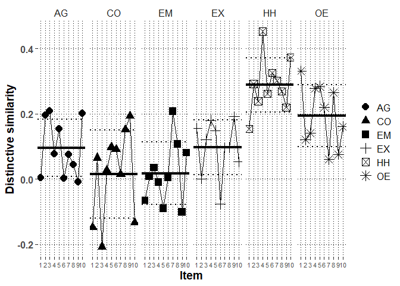

# Packages


```r
library(lme4)
library(rio)
library(lmerTest)
library(emmeans)
library(dplyr)
library(ggplot2)
library(metafor)
library(finalfit)
library(psych)
#custom functions
source("../../custom functions/custom_functions.R")
```

# Data


```r
Chi3comb_long_fdat<-
  import("../../../data/processed/Chinese 3/Chi3comb_long_fdat.xlsx")
```

# Descriptive analysis

## Profile distinctive and normative similarity correlations


```r
mod.dat<-Chi3comb_long_fdat %>%
  group_by(ID) %>%
  summarize(satis.z=mean(satis.z),
            commit.z=mean(commit.z),
            cor.SRc.zc=transf.rtoz(cor(PR.z,SRc.zc)),
            cor.Norm_sr.z=transf.rtoz(cor(PR.z,Norm_sr.z)),
            cor.SR=transf.rtoz(cor(PR,SR)))
```

```
## `summarise()` ungrouping output (override with `.groups` argument)
```

```r
# mean distinctive similarity
(mean.dist.sim<-transf.ztor(mean(mod.dat$cor.SRc.zc)))
```

```
## [1] 0.1298514
```

```r
# mean normative similarity
(mean.norm.sim<-transf.ztor(mean(mod.dat$cor.Norm_sr.z)))
```

```
## [1] 0.4477178
```

```r
# mean overall profile similarity
(mean.over.sim<-transf.ztor(mean(mod.dat$cor.SR)))
```

```
## [1] 0.3290105
```

```r
#correlations with moderators
print(corr.test(mod.dat[,c("cor.SRc.zc",
                     "cor.Norm_sr.z",
                     "cor.SR",
                     "satis.z",
                     "commit.z")],adjust="none"),short=F)
```

```
## Call:corr.test(x = mod.dat[, c("cor.SRc.zc", "cor.Norm_sr.z", "cor.SR", 
##     "satis.z", "commit.z")], adjust = "none")
## Correlation matrix 
##               cor.SRc.zc cor.Norm_sr.z cor.SR satis.z commit.z
## cor.SRc.zc          1.00          0.26   0.91    0.24     0.21
## cor.Norm_sr.z       0.26          1.00   0.60    0.25     0.31
## cor.SR              0.91          0.60   1.00    0.29     0.27
## satis.z             0.24          0.25   0.29    1.00     0.54
## commit.z            0.21          0.31   0.27    0.54     1.00
## Sample Size 
## [1] 315
## Probability values (Entries above the diagonal are adjusted for multiple tests.) 
##               cor.SRc.zc cor.Norm_sr.z cor.SR satis.z commit.z
## cor.SRc.zc             0             0      0       0        0
## cor.Norm_sr.z          0             0      0       0        0
## cor.SR                 0             0      0       0        0
## satis.z                0             0      0       0        0
## commit.z               0             0      0       0        0
## 
##  Confidence intervals based upon normal theory.  To get bootstrapped values, try cor.ci
##             raw.lower raw.r raw.upper raw.p lower.adj upper.adj
## c.SR.-c.N_.      0.15  0.26      0.36     0      0.11      0.40
## c.SR.-cr.SR      0.89  0.91      0.93     0      0.88      0.93
## c.SR.-sts.z      0.13  0.24      0.34     0      0.08      0.38
## c.SR.-cmmt.      0.11  0.21      0.32     0      0.06      0.36
## c.N_.-cr.SR      0.52  0.60      0.66     0      0.49      0.69
## c.N_.-sts.z      0.15  0.25      0.35     0      0.10      0.40
## c.N_.-cmmt.      0.20  0.31      0.40     0      0.16      0.44
## cr.SR-sts.z      0.18  0.29      0.38     0      0.13      0.42
## cr.SR-cmmt.      0.16  0.27      0.37     0      0.12      0.41
## sts.z-cmmt.      0.45  0.54      0.61     0      0.41      0.64
```

```r
#partial correlations with moderators

#distinctive (normative partialed)

partial.r(data=mod.dat,
          x=c("cor.SRc.zc",
                     "satis.z",
                     "commit.z"),
          y=c("cor.Norm_sr.z"))
```

```
## partial correlations 
##            cor.SRc.zc satis.z commit.z
## cor.SRc.zc       1.00    0.18     0.15
## satis.z          0.18    1.00     0.50
## commit.z         0.15    0.50     1.00
```

```r
#normative (distinctive partialed)

partial.r(data=mod.dat,
          x=c("cor.Norm_sr.z",
                     "satis.z",
                     "commit.z"),
          y=c("cor.SRc.zc"))
```

```
## partial correlations 
##               cor.Norm_sr.z satis.z commit.z
## cor.Norm_sr.z          1.00    0.21     0.27
## satis.z                0.21    1.00     0.51
## commit.z               0.27    0.51     1.00
```


# Multilevel profile analysis

## mod0: Baseline model without random effects


```r
mod0<-lmer(PR.z~SRc.zc+Norm_sr.z+(1|ID),
           data=Chi3comb_long_fdat,
           REML=F,
           control=lmerControl(optimizer="bobyqa",
                               optCtrl=list(maxfun=2e8)))
getMOD(mod0)
```

```
## $Fixed
##               Est   SE       df     t     p    LL   UL
## (Intercept) -0.00 0.01   315.00 -0.18 0.854 -0.02 0.02
## SRc.zc       0.13 0.01 18585.00 19.08 0.000  0.11 0.14
## Norm_sr.z    0.43 0.01 18585.00 64.58 0.000  0.42 0.45
## 
## $Random
##        grp        var1 var2 est_SD est_VAR
## 1       ID (Intercept) <NA>   0.11    0.01
## 2 Residual        <NA> <NA>   0.92    0.84
## 
## $Deviance
##      Deviance n.pars
## [1,] 50469.87      4
```

## mod1: Baseline model with random effects


```r
mod1<-lmer(PR.z~SRc.zc+Norm_sr.z+(1+SRc.zc+Norm_sr.z|ID),
           data=Chi3comb_long_fdat,
           REML=F,
           control=lmerControl(optimizer="bobyqa",
                               optCtrl=list(maxfun=2e8)))

getMOD(mod1)
```

```
## $Fixed
##               Est   SE     df     t     p    LL   UL
## (Intercept) -0.00 0.01 315.00 -0.18 0.856 -0.02 0.02
## SRc.zc       0.12 0.01 313.09 11.26 0.000  0.10 0.14
## Norm_sr.z    0.42 0.01 313.57 39.82 0.000  0.40 0.45
## 
## $Random
##        grp        var1      var2 est_SD est_VAR
## 1       ID (Intercept)      <NA>   0.11    0.01
## 2       ID      SRc.zc      <NA>   0.15    0.02
## 3       ID   Norm_sr.z      <NA>   0.15    0.02
## 4       ID (Intercept)    SRc.zc  -0.30   -0.00
## 5       ID (Intercept) Norm_sr.z   0.09    0.00
## 6       ID      SRc.zc Norm_sr.z   0.24    0.01
## 7 Residual        <NA>      <NA>   0.89    0.79
## 
## $Deviance
##      Deviance n.pars
## [1,] 50015.56      9
```

```r
#check the CIs for random effects as well
confint(mod1, oldNames=FALSE)
```

```
## Computing profile confidence intervals ...
```

```
##                                    2.5 %      97.5 %
## sd_(Intercept)|ID             0.09193993  0.12813590
## cor_SRc.zc.(Intercept)|ID    -0.48395383 -0.10061310
## cor_Norm_sr.z.(Intercept)|ID -0.11331180  0.28976912
## sd_SRc.zc|ID                  0.13215752  0.17010731
## cor_Norm_sr.z.SRc.zc|ID       0.06604867  0.40668472
## sd_Norm_sr.z|ID               0.13013831  0.16807868
## sigma                         0.88059940  0.89899352
## (Intercept)                  -0.01921794  0.01596307
## SRc.zc                        0.10100815  0.14379720
## Norm_sr.z                     0.40339788  0.44534008
```

```r
#obtain random slope SDs for scaling purposes
(Dist.SD.mod1<-
    getREVAR(model=mod1,par="SRc.zc",
             grp="ID",type="sdcor"))
```

```
## [1] 0.1502908
```

```r
(Norm.SD.mod1<-
    getREVAR(model=mod1,par="Norm_sr.z",
             grp="ID",type="sdcor"))
```

```
## [1] 0.1483499
```

```r
#save estimates
export(summary(mod1)$coefficients,
       "../../../output/Chinese 3/Chi3comb.main.xlsx",row.names=T)

#save slope-SD estimates
export(cbind(Dist.SD.mod1,Norm.SD.mod1),
       "../../../output/Chinese 3/Chi3comb.slope.SD.xlsx",row.names=T)
```


## mod2: Moderation of similarity by relationship satisfaction


```r
mod2<-lmer(PR.z~SRc.zc+Norm_sr.z+
             satis.z+satis.z:SRc.zc+satis.z:Norm_sr.z+
             (1+SRc.zc+Norm_sr.z|ID),
           data=Chi3comb_long_fdat,
           REML=F,
           control=lmerControl(optimizer="bobyqa",
                               optCtrl=list(maxfun=2e8)))

getMOD(mod2)
```

```
## $Fixed
##                     Est   SE     df     t     p    LL   UL
## (Intercept)       -0.00 0.01 315.00 -0.18 0.854 -0.02 0.02
## SRc.zc             0.12 0.01 314.10 11.46 0.000  0.10 0.14
## Norm_sr.z          0.42 0.01 313.28 41.13 0.000  0.40 0.44
## satis.z            0.00 0.01 315.00  0.14 0.891 -0.02 0.02
## SRc.zc:satis.z     0.04 0.01 285.87  3.86 0.000  0.02 0.06
## Norm_sr.z:satis.z  0.05 0.01 313.92  4.81 0.000  0.03 0.07
## 
## $Random
##        grp        var1      var2 est_SD est_VAR
## 1       ID (Intercept)      <NA>   0.11    0.01
## 2       ID      SRc.zc      <NA>   0.14    0.02
## 3       ID   Norm_sr.z      <NA>   0.14    0.02
## 4       ID (Intercept)    SRc.zc  -0.31   -0.00
## 5       ID (Intercept) Norm_sr.z   0.09    0.00
## 6       ID      SRc.zc Norm_sr.z   0.17    0.00
## 7 Residual        <NA>      <NA>   0.89    0.79
## 
## $Deviance
##      Deviance n.pars
## [1,] 49983.02     12
```

```r
#save estimates
export(summary(mod2)$coefficients,
       "../../../output/Chinese 3/Chi3comb.satis.xlsx",row.names=T)
```

### Simple slopes for distinctive similarity by satisfaction


```r
(slopes.Dist.satis.mod2<-emtrends(mod2,
         var="SRc.zc",
         specs="satis.z",
         at=list(satis.z=c(-1,0,1)),
         lmerTest.limit = 25000,
         disable.pbkrtest=T,infer=c(T,T)))
```

```
##  satis.z SRc.zc.trend     SE  df lower.CL upper.CL t.ratio p.value
##       -1       0.0807 0.0151 297    0.051    0.110  5.352  <.0001 
##        0       0.1216 0.0106 314    0.101    0.142 11.465  <.0001 
##        1       0.1625 0.0149 302    0.133    0.192 10.905  <.0001 
## 
## Degrees-of-freedom method: satterthwaite 
## Confidence level used: 0.95
```

```r
export(slopes.Dist.satis.mod2,
       "../../../output/Chinese 3/Chi3comb.satis.slopes.xlsx",row.names=T)
```

### Model-based effect size for relationship satisfaction in association with distinctive similarity


```r
#obtain effect by scaling the contrast between mean and mean+1SD
eff.Dist.satis.mod2<-emtrends(mod2,
         var="SRc.zc",
         specs="satis.z",
         at=list(satis.z=c(1,0,-1)),
         lmerTest.limit = 25000,
         disable.pbkrtest=T,infer=c(T,T))
pairs(eff.Dist.satis.mod2,
      scale=1/Dist.SD.mod1,adjust="none",infer=c(T,T))
```

```
##  contrast estimate     SE  df lower.CL upper.CL t.ratio p.value
##  1 - 0       0.272 0.0705 286    0.133    0.411 3.861   0.0001 
##  1 - (-1)    0.544 0.1410 286    0.267    0.822 3.861   0.0001 
##  0 - (-1)    0.272 0.0705 286    0.133    0.411 3.861   0.0001 
## 
## Degrees-of-freedom method: satterthwaite 
## Confidence level used: 0.95
```


## mod3: Moderation of similarity by relationship commitment


```r
mod3<-lmer(PR.z~SRc.zc+Norm_sr.z+
             commit.z+commit.z:SRc.zc+commit.z:Norm_sr.z+
             (1+SRc.zc+Norm_sr.z|ID),
           data=Chi3comb_long_fdat,
           REML=F,
           control=lmerControl(optimizer="bobyqa",
                               optCtrl=list(maxfun=2e8)))

getMOD(mod3)
```

```
## $Fixed
##                      Est   SE     df     t     p    LL   UL
## (Intercept)        -0.00 0.01 315.00 -0.18 0.856 -0.02 0.02
## SRc.zc              0.12 0.01 313.54 11.52 0.000  0.10 0.14
## Norm_sr.z           0.42 0.01 313.29 42.75 0.000  0.40 0.44
## commit.z           -0.00 0.01 315.00 -0.50 0.617 -0.02 0.01
## SRc.zc:commit.z     0.04 0.01 306.29  3.85 0.000  0.02 0.06
## Norm_sr.z:commit.z  0.07 0.01 312.46  6.95 0.000  0.05 0.09
## 
## $Random
##        grp        var1      var2 est_SD est_VAR
## 1       ID (Intercept)      <NA>   0.11    0.01
## 2       ID      SRc.zc      <NA>   0.14    0.02
## 3       ID   Norm_sr.z      <NA>   0.13    0.02
## 4       ID (Intercept)    SRc.zc  -0.30   -0.00
## 5       ID (Intercept) Norm_sr.z   0.12    0.00
## 6       ID      SRc.zc Norm_sr.z   0.14    0.00
## 7 Residual        <NA>      <NA>   0.89    0.79
## 
## $Deviance
##      Deviance n.pars
## [1,] 49961.76     12
```

```r
#save estimates
export(summary(mod3)$coefficients,
       "../../../output/Chinese 3/Chi3comb.commit.xlsx",row.names=T)
```

### Simple slopes for distinctive similarity by commitment


```r
(slopes.Dist.commit.mod3<-emtrends(mod3,
         var="SRc.zc",
         specs="commit.z",
         at=list(commit.z=c(-1,0,1)),
         lmerTest.limit = 25000,
         disable.pbkrtest=T,infer=c(T,T)))
```

```
##  commit.z SRc.zc.trend     SE  df lower.CL upper.CL t.ratio p.value
##        -1       0.0813 0.0150 319   0.0517    0.111  5.406  <.0001 
##         0       0.1218 0.0106 314   0.1010    0.143 11.516  <.0001 
##         1       0.1623 0.0148 300   0.1332    0.191 10.964  <.0001 
## 
## Degrees-of-freedom method: satterthwaite 
## Confidence level used: 0.95
```

```r
export(slopes.Dist.commit.mod3,
       "../../../output/Chinese 3/Chi3comb.commit.slopes.xlsx",row.names=T)
```

### Model-based effect size for relationship commitment in association with distinctive similarity


```r
#obtain effect by scaling the contrast between mean and mean+1SD
eff.Dist.commit.mod3<-emtrends(mod3,
         var="SRc.zc",
         specs="commit.z",
         at=list(commit.z=c(1,0,-1)),
         lmerTest.limit = 25000,infer=c(T,T),
         disable.pbkrtest=T)
pairs(eff.Dist.commit.mod3,scale=1/Dist.SD.mod1,
      adjust="none",infer=c(T,T))
```

```
##  contrast estimate   SE  df lower.CL upper.CL t.ratio p.value
##  1 - 0       0.269 0.07 306    0.132    0.407 3.847   0.0001 
##  1 - (-1)    0.539 0.14 306    0.263    0.814 3.847   0.0001 
##  0 - (-1)    0.269 0.07 306    0.132    0.407 3.847   0.0001 
## 
## Degrees-of-freedom method: satterthwaite 
## Confidence level used: 0.95
```


## mod9: HEXACO-domain fixed main effects


```r
mod9<-lmer(PR.z~SRc.zc+Norm_sr.z+
             (1+SRc.zc+Norm_sr.z|ID)+
             domain+domain:SRc.zc+domain:Norm_sr.z,
           data=Chi3comb_long_fdat,
           REML=F,
           control=lmerControl(optimizer="bobyqa",
                               optCtrl=list(maxfun=2e8)))

getMOD(mod9)
```

```
## $Fixed
##                      Est   SE       df     t     p    LL    UL
## (Intercept)         0.03 0.02  3623.54  1.57 0.116 -0.01  0.06
## SRc.zc              0.10 0.02  2737.21  5.40 0.000  0.06  0.14
## Norm_sr.z           0.47 0.02  2539.79 25.78 0.000  0.43  0.50
## domainCO           -0.12 0.02 18139.73 -5.48 0.000 -0.17 -0.08
## domainEM           -0.00 0.02 18157.21 -0.11 0.911 -0.05  0.04
## domainEX           -0.01 0.02 18151.13 -0.30 0.766 -0.05  0.04
## domainHH            0.01 0.02 18173.86  0.65 0.513 -0.03  0.06
## domainOE           -0.02 0.02 18173.34 -1.05 0.293 -0.07  0.02
## SRc.zc:domainCO    -0.09 0.02 18645.65 -3.85 0.000 -0.14 -0.04
## SRc.zc:domainEM    -0.09 0.02 18679.12 -3.98 0.000 -0.14 -0.05
## SRc.zc:domainEX    -0.01 0.02 18651.23 -0.35 0.728 -0.05  0.04
## SRc.zc:domainHH     0.18 0.02 18675.15  8.10 0.000  0.14  0.22
## SRc.zc:domainOE     0.09 0.02 18640.45  4.05 0.000  0.05  0.13
## Norm_sr.z:domainCO -0.13 0.02 18181.71 -5.97 0.000 -0.17 -0.09
## Norm_sr.z:domainEM -0.03 0.02 18249.46 -1.29 0.198 -0.08  0.02
## Norm_sr.z:domainEX  0.04 0.02 18195.72  1.76 0.079 -0.00  0.08
## Norm_sr.z:domainHH  0.09 0.02 18244.79  3.70 0.000  0.04  0.14
## Norm_sr.z:domainOE -0.20 0.02 18192.89 -8.66 0.000 -0.25 -0.15
## 
## $Random
##        grp        var1      var2 est_SD est_VAR
## 1       ID (Intercept)      <NA>   0.11    0.01
## 2       ID      SRc.zc      <NA>   0.14    0.02
## 3       ID   Norm_sr.z      <NA>   0.15    0.02
## 4       ID (Intercept)    SRc.zc  -0.28   -0.00
## 5       ID (Intercept) Norm_sr.z   0.10    0.00
## 6       ID      SRc.zc Norm_sr.z   0.26    0.01
## 7 Residual        <NA>      <NA>   0.88    0.77
## 
## $Deviance
##      Deviance n.pars
## [1,] 49521.47     24
```

```r
anova(mod9)
```

```
## Type III Analysis of Variance Table with Satterthwaite's method
##                   Sum Sq Mean Sq NumDF   DenDF  F value    Pr(>F)    
## SRc.zc             89.73   89.73     1   316.0  116.367 < 2.2e-16 ***
## Norm_sr.z        1249.79 1249.79     1   323.1 1620.722 < 2.2e-16 ***
## domain             38.68    7.74     5 18150.6   10.033 1.322e-09 ***
## SRc.zc:domain     184.49   36.90     5 18637.9   47.848 < 2.2e-16 ***
## Norm_sr.z:domain  167.33   33.47     5 18226.1   43.399 < 2.2e-16 ***
## ---
## Signif. codes:  0 '***' 0.001 '**' 0.01 '*' 0.05 '.' 0.1 ' ' 1
```

```r
anova(mod1,mod9)
```

```
## Data: Chi3comb_long_fdat
## Models:
## mod1: PR.z ~ SRc.zc + Norm_sr.z + (1 + SRc.zc + Norm_sr.z | ID)
## mod9: PR.z ~ SRc.zc + Norm_sr.z + (1 + SRc.zc + Norm_sr.z | ID) + domain + 
## mod9:     domain:SRc.zc + domain:Norm_sr.z
##      npar   AIC   BIC logLik deviance Chisq Df Pr(>Chisq)    
## mod1   10 50036 50114 -25008    50016                        
## mod9   25 49571 49768 -24761    49521 494.1 15  < 2.2e-16 ***
## ---
## Signif. codes:  0 '***' 0.001 '**' 0.01 '*' 0.05 '.' 0.1 ' ' 1
```

### Marginal effects for distinctive similarity in HEXACO-domains


```r
Dist.HEXACO.mod9<-emtrends(mod9,var="SRc.zc",specs="domain",
                          lmerTest.limit = 21540,
                          disable.pbkrtest=T,infer=c(T,T))
Dist.HEXACO.mod9
```

```
##  domain SRc.zc.trend     SE   df lower.CL upper.CL t.ratio p.value
##  AG          0.10045 0.0186 2737   0.0640   0.1369  5.399  <.0001 
##  CO          0.00980 0.0187 2756  -0.0269   0.0465  0.524  0.6002 
##  EM          0.00994 0.0176 2207  -0.0245   0.0444  0.565  0.5719 
##  EX          0.09227 0.0187 2728   0.0557   0.1288  4.947  <.0001 
##  HH          0.28101 0.0170 1953   0.2476   0.3144 16.509  <.0001 
##  OE          0.19011 0.0168 1888   0.1572   0.2230 11.325  <.0001 
## 
## Degrees-of-freedom method: satterthwaite 
## Confidence level used: 0.95
```

```r
#export the domain-specific estimates
export(data.frame(test(Dist.HEXACO.mod9)),
       "../../../output/Chinese 3/Chi3comb.HEXACO.Dist.xlsx")
contrast(Dist.HEXACO.mod9,"eff",adjust="holm")
```

```
##  contrast  estimate     SE    df t.ratio p.value
##  AG effect  -0.0135 0.0150 18678 -0.896  0.3703 
##  CO effect  -0.1041 0.0151 18605 -6.906  <.0001 
##  EM effect  -0.1040 0.0142 18638 -7.311  <.0001 
##  EX effect  -0.0217 0.0151 18642 -1.438  0.3008 
##  HH effect   0.1671 0.0137 18640 12.168  <.0001 
##  OE effect   0.0762 0.0136 18598  5.619  <.0001 
## 
## Degrees-of-freedom method: satterthwaite 
## P value adjustment: holm method for 6 tests
```

```r
contrast(Dist.HEXACO.mod9,"del.eff",adjust="holm")
```

```
##  contrast  estimate     SE    df t.ratio p.value
##  AG effect  -0.0162 0.0181 18678 -0.896  0.3703 
##  CO effect  -0.1250 0.0181 18605 -6.906  <.0001 
##  EM effect  -0.1248 0.0171 18638 -7.311  <.0001 
##  EX effect  -0.0260 0.0181 18642 -1.438  0.3008 
##  HH effect   0.2005 0.0165 18640 12.168  <.0001 
##  OE effect   0.0914 0.0163 18598  5.619  <.0001 
## 
## Degrees-of-freedom method: satterthwaite 
## P value adjustment: holm method for 6 tests
```

```r
pairs(Dist.HEXACO.mod9,adjust="holm")
```

```
##  contrast  estimate     SE    df t.ratio p.value
##  AG - CO   0.090654 0.0236 18646   3.848 0.0006 
##  AG - EM   0.090511 0.0228 18679   3.976 0.0004 
##  AG - EX   0.008185 0.0235 18651   0.348 1.0000 
##  AG - HH  -0.180560 0.0223 18675  -8.101 <.0001 
##  AG - OE  -0.089658 0.0221 18640  -4.054 0.0004 
##  CO - EM  -0.000143 0.0228 18637  -0.006 1.0000 
##  CO - EX  -0.082469 0.0236 18632  -3.500 0.0014 
##  CO - HH  -0.271214 0.0223 18599 -12.145 <.0001 
##  CO - OE  -0.180312 0.0222 18588  -8.136 <.0001 
##  EM - EX  -0.082326 0.0228 18625  -3.617 0.0012 
##  EM - HH  -0.271071 0.0214 18662 -12.645 <.0001 
##  EM - OE  -0.180169 0.0213 18622  -8.455 <.0001 
##  EX - HH  -0.188745 0.0223 18659  -8.454 <.0001 
##  EX - OE  -0.097843 0.0221 18628  -4.418 0.0001 
##  HH - OE   0.090902 0.0208 18613   4.368 0.0001 
## 
## Degrees-of-freedom method: satterthwaite 
## P value adjustment: holm method for 15 tests
```

```r
pairs(Dist.HEXACO.mod9,adjust="none")
```

```
##  contrast  estimate     SE    df t.ratio p.value
##  AG - CO   0.090654 0.0236 18646   3.848 0.0001 
##  AG - EM   0.090511 0.0228 18679   3.976 0.0001 
##  AG - EX   0.008185 0.0235 18651   0.348 0.7281 
##  AG - HH  -0.180560 0.0223 18675  -8.101 <.0001 
##  AG - OE  -0.089658 0.0221 18640  -4.054 0.0001 
##  CO - EM  -0.000143 0.0228 18637  -0.006 0.9950 
##  CO - EX  -0.082469 0.0236 18632  -3.500 0.0005 
##  CO - HH  -0.271214 0.0223 18599 -12.145 <.0001 
##  CO - OE  -0.180312 0.0222 18588  -8.136 <.0001 
##  EM - EX  -0.082326 0.0228 18625  -3.617 0.0003 
##  EM - HH  -0.271071 0.0214 18662 -12.645 <.0001 
##  EM - OE  -0.180169 0.0213 18622  -8.455 <.0001 
##  EX - HH  -0.188745 0.0223 18659  -8.454 <.0001 
##  EX - OE  -0.097843 0.0221 18628  -4.418 <.0001 
##  HH - OE   0.090902 0.0208 18613   4.368 <.0001 
## 
## Degrees-of-freedom method: satterthwaite
```

### Marginal effects for normative similarity in HEXACO-domains


```r
Norm.HEXACO.mod9<-emtrends(mod9,var="Norm_sr.z",
                           specs="domain",
                          lmerTest.limit = 21540,
                          disable.pbkrtest=T,infer=c(T,T))
Norm.HEXACO.mod9
```

```
##  domain Norm_sr.z.trend     SE   df lower.CL upper.CL t.ratio p.value
##  AG               0.467 0.0181 2540    0.432    0.503 25.783  <.0001 
##  CO               0.340 0.0164 1747    0.308    0.372 20.735  <.0001 
##  EM               0.437 0.0192 3112    0.399    0.475 22.774  <.0001 
##  EX               0.506 0.0171 2049    0.472    0.539 29.587  <.0001 
##  HH               0.557 0.0199 3515    0.518    0.596 28.018  <.0001 
##  OE               0.268 0.0186 2766    0.231    0.304 14.416  <.0001 
## 
## Degrees-of-freedom method: satterthwaite 
## Confidence level used: 0.95
```

```r
test(Norm.HEXACO.mod9)
```

```
##  domain Norm_sr.z.trend     SE   df t.ratio p.value
##  AG               0.467 0.0181 2540 25.783  <.0001 
##  CO               0.340 0.0164 1747 20.735  <.0001 
##  EM               0.437 0.0192 3112 22.774  <.0001 
##  EX               0.506 0.0171 2049 29.587  <.0001 
##  HH               0.557 0.0199 3515 28.018  <.0001 
##  OE               0.268 0.0186 2766 14.416  <.0001 
## 
## Degrees-of-freedom method: satterthwaite
```

```r
export(data.frame(test(Norm.HEXACO.mod9)),
       "../../../output/Chinese 3/Chi3comb.HEXACO.Norm.xlsx")
contrast(Norm.HEXACO.mod9,"eff",adjust="holm")
```

```
##  contrast  estimate     SE    df t.ratio p.value
##  AG effect  0.03834 0.0147 18196   2.607 0.0183 
##  CO effect -0.08926 0.0133 18188  -6.729 <.0001 
##  EM effect  0.00789 0.0156 18267   0.506 0.6132 
##  EX effect  0.07689 0.0139 18218   5.545 <.0001 
##  HH effect  0.12761 0.0161 18268   7.911 <.0001 
##  OE effect -0.16147 0.0151 18227 -10.716 <.0001 
## 
## Degrees-of-freedom method: satterthwaite 
## P value adjustment: holm method for 6 tests
```

```r
contrast(Norm.HEXACO.mod9,"del.eff",adjust="holm")
```

```
##  contrast  estimate     SE    df t.ratio p.value
##  AG effect  0.04601 0.0176 18196   2.607 0.0183 
##  CO effect -0.10711 0.0159 18188  -6.729 <.0001 
##  EM effect  0.00947 0.0187 18267   0.506 0.6132 
##  EX effect  0.09226 0.0166 18218   5.545 <.0001 
##  HH effect  0.15314 0.0194 18268   7.911 <.0001 
##  OE effect -0.19377 0.0181 18227 -10.716 <.0001 
## 
## Degrees-of-freedom method: satterthwaite 
## P value adjustment: holm method for 6 tests
```

```r
pairs(Norm.HEXACO.mod9,adjust="holm")
```

```
##  contrast estimate     SE    df t.ratio p.value
##  AG - CO    0.1276 0.0214 18182  5.969  <.0001 
##  AG - EM    0.0304 0.0236 18249  1.288  0.1977 
##  AG - EX   -0.0385 0.0219 18196 -1.758  0.1577 
##  AG - HH   -0.0893 0.0241 18245 -3.697  0.0013 
##  AG - OE    0.1998 0.0231 18193  8.656  <.0001 
##  CO - EM   -0.0971 0.0223 18241 -4.355  0.0001 
##  CO - EX   -0.1661 0.0205 18193 -8.100  <.0001 
##  CO - HH   -0.2169 0.0229 18247 -9.486  <.0001 
##  CO - OE    0.0722 0.0217 18204  3.320  0.0045 
##  EM - EX   -0.0690 0.0229 18256 -3.019  0.0102 
##  EM - HH   -0.1197 0.0250 18269 -4.793  <.0001 
##  EM - OE    0.1694 0.0240 18254  7.066  <.0001 
##  EX - HH   -0.0507 0.0234 18253 -2.169  0.0903 
##  EX - OE    0.2384 0.0223 18218 10.687  <.0001 
##  HH - OE    0.2891 0.0245 18261 11.804  <.0001 
## 
## Degrees-of-freedom method: satterthwaite 
## P value adjustment: holm method for 15 tests
```

```r
pairs(Norm.HEXACO.mod9,adjust="none")
```

```
##  contrast estimate     SE    df t.ratio p.value
##  AG - CO    0.1276 0.0214 18182  5.969  <.0001 
##  AG - EM    0.0304 0.0236 18249  1.288  0.1977 
##  AG - EX   -0.0385 0.0219 18196 -1.758  0.0788 
##  AG - HH   -0.0893 0.0241 18245 -3.697  0.0002 
##  AG - OE    0.1998 0.0231 18193  8.656  <.0001 
##  CO - EM   -0.0971 0.0223 18241 -4.355  <.0001 
##  CO - EX   -0.1661 0.0205 18193 -8.100  <.0001 
##  CO - HH   -0.2169 0.0229 18247 -9.486  <.0001 
##  CO - OE    0.0722 0.0217 18204  3.320  0.0009 
##  EM - EX   -0.0690 0.0229 18256 -3.019  0.0025 
##  EM - HH   -0.1197 0.0250 18269 -4.793  <.0001 
##  EM - OE    0.1694 0.0240 18254  7.066  <.0001 
##  EX - HH   -0.0507 0.0234 18253 -2.169  0.0301 
##  EX - OE    0.2384 0.0223 18218 10.687  <.0001 
##  HH - OE    0.2891 0.0245 18261 11.804  <.0001 
## 
## Degrees-of-freedom method: satterthwaite
```


## mod10: HEXACO-domain fixed interactions with satisfaction 


```r
mod10<-lmer(PR.z~SRc.zc+Norm_sr.z+
             domain+domain:SRc.zc+domain:Norm_sr.z+
             satis.z+satis.z:SRc.zc+satis.z:Norm_sr.z+
             domain:satis.z+
             domain:satis.z:SRc.zc+
             domain:satis.z:Norm_sr.z+
              (1+SRc.zc+Norm_sr.z|ID),
           data=Chi3comb_long_fdat,
           REML=F,
           control=lmerControl(optimizer="bobyqa",
                               optCtrl=list(maxfun=2e8)))

getMOD(mod10)
```

```
## $Fixed
##                              Est   SE       df     t     p    LL    UL
## (Intercept)                 0.03 0.02  3616.49  1.59 0.113 -0.01  0.06
## SRc.zc                      0.10 0.02  2906.70  5.19 0.000  0.06  0.13
## Norm_sr.z                   0.46 0.02  2758.58 25.76 0.000  0.43  0.50
## domainCO                   -0.12 0.02 18140.91 -5.50 0.000 -0.17 -0.08
## domainEM                   -0.00 0.02 18159.69 -0.14 0.885 -0.05  0.04
## domainEX                   -0.01 0.02 18152.58 -0.29 0.773 -0.05  0.04
## domainHH                    0.01 0.02 18177.23  0.61 0.539 -0.03  0.06
## domainOE                   -0.02 0.02 18175.98 -1.07 0.283 -0.07  0.02
## satis.z                    -0.03 0.02  3614.61 -1.50 0.133 -0.06  0.01
## SRc.zc:domainCO            -0.09 0.02 18657.16 -3.68 0.000 -0.13 -0.04
## SRc.zc:domainEM            -0.09 0.02 18690.46 -3.79 0.000 -0.13 -0.04
## SRc.zc:domainEX            -0.01 0.02 18667.06 -0.44 0.657 -0.06  0.04
## SRc.zc:domainHH             0.18 0.02 18689.41  8.29 0.000  0.14  0.23
## SRc.zc:domainOE             0.09 0.02 18652.42  4.27 0.000  0.05  0.14
## Norm_sr.z:domainCO         -0.12 0.02 18184.60 -5.71 0.000 -0.16 -0.08
## Norm_sr.z:domainEM         -0.02 0.02 18251.74 -1.03 0.305 -0.07  0.02
## Norm_sr.z:domainEX          0.04 0.02 18204.58  2.02 0.043  0.00  0.09
## Norm_sr.z:domainHH          0.09 0.02 18249.06  3.84 0.000  0.05  0.14
## Norm_sr.z:domainOE         -0.19 0.02 18196.62 -8.40 0.000 -0.24 -0.15
## SRc.zc:satis.z              0.11 0.02  2271.67  6.32 0.000  0.08  0.15
## Norm_sr.z:satis.z           0.09 0.02  2849.09  5.11 0.000  0.06  0.13
## domainCO:satis.z           -0.00 0.02 18149.76 -0.03 0.979 -0.05  0.04
## domainEM:satis.z            0.05 0.02 18138.40  2.05 0.041  0.00  0.09
## domainEX:satis.z            0.04 0.02 18157.76  1.56 0.120 -0.01  0.08
## domainHH:satis.z            0.05 0.02 18194.63  2.09 0.037  0.00  0.09
## domainOE:satis.z            0.04 0.02 18148.39  1.74 0.081 -0.00  0.08
## SRc.zc:domainCO:satis.z    -0.10 0.02 18656.21 -4.35 0.000 -0.14 -0.05
## SRc.zc:domainEM:satis.z    -0.07 0.02 18608.50 -3.31 0.001 -0.11 -0.03
## SRc.zc:domainEX:satis.z    -0.10 0.02 18663.37 -4.27 0.000 -0.14 -0.05
## SRc.zc:domainHH:satis.z    -0.06 0.02 18661.43 -2.73 0.006 -0.10 -0.02
## SRc.zc:domainOE:satis.z    -0.10 0.02 18558.70 -4.80 0.000 -0.14 -0.06
## Norm_sr.z:domainCO:satis.z -0.06 0.02 18207.85 -2.55 0.011 -0.10 -0.01
## Norm_sr.z:domainEM:satis.z -0.08 0.02 18262.08 -3.33 0.001 -0.13 -0.03
## Norm_sr.z:domainEX:satis.z -0.00 0.02 18214.49 -0.17 0.865 -0.05  0.04
## Norm_sr.z:domainHH:satis.z -0.06 0.02 18238.71 -2.43 0.015 -0.11 -0.01
## Norm_sr.z:domainOE:satis.z -0.07 0.02 18189.98 -3.08 0.002 -0.12 -0.03
## 
## $Random
##        grp        var1      var2 est_SD est_VAR
## 1       ID (Intercept)      <NA>   0.11    0.01
## 2       ID      SRc.zc      <NA>   0.14    0.02
## 3       ID   Norm_sr.z      <NA>   0.14    0.02
## 4       ID (Intercept)    SRc.zc  -0.29   -0.00
## 5       ID (Intercept) Norm_sr.z   0.09    0.00
## 6       ID      SRc.zc Norm_sr.z   0.19    0.00
## 7 Residual        <NA>      <NA>   0.88    0.77
## 
## $Deviance
##      Deviance n.pars
## [1,] 49430.27     42
```

```r
anova(mod10)
```

```
## Type III Analysis of Variance Table with Satterthwaite's method
##                           Sum Sq Mean Sq NumDF   DenDF   F value    Pr(>F)    
## SRc.zc                     90.11   90.11     1   318.3  117.2279 < 2.2e-16 ***
## Norm_sr.z                1325.17 1325.17     1   323.9 1724.0283 < 2.2e-16 ***
## domain                     38.43    7.69     5 18152.7    9.9985 1.434e-09 ***
## satis.z                     0.05    0.05     1   320.6    0.0586 0.8089267    
## SRc.zc:domain             186.10   37.22     5 18650.0   48.4234 < 2.2e-16 ***
## Norm_sr.z:domain          163.91   32.78     5 18229.6   42.6490 < 2.2e-16 ***
## SRc.zc:satis.z             11.86   11.86     1   289.5   15.4267 0.0001073 ***
## Norm_sr.z:satis.z          16.45   16.45     1   326.1   21.4022 5.378e-06 ***
## domain:satis.z              7.50    1.50     5 18156.4    1.9522 0.0823578 .  
## SRc.zc:domain:satis.z      23.94    4.79     5 18629.5    6.2282 8.881e-06 ***
## Norm_sr.z:domain:satis.z   17.27    3.45     5 18220.8    4.4945 0.0004279 ***
## ---
## Signif. codes:  0 '***' 0.001 '**' 0.01 '*' 0.05 '.' 0.1 ' ' 1
```

```r
#model with manually defined interactions


Chi3comb_long_fdat$satis.z_SRc.zc<-
  Chi3comb_long_fdat$satis.z*Chi3comb_long_fdat$SRc.zc

Chi3comb_long_fdat$satis.z_Norm_sr.z<-
  Chi3comb_long_fdat$satis.z*Chi3comb_long_fdat$Norm_sr.z

mod10.alt<-lmer(PR.z~SRc.zc+Norm_sr.z+
             domain+domain:SRc.zc+domain:Norm_sr.z+
             satis.z+satis.z_SRc.zc+satis.z_Norm_sr.z+
             domain:satis.z+
             domain:satis.z_SRc.zc+
             domain:satis.z_Norm_sr.z+
               (0+SRc.zc+Norm_sr.z|ID),
           data=Chi3comb_long_fdat,
           REML=F,
           control=lmerControl(optimizer="bobyqa",
                               optCtrl=list(maxfun=2e8)))

#confirm that the models are identical
anova(mod10,mod10.alt)
```

```
## Data: Chi3comb_long_fdat
## Models:
## mod10.alt: PR.z ~ SRc.zc + Norm_sr.z + domain + domain:SRc.zc + domain:Norm_sr.z + 
## mod10.alt:     satis.z + satis.z_SRc.zc + satis.z_Norm_sr.z + domain:satis.z + 
## mod10.alt:     domain:satis.z_SRc.zc + domain:satis.z_Norm_sr.z + (0 + SRc.zc + 
## mod10.alt:     Norm_sr.z | ID)
## mod10: PR.z ~ SRc.zc + Norm_sr.z + domain + domain:SRc.zc + domain:Norm_sr.z + 
## mod10:     satis.z + satis.z:SRc.zc + satis.z:Norm_sr.z + domain:satis.z + 
## mod10:     domain:satis.z:SRc.zc + domain:satis.z:Norm_sr.z + (1 + SRc.zc + 
## mod10:     Norm_sr.z | ID)
##           npar   AIC   BIC logLik deviance  Chisq Df Pr(>Chisq)    
## mod10.alt   40 49609 49923 -24765    49529                         
## mod10       43 49516 49854 -24715    49430 98.827  3  < 2.2e-16 ***
## ---
## Signif. codes:  0 '***' 0.001 '**' 0.01 '*' 0.05 '.' 0.1 ' ' 1
```


### Marginal effects for satisment on distinctive similarity for each HEXACO domain


```r
#satisment effect on distinctive similarity separately for domains

#unscaled

(Dist.satis.domain.mod10.alt<-
  emtrends(mod10.alt,
           var="satis.z_SRc.zc",
           #by="domain",
           specs=c("domain"),
           lmerTest.limit = 25000,
           disable.pbkrtest=T,infer=c(T,T)))
```

```
##  domain satis.z_SRc.zc.trend     SE   df lower.CL upper.CL t.ratio p.value
##  AG                   0.1114 0.0176 2286  0.07688   0.1460 6.324   <.0001 
##  CO                   0.0136 0.0182 2537 -0.02203   0.0492 0.748   0.4547 
##  EM                   0.0383 0.0173 2127  0.00435   0.0723 2.212   0.0271 
##  EX                   0.0140 0.0181 2456 -0.02154   0.0496 0.773   0.4398 
##  HH                   0.0527 0.0167 1852  0.01997   0.0854 3.158   0.0016 
##  OE                   0.0104 0.0164 1778 -0.02183   0.0426 0.633   0.5270 
## 
## Degrees-of-freedom method: satterthwaite 
## Confidence level used: 0.95
```

```r
export(Dist.satis.domain.mod10.alt,
       "../../../output/Chinese 3/Chi3comb.HEXACO.Dist.by.satis.xlsx")

pairs(Dist.satis.domain.mod10.alt,adjust="holm")
```

```
##  contrast  estimate     SE    df t.ratio p.value
##  AG - CO   0.097858 0.0225 18732  4.343  0.0002 
##  AG - EM   0.073091 0.0219 18735  3.339  0.0101 
##  AG - EX   0.097430 0.0225 18745  4.334  0.0002 
##  AG - HH   0.058738 0.0213 18730  2.751  0.0653 
##  AG - OE   0.101040 0.0211 18682  4.783  <.0001 
##  CO - EM  -0.024768 0.0222 18706 -1.114  1.0000 
##  CO - EX  -0.000428 0.0229 18735 -0.019  1.0000 
##  CO - HH  -0.039120 0.0218 18715 -1.798  0.6497 
##  CO - OE   0.003182 0.0216 18705  0.147  1.0000 
##  EM - EX   0.024339 0.0222 18742  1.095  1.0000 
##  EM - HH  -0.014352 0.0211 18737 -0.680  1.0000 
##  EM - OE   0.027949 0.0209 18741  1.334  1.0000 
##  EX - HH  -0.038692 0.0218 18766 -1.777  0.6497 
##  EX - OE   0.003610 0.0216 18714  0.167  1.0000 
##  HH - OE   0.042302 0.0204 18717  2.074  0.3805 
## 
## Degrees-of-freedom method: satterthwaite 
## P value adjustment: holm method for 15 tests
```

```r
contrast(Dist.satis.domain.mod10.alt,"eff",adjust="holm")
```

```
##  contrast  estimate     SE    df t.ratio p.value
##  AG effect  0.07136 0.0142 18730  5.019  <.0001 
##  CO effect -0.02650 0.0146 18713 -1.811  0.2804 
##  EM effect -0.00173 0.0140 18741 -0.124  0.9014 
##  EX effect -0.02607 0.0146 18744 -1.783  0.2804 
##  HH effect  0.01262 0.0134 18735  0.939  0.6951 
##  OE effect -0.02968 0.0133 18698 -2.240  0.1255 
## 
## Degrees-of-freedom method: satterthwaite 
## P value adjustment: holm method for 6 tests
```

```r
contrast(Dist.satis.domain.mod10.alt,"del.eff",adjust="holm")
```

```
##  contrast  estimate     SE    df t.ratio p.value
##  AG effect  0.08563 0.0171 18730  5.019  <.0001 
##  CO effect -0.03180 0.0176 18713 -1.811  0.2804 
##  EM effect -0.00208 0.0168 18741 -0.124  0.9014 
##  EX effect -0.03128 0.0175 18744 -1.783  0.2804 
##  HH effect  0.01515 0.0161 18735  0.939  0.6951 
##  OE effect -0.03562 0.0159 18698 -2.240  0.1255 
## 
## Degrees-of-freedom method: satterthwaite 
## P value adjustment: holm method for 6 tests
```

```r
#scaled with common SD

Dist.var.common.scaled<-paste0("satis.z_SRc.zc*c(",
                        Dist.SD.mod1,")")

(Dist.satis.domain.mod10.alt.scaled<-
  emtrends(mod10.alt,
           var=Dist.var.common.scaled,
           #by="domain",
           specs=c("domain"),
           lmerTest.limit = 25000,
           disable.pbkrtest=T,infer=c(T,T)))
```

```
##  domain satis.z_SRc.zc*c(0.150290790943576).trend    SE   df lower.CL upper.CL
##  AG                                        0.7415 0.117 2286    0.512    0.971
##  CO                                        0.0904 0.121 2537   -0.147    0.327
##  EM                                        0.2552 0.115 2127    0.029    0.481
##  EX                                        0.0932 0.121 2456   -0.143    0.330
##  HH                                        0.3507 0.111 1852    0.133    0.568
##  OE                                        0.0692 0.109 1778   -0.145    0.284
##  t.ratio p.value
##  6.324   <.0001 
##  0.748   0.4547 
##  2.212   0.0271 
##  0.773   0.4398 
##  3.158   0.0016 
##  0.633   0.5270 
## 
## Degrees-of-freedom method: satterthwaite 
## Confidence level used: 0.95
```

```r
export(Dist.satis.domain.mod10.alt.scaled,
       "../../../output/Chinese 3/Chi3comb.HEXACO.Dist.by.satis.scaled.xlsx")


#simple slopes

(Dist.satis.slopes.domain.mod10<-
  emtrends(mod10,
           var="SRc.zc",
           by="domain",
           specs=c("satis.z"),
           at=list(satis.z=c(-1,0,1)),      
           lmerTest.limit = 25000,
           disable.pbkrtest=T,infer=c(T,T)))
```

```
## domain = AG:
##  satis.z SRc.zc.trend     SE   df lower.CL upper.CL t.ratio p.value
##       -1     -0.01538 0.0258 2614 -0.06595   0.0352 -0.596  0.5511 
##        0      0.09577 0.0185 2907  0.05955   0.1320  5.185  <.0001 
##        1      0.20691 0.0252 2539  0.15750   0.2563  8.211  <.0001 
## 
## domain = CO:
##  satis.z SRc.zc.trend     SE   df lower.CL upper.CL t.ratio p.value
##       -1     -0.00445 0.0260 2691 -0.05550   0.0466 -0.171  0.8644 
##        0      0.00914 0.0185 2914 -0.02722   0.0455  0.493  0.6220 
##        1      0.02273 0.0258 2723 -0.02782   0.0733  0.882  0.3781 
## 
## domain = EM:
##  satis.z SRc.zc.trend     SE   df lower.CL upper.CL t.ratio p.value
##       -1     -0.02958 0.0248 2238 -0.07824   0.0191 -1.192  0.2333 
##        0      0.00950 0.0174 2329 -0.02467   0.0437  0.545  0.5856 
##        1      0.04859 0.0243 2190  0.00102   0.0962  2.003  0.0453 
## 
## domain = EX:
##  satis.z SRc.zc.trend     SE   df lower.CL upper.CL t.ratio p.value
##       -1      0.06962 0.0259 2586  0.01875   0.1205  2.684  0.0073 
##        0      0.08527 0.0186 2930  0.04886   0.1217  4.591  <.0001 
##        1      0.10093 0.0259 2774  0.05012   0.1517  3.895  0.0001 
## 
## domain = HH:
##  satis.z SRc.zc.trend     SE   df lower.CL upper.CL t.ratio p.value
##       -1      0.22749 0.0239 1968  0.18056   0.2744  9.505  <.0001 
##        0      0.28060 0.0169 2069  0.24750   0.3137 16.622  <.0001 
##        1      0.33371 0.0235 1933  0.28766   0.3798 14.212  <.0001 
## 
## domain = OE:
##  satis.z SRc.zc.trend     SE   df lower.CL upper.CL t.ratio p.value
##       -1      0.17994 0.0234 1844  0.13407   0.2258  7.692  <.0001 
##        0      0.19018 0.0166 1992  0.15759   0.2228 11.443  <.0001 
##        1      0.20042 0.0233 1904  0.15477   0.2461  8.611  <.0001 
## 
## Degrees-of-freedom method: satterthwaite 
## Confidence level used: 0.95
```

```r
export(data.frame(Dist.satis.slopes.domain.mod10),
       "../../../output/Chinese 3/Chi3comb.HEXACO.Dist.by.satis.slopes.xlsx")
```


## mod11: HEXACO-domain fixed interactions with commitment 


```r
mod11<-lmer(PR.z~SRc.zc+Norm_sr.z+
             domain+domain:SRc.zc+domain:Norm_sr.z+
             commit.z+commit.z:SRc.zc+commit.z:Norm_sr.z+
             domain:commit.z+
             domain:commit.z:SRc.zc+
             domain:commit.z:Norm_sr.z+
              (1+SRc.zc+Norm_sr.z|ID),
           data=Chi3comb_long_fdat,
           REML=F,
           control=lmerControl(optimizer="bobyqa",
                               optCtrl=list(maxfun=2e8)))

getMOD(mod11)
```

```
## $Fixed
##                               Est   SE       df     t     p    LL    UL
## (Intercept)                  0.03 0.02  3626.78  1.54 0.123 -0.01  0.06
## SRc.zc                       0.10 0.02  2943.45  5.37 0.000  0.06  0.14
## Norm_sr.z                    0.47 0.02  3010.22 26.35 0.000  0.43  0.50
## domainCO                    -0.12 0.02 18141.17 -5.47 0.000 -0.17 -0.08
## domainEM                    -0.00 0.02 18159.48 -0.10 0.920 -0.05  0.04
## domainEX                    -0.01 0.02 18153.21 -0.26 0.794 -0.05  0.04
## domainHH                     0.02 0.02 18176.31  0.70 0.487 -0.03  0.06
## domainOE                    -0.02 0.02 18174.24 -1.03 0.304 -0.07  0.02
## commit.z                    -0.01 0.02  3630.25 -0.83 0.405 -0.05  0.02
## SRc.zc:domainCO             -0.09 0.02 18670.47 -3.78 0.000 -0.14 -0.04
## SRc.zc:domainEM             -0.09 0.02 18696.72 -3.95 0.000 -0.13 -0.05
## SRc.zc:domainEX             -0.01 0.02 18677.44 -0.39 0.697 -0.06  0.04
## SRc.zc:domainHH              0.18 0.02 18701.19  8.06 0.000  0.14  0.22
## SRc.zc:domainOE              0.09 0.02 18664.68  4.15 0.000  0.05  0.14
## Norm_sr.z:domainCO          -0.13 0.02 18183.25 -5.91 0.000 -0.17 -0.08
## Norm_sr.z:domainEM          -0.03 0.02 18252.79 -1.26 0.206 -0.08  0.02
## Norm_sr.z:domainEX           0.04 0.02 18200.75  1.83 0.067 -0.00  0.08
## Norm_sr.z:domainHH           0.09 0.02 18248.90  3.67 0.000  0.04  0.14
## Norm_sr.z:domainOE          -0.20 0.02 18197.30 -8.61 0.000 -0.24 -0.15
## SRc.zc:commit.z              0.06 0.02  2754.75  3.36 0.001  0.03  0.10
## Norm_sr.z:commit.z           0.06 0.02  3018.73  3.40 0.001  0.03  0.10
## domainCO:commit.z           -0.03 0.02 18145.23 -1.47 0.142 -0.08  0.01
## domainEM:commit.z            0.04 0.02 18158.71  1.93 0.053 -0.00  0.09
## domainEX:commit.z            0.03 0.02 18161.43  1.28 0.201 -0.02  0.07
## domainHH:commit.z            0.04 0.02 18175.94  1.73 0.084 -0.01  0.08
## domainOE:commit.z           -0.00 0.02 18197.57 -0.18 0.857 -0.05  0.04
## SRc.zc:domainCO:commit.z    -0.03 0.02 18648.00 -1.22 0.223 -0.07  0.02
## SRc.zc:domainEM:commit.z    -0.02 0.02 18630.51 -0.93 0.350 -0.06  0.02
## SRc.zc:domainEX:commit.z    -0.04 0.02 18683.73 -1.57 0.116 -0.08  0.01
## SRc.zc:domainHH:commit.z    -0.01 0.02 18679.51 -0.24 0.811 -0.05  0.04
## SRc.zc:domainOE:commit.z    -0.04 0.02 18681.70 -1.62 0.105 -0.08  0.01
## Norm_sr.z:domainCO:commit.z  0.02 0.02 18188.30  0.76 0.444 -0.03  0.06
## Norm_sr.z:domainEM:commit.z  0.00 0.02 18267.28  0.01 0.990 -0.05  0.05
## Norm_sr.z:domainEX:commit.z  0.03 0.02 18202.00  1.52 0.128 -0.01  0.08
## Norm_sr.z:domainHH:commit.z  0.03 0.02 18227.19  1.29 0.196 -0.02  0.08
## Norm_sr.z:domainOE:commit.z -0.04 0.02 18209.05 -1.63 0.103 -0.08  0.01
## 
## $Random
##        grp        var1      var2 est_SD est_VAR
## 1       ID (Intercept)      <NA>   0.11    0.01
## 2       ID      SRc.zc      <NA>   0.14    0.02
## 3       ID   Norm_sr.z      <NA>   0.13    0.02
## 4       ID (Intercept)    SRc.zc  -0.28   -0.00
## 5       ID (Intercept) Norm_sr.z   0.12    0.00
## 6       ID      SRc.zc Norm_sr.z   0.16    0.00
## 7 Residual        <NA>      <NA>   0.88    0.77
## 
## $Deviance
##      Deviance n.pars
## [1,] 49433.34     42
```

```r
anova(mod11)
```

```
## Type III Analysis of Variance Table with Satterthwaite's method
##                            Sum Sq Mean Sq NumDF   DenDF   F value    Pr(>F)    
## SRc.zc                      93.42   93.42     1   316.5  121.3515 < 2.2e-16 ***
## Norm_sr.z                 1433.55 1433.55     1   324.4 1862.2412 < 2.2e-16 ***
## domain                      38.78    7.76     5 18152.3   10.0765 1.194e-09 ***
## commit.z                     0.03    0.03     1   319.6    0.0393 0.8430613    
## SRc.zc:domain              182.90   36.58     5 18661.1   47.5182 < 2.2e-16 ***
## Norm_sr.z:domain           165.98   33.20     5 18229.6   43.1227 < 2.2e-16 ***
## SRc.zc:commit.z             11.64   11.64     1   309.1   15.1160 0.0001238 ***
## Norm_sr.z:commit.z          35.53   35.53     1   323.9   46.1596 5.237e-11 ***
## domain:commit.z             13.47    2.69     5 18158.6    3.4994 0.0036580 ** 
## SRc.zc:domain:commit.z       3.76    0.75     5 18647.2    0.9758 0.4308279    
## Norm_sr.z:domain:commit.z    9.95    1.99     5 18214.7    2.5855 0.0241035 *  
## ---
## Signif. codes:  0 '***' 0.001 '**' 0.01 '*' 0.05 '.' 0.1 ' ' 1
```

```r
#model with manually defined interactions


Chi3comb_long_fdat$commit.z_SRc.zc<-
  Chi3comb_long_fdat$commit.z*Chi3comb_long_fdat$SRc.zc

Chi3comb_long_fdat$commit.z_Norm_sr.z<-
  Chi3comb_long_fdat$commit.z*Chi3comb_long_fdat$Norm_sr.z

mod11.alt<-lmer(PR.z~SRc.zc+Norm_sr.z+
             domain+domain:SRc.zc+domain:Norm_sr.z+
             commit.z+commit.z_SRc.zc+commit.z_Norm_sr.z+
             domain:commit.z+
             domain:commit.z_SRc.zc+
             domain:commit.z_Norm_sr.z+
               (0+SRc.zc+Norm_sr.z|ID),
           data=Chi3comb_long_fdat,
           REML=F,
           control=lmerControl(optimizer="bobyqa",
                               optCtrl=list(maxfun=2e8)))

#confirm that the models are identical
anova(mod11,mod11.alt)
```

```
## Data: Chi3comb_long_fdat
## Models:
## mod11.alt: PR.z ~ SRc.zc + Norm_sr.z + domain + domain:SRc.zc + domain:Norm_sr.z + 
## mod11.alt:     commit.z + commit.z_SRc.zc + commit.z_Norm_sr.z + domain:commit.z + 
## mod11.alt:     domain:commit.z_SRc.zc + domain:commit.z_Norm_sr.z + (0 + 
## mod11.alt:     SRc.zc + Norm_sr.z | ID)
## mod11: PR.z ~ SRc.zc + Norm_sr.z + domain + domain:SRc.zc + domain:Norm_sr.z + 
## mod11:     commit.z + commit.z:SRc.zc + commit.z:Norm_sr.z + domain:commit.z + 
## mod11:     domain:commit.z:SRc.zc + domain:commit.z:Norm_sr.z + (1 + 
## mod11:     SRc.zc + Norm_sr.z | ID)
##           npar   AIC   BIC logLik deviance  Chisq Df Pr(>Chisq)    
## mod11.alt   40 49611 49925 -24766    49531                         
## mod11       43 49519 49857 -24717    49433 97.929  3  < 2.2e-16 ***
## ---
## Signif. codes:  0 '***' 0.001 '**' 0.01 '*' 0.05 '.' 0.1 ' ' 1
```


### Marginal effects for commitment on distinctive similarity for entire profile and for each HEXACO domain


```r
#commitment effect on distinctive similarity separately for domains

#unscaled

(Dist.commit.domain.mod11.alt<-
  emtrends(mod11.alt,
           var="commit.z_SRc.zc",
           #by="domain",
           specs=c("domain"),
           lmerTest.limit = 25000,
           disable.pbkrtest=T,infer=c(T,T)))
```

```
##  domain commit.z_SRc.zc.trend     SE   df lower.CL upper.CL t.ratio p.value
##  AG                    0.0624 0.0182 2771  0.02682   0.0980 3.438   0.0006 
##  CO                    0.0321 0.0185 2911 -0.00411   0.0683 1.738   0.0822 
##  EM                    0.0391 0.0172 2205  0.00541   0.0728 2.276   0.0230 
##  EX                    0.0215 0.0186 2958 -0.01491   0.0579 1.157   0.2472 
##  HH                    0.0554 0.0167 2030  0.02260   0.0882 3.312   0.0009 
##  OE                    0.0250 0.0166 2004 -0.00750   0.0575 1.508   0.1316 
## 
## Degrees-of-freedom method: satterthwaite 
## Confidence level used: 0.95
```

```r
export(Dist.commit.domain.mod11.alt,
       "../../../output/Chinese 3/Chi3comb.HEXACO.Dist.by.commit.xlsx")

pairs(Dist.commit.domain.mod11.alt,adjust="holm")
```

```
##  contrast estimate     SE    df t.ratio p.value
##  AG - CO   0.03031 0.0233 18726  1.299  1.0000 
##  AG - EM   0.02329 0.0224 18712  1.040  1.0000 
##  AG - EX   0.04093 0.0234 18749  1.748  1.0000 
##  AG - HH   0.00700 0.0220 18761  0.319  1.0000 
##  AG - OE   0.03742 0.0219 18746  1.712  1.0000 
##  CO - EM  -0.00702 0.0226 18755 -0.311  1.0000 
##  CO - EX   0.01062 0.0236 18724  0.450  1.0000 
##  CO - HH  -0.02330 0.0222 18753 -1.048  1.0000 
##  CO - OE   0.00712 0.0221 18727  0.322  1.0000 
##  EM - EX   0.01764 0.0226 18768  0.780  1.0000 
##  EM - HH  -0.01629 0.0212 18780 -0.769  1.0000 
##  EM - OE   0.01413 0.0211 18737  0.669  1.0000 
##  EX - HH  -0.03392 0.0223 18764 -1.521  1.0000 
##  EX - OE  -0.00350 0.0222 18750 -0.158  1.0000 
##  HH - OE   0.03042 0.0207 18760  1.470  1.0000 
## 
## Degrees-of-freedom method: satterthwaite 
## P value adjustment: holm method for 15 tests
```

```r
contrast(Dist.commit.domain.mod11.alt,"eff",adjust="holm")
```

```
##  contrast   estimate     SE    df t.ratio p.value
##  AG effect  0.023159 0.0148 18751  1.564  0.7074 
##  CO effect -0.007149 0.0150 18722 -0.476  1.0000 
##  EM effect -0.000132 0.0140 18737 -0.009  1.0000 
##  EX effect -0.017768 0.0151 18748 -1.176  1.0000 
##  HH effect  0.016156 0.0136 18771  1.186  1.0000 
##  OE effect -0.014266 0.0135 18752 -1.055  1.0000 
## 
## Degrees-of-freedom method: satterthwaite 
## P value adjustment: holm method for 6 tests
```

```r
contrast(Dist.commit.domain.mod11.alt,"del.eff",adjust="holm")
```

```
##  contrast   estimate     SE    df t.ratio p.value
##  AG effect  0.027791 0.0178 18751  1.564  0.7074 
##  CO effect -0.008579 0.0180 18722 -0.476  1.0000 
##  EM effect -0.000159 0.0168 18737 -0.009  1.0000 
##  EX effect -0.021322 0.0181 18748 -1.176  1.0000 
##  HH effect  0.019387 0.0164 18771  1.186  1.0000 
##  OE effect -0.017119 0.0162 18752 -1.055  1.0000 
## 
## Degrees-of-freedom method: satterthwaite 
## P value adjustment: holm method for 6 tests
```

```r
#scaled with common SD

Dist.var.common.scaled<-paste0("commit.z_SRc.zc*c(",
                        Dist.SD.mod1,")")

(Dist.commit.domain.mod11.alt.scaled<-
  emtrends(mod11.alt,
           var=Dist.var.common.scaled,
           #by="domain",
           specs=c("domain"),
           lmerTest.limit = 25000,
           disable.pbkrtest=T,infer=c(T,T)))
```

```
##  domain commit.z_SRc.zc*c(0.150290790943576).trend    SE   df lower.CL upper.CL
##  AG                                          0.415 0.121 2771   0.1785    0.652
##  CO                                          0.214 0.123 2911  -0.0273    0.455
##  EM                                          0.260 0.114 2205   0.0360    0.485
##  EX                                          0.143 0.124 2958  -0.0992    0.385
##  HH                                          0.369 0.111 2030   0.1504    0.587
##  OE                                          0.166 0.110 2004  -0.0499    0.382
##  t.ratio p.value
##  3.438   0.0006 
##  1.738   0.0822 
##  2.276   0.0230 
##  1.157   0.2472 
##  3.312   0.0009 
##  1.508   0.1316 
## 
## Degrees-of-freedom method: satterthwaite 
## Confidence level used: 0.95
```

```r
export(Dist.commit.domain.mod11.alt.scaled,
       "../../../output/Chinese 3/Chi3comb.HEXACO.Dist.by.commit.scaled.xlsx")


#simple slopes

(Dist.commit.slopes.domain.mod11<-
  emtrends(mod11,
           var="SRc.zc",
           by="domain",
           specs=c("commit.z"),
           at=list(commit.z=c(-1,0,1)),      
           lmerTest.limit = 25000,
           disable.pbkrtest=T,infer=c(T,T)))
```

```
## domain = AG:
##  commit.z SRc.zc.trend     SE   df lower.CL upper.CL t.ratio p.value
##        -1      0.03839 0.0265 3114 -0.01361   0.0904  1.448  0.1478 
##         0      0.09918 0.0185 2943  0.06298   0.1354  5.372  <.0001 
##         1      0.15996 0.0252 2590  0.11057   0.2093  6.351  <.0001 
## 
## domain = CO:
##  commit.z SRc.zc.trend     SE   df lower.CL upper.CL t.ratio p.value
##        -1     -0.02228 0.0266 3120 -0.07448   0.0299 -0.837  0.4026 
##         0      0.01017 0.0185 2943 -0.02615   0.0465  0.549  0.5829 
##         1      0.04263 0.0256 2706 -0.00753   0.0928  1.666  0.0958 
## 
## domain = EM:
##  commit.z SRc.zc.trend     SE   df lower.CL upper.CL t.ratio p.value
##        -1     -0.03074 0.0250 2455 -0.07975   0.0183 -1.230  0.2189 
##         0      0.00921 0.0174 2360 -0.02495   0.0434  0.529  0.5971 
##         1      0.04916 0.0239 2094  0.00235   0.0960  2.059  0.0396 
## 
## domain = EX:
##  commit.z SRc.zc.trend     SE   df lower.CL upper.CL t.ratio p.value
##        -1      0.06586 0.0265 3043  0.01384   0.1179  2.482  0.0131 
##         0      0.08999 0.0185 2920  0.05372   0.1263  4.865  <.0001 
##         1      0.11412 0.0258 2812  0.06354   0.1647  4.424  <.0001 
## 
## domain = HH:
##  commit.z SRc.zc.trend     SE   df lower.CL upper.CL t.ratio p.value
##        -1      0.22346 0.0241 2166  0.17620   0.2707  9.272  <.0001 
##         0      0.27903 0.0169 2087  0.24597   0.3121 16.552  <.0001 
##         1      0.33459 0.0233 1935  0.28886   0.3803 14.351  <.0001 
## 
## domain = OE:
##  commit.z SRc.zc.trend     SE   df lower.CL upper.CL t.ratio p.value
##        -1      0.16554 0.0236 2052  0.11934   0.2117  7.027  <.0001 
##         0      0.19098 0.0166 2010  0.15843   0.2235 11.507  <.0001 
##         1      0.21642 0.0233 1945  0.17079   0.2621  9.301  <.0001 
## 
## Degrees-of-freedom method: satterthwaite 
## Confidence level used: 0.95
```

```r
export(data.frame(Dist.commit.slopes.domain.mod11),
       "../../../output/Chinese 3/Chi3comb.HEXACO.Dist.by.commit.slopes.xlsx")
```


## mod12: Extract item specific effects


```r
mod12<-lmer(PR.z~SRc.zc+Norm_sr.z+
             (1+SRc.zc+Norm_sr.z|ID)+
             item:SRc.zc,
           data=Chi3comb_long_fdat,
           REML=F,
           control=lmerControl(optimizer="bobyqa",
                               optCtrl=list(maxfun=2e8)))
Chi3comb.Dist.item.effs<-
  emtrends(mod12,var="SRc.zc",specs="item",
         lmerTest.limit = 21540,
         disable.pbkrtest=T)

#contrasts for items within domain
#OE

contrast(Chi3comb.Dist.item.effs,
         "del.eff",include=seq(1,60,6),adjust="holm")
```

```
##  contrast     estimate     SE    df t.ratio p.value
##  hex01 effect   0.1531 0.0510 18259  3.003  0.0268 
##  hex07 effect  -0.0812 0.0479 18491 -1.692  0.4529 
##  hex13 effect  -0.0585 0.0448 18518 -1.307  0.7648 
##  hex19 effect   0.0942 0.0493 18495  1.910  0.3371 
##  hex25 effect   0.0995 0.0447 18507  2.225  0.1826 
##  hex31 effect   0.0288 0.0476 18485  0.606  0.8100 
##  hex37 effect  -0.1474 0.0554 18509 -2.660  0.0626 
##  hex43 effect   0.0792 0.0680 17825  1.164  0.7648 
##  hex49 effect  -0.1308 0.0465 18487 -2.812  0.0443 
##  hex55 effect  -0.0370 0.0444 18513 -0.833  0.8100 
## 
## Degrees-of-freedom method: satterthwaite 
## P value adjustment: holm method for 10 tests
```

```r
#CO
contrast(Chi3comb.Dist.item.effs,
         "del.eff",include=seq(2,60,6),adjust="holm")
```

```
##  contrast      estimate     SE    df t.ratio p.value
##  hex02 effect -0.181490 0.0595 18206 -3.049  0.0161 
##  hex08 effect  0.054841 0.0522 18470  1.050  0.8809 
##  hex14 effect -0.247202 0.0491 18460 -5.032  <.0001 
##  hex20 effect  0.013062 0.0614 18399  0.213  1.0000 
##  hex26 effect  0.091415 0.0585 18497  1.564  0.5893 
##  hex32 effect  0.084611 0.0557 18227  1.520  0.5893 
##  hex38 effect -0.000285 0.0667 18334 -0.004  1.0000 
##  hex44 effect  0.151387 0.0563 18443  2.690  0.0429 
##  hex50 effect  0.198159 0.0524 18493  3.780  0.0014 
##  hex56 effect -0.164497 0.0519 18456 -3.167  0.0124 
## 
## Degrees-of-freedom method: satterthwaite 
## P value adjustment: holm method for 10 tests
```

```r
#AG
contrast(Chi3comb.Dist.item.effs,
         "del.eff",include=seq(3,60,6),adjust="holm")
```

```
##  contrast     estimate     SE    df t.ratio p.value
##  hex03 effect  -0.1017 0.0519 18451 -1.961  0.2993 
##  hex09 effect   0.1114 0.0522 18447  2.135  0.2947 
##  hex15 effect   0.1257 0.0528 18467  2.382  0.1723 
##  hex21 effect  -0.0205 0.0559 18057 -0.367  1.0000 
##  hex27 effect   0.0648 0.0511 18469  1.269  0.8184 
##  hex33 effect  -0.1034 0.0659 18436 -1.569  0.5832 
##  hex39 effect  -0.0216 0.0715 18423 -0.302  1.0000 
##  hex45 effect  -0.0572 0.0544 18453 -1.052  0.8785 
##  hex51 effect  -0.1148 0.0538 18446 -2.134  0.2947 
##  hex57 effect   0.1174 0.0550 18483  2.133  0.2947 
## 
## Degrees-of-freedom method: satterthwaite 
## P value adjustment: holm method for 10 tests
```

```r
#EX
contrast(Chi3comb.Dist.item.effs,
         "del.eff",include=seq(4,60,6),adjust="holm")
```

```
##  contrast      estimate     SE    df t.ratio p.value
##  hex04 effect  0.065596 0.0660 18503  0.994  1.0000 
##  hex10 effect -0.106410 0.0529 18419 -2.011  0.3549 
##  hex16 effect  0.027188 0.0510 18491  0.534  1.0000 
##  hex22 effect  0.092195 0.0613 18423  1.504  0.9281 
##  hex28 effect  0.057946 0.0685 17738  0.845  1.0000 
##  hex34 effect -0.192575 0.0534 18477 -3.607  0.0031 
##  hex40 effect -0.000186 0.0550 18483 -0.003  1.0000 
##  hex46 effect  0.000151 0.0554 18412  0.003  1.0000 
##  hex52 effect  0.105001 0.0481 18521  2.182  0.2622 
##  hex58 effect -0.048907 0.0539 18494 -0.907  1.0000 
## 
## Degrees-of-freedom method: satterthwaite 
## P value adjustment: holm method for 10 tests
```

```r
#EM
contrast(Chi3comb.Dist.item.effs,
         "del.eff",include=seq(5,60,6),adjust="holm")
```

```
##  contrast     estimate     SE    df t.ratio p.value
##  hex05 effect  -0.0922 0.0458 18459 -2.011  0.3104 
##  hex11 effect  -0.0105 0.0574 18493 -0.184  1.0000 
##  hex17 effect   0.0189 0.0524 18468  0.361  1.0000 
##  hex23 effect  -0.0303 0.0497 18449 -0.610  1.0000 
##  hex29 effect  -0.1194 0.0501 18477 -2.385  0.1368 
##  hex35 effect  -0.0151 0.0505 18462 -0.298  1.0000 
##  hex41 effect   0.2108 0.0514 18425  4.103  0.0004 
##  hex47 effect   0.0993 0.0568 18166  1.746  0.4848 
##  hex53 effect  -0.1317 0.0498 18465 -2.643  0.0740 
##  hex59 effect   0.0702 0.0539 18470  1.303  0.9627 
## 
## Degrees-of-freedom method: satterthwaite 
## P value adjustment: holm method for 10 tests
```

```r
#HH
contrast(Chi3comb.Dist.item.effs,
         "del.eff",include=seq(6,60,6),adjust="holm")
```

```
##  contrast     estimate     SE    df t.ratio p.value
##  hex06 effect -0.15016 0.0493 18511 -3.048  0.0231 
##  hex12 effect  0.00336 0.0433 18435  0.078  1.0000 
##  hex18 effect -0.05527 0.0483 18487 -1.143  1.0000 
##  hex24 effect  0.18184 0.0600 18446  3.031  0.0231 
##  hex30 effect -0.03029 0.0510 18448 -0.594  1.0000 
##  hex36 effect  0.04060 0.0489 18462  0.831  1.0000 
##  hex42 effect  0.01397 0.0489 18490  0.286  1.0000 
##  hex48 effect -0.02144 0.0514 18429 -0.417  1.0000 
##  hex54 effect -0.07696 0.0472 18502 -1.629  0.7228 
##  hex60 effect  0.09434 0.0494 17819  1.911  0.4484 
## 
## Degrees-of-freedom method: satterthwaite 
## P value adjustment: holm method for 10 tests
```

```r
#combine to same frame
Chi3comb.Dist.item.effs<-cbind(data.frame(Chi3comb.Dist.item.effs),
      t.ratio=data.frame(test(Chi3comb.Dist.item.effs))$t.ratio,
      p.value=data.frame(test(Chi3comb.Dist.item.effs))$p.value,
      adj.p.value=
        data.frame(test(Chi3comb.Dist.item.effs,adjust="holm"))$p.value)

Chi3comb.Dist.item.effs$domain<-
  rep(c("OE","CO","AG","EX","EM","HH"),10)

Chi3comb.Dist.item.effs$item.number<-rep(1:10,each=6)

Chi3comb.Dist.item.effs
```

```
##     item SRc.zc.trend         SE       df     lower.CL     upper.CL     t.ratio
## 1  hex01  0.331473777 0.04925589 16349.88  0.234926864  0.428020690  6.72962751
## 2  hex02 -0.148307765 0.05755382 17260.95 -0.261119093 -0.035496437 -2.57685348
## 3  hex03  0.003536365 0.04934445 17126.54 -0.093183809  0.100256538  0.07166692
## 4  hex04  0.156078315 0.06425090 18153.69  0.030140469  0.282016161  2.42920045
## 5  hex05 -0.065086413 0.04355126 16118.09 -0.150451723  0.020278898 -1.49447831
## 6  hex06  0.153585825 0.04748022 16773.46  0.060519588  0.246652061  3.23473280
## 7  hex07  0.120649219 0.04600801 16513.13  0.030468574  0.210829864  2.62235269
## 8  hex08  0.064390481 0.04971140 17215.52 -0.033048919  0.161829881  1.29528608
## 9  hex09  0.195297898 0.04968650 16972.56  0.097907198  0.292688599  3.93060266
## 10 hex10  0.001272258 0.05042799 17009.97 -0.097571830  0.100116345  0.02522919
## 11 hex11  0.008363087 0.05576991 17587.05 -0.100951455  0.117677629  0.14995697
## 12 hex12  0.291753640 0.04118036 15143.88  0.211035174  0.372472106  7.08477699
## 13 hex13  0.141030615 0.04255793 15652.59  0.057612158  0.224449073  3.31385057
## 14 hex14 -0.207448610 0.04650402 16638.53 -0.298601443 -0.116295778 -4.46087491
## 15 hex15  0.208225804 0.05026033 17244.51  0.109710449  0.306741160  4.14294524
## 16 hex16  0.121511020 0.04838445 16993.82  0.026672495  0.216349546  2.51136536
## 17 hex17  0.034874257 0.05062546 17113.45 -0.064356843  0.134105358  0.68886793
## 18 hex18  0.238988837 0.04642474 16523.99  0.147991344  0.329986329  5.14787621
## 19 hex19  0.278500915 0.04745207 16695.35  0.185489824  0.371512006  5.86909941
## 20 hex20  0.026789376 0.05948730 17851.06 -0.089811496  0.143390247  0.45033773
## 21 hex21  0.076590590 0.05368835 16857.29 -0.028644202  0.181825382  1.42657741
## 22 hex22  0.180017082 0.05943557 17804.42  0.063517578  0.296516587  3.02877670
## 23 hex23 -0.009386452 0.04760543 16936.11 -0.102698043  0.083925140 -0.19717188
## 24 hex24  0.452382181 0.05859644 17936.27  0.337527517  0.567236846  7.72030131
## 25 hex25  0.283217476 0.04263387 15642.59  0.199650159  0.366784793  6.64301581
## 26 hex26  0.097306821 0.05627554 17773.64 -0.012998729  0.207612372  1.72911384
## 27 hex27  0.153356021 0.04845348 17056.70  0.058382209  0.248329833  3.16501573
## 28 hex28  0.149192909 0.06700018 17141.39  0.017865701  0.280520117  2.22675393
## 29 hex29 -0.089612586 0.04813142 16771.67 -0.183955236  0.004730063 -1.86183151
## 30 hex30  0.261470981 0.04927413 17118.13  0.164888637  0.358053325  5.30645585
## 31 hex31  0.219639413 0.04563824 16412.14  0.130183508  0.309095317  4.81261789
## 32 hex32  0.091183263 0.05357300 16984.87 -0.013825380  0.196191905  1.70203750
## 33 hex33  0.001979651 0.06422894 17973.97 -0.123915231  0.127874533  0.03082179
## 34 hex34 -0.076275943 0.05091982 17340.97 -0.176083918  0.023532032 -1.49796183
## 35 hex35  0.004291397 0.04852615 17039.99 -0.090824870  0.099407664  0.08843473
## 36 hex36  0.325268947 0.04708869 16777.64  0.232970148  0.417567746  6.90758083
## 37 hex37  0.061049852 0.05377158 17629.70 -0.044347735  0.166447439  1.13535546
## 38 hex38  0.014776789 0.06501488 17972.86 -0.112658624  0.142212202  0.22728317
## 39 hex39  0.075630348 0.06991999 18259.34 -0.061419400  0.212680096  1.08166989
## 40 hex40  0.096874371 0.05272303 17508.03 -0.006468009  0.200216751  1.83742047
## 41 hex41  0.207591997 0.04945484 16886.03  0.110655349  0.304528645  4.19760753
## 42 hex42  0.301304981 0.04704654 16682.97  0.209088770  0.393521192  6.40440277
## 43 hex43  0.264944358 0.06690995 17424.15  0.133794165  0.396094551  3.95971566
## 44 hex44  0.151282197 0.05400341 17706.46  0.045430229  0.257134165  2.80134544
## 45 hex45  0.043538436 0.05208183 17438.06 -0.058547159  0.145624031  0.83596212
## 46 hex46  0.097177125 0.05322645 17264.40 -0.007152107  0.201506357  1.82573009
## 47 hex47  0.107194255 0.05520120 17002.65 -0.001005802  0.215394312  1.94188286
## 48 hex48  0.269436503 0.04978532 17176.06  0.171852200  0.367020805  5.41196735
## 49 hex49  0.075943892 0.04446109 16296.84 -0.011204710  0.163092494  1.70809796
## 50 hex50  0.193376960 0.04986955 17136.16  0.095627541  0.291126379  3.87765629
## 51 hex51 -0.008296990 0.05149019 17373.01 -0.109222932  0.092628951 -0.16113732
## 52 hex52  0.191542868 0.04528811 16450.72  0.102773272  0.280312464  4.22942947
## 53 hex53 -0.100689409 0.04779219 16952.67 -0.194367068 -0.007011751 -2.10681725
## 54 hex54  0.219461077 0.04534117 16346.01  0.130587435  0.308334719  4.84021641
## 55 hex55  0.160409628 0.04224457 15555.83  0.077605356  0.243213900  3.79716590
## 56 hex56 -0.133013957 0.04953403 17105.17 -0.230105743 -0.035922172 -2.68530457
## 57 hex57  0.200675580 0.05265314 17581.60  0.097470224  0.303880935  3.81127496
## 58 hex58  0.053025299 0.05142698 17369.80 -0.047776752  0.153827350  1.03107940
## 59 hex59  0.081038501 0.05211106 17205.86 -0.021104481  0.183181483  1.55511141
## 60 hex60  0.373630855 0.04767758 15552.18  0.280177240  0.467084470  7.83661515
##         p.value  adj.p.value domain item.number
## 1  1.757474e-11 9.841855e-10     OE           1
## 2  9.978646e-03 3.093380e-01     CO           1
## 3  9.428678e-01 1.000000e+00     AG           1
## 4  1.514180e-02 4.391122e-01     EX           1
## 5  1.350702e-01 1.000000e+00     EM           1
## 6  1.219924e-03 4.513719e-02     HH           1
## 7  8.740516e-03 2.796965e-01     OE           2
## 8  1.952389e-01 1.000000e+00     CO           2
## 9  8.506933e-05 3.572912e-03     AG           2
## 10 9.798724e-01 1.000000e+00     EX           2
## 11 8.808003e-01 1.000000e+00     EM           2
## 12 1.454080e-12 8.433662e-11     HH           2
## 13 9.222951e-04 3.504721e-02     OE           3
## 14 8.216066e-06 3.861551e-04     CO           3
## 15 3.445083e-05 1.515837e-03     AG           3
## 16 1.203571e-02 3.610714e-01     EX           3
## 17 4.909157e-01 1.000000e+00     EM           3
## 18 2.664737e-07 1.332369e-05     HH           3
## 19 4.464670e-09 2.366275e-07     OE           4
## 20 6.524724e-01 1.000000e+00     CO           4
## 21 1.537203e-01 1.000000e+00     AG           4
## 22 2.458979e-03 8.606425e-02     EX           4
## 23 8.436954e-01 1.000000e+00     EM           4
## 24 1.221338e-14 7.205896e-13     HH           4
## 25 3.174686e-11 1.746077e-09     OE           5
## 26 8.380609e-02 1.000000e+00     CO           5
## 27 1.553471e-03 5.592496e-02     AG           5
## 28 2.597666e-02 7.273466e-01     EX           5
## 29 6.264432e-02 1.000000e+00     EM           5
## 30 1.131694e-07 5.771637e-06     HH           5
## 31 1.502913e-06 7.213982e-05     OE           6
## 32 8.876664e-02 1.000000e+00     CO           6
## 33 9.754120e-01 1.000000e+00     AG           6
## 34 1.341614e-01 1.000000e+00     EX           6
## 35 9.295322e-01 1.000000e+00     EM           6
## 36 5.106848e-12 2.910903e-10     HH           6
## 37 2.562418e-01 1.000000e+00     OE           7
## 38 8.202061e-01 1.000000e+00     CO           7
## 39 2.794135e-01 1.000000e+00     AG           7
## 40 6.616478e-02 1.000000e+00     EX           7
## 41 2.711301e-05 1.220085e-03     EM           7
## 42 1.549951e-10 8.369736e-09     HH           7
## 43 7.533722e-05 3.239500e-03     OE           8
## 44 5.094522e-03 1.732137e-01     CO           8
## 45 4.031877e-01 1.000000e+00     AG           8
## 46 6.790819e-02 1.000000e+00     EX           8
## 47 5.216778e-02 1.000000e+00     EM           8
## 48 6.317147e-08 3.284916e-06     HH           8
## 49 8.763721e-02 1.000000e+00     OE           9
## 50 1.058612e-04 4.340311e-03     CO           9
## 51 8.719871e-01 1.000000e+00     AG           9
## 52 2.355514e-05 1.083537e-03     EX           9
## 53 3.514808e-02 9.489981e-01     EM           9
## 54 1.308823e-06 6.413232e-05     HH           9
## 55 1.469159e-04 5.729720e-03     OE          10
## 56 7.253363e-03 2.393610e-01     CO          10
## 57 1.387231e-04 5.548923e-03     AG          10
## 58 3.025179e-01 1.000000e+00     EX          10
## 59 1.199379e-01 1.000000e+00     EM          10
## 60 4.926678e-15 2.956007e-13     HH          10
```

```r
#save
export(Chi3comb.Dist.item.effs,
       "../../../output/Chinese 3/Chi3comb.Dist.item.effs.xlsx")
```

### Plot item specific effects


```r
#save the domain means to different frames
Chi3comb.Dist.dom.means<-Chi3comb.Dist.item.effs %>%
  group_by(domain) %>%
  summarize(SRc.zc.trend=mean(SRc.zc.trend))
```

```
## `summarise()` ungrouping output (override with `.groups` argument)
```

```r
Chi3comb.Dist.dom.sds<-Chi3comb.Dist.item.effs %>%
  group_by(domain) %>%
  summarize(SRc.zc.trend.sd=sd(SRc.zc.trend))
```

```
## `summarise()` ungrouping output (override with `.groups` argument)
```

```r
Chi3comb.Dist.dom.means$LL<-
  Chi3comb.Dist.dom.means$SRc.zc.trend-
  Chi3comb.Dist.dom.sds$SRc.zc.trend.sd

Chi3comb.Dist.dom.means$UL<-
  Chi3comb.Dist.dom.means$SRc.zc.trend+
  Chi3comb.Dist.dom.sds$SRc.zc.trend.sd

Chi3comb.Dist.dom.means
```

```
## # A tibble: 6 x 4
##   domain SRc.zc.trend       LL    UL
##   <chr>         <dbl>    <dbl> <dbl>
## 1 AG           0.0951  0.00781 0.182
## 2 CO           0.0150 -0.120   0.150
## 3 EM           0.0179 -0.0775  0.113
## 4 EX           0.0970  0.0129  0.181
## 5 HH           0.289   0.206   0.372
## 6 OE           0.194   0.0990  0.288
```

```r
#Distinctive similarity
Fig1<-ggplot(data=Chi3comb.Dist.item.effs,
             aes(x=as.factor(item.number),y=SRc.zc.trend,group=domain))+
  geom_point(size=4,aes(shape=domain))+
  geom_line()+
  ylab("Distinctive similarity")+
  xlab("Item")+
  geom_hline(aes(yintercept=SRc.zc.trend),
             Chi3comb.Dist.dom.means,linetype=1,size=1.5)+
  geom_hline(aes(yintercept=LL),
             Chi3comb.Dist.dom.means,linetype=3,size=1)+
  geom_hline(aes(yintercept=UL),
             Chi3comb.Dist.dom.means,linetype=3,size=1)+
  theme(axis.text.y=element_text(size=12,face="bold",family="sans"),
        axis.title.y=element_text(size=14,face="bold",family="sans"),
        axis.text.x=element_text(size=8,family="sans"),
        axis.title.x=element_text(size=14,face="bold",family="sans"),
        strip.background =element_rect(fill="white"),
        panel.grid.major = element_line(linetype=3,color="black"),
        legend.title=element_blank(),
        legend.text=element_text(size=12,family="sans"),
        panel.background = element_rect(fill="white"),
        legend.key = element_rect(colour = NA, fill = NA))+
  facet_wrap(~domain,ncol=6)+ 
  theme(strip.text.x = element_text(size = 12))

Fig1
```

<!-- -->


# Custom functions


```r
getFE<-function(model){
  require(finalfit) #install this package first (it helps having the correct sign for rounded numbers that are near zero)
  coefs<-data.frame(summary(model)$coefficients) #obtain fixed effects
  names.temp<-rownames(coefs) #save the names of the fixed effects
  coefs$lower<-coefs[,1]-qt(p=.975,df=coefs[,"df"])*coefs[,2] #lower confidence 
  coefs$upper<-coefs[,1]+qt(p=.975,df=coefs[,"df"])*coefs[,2] #upper confidence
  coefs<-cbind.data.frame(Est=round_tidy(coefs[,1],2),
                          SE=round_tidy(coefs[,2],2),
                          df=round_tidy(coefs[,3],2),
                          t=round_tidy(coefs[,4],2),
                          p=round_tidy(coefs[,5],3),
                          LL=round_tidy(coefs$lower,2),
                          UL=round_tidy(coefs$upper,2)) #construct new output frame
  rownames(coefs)<-names.temp #add effect names
  
  return(coefs) #print the output
}


getVC<-function(model){
  require(finalfit)
  VC<-as.data.frame(VarCorr(model))
  VC<-cbind(VC[,c(1:3)],
            est_SD=round_tidy(VC[,5],2),
            est_VAR=round_tidy(VC[,4],2))
  return(VC)
}

getDEV<-function(model){
  DEV<-unname(summary(model)$devcomp$cmp["dev"])
  n.pars<-sum(getME(model,"p"),
              getME(model,"m"))
  output<-cbind(Deviance=DEV,n.pars=n.pars)
  return(output)
}

getMOD<-function(model){
  Fixed<-getFE(model)
  Random<-getVC(model)
  Deviance<-getDEV(model)
  output<-list(Fixed=Fixed,
               Random=Random,
               Deviance=Deviance)
  return(output)
}

getREVAR<-function(model,par,grp,type){
  d<-as.data.frame(VarCorr(model))
  d[d$var1==par & is.na(d$var2) & d$grp==grp,type][1]
  
}


getR2Dist_satisSlope<-function(model,cl.par){
  v.full<-as.numeric(r2mlm(model)$R2["v","within"])
  red.mod<-update(model,.~.-satis.z:SRc.zc)
  v.red<-as.numeric(r2mlm(red.mod)$R2["v","within"])
  R2.slope<-(v.red-v.full)/v.red
  output<-c(v.red=v.red,
            v.full=v.full,
            R2.slope=R2.slope,
            R.slope=sqrt(R2.slope))
  return(output)
}


getR2Norm_satisSlope<-function(model,cl.par){
  v.full<-as.numeric(r2mlm(model)$R2["v","within"])
  red.mod<-update(model,.~.-satis.z:Norm_sr.z)
  v.red<-as.numeric(r2mlm(red.mod)$R2["v","within"])
  R2.slope<-(v.red-v.full)/v.red
  output<-c(v.red=v.red,
            v.full=v.full,
            R2.slope=R2.slope,
            R.slope=sqrt(R2.slope))
  return(output)
}


getR2Dist_commitSlope<-function(model,cl.par){
  v.full<-as.numeric(r2mlm(model)$R2["v","within"])
  red.mod<-update(model,.~.-commit.z:SRc.zc)
  v.red<-as.numeric(r2mlm(red.mod)$R2["v","within"])
  R2.slope<-(v.red-v.full)/v.red
  output<-c(v.red=v.red,
            v.full=v.full,
            R2.slope=R2.slope,
            R.slope=sqrt(R2.slope))
  return(output)
}


getR2Norm_commitSlope<-function(model,cl.par){
  v.full<-as.numeric(r2mlm(model)$R2["v","within"])
  red.mod<-update(model,.~.-commit.z:Norm_sr.z)
  v.red<-as.numeric(r2mlm(red.mod)$R2["v","within"])
  R2.slope<-(v.red-v.full)/v.red
  output<-c(v.red=v.red,
            v.full=v.full,
            R2.slope=R2.slope,
            R.slope=sqrt(R2.slope))
  return(output)
}


#function to rescale from 1 to 9 to 1 to 5

rescale.commit<-function(var){
  var[var==2]<-1.5
  var[var==3]<-2
  var[var==4]<-2.5
  var[var==5]<-3
  var[var==6]<-3.5
  var[var==7]<-4
  var[var==8]<-4.5
  var[var==9]<-5
  return(var)
  
}

#get rid of commas as decimals

commas.to.dots<-function(var){
  as.numeric(sub(",",".",var))
}

#obtain item deviations from domain means from the pooled estimates

test.item.mod<-function(model){
  items<-attr(model$yi,which = "slab")
  estimates<-model$yi[1:length(items)]
  vi<-model$vi
  
  mdat<-data.frame(items=items,
                   estimates=estimates,
                   vi=vi)
  
  mod.effs<-data.frame(matrix(ncol=7,nrow=length(items)))
  del.effs<-data.frame(matrix(ncol=7,nrow=length(items)))
  
  for (i in 1:length(items)){
    
    mod.effs[i,1]<-items[i]
    del.effs[i,1]<-items[i]
    
    mdat$mod<-ifelse(mdat$items==items[i],1,0)
    
    mod.mod<-rma.uni(yi=estimates,
                     vi=vi,
                     mods=~mod,
                     data=mdat,
                     method="ML")
    
    mod.effs[i,2:7]<-
      c(summary(mod.mod)$beta[2],
        summary(mod.mod)$se[2],
        summary(mod.mod)$zval[2],
        summary(mod.mod)$pval[2],
        summary(mod.mod)$ci.lb[2],
        summary(mod.mod)$ci.ub[2])
    
    del.effs[i,2:7]<-
      c(summary(mod.mod)$beta[1],
        summary(mod.mod)$se[1],
        summary(mod.mod)$zval[1],
        summary(mod.mod)$pval[1],
        summary(mod.mod)$ci.lb[1],
        summary(mod.mod)$ci.ub[1])
  }
  
  colnames(mod.effs)<-
    c("item","mod.est","se","z","p","LL","UL")
  
  colnames(del.effs)<-
    c("item","del.est","se","z","p","LL","UL")
  
  mod.effs$p.adj<-p.adjust(mod.effs$p,method = "holm")
  
  output<-list(mod.effs,del.effs)
  return(output)
}

#simulation function that generates item responses based on weighting
#and individual dispersion

## for single items

gen.std<-function(weight){
  sr<-rnorm(1)
  pr<-weight*sr+rnorm(1,sd=sqrt(1-weight^2))
  output<-c(sr,pr)
  return(output)
}

## for entire profile

gen.std.prof<-function(weight,n.items){
  sr<-rnorm(n.items)
  pr<-weight*sr+rnorm(n.items,sd=sqrt(1-weight^2))
  output<-cbind(sr,pr)
  return(output)
}


#fixed effects without rounding (for simulations)

getFEraw<-function(model){
  #require(finalfit) #install this package first (it helps having the correct sign for rounded numbers that are near zero)
  coefs<-data.frame(summary(model)$coefficients) #obtain fixed effects
  names.temp<-rownames(coefs) #save the names of the fixed effects
  coefs$lower<-coefs[,1]-qt(p=.975,df=coefs[,"df"])*coefs[,2] #lower confidence 
  coefs$upper<-coefs[,1]+qt(p=.975,df=coefs[,"df"])*coefs[,2] #upper confidence
  coefs<-cbind.data.frame(Est=coefs[,1],
                          SE=coefs[,2],
                          df=coefs[,3],
                          t=coefs[,4],
                          p=coefs[,5],
                          LL=coefs$lower,
                          UL=coefs$upper) #construct new output frame
  rownames(coefs)<-names.temp #add effect names
  
  return(coefs) #print the output
}

#power simulation function

prof_mod_power<-function(n,
                         n.item,
                         CL.cor,
                         mean.Dist,
                         sd.Dist,
                         wi.rand=F,
                         sd.Dist.wi){
  require(dplyr)
  require(metafor)
  require(lme4)
  require(lmerTest)
  #generate moderator that with standard normal distribution
  Rel<-rnorm(n,mean=0,sd=1)
  #generate similarity correlations for each participant
  #that is dependent on the moderator
  Dist<-CL.cor*Rel+rnorm(n,mean=mean.Dist/sd.Dist,sd=sqrt(1-CL.cor^2))
  #scale similarity correlations to given parameters
  Dist<-Dist*sd.Dist
  
  #generate individual level data
  
  #data list to save the individually generated data frames
  dat.list<-list()
  
  if (wi.rand) {
    for (i in 1:n){
      #generate item-specific distribution of similarity
      #based on person's mean similarity, and some dispersion
      item.Dist<-rnorm(n.item,mean=Dist[i],sd=sd.Dist.wi)
      #save to a frame alongside ID-variable and the moderator
      dat.list[[i]]<-
        cbind.data.frame(ID=paste0("ID",i),Rel=Rel[i],
                         t(sapply(item.Dist,gen.std)))
    }
  } else {
    for (i in 1:n){
      #generate general distribution of similarity
      #for each subject
      
      #save to a frame alongside ID-variable and the moderator
      dat.list[[i]]<-
        cbind.data.frame(ID=paste0("ID",i),Rel=Rel[i],
                         gen.std.prof(weight=Dist[i],
                                      n.item = n.item))
    }
  }
  
  
  
  #combine all participants to same long format data file
  dat<-do.call(rbind.data.frame,dat.list)
  #name the columns in the data
  colnames(dat)<-c("ID","Rel","sr","pr")
  
  #fit model without cross-level interaction
  mod1<-lmerTest::lmer(pr~sr+Rel+(0+sr|ID),data=dat,REML=F)
  #obtain the slope SD for scaling
  slope.SD<-getREVAR(mod1,par="sr",grp="ID",type="sdcor")
  #obtain the slope var for effect size
  slope.var.mod1<-getREVAR(mod1,par="sr",grp="ID",type="vcov")
  
  #fit model with the cross-level interaction
  mod2<-lmerTest::lmer(pr~sr+Rel+sr:Rel+(0+sr|ID),data=dat,REML=F)
  #obtain estimate and p-value
  CL.eff<-getFEraw(mod2)[4,c("Est","p")]
  #obtain the slope var for effect size
  slope.var.mod2<-getREVAR(mod2,par="sr",grp="ID",type="vcov")
  #scale the fixed slope with slope SD from the reduced model
  CL.eff$scaled<-CL.eff$Est/slope.SD
  #obtain empirical correlations
  emp.cor.dat<-dat %>%
    group_by(ID) %>%
    summarise(emp.cor=cor(sr,pr),
              emp.cor.z=transf.rtoz(cor(sr,pr)),
              Rel=mean(Rel))
  emp.cors<-cor(emp.cor.dat[,2:4])[3,1:2]
  
  #reduction in slope variance
  R2=(slope.var.mod1-slope.var.mod2)/slope.var.mod1
  R=sqrt(R2)
  
  #correlation between moderator and posterior mode slopes from the reduced model
  re.mod1<-data.frame(ranef(mod1)$ID)
  re.mod1$ID<-rownames(re.mod1)
  re.mod1<-left_join(re.mod1,emp.cor.dat,by="ID")
  re.cor<-cor(re.mod1$sr,re.mod1$Rel)
  
  #scaling that accounts for residual
  res.SD.mod2<-as.data.frame(VarCorr(mod2))[2,5]
  CL.eff$scaled.res<-CL.eff$Est/(slope.SD/res.SD.mod2)
  
  #combine results
  results<-cbind(CL.eff,
                 slope.SD,
                 lvl.2.cor=cor(Rel,Dist),
                 emp.cor=emp.cors[1],
                 emp.cor.z=emp.cors[2],
                 R2,
                 R,
                 re.cor)
  #export
  return(results)
  
}
```


# Session information


```r
sI <- sessionInfo()
print(sI, locale = FALSE)
```

```
## R version 4.0.3 (2020-10-10)
## Platform: x86_64-w64-mingw32/x64 (64-bit)
## Running under: Windows 10 x64 (build 19041)
## 
## Matrix products: default
## 
## attached base packages:
## [1] stats     graphics  grDevices utils     datasets  methods   base     
## 
## other attached packages:
##  [1] psych_2.0.9        finalfit_1.0.2     metafor_2.4-0      ggplot2_3.3.2     
##  [5] dplyr_1.0.2        emmeans_1.5.5-9004 lmerTest_3.1-2     rio_0.5.16        
##  [9] lme4_1.1-23        Matrix_1.2-18     
## 
## loaded via a namespace (and not attached):
##  [1] Rcpp_1.0.5          mvtnorm_1.1-1       lattice_0.20-41    
##  [4] tidyr_1.1.2         zoo_1.8-8           digest_0.6.25      
##  [7] utf8_1.2.1          plyr_1.8.6          R6_2.4.1           
## [10] cellranger_1.1.0    backports_1.1.10    evaluate_0.14      
## [13] coda_0.19-4         pillar_1.5.1        rlang_0.4.10       
## [16] curl_4.3            multcomp_1.4-14     readxl_1.3.1       
## [19] rstudioapi_0.11     minqa_1.2.4         data.table_1.14.0  
## [22] nloptr_1.2.2.2      rmarkdown_2.5       labeling_0.3       
## [25] splines_4.0.3       statmod_1.4.34      stringr_1.4.0      
## [28] foreign_0.8-80      munsell_0.5.0       broom_0.7.1        
## [31] compiler_4.0.3      numDeriv_2016.8-1.1 xfun_0.19          
## [34] pkgconfig_2.0.3     mnormt_2.0.2        tmvnsim_1.0-2      
## [37] htmltools_0.5.0     tidyselect_1.1.0    tibble_3.0.3       
## [40] codetools_0.2-16    fansi_0.4.1         crayon_1.4.1       
## [43] withr_2.2.0         MASS_7.3-53         grid_4.0.3         
## [46] nlme_3.1-149        xtable_1.8-4        gtable_0.3.0       
## [49] lifecycle_1.0.0     magrittr_1.5        scales_1.1.1       
## [52] zip_2.1.1           cli_2.4.0           estimability_1.3   
## [55] stringi_1.5.3       farver_2.0.3        mice_3.11.0        
## [58] ellipsis_0.3.1      generics_0.0.2      vctrs_0.3.7        
## [61] boot_1.3-25         sandwich_3.0-0      openxlsx_4.2.2     
## [64] TH.data_1.0-10      tools_4.0.3         forcats_0.5.0      
## [67] glue_1.4.2          purrr_0.3.4         hms_0.5.3          
## [70] parallel_4.0.3      survival_3.2-7      yaml_2.2.1         
## [73] colorspace_1.4-1    knitr_1.30          haven_2.3.1
```
