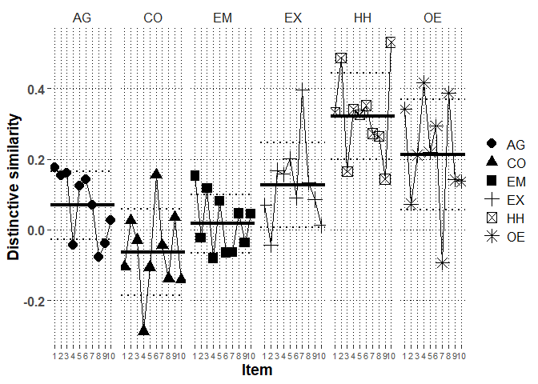

# Packages


```r
library(lme4)
library(rio)
library(lmerTest)
library(emmeans)
library(dplyr)
library(ggplot2)
library(metafor)
library(finalfit)
#custom functions
source("../../custom functions/custom_functions.R")
```

# Data


```r
Dan_long_fdat<-
  import("../../../data/processed/Danish/Dan_long_fdat.xlsx")
```

# Descriptive analysis

## Profile distinctive and normative similarity correlations


```r
mod.dat<-Dan_long_fdat %>%
  group_by(ID) %>%
  summarize(#satis.z=mean(satis.z),
            #commit.z=mean(commit.z),
            #responsive.z=mean(responsive.z),
            cor.SRc.zc=transf.rtoz(cor(PR.z,SRc.zc)),
            cor.Norm_sr.z=transf.rtoz(cor(PR.z,Norm_sr.z)),
            cor.SR=transf.rtoz(cor(PR,SR)))
```

```
## `summarise()` ungrouping output (override with `.groups` argument)
```

```r
# mean distinctive similarity
(mean.dist.sim<-transf.ztor(mean(mod.dat$cor.SRc.zc)))
```

```
## [1] 0.1280213
```

```r
# mean normative similarity
(mean.norm.sim<-transf.ztor(mean(mod.dat$cor.Norm_sr.z)))
```

```
## [1] 0.344835
```

```r
# mean overall profile similarity
(mean.over.sim<-transf.ztor(mean(mod.dat$cor.SR)))
```

```
## [1] 0.282217
```


# Multilevel profile analysis

## mod0: Baseline model without random effects


```r
mod0<-lmer(PR.z~SRc.zc+Norm_sr.z+(1|ID),
           data=Dan_long_fdat,
           REML=F,
           control=lmerControl(optimizer="bobyqa",
                               optCtrl=list(maxfun=2e8)))
getMOD(mod0)
```

```
## $Fixed
##              Est   SE      df     t     p    LL   UL
## (Intercept) 0.01 0.01   92.03  0.81 0.422 -0.02 0.04
## SRc.zc      0.11 0.01 5428.00  8.69 0.000  0.09 0.14
## Norm_sr.z   0.32 0.01 5428.00 24.70 0.000  0.29 0.34
## 
## $Random
##        grp        var1 var2 est_SD est_VAR
## 1       ID (Intercept) <NA>   0.02    0.00
## 2 Residual        <NA> <NA>   0.95    0.91
## 
## $Deviance
##      Deviance n.pars
## [1,] 15127.83      4
```

## mod1: Baseline model with random effects


```r
mod1<-lmer(PR.z~SRc.zc+Norm_sr.z+(0+SRc.zc+Norm_sr.z|ID),
           data=Dan_long_fdat,
           REML=F,
           control=lmerControl(optimizer="bobyqa",
                               optCtrl=list(maxfun=2e8)))

getMOD(mod1)
```

```
## $Fixed
##              Est   SE      df     t     p    LL   UL
## (Intercept) 0.01 0.01 5338.17  0.85 0.397 -0.01 0.03
## SRc.zc      0.11 0.02   91.54  5.25 0.000  0.07 0.16
## Norm_sr.z   0.31 0.02   91.60 12.62 0.000  0.26 0.36
## 
## $Random
##        grp      var1      var2 est_SD est_VAR
## 1       ID    SRc.zc      <NA>   0.17    0.03
## 2       ID Norm_sr.z      <NA>   0.20    0.04
## 3       ID    SRc.zc Norm_sr.z   0.36    0.01
## 4 Residual      <NA>      <NA>   0.92    0.84
## 
## $Deviance
##      Deviance n.pars
## [1,] 14907.98      6
```

```r
#check the CIs for random effects as well
confint(mod1, oldNames=FALSE)
```

```
## Computing profile confidence intervals ...
```

```
##                               2.5 %     97.5 %
## sd_SRc.zc|ID             0.13343744 0.20862427
## cor_Norm_sr.z.SRc.zc|ID  0.07182850 0.59663044
## sd_Norm_sr.z|ID          0.16719647 0.24818322
## sigma                    0.89839845 0.93313758
## (Intercept)             -0.01372283 0.03459174
## SRc.zc                   0.07138593 0.15774829
## Norm_sr.z                0.26312924 0.36116238
```

```r
#obtain random slope SDs for scaling purposes
(Dist.SD.mod1<-
    getREVAR(model=mod1,par="SRc.zc",
             grp="ID",type="sdcor"))
```

```
## [1] 0.1678366
```

```r
(Norm.SD.mod1<-
    getREVAR(model=mod1,par="Norm_sr.z",
             grp="ID",type="sdcor"))
```

```
## [1] 0.2038806
```

```r
#save estimates
export(summary(mod1)$coefficients,
       "../../../output/Danish/Dan.main.xlsx",row.names=T)

#save slope-SD estimates
export(cbind(Dist.SD.mod1,Norm.SD.mod1),
       "../../../output/Danish/Dan.slope.SD.xlsx",row.names=T)
```


## mod9: Only HEXACO-domain fixed main effects


```r
mod9<-lmer(PR.z~SRc.zc+Norm_sr.z+
             (0+SRc.zc+Norm_sr.z|ID)+
             domain+domain:SRc.zc+domain:Norm_sr.z,
           data=Dan_long_fdat,
           REML=F,
           control=lmerControl(optimizer="bobyqa",
                               optCtrl=list(maxfun=2e8)))

getMOD(mod9)
```

```
## $Fixed
##                      Est   SE      df     t     p    LL    UL
## (Intercept)         0.02 0.03 5381.03  0.63 0.529 -0.04  0.08
## SRc.zc              0.07 0.03  647.06  1.96 0.050 -0.00  0.13
## Norm_sr.z           0.55 0.06 2039.15  9.99 0.000  0.45  0.66
## domainCO            0.02 0.04 5385.05  0.40 0.687 -0.07  0.10
## domainEM           -0.02 0.04 5376.97 -0.45 0.653 -0.10  0.06
## domainEX           -0.01 0.04 5382.49 -0.18 0.858 -0.09  0.07
## domainHH           -0.02 0.04 5395.15 -0.46 0.648 -0.11  0.07
## domainOE            0.06 0.04 5386.70  1.40 0.160 -0.02  0.14
## SRc.zc:domainCO    -0.13 0.04 5465.31 -3.05 0.002 -0.22 -0.05
## SRc.zc:domainEM    -0.06 0.04 5464.14 -1.36 0.173 -0.14  0.03
## SRc.zc:domainEX     0.04 0.04 5433.15  1.01 0.315 -0.04  0.13
## SRc.zc:domainHH     0.25 0.04 5458.21  6.11 0.000  0.17  0.33
## SRc.zc:domainOE     0.14 0.04 5460.21  3.29 0.001  0.06  0.23
## Norm_sr.z:domainCO -0.24 0.06 5417.27 -4.14 0.000 -0.35 -0.13
## Norm_sr.z:domainEM -0.41 0.06 5420.49 -6.90 0.000 -0.53 -0.30
## Norm_sr.z:domainEX -0.08 0.06 5418.98 -1.40 0.161 -0.20  0.03
## Norm_sr.z:domainHH -0.06 0.06 5417.75 -1.04 0.296 -0.19  0.06
## Norm_sr.z:domainOE -0.42 0.06 5426.44 -7.19 0.000 -0.53 -0.30
## 
## $Random
##        grp      var1      var2 est_SD est_VAR
## 1       ID    SRc.zc      <NA>   0.16    0.02
## 2       ID Norm_sr.z      <NA>   0.19    0.04
## 3       ID    SRc.zc Norm_sr.z   0.38    0.01
## 4 Residual      <NA>      <NA>   0.89    0.80
## 
## $Deviance
##      Deviance n.pars
## [1,] 14645.56     21
```

```r
anova(mod9)
```

```
## Type III Analysis of Variance Table with Satterthwaite's method
##                   Sum Sq Mean Sq NumDF  DenDF  F value    Pr(>F)    
## SRc.zc            22.148  22.148     1   92.2  27.6610 9.328e-07 ***
## Norm_sr.z        162.905 162.905     1  106.4 203.4553 < 2.2e-16 ***
## domain             3.911   0.782     5 5383.4   0.9769    0.4302    
## SRc.zc:domain     86.051  17.210     5 5394.7  21.4942 < 2.2e-16 ***
## Norm_sr.z:domain 122.435  24.487     5 5423.3  30.5822 < 2.2e-16 ***
## ---
## Signif. codes:  0 '***' 0.001 '**' 0.01 '*' 0.05 '.' 0.1 ' ' 1
```

```r
anova(mod1,mod9)
```

```
## Data: Dan_long_fdat
## Models:
## mod1: PR.z ~ SRc.zc + Norm_sr.z + (0 + SRc.zc + Norm_sr.z | ID)
## mod9: PR.z ~ SRc.zc + Norm_sr.z + (0 + SRc.zc + Norm_sr.z | ID) + domain + 
## mod9:     domain:SRc.zc + domain:Norm_sr.z
##      npar   AIC   BIC  logLik deviance  Chisq Df Pr(>Chisq)    
## mod1    7 14922 14968 -7454.0    14908                         
## mod9   22 14690 14835 -7322.8    14646 262.42 15  < 2.2e-16 ***
## ---
## Signif. codes:  0 '***' 0.001 '**' 0.01 '*' 0.05 '.' 0.1 ' ' 1
```

### Marginal effects for distinctive similarity in HEXACO-domains


```r
Dist.HEXACO.mod9<-emtrends(mod9,var="SRc.zc",specs="domain",
                          lmerTest.limit = 21540,
                          disable.pbkrtest=T)
Dist.HEXACO.mod9
```

```
##  domain SRc.zc.trend     SE  df  lower.CL upper.CL
##  AG          0.06704 0.0341 647 -1.16e-05  0.13410
##  CO         -0.06435 0.0353 708 -1.34e-01  0.00504
##  EM          0.00973 0.0338 617 -5.67e-02  0.07619
##  EX          0.10975 0.0343 633  4.23e-02  0.17719
##  HH          0.31863 0.0330 560  2.54e-01  0.38344
##  OE          0.20821 0.0350 686  1.40e-01  0.27687
## 
## Degrees-of-freedom method: satterthwaite 
## Confidence level used: 0.95
```

```r
#export the domain-specific estimates
export(data.frame(test(Dist.HEXACO.mod9)),
       "../../../output/Danish/Dan.HEXACO.Dist.xlsx")
contrast(Dist.HEXACO.mod9,"eff",adjust="holm")
```

```
##  contrast  estimate     SE   df t.ratio p.value
##  AG effect -0.04113 0.0272 5445 -1.509  0.2625 
##  CO effect -0.17252 0.0283 5390 -6.102  <.0001 
##  EM effect -0.09844 0.0270 5474 -3.641  0.0011 
##  EX effect  0.00158 0.0276 5353  0.057  0.9542 
##  HH effect  0.21046 0.0263 5477  8.015  <.0001 
##  OE effect  0.10004 0.0281 5317  3.558  0.0011 
## 
## Degrees-of-freedom method: satterthwaite 
## P value adjustment: holm method for 6 tests
```

```r
contrast(Dist.HEXACO.mod9,"del.eff",adjust="holm")
```

```
##  contrast  estimate     SE   df t.ratio p.value
##  AG effect  -0.0494 0.0327 5445 -1.509  0.2625 
##  CO effect  -0.2070 0.0339 5390 -6.102  <.0001 
##  EM effect  -0.1181 0.0324 5474 -3.641  0.0011 
##  EX effect   0.0019 0.0331 5353  0.057  0.9542 
##  HH effect   0.2526 0.0315 5477  8.015  <.0001 
##  OE effect   0.1200 0.0337 5317  3.558  0.0011 
## 
## Degrees-of-freedom method: satterthwaite 
## P value adjustment: holm method for 6 tests
```

```r
pairs(Dist.HEXACO.mod9,adjust="holm")
```

```
##  contrast estimate     SE   df t.ratio p.value
##  AG - CO    0.1314 0.0431 5465  3.047  0.0163 
##  AG - EM    0.0573 0.0420 5464  1.364  0.3455 
##  AG - EX   -0.0427 0.0425 5433 -1.005  0.3455 
##  AG - HH   -0.2516 0.0412 5458 -6.107  <.0001 
##  AG - OE   -0.1412 0.0429 5460 -3.293  0.0080 
##  CO - EM   -0.0741 0.0427 5476 -1.734  0.2492 
##  CO - EX   -0.1741 0.0434 5362 -4.007  0.0006 
##  CO - HH   -0.3830 0.0422 5447 -9.086  <.0001 
##  CO - OE   -0.2726 0.0443 5221 -6.157  <.0001 
##  EM - EX   -0.1000 0.0422 5447 -2.369  0.0892 
##  EM - HH   -0.3089 0.0411 5476 -7.519  <.0001 
##  EM - OE   -0.1985 0.0429 5390 -4.630  <.0001 
##  EX - HH   -0.2089 0.0416 5418 -5.016  <.0001 
##  EX - OE   -0.0985 0.0432 5327 -2.278  0.0911 
##  HH - OE    0.1104 0.0419 5451  2.636  0.0504 
## 
## Degrees-of-freedom method: satterthwaite 
## P value adjustment: holm method for 15 tests
```

```r
pairs(Dist.HEXACO.mod9,adjust="none")
```

```
##  contrast estimate     SE   df t.ratio p.value
##  AG - CO    0.1314 0.0431 5465  3.047  0.0023 
##  AG - EM    0.0573 0.0420 5464  1.364  0.1727 
##  AG - EX   -0.0427 0.0425 5433 -1.005  0.3149 
##  AG - HH   -0.2516 0.0412 5458 -6.107  <.0001 
##  AG - OE   -0.1412 0.0429 5460 -3.293  0.0010 
##  CO - EM   -0.0741 0.0427 5476 -1.734  0.0831 
##  CO - EX   -0.1741 0.0434 5362 -4.007  0.0001 
##  CO - HH   -0.3830 0.0422 5447 -9.086  <.0001 
##  CO - OE   -0.2726 0.0443 5221 -6.157  <.0001 
##  EM - EX   -0.1000 0.0422 5447 -2.369  0.0178 
##  EM - HH   -0.3089 0.0411 5476 -7.519  <.0001 
##  EM - OE   -0.1985 0.0429 5390 -4.630  <.0001 
##  EX - HH   -0.2089 0.0416 5418 -5.016  <.0001 
##  EX - OE   -0.0985 0.0432 5327 -2.278  0.0228 
##  HH - OE    0.1104 0.0419 5451  2.636  0.0084 
## 
## Degrees-of-freedom method: satterthwaite
```

### Marginal effects for normative similarity in HEXACO-domains


```r
Norm.HEXACO.mod9<-emtrends(mod9,var="Norm_sr.z",
                           specs="domain",
                          lmerTest.limit = 21540,
                          disable.pbkrtest=T)
Norm.HEXACO.mod9
```

```
##  domain Norm_sr.z.trend     SE   df lower.CL upper.CL
##  AG               0.554 0.0555 2039   0.4454    0.663
##  CO               0.316 0.0330  336   0.2507    0.380
##  EM               0.141 0.0367  505   0.0687    0.213
##  EX               0.471 0.0359  466   0.4002    0.541
##  HH               0.490 0.0401  702   0.4109    0.568
##  OE               0.139 0.0329  331   0.0742    0.203
## 
## Degrees-of-freedom method: satterthwaite 
## Confidence level used: 0.95
```

```r
test(Norm.HEXACO.mod9)
```

```
##  domain Norm_sr.z.trend     SE   df t.ratio p.value
##  AG               0.554 0.0555 2039  9.993  <.0001 
##  CO               0.316 0.0330  336  9.571  <.0001 
##  EM               0.141 0.0367  505  3.837  0.0001 
##  EX               0.471 0.0359  466 13.111  <.0001 
##  HH               0.490 0.0401  702 12.218  <.0001 
##  OE               0.139 0.0329  331  4.226  <.0001 
## 
## Degrees-of-freedom method: satterthwaite
```

```r
export(data.frame(test(Norm.HEXACO.mod9)),
       "../../../output/Danish/Dan.HEXACO.Norm.xlsx")
contrast(Norm.HEXACO.mod9,"eff",adjust="holm")
```

```
##  contrast  estimate     SE   df t.ratio p.value
##  AG effect    0.203 0.0443 5416  4.572  <.0001 
##  CO effect   -0.036 0.0254 5429 -1.421  0.1554 
##  EM effect   -0.211 0.0286 5426 -7.377  <.0001 
##  EX effect    0.119 0.0280 5430  4.261  <.0001 
##  HH effect    0.138 0.0314 5427  4.395  <.0001 
##  OE effect   -0.213 0.0254 5428 -8.375  <.0001 
## 
## Degrees-of-freedom method: satterthwaite 
## P value adjustment: holm method for 6 tests
```

```r
contrast(Norm.HEXACO.mod9,"del.eff",adjust="holm")
```

```
##  contrast  estimate     SE   df t.ratio p.value
##  AG effect   0.2431 0.0532 5416  4.572  <.0001 
##  CO effect  -0.0433 0.0304 5429 -1.421  0.1554 
##  EM effect  -0.2530 0.0343 5426 -7.377  <.0001 
##  EX effect   0.1430 0.0336 5430  4.261  <.0001 
##  HH effect   0.1655 0.0377 5427  4.395  <.0001 
##  OE effect  -0.2553 0.0305 5428 -8.375  <.0001 
## 
## Degrees-of-freedom method: satterthwaite 
## P value adjustment: holm method for 6 tests
```

```r
pairs(Norm.HEXACO.mod9,adjust="holm")
```

```
##  contrast estimate     SE   df t.ratio p.value
##  AG - CO   0.23862 0.0577 5417  4.138  0.0002 
##  AG - EM   0.41344 0.0599 5420  6.899  <.0001 
##  AG - EX   0.08338 0.0594 5419  1.403  0.6424 
##  AG - HH   0.06466 0.0619 5418  1.045  0.8889 
##  AG - OE   0.41532 0.0577 5426  7.194  <.0001 
##  CO - EM   0.17482 0.0400 5422  4.371  0.0001 
##  CO - EX  -0.15523 0.0394 5429 -3.939  0.0004 
##  CO - HH  -0.17396 0.0432 5429 -4.031  0.0003 
##  CO - OE   0.17671 0.0368 5421  4.796  <.0001 
##  EM - EX  -0.33006 0.0427 5429 -7.733  <.0001 
##  EM - HH  -0.34878 0.0460 5425 -7.577  <.0001 
##  EM - OE   0.00188 0.0401 5429  0.047  1.0000 
##  EX - HH  -0.01873 0.0455 5430 -0.411  1.0000 
##  EX - OE   0.33194 0.0394 5430  8.425  <.0001 
##  HH - OE   0.35067 0.0431 5430  8.135  <.0001 
## 
## Degrees-of-freedom method: satterthwaite 
## P value adjustment: holm method for 15 tests
```

```r
pairs(Norm.HEXACO.mod9,adjust="none")
```

```
##  contrast estimate     SE   df t.ratio p.value
##  AG - CO   0.23862 0.0577 5417  4.138  <.0001 
##  AG - EM   0.41344 0.0599 5420  6.899  <.0001 
##  AG - EX   0.08338 0.0594 5419  1.403  0.1606 
##  AG - HH   0.06466 0.0619 5418  1.045  0.2963 
##  AG - OE   0.41532 0.0577 5426  7.194  <.0001 
##  CO - EM   0.17482 0.0400 5422  4.371  <.0001 
##  CO - EX  -0.15523 0.0394 5429 -3.939  0.0001 
##  CO - HH  -0.17396 0.0432 5429 -4.031  0.0001 
##  CO - OE   0.17671 0.0368 5421  4.796  <.0001 
##  EM - EX  -0.33006 0.0427 5429 -7.733  <.0001 
##  EM - HH  -0.34878 0.0460 5425 -7.577  <.0001 
##  EM - OE   0.00188 0.0401 5429  0.047  0.9625 
##  EX - HH  -0.01873 0.0455 5430 -0.411  0.6808 
##  EX - OE   0.33194 0.0394 5430  8.425  <.0001 
##  HH - OE   0.35067 0.0431 5430  8.135  <.0001 
## 
## Degrees-of-freedom method: satterthwaite
```

## mod12: Extract item specific effects


```r
mod12<-lmer(PR.z~SRc.zc+Norm_sr.z+
             (0+SRc.zc+Norm_sr.z|ID)+
             item:SRc.zc,
           data=Dan_long_fdat,
           REML=F,
           control=lmerControl(optimizer="bobyqa",
                               optCtrl=list(maxfun=2e8)))
Dan.Dist.item.effs<-
  emtrends(mod12,var="SRc.zc",specs="item",
         lmerTest.limit = 21540,
         disable.pbkrtest=T)

#contrasts for items within domain
#OE

contrast(Dan.Dist.item.effs,
         "del.eff",include=seq(1,60,6),adjust="holm")
```

```
##  contrast     estimate     SE   df t.ratio p.value
##  hex01 effect  0.14370 0.1046 5446  1.374  1.0000 
##  hex07 effect -0.15505 0.1135 5441 -1.366  1.0000 
##  hex13 effect -0.00173 0.1022 5436 -0.017  1.0000 
##  hex19 effect  0.22671 0.1100 5422  2.062  0.3534 
##  hex25 effect  0.00709 0.0833 5444  0.085  1.0000 
##  hex31 effect  0.08989 0.1011 5427  0.889  1.0000 
##  hex37 effect -0.34001 0.1081 5454 -3.146  0.0167 
##  hex43 effect  0.19302 0.1334 5447  1.446  1.0000 
##  hex49 effect -0.07921 0.0857 5436 -0.924  1.0000 
##  hex55 effect -0.08440 0.1103 5461 -0.765  1.0000 
## 
## Degrees-of-freedom method: satterthwaite 
## P value adjustment: holm method for 10 tests
```

```r
#CO
contrast(Dan.Dist.item.effs,
         "del.eff",include=seq(2,60,6),adjust="holm")
```

```
##  contrast     estimate     SE   df t.ratio p.value
##  hex02 effect  -0.0464 0.0972 5450 -0.478  1.0000 
##  hex08 effect   0.1005 0.1178 5451  0.853  1.0000 
##  hex14 effect   0.0379 0.1123 5450  0.338  1.0000 
##  hex20 effect  -0.2490 0.1089 5421 -2.286  0.2227 
##  hex26 effect  -0.0478 0.0925 5446 -0.517  1.0000 
##  hex32 effect   0.2438 0.1092 5446  2.231  0.2313 
##  hex38 effect   0.0220 0.1116 5448  0.197  1.0000 
##  hex44 effect  -0.0828 0.1172 5452 -0.706  1.0000 
##  hex50 effect   0.1092 0.0854 5440  1.278  1.0000 
##  hex56 effect  -0.0873 0.0967 5428 -0.903  1.0000 
## 
## Degrees-of-freedom method: satterthwaite 
## P value adjustment: holm method for 10 tests
```

```r
#AG
contrast(Dan.Dist.item.effs,
         "del.eff",include=seq(3,60,6),adjust="holm")
```

```
##  contrast     estimate     SE   df t.ratio p.value
##  hex03 effect  0.11955 0.1101 5393  1.086  1.0000 
##  hex09 effect  0.09420 0.0941 5444  1.001  1.0000 
##  hex15 effect  0.10226 0.0858 5401  1.193  1.0000 
##  hex21 effect -0.12599 0.0909 5445 -1.387  1.0000 
##  hex27 effect  0.06114 0.1112 5391  0.550  1.0000 
##  hex33 effect  0.08152 0.1129 5403  0.722  1.0000 
##  hex39 effect  0.00029 0.1002 5393  0.003  1.0000 
##  hex45 effect -0.16406 0.0953 5408 -1.721  0.8532 
##  hex51 effect -0.12156 0.1076 5386 -1.130  1.0000 
##  hex57 effect -0.04737 0.1086 5383 -0.436  1.0000 
## 
## Degrees-of-freedom method: satterthwaite 
## P value adjustment: holm method for 10 tests
```

```r
#EX
contrast(Dan.Dist.item.effs,
         "del.eff",include=seq(4,60,6),adjust="holm")
```

```
##  contrast     estimate     SE   df t.ratio p.value
##  hex04 effect -0.06397 0.1103 5456 -0.580  1.0000 
##  hex10 effect -0.18959 0.0882 5447 -2.150  0.2847 
##  hex16 effect  0.04563 0.0913 5436  0.500  1.0000 
##  hex22 effect  0.03416 0.1148 5457  0.298  1.0000 
##  hex28 effect  0.08276 0.1155 5457  0.716  1.0000 
##  hex34 effect -0.04129 0.0979 5412 -0.422  1.0000 
##  hex40 effect  0.29870 0.1068 5408  2.798  0.0517 
##  hex46 effect  0.00688 0.1005 5416  0.068  1.0000 
##  hex52 effect -0.04599 0.0896 5443 -0.513  1.0000 
##  hex58 effect -0.12728 0.0944 5420 -1.348  1.0000 
## 
## Degrees-of-freedom method: satterthwaite 
## P value adjustment: holm method for 10 tests
```

```r
#EM
contrast(Dan.Dist.item.effs,
         "del.eff",include=seq(5,60,6),adjust="holm")
```

```
##  contrast     estimate     SE   df t.ratio p.value
##  hex05 effect   0.1503 0.1035 5464  1.452  1.0000 
##  hex11 effect  -0.0448 0.0947 5454 -0.473  1.0000 
##  hex17 effect   0.1120 0.1001 5446  1.119  1.0000 
##  hex23 effect  -0.1094 0.1022 5418 -1.070  1.0000 
##  hex29 effect   0.0713 0.1016 5409  0.702  1.0000 
##  hex35 effect  -0.0914 0.1006 5436 -0.908  1.0000 
##  hex41 effect  -0.0901 0.0884 5402 -1.020  1.0000 
##  hex47 effect   0.0316 0.1012 5453  0.312  1.0000 
##  hex53 effect  -0.0600 0.0882 5413 -0.680  1.0000 
##  hex59 effect   0.0304 0.1088 5455  0.280  1.0000 
## 
## Degrees-of-freedom method: satterthwaite 
## P value adjustment: holm method for 10 tests
```

```r
#HH
contrast(Dan.Dist.item.effs,
         "del.eff",include=seq(6,60,6),adjust="holm")
```

```
##  contrast     estimate     SE   df t.ratio p.value
##  hex06 effect  0.01305 0.0886 5405  0.147  1.0000 
##  hex12 effect  0.18304 0.0877 5432  2.087  0.2953 
##  hex18 effect -0.17305 0.0983 5401 -1.760  0.5492 
##  hex24 effect  0.02106 0.1108 5453  0.190  1.0000 
##  hex30 effect  0.00455 0.0999 5448  0.046  1.0000 
##  hex36 effect  0.03370 0.0944 5443  0.357  1.0000 
##  hex42 effect -0.05391 0.0911 5422 -0.592  1.0000 
##  hex48 effect -0.06347 0.0990 5406 -0.641  1.0000 
##  hex54 effect -0.19771 0.0879 5433 -2.249  0.2210 
##  hex60 effect  0.23274 0.0959 5452  2.426  0.1531 
## 
## Degrees-of-freedom method: satterthwaite 
## P value adjustment: holm method for 10 tests
```

```r
#combine to same frame
Dan.Dist.item.effs<-cbind(data.frame(Dan.Dist.item.effs),
      t.ratio=data.frame(test(Dan.Dist.item.effs))$t.ratio,
      p.value=data.frame(test(Dan.Dist.item.effs))$p.value,
      adj.p.value=data.frame(test(Dan.Dist.item.effs,adjust="holm"))$p.value)

Dan.Dist.item.effs$domain<-
  rep(c("OE","CO","AG","EX","EM","HH"),10)

Dan.Dist.item.effs$item.number<-rep(1:10,each=6)

Dan.Dist.item.effs
```

```
##     item SRc.zc.trend         SE       df     lower.CL    upper.CL    t.ratio
## 1  hex01   0.34237568 0.10069329 4927.290  0.144971962  0.53977939  3.4001836
## 2  hex02  -0.10540046 0.09311530 4841.180 -0.287948724  0.07714781 -1.1319349
## 3  hex03   0.17724259 0.10670978 5195.144 -0.031953468  0.38643864  1.6609780
## 4  hex04   0.06964234 0.10767472 5143.881 -0.141445905  0.28073058  0.6467845
## 5  hex05   0.15294163 0.09979904 5086.892 -0.042707453  0.34859071  1.5324959
## 6  hex06   0.33356960 0.08506286 4665.123  0.166806181  0.50033301  3.9214480
## 7  hex07   0.07350454 0.10997813 5255.645 -0.142098281  0.28910736  0.6683560
## 8  hex08   0.02681595 0.11497841 5256.754 -0.198589500  0.25222139  0.2332259
## 9  hex09   0.15443248 0.08997627 4796.127 -0.021962290  0.33082724  1.7163689
## 10 hex10  -0.04342089 0.08379974 4426.327 -0.207710287  0.12086850 -0.5181507
## 11 hex11  -0.02264781 0.09106730 4852.257 -0.201180967  0.15588534 -0.2486931
## 12 hex12   0.48655191 0.08426570 4618.142  0.321350869  0.65175296  5.7740206
## 13 hex13   0.21149165 0.09850567 4870.627  0.018376089  0.40460720  2.1469997
## 14 hex14  -0.02949118 0.10910280 5102.484 -0.243379469  0.18439711 -0.2703063
## 15 hex15   0.16168510 0.08101179 4544.153  0.002862613  0.32050759  1.9958219
## 16 hex16   0.16827905 0.08727893 4777.359 -0.002827865  0.33938597  1.9280604
## 17 hex17   0.11846700 0.09685663 4997.702 -0.071414497  0.30834850  1.2231171
## 18 hex18   0.16607267 0.09512325 5005.774 -0.020410563  0.35255591  1.7458683
## 19 hex19   0.41708507 0.10620847 5176.075  0.208871595  0.62529854  3.9270413
## 20 hex20  -0.28775974 0.10534988 5184.084 -0.494289941 -0.08122955 -2.7314671
## 21 hex21  -0.04373886 0.08662861 4708.338 -0.213571469  0.12609375 -0.5049009
## 22 hex22   0.15795791 0.11239603 5229.349 -0.062385269  0.37830109  1.4053691
## 23 hex23  -0.08081006 0.09897077 5059.334 -0.274835631  0.11321551 -0.8165043
## 24 hex24   0.34077400 0.10823945 5261.167  0.128579771  0.55296823  3.1483347
## 25 hex25   0.21942635 0.07798694 4316.976  0.066531900  0.37232080  2.8136296
## 26 hex26  -0.10663720 0.08788861 4757.408 -0.278939549  0.06566516 -1.2133221
## 27 hex27   0.12467841 0.10783980 5212.097 -0.086732803  0.33608962  1.1561447
## 28 hex28   0.20170089 0.11308704 5127.783 -0.019997962  0.42339973  1.7835898
## 29 hex29   0.08187207 0.09813355 5053.629 -0.110512239  0.27425637  0.8342923
## 30 hex30   0.32591771 0.09692109 4955.192  0.135909463  0.51592597  3.3627121
## 31 hex31   0.29394819 0.09671017 5032.987  0.104354147  0.48354223  3.0394755
## 32 hex32   0.15576620 0.10576092 5154.989 -0.051570083  0.36310248  1.4728143
## 33 hex33   0.14301876 0.10980191 5225.497 -0.072238878  0.35827640  1.3025162
## 34 hex34   0.09004773 0.09403949 4947.877 -0.094311394  0.27440684  0.9575522
## 35 hex35  -0.06461983 0.09742473 5037.607 -0.255614686  0.12637503 -0.6632795
## 36 hex36   0.35214660 0.09107438 4840.134  0.173599438  0.53069376  3.8665823
## 37 hex37  -0.09295745 0.10441245 5160.845 -0.297650091  0.11173519 -0.8902909
## 38 hex38  -0.04384440 0.10833332 5228.183 -0.256222967  0.16853417 -0.4047176
## 39 hex39   0.06990945 0.09643343 5041.464 -0.119141990  0.25896089  0.7249503
## 40 hex40   0.39603885 0.10330377 5155.926  0.193519639  0.59855807  3.8337308
## 41 hex41  -0.06341017 0.08426099 4660.526 -0.228601587  0.10178124 -0.7525448
## 42 hex42   0.27329734 0.08737668 4764.823  0.101998686  0.44459599  3.1278065
## 43 hex43   0.38677104 0.13087225 5440.565  0.130209080  0.64333301  2.9553328
## 44 hex44  -0.13810410 0.11410074 5267.264 -0.361788838  0.08558063 -1.2103700
## 45 hex45  -0.07800771 0.09139134 4900.947 -0.257175686  0.10116027 -0.8535569
## 46 hex46   0.13340477 0.09652532 5052.858 -0.055826714  0.32263626  1.3820702
## 47 hex47   0.04612536 0.09816899 5048.501 -0.146328470  0.23857919  0.4698567
## 48 hex48   0.26470069 0.09603336 5053.680  0.076433667  0.45296771  2.7563409
## 49 hex49   0.14175986 0.08043884 4440.593 -0.015940352  0.29946006  1.7623310
## 50 hex50   0.03466126 0.08019154 4459.234 -0.122553932  0.19187646  0.4322309
## 51 hex51  -0.03975392 0.10414946 5189.202 -0.243930738  0.16442290 -0.3817006
## 52 hex52   0.08581909 0.08563040 4715.942 -0.082056507  0.25369468  1.0022035
## 53 hex53  -0.03635525 0.08398494 4668.865 -0.201005392  0.12829489 -0.4328782
## 54 hex54   0.14388175 0.08439325 4652.661 -0.021569010  0.30933251  1.7048965
## 55 hex55   0.13708571 0.10699237 5190.852 -0.072664386  0.34683582  1.2812663
## 56 hex56  -0.14216364 0.09221403 4872.100 -0.322944726  0.03861745 -1.5416703
## 57 hex57   0.02701527 0.10514290 5208.837 -0.179108933  0.23313947  0.2569386
## 58 hex58   0.01266074 0.09021057 4849.764 -0.164192874  0.18951436  0.1403465
## 59 hex59   0.04504780 0.10614018 5168.390 -0.163031866  0.25312747  0.4244180
## 60 hex60   0.53129070 0.09313196 4842.835  0.348709776  0.71387161  5.7047086
##         p.value  adj.p.value domain item.number
## 1  6.787565e-04 3.665285e-02     OE           1
## 2  2.577179e-01 1.000000e+00     CO           1
## 3  9.677821e-02 1.000000e+00     AG           1
## 4  5.178003e-01 1.000000e+00     EX           1
## 5  1.254623e-01 1.000000e+00     EM           1
## 6  8.928216e-05 5.089083e-03     HH           1
## 7  5.039357e-01 1.000000e+00     OE           2
## 8  8.155951e-01 1.000000e+00     CO           2
## 9  8.615911e-02 1.000000e+00     AG           2
## 10 6.043790e-01 1.000000e+00     EX           2
## 11 8.036087e-01 1.000000e+00     EM           2
## 12 8.247113e-09 4.948268e-07     HH           2
## 13 3.184253e-02 1.000000e+00     OE           3
## 14 7.869355e-01 1.000000e+00     CO           3
## 15 4.601290e-02 1.000000e+00     AG           3
## 16 5.390682e-02 1.000000e+00     EX           3
## 17 2.213432e-01 1.000000e+00     EM           3
## 18 8.089518e-02 1.000000e+00     HH           3
## 19 8.711552e-05 5.052700e-03     OE           4
## 20 6.326645e-03 2.910257e-01     CO           4
## 21 6.136521e-01 1.000000e+00     AG           4
## 22 1.599710e-01 1.000000e+00     EX           4
## 23 4.142502e-01 1.000000e+00     EM           4
## 24 1.651221e-03 8.586350e-02     HH           4
## 25 4.920724e-03 2.361948e-01     OE           5
## 26 2.250669e-01 1.000000e+00     CO           5
## 27 2.476750e-01 1.000000e+00     AG           5
## 28 7.454947e-02 1.000000e+00     EX           5
## 29 4.041557e-01 1.000000e+00     EM           5
## 30 7.776590e-04 4.121593e-02     HH           5
## 31 2.382083e-03 1.191042e-01     OE           6
## 32 1.408622e-01 1.000000e+00     CO           6
## 33 1.927974e-01 1.000000e+00     AG           6
## 34 3.383354e-01 1.000000e+00     EX           6
## 35 5.071819e-01 1.000000e+00     EM           6
## 36 1.118188e-04 6.261852e-03     HH           6
## 37 3.733512e-01 1.000000e+00     OE           7
## 38 6.857017e-01 1.000000e+00     CO           7
## 39 4.685161e-01 1.000000e+00     AG           7
## 40 1.277184e-04 7.024510e-03     EX           7
## 41 4.517615e-01 1.000000e+00     EM           7
## 42 1.771782e-03 9.036087e-02     HH           7
## 43 3.136717e-03 1.536992e-01     OE           8
## 44 2.261913e-01 1.000000e+00     CO           8
## 45 3.933922e-01 1.000000e+00     AG           8
## 46 1.670112e-01 1.000000e+00     EX           8
## 47 6.384777e-01 1.000000e+00     EM           8
## 48 5.866172e-03 2.757101e-01     HH           8
## 49 7.808218e-02 1.000000e+00     OE           9
## 50 6.655945e-01 1.000000e+00     CO           9
## 51 7.026990e-01 1.000000e+00     AG           9
## 52 3.162968e-01 1.000000e+00     EX           9
## 53 6.651232e-01 1.000000e+00     EM           9
## 54 8.828048e-02 1.000000e+00     HH           9
## 55 2.001574e-01 1.000000e+00     OE          10
## 56 1.232187e-01 1.000000e+00     CO          10
## 57 7.972363e-01 1.000000e+00     AG          10
## 58 8.883920e-01 1.000000e+00     EX          10
## 59 6.712787e-01 1.000000e+00     EM          10
## 60 1.234691e-08 7.284676e-07     HH          10
```

```r
#save
export(Dan.Dist.item.effs,
       "../../../output/Danish/Dan.Dist.item.effs.xlsx")
```

### Plot item specific effects


```r
#save the domain means to different frames
Dan.Dist.dom.means<-Dan.Dist.item.effs %>%
  group_by(domain) %>%
  summarize(SRc.zc.trend=mean(SRc.zc.trend))
```

```
## `summarise()` ungrouping output (override with `.groups` argument)
```

```r
Dan.Dist.dom.sds<-Dan.Dist.item.effs %>%
  group_by(domain) %>%
  summarize(SRc.zc.trend.sd=sd(SRc.zc.trend))
```

```
## `summarise()` ungrouping output (override with `.groups` argument)
```

```r
Dan.Dist.dom.means$LL<-
  Dan.Dist.dom.means$SRc.zc.trend-
  Dan.Dist.dom.sds$SRc.zc.trend.sd

Dan.Dist.dom.means$UL<-
  Dan.Dist.dom.means$SRc.zc.trend+
  Dan.Dist.dom.sds$SRc.zc.trend.sd

Dan.Dist.dom.means
```

```
## # A tibble: 6 x 4
##   domain SRc.zc.trend       LL     UL
##   <chr>         <dbl>    <dbl>  <dbl>
## 1 AG           0.0696 -0.0270  0.166 
## 2 CO          -0.0636 -0.185   0.0580
## 3 EM           0.0177 -0.0652  0.100 
## 4 EX           0.127   0.00743 0.247 
## 5 HH           0.322   0.200   0.444 
## 6 OE           0.213   0.0570  0.369
```

```r
#Distinctive similarity
Fig1<-ggplot(data=Dan.Dist.item.effs,
             aes(x=as.factor(item.number),y=SRc.zc.trend,group=domain))+
  geom_point(size=4,aes(shape=domain))+
  geom_line()+
  ylab("Distinctive similarity")+
  xlab("Item")+
  geom_hline(aes(yintercept=SRc.zc.trend),
             Dan.Dist.dom.means,linetype=1,size=1.5)+
  geom_hline(aes(yintercept=LL),
             Dan.Dist.dom.means,linetype=3,size=1)+
  geom_hline(aes(yintercept=UL),
             Dan.Dist.dom.means,linetype=3,size=1)+
  theme(axis.text.y=element_text(size=12,face="bold",family="sans"),
        axis.title.y=element_text(size=14,face="bold",family="sans"),
        axis.text.x=element_text(size=8,family="sans"),
        axis.title.x=element_text(size=14,face="bold",family="sans"),
        strip.background =element_rect(fill="white"),
        panel.grid.major = element_line(linetype=3,color="black"),
        legend.title=element_blank(),
        legend.text=element_text(size=12,family="sans"),
        panel.background = element_rect(fill="white"),
        legend.key = element_rect(colour = NA, fill = NA))+
  facet_wrap(~domain,ncol=6)+ 
  theme(strip.text.x = element_text(size = 12))

Fig1
```

<!-- -->


# Custom functions


```r
getFE<-function(model){
  require(finalfit) #install this package first (it helps having the correct sign for rounded numbers that are near zero)
  coefs<-data.frame(summary(model)$coefficients) #obtain fixed effects
  names.temp<-rownames(coefs) #save the names of the fixed effects
  coefs$lower<-coefs[,1]-qt(p=.975,df=coefs[,"df"])*coefs[,2] #lower confidence 
  coefs$upper<-coefs[,1]+qt(p=.975,df=coefs[,"df"])*coefs[,2] #upper confidence
  coefs<-cbind.data.frame(Est=round_tidy(coefs[,1],2),
                          SE=round_tidy(coefs[,2],2),
                          df=round_tidy(coefs[,3],2),
                          t=round_tidy(coefs[,4],2),
                          p=round_tidy(coefs[,5],3),
                          LL=round_tidy(coefs$lower,2),
                          UL=round_tidy(coefs$upper,2)) #construct new output frame
  rownames(coefs)<-names.temp #add effect names
  
  return(coefs) #print the output
}


getVC<-function(model){
  require(finalfit)
  VC<-as.data.frame(VarCorr(model))
  VC<-cbind(VC[,c(1:3)],
            est_SD=round_tidy(VC[,5],2),
            est_VAR=round_tidy(VC[,4],2))
  return(VC)
}

getDEV<-function(model){
  DEV<-unname(summary(model)$devcomp$cmp["dev"])
  n.pars<-sum(getME(model,"p"),
              getME(model,"m"))
  output<-cbind(Deviance=DEV,n.pars=n.pars)
  return(output)
}

getMOD<-function(model){
  Fixed<-getFE(model)
  Random<-getVC(model)
  Deviance<-getDEV(model)
  output<-list(Fixed=Fixed,
               Random=Random,
               Deviance=Deviance)
  return(output)
}

getREVAR<-function(model,par,grp,type){
  d<-as.data.frame(VarCorr(model))
  d[d$var1==par & is.na(d$var2) & d$grp==grp,type][1]
  
}


getR2Dist_satisSlope<-function(model,cl.par){
  v.full<-as.numeric(r2mlm(model)$R2["v","within"])
  red.mod<-update(model,.~.-satis.z:SRc.zc)
  v.red<-as.numeric(r2mlm(red.mod)$R2["v","within"])
  R2.slope<-(v.red-v.full)/v.red
  output<-c(v.red=v.red,
            v.full=v.full,
            R2.slope=R2.slope,
            R.slope=sqrt(R2.slope))
  return(output)
}


getR2Norm_satisSlope<-function(model,cl.par){
  v.full<-as.numeric(r2mlm(model)$R2["v","within"])
  red.mod<-update(model,.~.-satis.z:Norm_sr.z)
  v.red<-as.numeric(r2mlm(red.mod)$R2["v","within"])
  R2.slope<-(v.red-v.full)/v.red
  output<-c(v.red=v.red,
            v.full=v.full,
            R2.slope=R2.slope,
            R.slope=sqrt(R2.slope))
  return(output)
}


getR2Dist_commitSlope<-function(model,cl.par){
  v.full<-as.numeric(r2mlm(model)$R2["v","within"])
  red.mod<-update(model,.~.-commit.z:SRc.zc)
  v.red<-as.numeric(r2mlm(red.mod)$R2["v","within"])
  R2.slope<-(v.red-v.full)/v.red
  output<-c(v.red=v.red,
            v.full=v.full,
            R2.slope=R2.slope,
            R.slope=sqrt(R2.slope))
  return(output)
}


getR2Norm_commitSlope<-function(model,cl.par){
  v.full<-as.numeric(r2mlm(model)$R2["v","within"])
  red.mod<-update(model,.~.-commit.z:Norm_sr.z)
  v.red<-as.numeric(r2mlm(red.mod)$R2["v","within"])
  R2.slope<-(v.red-v.full)/v.red
  output<-c(v.red=v.red,
            v.full=v.full,
            R2.slope=R2.slope,
            R.slope=sqrt(R2.slope))
  return(output)
}


#function to rescale from 1 to 9 to 1 to 5

rescale.commit<-function(var){
  var[var==2]<-1.5
  var[var==3]<-2
  var[var==4]<-2.5
  var[var==5]<-3
  var[var==6]<-3.5
  var[var==7]<-4
  var[var==8]<-4.5
  var[var==9]<-5
  return(var)
  
}

#get rid of commas as decimals

commas.to.dots<-function(var){
  as.numeric(sub(",",".",var))
}

#obtain item deviations from domain means from the pooled estimates

test.item.mod<-function(model){
  items<-attr(model$yi,which = "slab")
  estimates<-model$yi[1:length(items)]
  vi<-model$vi
  
  mdat<-data.frame(items=items,
                   estimates=estimates,
                   vi=vi)
  
  mod.effs<-data.frame(matrix(ncol=7,nrow=length(items)))
  del.effs<-data.frame(matrix(ncol=7,nrow=length(items)))
  
  for (i in 1:length(items)){
    
    mod.effs[i,1]<-items[i]
    del.effs[i,1]<-items[i]
    
    mdat$mod<-ifelse(mdat$items==items[i],1,0)
    
    mod.mod<-rma.uni(yi=estimates,
                     vi=vi,
                     mods=~mod,
                     data=mdat,
                     method="ML")
    
    mod.effs[i,2:7]<-
      c(summary(mod.mod)$beta[2],
        summary(mod.mod)$se[2],
        summary(mod.mod)$zval[2],
        summary(mod.mod)$pval[2],
        summary(mod.mod)$ci.lb[2],
        summary(mod.mod)$ci.ub[2])
    
    del.effs[i,2:7]<-
      c(summary(mod.mod)$beta[1],
        summary(mod.mod)$se[1],
        summary(mod.mod)$zval[1],
        summary(mod.mod)$pval[1],
        summary(mod.mod)$ci.lb[1],
        summary(mod.mod)$ci.ub[1])
  }
  
  colnames(mod.effs)<-
    c("item","mod.est","se","z","p","LL","UL")
  
  colnames(del.effs)<-
    c("item","del.est","se","z","p","LL","UL")
  
  mod.effs$p.adj<-p.adjust(mod.effs$p,method = "holm")
  
  output<-list(mod.effs,del.effs)
  return(output)
}

#simulation function that generates item responses based on weighting
#and individual dispersion

## for single items

gen.std<-function(weight){
  sr<-rnorm(1)
  pr<-weight*sr+rnorm(1,sd=sqrt(1-weight^2))
  output<-c(sr,pr)
  return(output)
}

## for entire profile

gen.std.prof<-function(weight,n.items){
  sr<-rnorm(n.items)
  pr<-weight*sr+rnorm(n.items,sd=sqrt(1-weight^2))
  output<-cbind(sr,pr)
  return(output)
}


#fixed effects without rounding (for simulations)

getFEraw<-function(model){
  #require(finalfit) #install this package first (it helps having the correct sign for rounded numbers that are near zero)
  coefs<-data.frame(summary(model)$coefficients) #obtain fixed effects
  names.temp<-rownames(coefs) #save the names of the fixed effects
  coefs$lower<-coefs[,1]-qt(p=.975,df=coefs[,"df"])*coefs[,2] #lower confidence 
  coefs$upper<-coefs[,1]+qt(p=.975,df=coefs[,"df"])*coefs[,2] #upper confidence
  coefs<-cbind.data.frame(Est=coefs[,1],
                          SE=coefs[,2],
                          df=coefs[,3],
                          t=coefs[,4],
                          p=coefs[,5],
                          LL=coefs$lower,
                          UL=coefs$upper) #construct new output frame
  rownames(coefs)<-names.temp #add effect names
  
  return(coefs) #print the output
}

#power simulation function

prof_mod_power<-function(n,
                         n.item,
                         CL.cor,
                         mean.Dist,
                         sd.Dist,
                         wi.rand=F,
                         sd.Dist.wi){
  require(dplyr)
  require(metafor)
  require(lme4)
  require(lmerTest)
  #generate moderator that with standard normal distribution
  Rel<-rnorm(n,mean=0,sd=1)
  #generate similarity correlations for each participant
  #that is dependent on the moderator
  Dist<-CL.cor*Rel+rnorm(n,mean=mean.Dist/sd.Dist,sd=sqrt(1-CL.cor^2))
  #scale similarity correlations to given parameters
  Dist<-Dist*sd.Dist
  
  #generate individual level data
  
  #data list to save the individually generated data frames
  dat.list<-list()
  
  if (wi.rand) {
    for (i in 1:n){
      #generate item-specific distribution of similarity
      #based on person's mean similarity, and some dispersion
      item.Dist<-rnorm(n.item,mean=Dist[i],sd=sd.Dist.wi)
      #save to a frame alongside ID-variable and the moderator
      dat.list[[i]]<-
        cbind.data.frame(ID=paste0("ID",i),Rel=Rel[i],
                         t(sapply(item.Dist,gen.std)))
    }
  } else {
    for (i in 1:n){
      #generate general distribution of similarity
      #for each subject
      
      #save to a frame alongside ID-variable and the moderator
      dat.list[[i]]<-
        cbind.data.frame(ID=paste0("ID",i),Rel=Rel[i],
                         gen.std.prof(weight=Dist[i],
                                      n.item = n.item))
    }
  }
  
  
  
  #combine all participants to same long format data file
  dat<-do.call(rbind.data.frame,dat.list)
  #name the columns in the data
  colnames(dat)<-c("ID","Rel","sr","pr")
  
  #fit model without cross-level interaction
  mod1<-lmerTest::lmer(pr~sr+Rel+(0+sr|ID),data=dat,REML=F)
  #obtain the slope SD for scaling
  slope.SD<-getREVAR(mod1,par="sr",grp="ID",type="sdcor")
  #obtain the slope var for effect size
  slope.var.mod1<-getREVAR(mod1,par="sr",grp="ID",type="vcov")
  
  #fit model with the cross-level interaction
  mod2<-lmerTest::lmer(pr~sr+Rel+sr:Rel+(0+sr|ID),data=dat,REML=F)
  #obtain estimate and p-value
  CL.eff<-getFEraw(mod2)[4,c("Est","p")]
  #obtain the slope var for effect size
  slope.var.mod2<-getREVAR(mod2,par="sr",grp="ID",type="vcov")
  #scale the fixed slope with slope SD from the reduced model
  CL.eff$scaled<-CL.eff$Est/slope.SD
  #obtain empirical correlations
  emp.cor.dat<-dat %>%
    group_by(ID) %>%
    summarise(emp.cor=cor(sr,pr),
              emp.cor.z=transf.rtoz(cor(sr,pr)),
              Rel=mean(Rel))
  emp.cors<-cor(emp.cor.dat[,2:4])[3,1:2]
  
  #reduction in slope variance
  R2=(slope.var.mod1-slope.var.mod2)/slope.var.mod1
  R=sqrt(R2)
  
  #correlation between moderator and posterior mode slopes from the reduced model
  re.mod1<-data.frame(ranef(mod1)$ID)
  re.mod1$ID<-rownames(re.mod1)
  re.mod1<-left_join(re.mod1,emp.cor.dat,by="ID")
  re.cor<-cor(re.mod1$sr,re.mod1$Rel)
  
  #scaling that accounts for residual
  res.SD.mod2<-as.data.frame(VarCorr(mod2))[2,5]
  CL.eff$scaled.res<-CL.eff$Est/(slope.SD/res.SD.mod2)
  
  #combine results
  results<-cbind(CL.eff,
                 slope.SD,
                 lvl.2.cor=cor(Rel,Dist),
                 emp.cor=emp.cors[1],
                 emp.cor.z=emp.cors[2],
                 R2,
                 R,
                 re.cor)
  #export
  return(results)
  
}
```


# Session information


```r
sI <- sessionInfo()
print(sI, locale = FALSE)
```

```
## R version 4.0.3 (2020-10-10)
## Platform: x86_64-w64-mingw32/x64 (64-bit)
## Running under: Windows 10 x64 (build 19041)
## 
## Matrix products: default
## 
## attached base packages:
## [1] stats     graphics  grDevices utils     datasets  methods   base     
## 
## other attached packages:
## [1] finalfit_1.0.2     metafor_2.4-0      ggplot2_3.3.2      dplyr_1.0.2       
## [5] emmeans_1.5.5-9004 lmerTest_3.1-2     rio_0.5.16         lme4_1.1-23       
## [9] Matrix_1.2-18     
## 
## loaded via a namespace (and not attached):
##  [1] Rcpp_1.0.5          mvtnorm_1.1-1       lattice_0.20-41    
##  [4] tidyr_1.1.2         zoo_1.8-8           digest_0.6.25      
##  [7] utf8_1.2.1          plyr_1.8.6          R6_2.4.1           
## [10] cellranger_1.1.0    backports_1.1.10    evaluate_0.14      
## [13] coda_0.19-4         pillar_1.5.1        rlang_0.4.10       
## [16] curl_4.3            multcomp_1.4-14     readxl_1.3.1       
## [19] rstudioapi_0.11     minqa_1.2.4         data.table_1.14.0  
## [22] nloptr_1.2.2.2      rmarkdown_2.5       labeling_0.3       
## [25] splines_4.0.3       statmod_1.4.34      stringr_1.4.0      
## [28] foreign_0.8-80      munsell_0.5.0       broom_0.7.1        
## [31] compiler_4.0.3      numDeriv_2016.8-1.1 xfun_0.19          
## [34] pkgconfig_2.0.3     htmltools_0.5.0     tidyselect_1.1.0   
## [37] tibble_3.0.3        codetools_0.2-16    fansi_0.4.1        
## [40] crayon_1.4.1        withr_2.2.0         MASS_7.3-53        
## [43] grid_4.0.3          nlme_3.1-149        xtable_1.8-4       
## [46] gtable_0.3.0        lifecycle_1.0.0     magrittr_1.5       
## [49] scales_1.1.1        zip_2.1.1           cli_2.4.0          
## [52] estimability_1.3    stringi_1.5.3       farver_2.0.3       
## [55] mice_3.11.0         ellipsis_0.3.1      generics_0.0.2     
## [58] vctrs_0.3.7         boot_1.3-25         sandwich_3.0-0     
## [61] openxlsx_4.2.2      TH.data_1.0-10      tools_4.0.3        
## [64] forcats_0.5.0       glue_1.4.2          purrr_0.3.4        
## [67] hms_0.5.3           survival_3.2-7      yaml_2.2.1         
## [70] colorspace_1.4-1    knitr_1.30          haven_2.3.1
```
