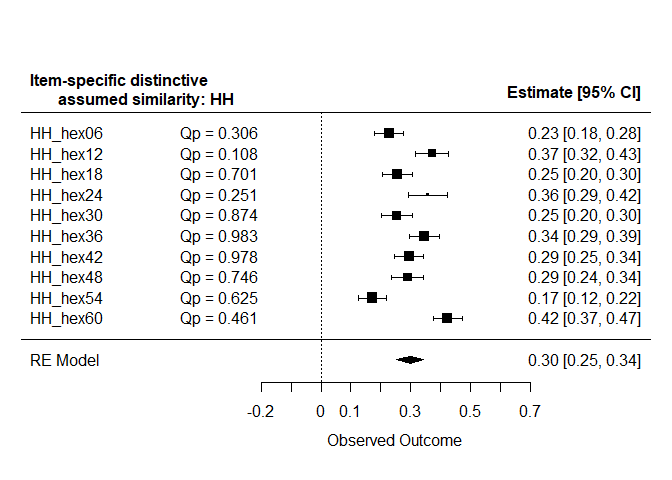
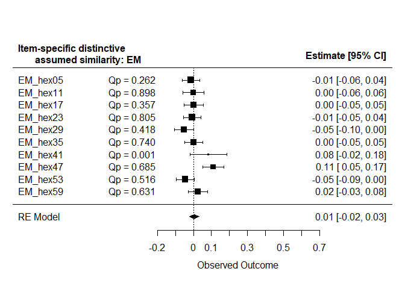
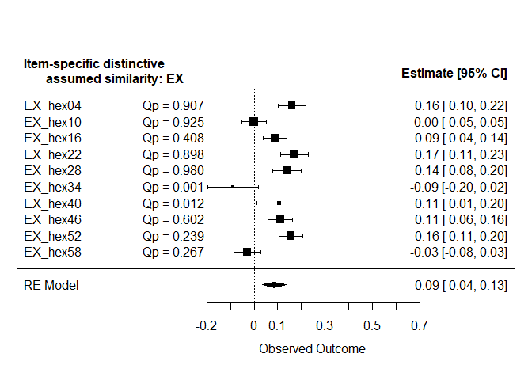
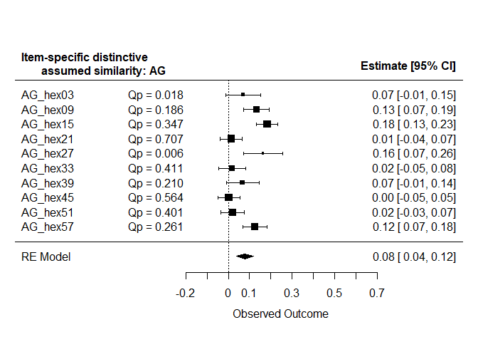
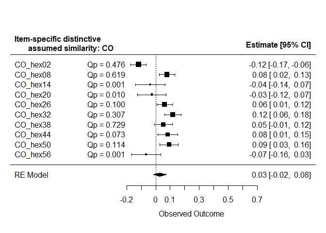
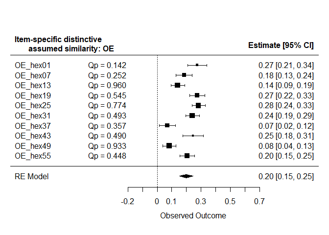

# Preparations

## Load packages


```r
library(metafor)
library(dplyr)
library(rio)
library(finalfit)
library(multcomp)
source("../../custom functions/custom_functions.R")
```

# Analysis

## Profile distinctive similarity

### Read effects


```r
Brit.Main<-
  import("../../../output/British/Brit.Main.xlsx")
```

```
## New names:
## * `` -> ...1
```

```r
Chi1.Main<-
  import("../../../output/Chinese 1/Chi1.Main.xlsx")
```

```
## New names:
## * `` -> ...1
```

```r
Chi2.Main<-
  import("../../../output/Chinese 2/Chi2.Main.xlsx")
```

```
## New names:
## * `` -> ...1
```

```r
Chi3comb.Main<-
  import("../../../output/Chinese 3/Chi3comb.Main.xlsx")
```

```
## New names:
## * `` -> ...1
```

```r
Dan.Main<-
  import("../../../output/Danish/Dan.Main.xlsx")
```

```
## New names:
## * `` -> ...1
```

```r
#combine
Main<-
  data.frame(rbind(
    Brit.Main,
    Chi1.Main,
    Chi2.Main,
    Chi3comb.Main,
    Dan.Main),
    sample=rep(c("British",
                 "Chinese 1",
                 "Chinese 2",
                 "Chinese 3",
                 "Danish"),each=3),
    country=rep(c("Britain","China","China","China",
                  "Denmark"),each=3))

#export
export(Main,
       "../../../data/processed/Meta-analysis/Main.Dist.xlsx")
```

### Main effects


```r
(rma.Dist<-rma.uni(yi = Estimate,
        sei=Std..Error,
        subset=...1=="SRc.zc",
        data=Main,
        method="ML"))
```

```
## 
## Random-Effects Model (k = 5; tau^2 estimator: ML)
## 
## tau^2 (estimated amount of total heterogeneity): 0.0002 (SE = 0.0002)
## tau (square root of estimated tau^2 value):      0.0132
## I^2 (total heterogeneity / total variability):   46.42%
## H^2 (total variability / sampling variability):  1.87
## 
## Test for Heterogeneity:
## Q(df = 4) = 9.1183, p-val = 0.0582
## 
## Model Results:
## 
## estimate      se     zval    pval   ci.lb   ci.ub 
##   0.1202  0.0088  13.6246  <.0001  0.1029  0.1375  *** 
## 
## ---
## Signif. codes:  0 '***' 0.001 '**' 0.01 '*' 0.05 '.' 0.1 ' ' 1
```

### Moderation by country


```r
(rma.Dist.by.country<-rma.uni(yi = Estimate,
        sei=Std..Error,
        subset=...1=="SRc.zc",
        mods=~country-1,
        data=Main,
        method="ML"))
```

```
## 
## Mixed-Effects Model (k = 5; tau^2 estimator: ML)
## 
## tau^2 (estimated amount of residual heterogeneity):     0 (SE = 0.0001)
## tau (square root of estimated tau^2 value):             0
## I^2 (residual heterogeneity / unaccounted variability): 0.00%
## H^2 (unaccounted variability / sampling variability):   1.00
## 
## Test for Residual Heterogeneity:
## QE(df = 2) = 1.2282, p-val = 0.5411
## 
## Test of Moderators (coefficients 1:3):
## QM(df = 3) = 400.1882, p-val < .0001
## 
## Model Results:
## 
##                 estimate      se     zval    pval   ci.lb   ci.ub 
## countryBritain    0.0880  0.0137   6.4070  <.0001  0.0611  0.1149  *** 
## countryChina      0.1313  0.0072  18.2095  <.0001  0.1171  0.1454  *** 
## countryDenmark    0.1143  0.0218   5.2491  <.0001  0.0716  0.1570  *** 
## 
## ---
## Signif. codes:  0 '***' 0.001 '**' 0.01 '*' 0.05 '.' 0.1 ' ' 1
```

```r
anova(rma.Dist.by.country,rma.Dist)
```

```
## 
##         df      AIC      BIC     AICc  logLik    LRT   pval     QE  tau^2 
## Full     4 -23.6953 -25.2575  16.3047 15.8476               1.2282 0.0000 
## Reduced  2 -21.2682 -22.0493 -15.2682 12.6341 6.4271 0.0402 9.1183 0.0002 
##               R^2 
## Full 
## Reduced 100.0000%
```

```r
summary(glht(rma.Dist.by.country,
             linfct=cbind(contrMat(rep(1,3),type="Tukey"))),
        test=adjusted("none"))
```

```
## 
## 	 Simultaneous Tests for General Linear Hypotheses
## 
## Fit: rma.uni(yi = Estimate, sei = Std..Error, mods = ~country - 1, 
##     data = Main, subset = ...1 == "SRc.zc", method = "ML")
## 
## Linear Hypotheses:
##            Estimate Std. Error z value Pr(>|z|)   
## 2 - 1 == 0  0.04326    0.01551   2.789  0.00529 **
## 3 - 1 == 0  0.02633    0.02575   1.023  0.30653   
## 3 - 2 == 0 -0.01693    0.02294  -0.738  0.46053   
## ---
## Signif. codes:  0 '***' 0.001 '**' 0.01 '*' 0.05 '.' 0.1 ' ' 1
## (Adjusted p values reported -- none method)
```

```r
summary(glht(rma.Dist.by.country,
             linfct=cbind(contrMat(rep(1,3),type="Tukey"))),
        test=adjusted("holm"))
```

```
## 
## 	 Simultaneous Tests for General Linear Hypotheses
## 
## Fit: rma.uni(yi = Estimate, sei = Std..Error, mods = ~country - 1, 
##     data = Main, subset = ...1 == "SRc.zc", method = "ML")
## 
## Linear Hypotheses:
##            Estimate Std. Error z value Pr(>|z|)  
## 2 - 1 == 0  0.04326    0.01551   2.789   0.0159 *
## 3 - 1 == 0  0.02633    0.02575   1.023   0.6131  
## 3 - 2 == 0 -0.01693    0.02294  -0.738   0.6131  
## ---
## Signif. codes:  0 '***' 0.001 '**' 0.01 '*' 0.05 '.' 0.1 ' ' 1
## (Adjusted p values reported -- holm method)
```

## Profile distinctive similarity moderation by relationship satisfaction

### Read effects


```r
Brit.satis<-
  import("../../../output/British/Brit.satis.xlsx")
```

```
## New names:
## * `` -> ...1
```

```r
Chi1.satis<-
  import("../../../output/Chinese 1/Chi1.satis.xlsx")
```

```
## New names:
## * `` -> ...1
```

```r
Chi2.satis<-
  import("../../../output/Chinese 2/Chi2.satis.xlsx")
```

```
## New names:
## * `` -> ...1
```

```r
Chi3comb.satis<-
  import("../../../output/Chinese 3/Chi3comb.satis.xlsx")
```

```
## New names:
## * `` -> ...1
```

```r
#combine
satis<-
  data.frame(rbind(
    Brit.satis,
    Chi1.satis,
    Chi2.satis,
    Chi3comb.satis),
    sample=rep(c("British","Chinese 1",
                 "Chinese 2","Chinese 3"),each=6),
    country=rep(c("Britain","China","China","China"),each=6))

#export
export(satis,
       "../../../data/processed/Meta-analysis/satis.Dist.xlsx")
```

### satis effects


```r
(rma.Dist.satis<-rma.uni(yi = Estimate,
        sei=Std..Error,
        subset=...1=="SRc.zc:satis.z",
        data=satis,
        method="ML"))
```

```
## 
## Random-Effects Model (k = 4; tau^2 estimator: ML)
## 
## tau^2 (estimated amount of total heterogeneity): 0.0001 (SE = 0.0002)
## tau (square root of estimated tau^2 value):      0.0114
## I^2 (total heterogeneity / total variability):   44.84%
## H^2 (total variability / sampling variability):  1.81
## 
## Test for Heterogeneity:
## Q(df = 3) = 7.7607, p-val = 0.0512
## 
## Model Results:
## 
## estimate      se    zval    pval   ci.lb   ci.ub 
##   0.0443  0.0086  5.1534  <.0001  0.0274  0.0611  *** 
## 
## ---
## Signif. codes:  0 '***' 0.001 '**' 0.01 '*' 0.05 '.' 0.1 ' ' 1
```

### Moderation by country


```r
(rma.Dist.satis.by.country<-rma.uni(yi = Estimate,
        sei=Std..Error,
        subset=...1=="SRc.zc:satis.z",
        mods=~country,
        data=satis,
        method="ML"))
```

```
## 
## Mixed-Effects Model (k = 4; tau^2 estimator: ML)
## 
## tau^2 (estimated amount of residual heterogeneity):     0.0001 (SE = 0.0002)
## tau (square root of estimated tau^2 value):             0.0111
## I^2 (residual heterogeneity / unaccounted variability): 43.60%
## H^2 (unaccounted variability / sampling variability):   1.77
## R^2 (amount of heterogeneity accounted for):            6.34%
## 
## Test for Residual Heterogeneity:
## QE(df = 2) = 7.5922, p-val = 0.0225
## 
## Test of Moderators (coefficient 2):
## QM(df = 1) = 0.0263, p-val = 0.8711
## 
## Model Results:
## 
##               estimate      se     zval    pval    ci.lb   ci.ub 
## intrcpt         0.0466  0.0174   2.6769  0.0074   0.0125  0.0808  ** 
## countryChina   -0.0032  0.0199  -0.1622  0.8711  -0.0423  0.0358     
## 
## ---
## Signif. codes:  0 '***' 0.001 '**' 0.01 '*' 0.05 '.' 0.1 ' ' 1
```

```r
(rma.Dist.satis.by.country<-rma.uni(yi = Estimate,
        sei=Std..Error,
        subset=...1=="SRc.zc:satis.z",
        mods=~country-1,
        data=satis,
        method="ML"))
```

```
## 
## Mixed-Effects Model (k = 4; tau^2 estimator: ML)
## 
## tau^2 (estimated amount of residual heterogeneity):     0.0001 (SE = 0.0002)
## tau (square root of estimated tau^2 value):             0.0111
## I^2 (residual heterogeneity / unaccounted variability): 43.60%
## H^2 (unaccounted variability / sampling variability):   1.77
## 
## Test for Residual Heterogeneity:
## QE(df = 2) = 7.5922, p-val = 0.0225
## 
## Test of Moderators (coefficients 1:2):
## QM(df = 2) = 27.2646, p-val < .0001
## 
## Model Results:
## 
##                 estimate      se    zval    pval   ci.lb   ci.ub 
## countryBritain    0.0466  0.0174  2.6769  0.0074  0.0125  0.0808   ** 
## countryChina      0.0434  0.0097  4.4831  <.0001  0.0244  0.0624  *** 
## 
## ---
## Signif. codes:  0 '***' 0.001 '**' 0.01 '*' 0.05 '.' 0.1 ' ' 1
```

## Profile distinctive similarity moderation by relationship commitment

### Read effects


```r
Brit.commit<-
  import("../../../output/British/Brit.commit.xlsx")
```

```
## New names:
## * `` -> ...1
```

```r
Chi1.commit<-
  import("../../../output/Chinese 1/Chi1.commit.xlsx")
```

```
## New names:
## * `` -> ...1
```

```r
Chi2.commit<-
  import("../../../output/Chinese 2/Chi2.commit.xlsx")
```

```
## New names:
## * `` -> ...1
```

```r
Chi3comb.commit<-
  import("../../../output/Chinese 3/Chi3comb.commit.xlsx")
```

```
## New names:
## * `` -> ...1
```

```r
#combine
commit<-
  data.frame(rbind(
    Brit.commit,
    Chi1.commit,
    Chi2.commit,
    Chi3comb.commit),
    sample=rep(c("British","Chinese 1",
                 "Chinese 2","Chinese 3"),each=6),
    country=rep(c("Britain","China","China","China"),each=6))

#export
export(commit,
       "../../../data/processed/Meta-analysis/commit.Dist.xlsx")
```

### commit effects


```r
(rma.Dist.commit<-rma.uni(yi = Estimate,
        sei=Std..Error,
        subset=...1=="SRc.zc:commit.z",
        data=commit,
        method="ML"))
```

```
## 
## Random-Effects Model (k = 4; tau^2 estimator: ML)
## 
## tau^2 (estimated amount of total heterogeneity): 0.0002 (SE = 0.0003)
## tau (square root of estimated tau^2 value):      0.0151
## I^2 (total heterogeneity / total variability):   58.33%
## H^2 (total variability / sampling variability):  2.40
## 
## Test for Heterogeneity:
## Q(df = 3) = 9.7068, p-val = 0.0212
## 
## Model Results:
## 
## estimate      se    zval    pval   ci.lb   ci.ub 
##   0.0364  0.0100  3.6309  0.0003  0.0168  0.0561  *** 
## 
## ---
## Signif. codes:  0 '***' 0.001 '**' 0.01 '*' 0.05 '.' 0.1 ' ' 1
```

### Moderation by country


```r
(rma.Dist.commit.by.country<-rma.uni(yi = Estimate,
        sei=Std..Error,
        subset=...1=="SRc.zc:commit.z",
        mods=~country,
        data=commit,
        method="ML"))
```

```
## 
## Mixed-Effects Model (k = 4; tau^2 estimator: ML)
## 
## tau^2 (estimated amount of residual heterogeneity):     0.0002 (SE = 0.0003)
## tau (square root of estimated tau^2 value):             0.0145
## I^2 (residual heterogeneity / unaccounted variability): 56.36%
## H^2 (unaccounted variability / sampling variability):   2.29
## R^2 (amount of heterogeneity accounted for):            8.34%
## 
## Test for Residual Heterogeneity:
## QE(df = 2) = 9.2404, p-val = 0.0099
## 
## Test of Moderators (coefficient 2):
## QM(df = 1) = 0.0913, p-val = 0.7626
## 
## Model Results:
## 
##               estimate      se     zval    pval    ci.lb   ci.ub 
## intrcpt         0.0415  0.0198   2.0957  0.0361   0.0027  0.0803  * 
## countryChina   -0.0069  0.0228  -0.3021  0.7626  -0.0515  0.0377    
## 
## ---
## Signif. codes:  0 '***' 0.001 '**' 0.01 '*' 0.05 '.' 0.1 ' ' 1
```

```r
(rma.Dist.commit.by.country<-rma.uni(yi = Estimate,
        sei=Std..Error,
        subset=...1=="SRc.zc:commit.z",
        mods=~country-1,
        data=commit,
        method="ML"))
```

```
## 
## Mixed-Effects Model (k = 4; tau^2 estimator: ML)
## 
## tau^2 (estimated amount of residual heterogeneity):     0.0002 (SE = 0.0003)
## tau (square root of estimated tau^2 value):             0.0145
## I^2 (residual heterogeneity / unaccounted variability): 56.36%
## H^2 (unaccounted variability / sampling variability):   2.29
## 
## Test for Residual Heterogeneity:
## QE(df = 2) = 9.2404, p-val = 0.0099
## 
## Test of Moderators (coefficients 1:2):
## QM(df = 2) = 13.8525, p-val = 0.0010
## 
## Model Results:
## 
##                 estimate      se    zval    pval   ci.lb   ci.ub 
## countryBritain    0.0415  0.0198  2.0957  0.0361  0.0027  0.0803   * 
## countryChina      0.0346  0.0113  3.0758  0.0021  0.0126  0.0567  ** 
## 
## ---
## Signif. codes:  0 '***' 0.001 '**' 0.01 '*' 0.05 '.' 0.1 ' ' 1
```

## Distinctive similarity for HEXACO domains

### Read effects


```r
Brit.HEXACO.Dist<-
  import("../../../output/British/Brit.HEXACO.Dist.xlsx")
Chi1.HEXACO.Dist<-
  import("../../../output/Chinese 1/Chi1.HEXACO.Dist.xlsx")
Chi2.HEXACO.Dist<-
  import("../../../output/Chinese 2/Chi2.HEXACO.Dist.xlsx")
Chi3comb.HEXACO.Dist<-
  import("../../../output/Chinese 3/Chi3comb.HEXACO.Dist.xlsx")
Dan.HEXACO.Dist<-
  import("../../../output/Danish/Dan.HEXACO.Dist.xlsx")

#combine
HEXACO.Dist<-
  data.frame(rbind(
    Brit.HEXACO.Dist,
    Chi1.HEXACO.Dist,
    Chi2.HEXACO.Dist,
    Chi3comb.HEXACO.Dist,
    Dan.HEXACO.Dist),
    sample=rep(c("British","Chinese 1",
                 "Chinese 2","Chinese 3","Danish"),each=6),
    country=rep(c("Britain","China","China",
                  "China","Denmark"),each=6))


#order by domain
HEXACO.Dist<-HEXACO.Dist[order(HEXACO.Dist$domain),]

#export
export(HEXACO.Dist,
       "../../../data/processed/Meta-analysis/HEXACO.Dist.xlsx")
```

### Main effects

#### AG


```r
(rma.Dist.AG<-rma.uni(yi = SRc.zc.trend,
        sei=SE,
        subset = domain=="AG",
        data=HEXACO.Dist,
        method="ML"))
```

```
## 
## Random-Effects Model (k = 5; tau^2 estimator: ML)
## 
## tau^2 (estimated amount of total heterogeneity): 0.0021 (SE = 0.0017)
## tau (square root of estimated tau^2 value):      0.0459
## I^2 (total heterogeneity / total variability):   80.61%
## H^2 (total variability / sampling variability):  5.16
## 
## Test for Heterogeneity:
## Q(df = 4) = 26.5910, p-val < .0001
## 
## Model Results:
## 
## estimate      se    zval    pval   ci.lb   ci.ub 
##   0.0821  0.0232  3.5374  0.0004  0.0366  0.1276  *** 
## 
## ---
## Signif. codes:  0 '***' 0.001 '**' 0.01 '*' 0.05 '.' 0.1 ' ' 1
```

##### Moderation by country


```r
(rma.Dist.AG.by.country<-rma.uni(yi = SRc.zc.trend,
        sei=SE,
        mods=~country-1,
        subset = domain=="AG",
        data=HEXACO.Dist,
        method="ML"))
```

```
## 
## Mixed-Effects Model (k = 5; tau^2 estimator: ML)
## 
## tau^2 (estimated amount of residual heterogeneity):     0 (SE = 0.0003)
## tau (square root of estimated tau^2 value):             0
## I^2 (residual heterogeneity / unaccounted variability): 0.00%
## H^2 (unaccounted variability / sampling variability):   1.00
## 
## Test for Residual Heterogeneity:
## QE(df = 2) = 1.1774, p-val = 0.5550
## 
## Test of Moderators (coefficients 1:3):
## QM(df = 3) = 96.0410, p-val < .0001
## 
## Model Results:
## 
##                 estimate      se     zval    pval    ci.lb   ci.ub 
## countryBritain   -0.0077  0.0209  -0.3667  0.7138  -0.0487  0.0334      
## countryChina      0.1129  0.0118   9.5944  <.0001   0.0898  0.1359  *** 
## countryDenmark    0.0670  0.0341   1.9633  0.0496   0.0001  0.1340    * 
## 
## ---
## Signif. codes:  0 '***' 0.001 '**' 0.01 '*' 0.05 '.' 0.1 ' ' 1
```

```r
anova(rma.Dist.AG.by.country,
      rma.Dist.AG)
```

```
## 
##         df      AIC      BIC    AICc  logLik     LRT   pval      QE  tau^2 
## Full     4 -19.2213 -20.7836 20.7787 13.6107                 1.1774 0.0000 
## Reduced  2 -11.5055 -12.2867 -5.5055  7.7528 11.7158 0.0029 26.5910 0.0021 
##               R^2 
## Full 
## Reduced 100.0000%
```

```r
summary(glht(rma.Dist.AG.by.country,
             linfct=cbind(contrMat(rep(1,3),type="Tukey"))),
        test=adjusted("none"))
```

```
## 
## 	 Simultaneous Tests for General Linear Hypotheses
## 
## Fit: rma.uni(yi = SRc.zc.trend, sei = SE, mods = ~country - 1, data = HEXACO.Dist, 
##     subset = domain == "AG", method = "ML")
## 
## Linear Hypotheses:
##            Estimate Std. Error z value Pr(>|z|)    
## 2 - 1 == 0  0.12057    0.02402   5.019  5.2e-07 ***
## 3 - 1 == 0  0.07472    0.04006   1.865   0.0621 .  
## 3 - 2 == 0 -0.04584    0.03612  -1.269   0.2043    
## ---
## Signif. codes:  0 '***' 0.001 '**' 0.01 '*' 0.05 '.' 0.1 ' ' 1
## (Adjusted p values reported -- none method)
```

```r
summary(glht(rma.Dist.AG.by.country,
             linfct=cbind(contrMat(rep(1,3),type="Tukey"))),
        test=adjusted("holm"))
```

```
## 
## 	 Simultaneous Tests for General Linear Hypotheses
## 
## Fit: rma.uni(yi = SRc.zc.trend, sei = SE, mods = ~country - 1, data = HEXACO.Dist, 
##     subset = domain == "AG", method = "ML")
## 
## Linear Hypotheses:
##            Estimate Std. Error z value Pr(>|z|)    
## 2 - 1 == 0  0.12057    0.02402   5.019 1.56e-06 ***
## 3 - 1 == 0  0.07472    0.04006   1.865    0.124    
## 3 - 2 == 0 -0.04584    0.03612  -1.269    0.204    
## ---
## Signif. codes:  0 '***' 0.001 '**' 0.01 '*' 0.05 '.' 0.1 ' ' 1
## (Adjusted p values reported -- holm method)
```

#### CO


```r
(rma.Dist.CO<-rma.uni(yi = SRc.zc.trend,
        sei=SE,
        subset = domain=="CO",
        data=HEXACO.Dist,
        method="ML"))
```

```
## 
## Random-Effects Model (k = 5; tau^2 estimator: ML)
## 
## tau^2 (estimated amount of total heterogeneity): 0.0018 (SE = 0.0015)
## tau (square root of estimated tau^2 value):      0.0422
## I^2 (total heterogeneity / total variability):   77.11%
## H^2 (total variability / sampling variability):  4.37
## 
## Test for Heterogeneity:
## Q(df = 4) = 22.4570, p-val = 0.0002
## 
## Model Results:
## 
## estimate      se    zval    pval    ci.lb   ci.ub 
##   0.0148  0.0219  0.6766  0.4987  -0.0281  0.0577    
## 
## ---
## Signif. codes:  0 '***' 0.001 '**' 0.01 '*' 0.05 '.' 0.1 ' ' 1
```


##### Moderation by country


```r
(rma.Dist.CO.by.country<-rma.uni(yi = SRc.zc.trend,
        sei=SE,
        mods=~country-1,
        subset = domain=="CO",
        data=HEXACO.Dist,
        method="ML"))
```

```
## 
## Mixed-Effects Model (k = 5; tau^2 estimator: ML)
## 
## tau^2 (estimated amount of residual heterogeneity):     0.0006 (SE = 0.0007)
## tau (square root of estimated tau^2 value):             0.0238
## I^2 (residual heterogeneity / unaccounted variability): 54.92%
## H^2 (unaccounted variability / sampling variability):   2.22
## 
## Test for Residual Heterogeneity:
## QE(df = 2) = 10.6203, p-val = 0.0049
## 
## Test of Moderators (coefficients 1:3):
## QM(df = 3) = 7.8042, p-val = 0.0502
## 
## Model Results:
## 
##                 estimate      se     zval    pval    ci.lb   ci.ub 
## countryBritain   -0.0066  0.0319  -0.2074  0.8357  -0.0691  0.0559    
## countryChina      0.0437  0.0186   2.3410  0.0192   0.0071  0.0802  * 
## countryDenmark   -0.0643  0.0426  -1.5102  0.1310  -0.1479  0.0192    
## 
## ---
## Signif. codes:  0 '***' 0.001 '**' 0.01 '*' 0.05 '.' 0.1 ' ' 1
```

```r
anova(rma.Dist.CO.by.country,
      rma.Dist.CO)
```

```
## 
##         df      AIC      BIC    AICc  logLik    LRT   pval      QE  tau^2 
## Full     4 -12.3887 -13.9510 27.6113 10.1944               10.6203 0.0006 
## Reduced  2 -11.8817 -12.6628 -5.8817  7.9409 4.5070 0.1050 22.4570 0.0018 
##              R^2 
## Full 
## Reduced 68.1935%
```

```r
summary(glht(rma.Dist.CO.by.country,
             linfct=cbind(contrMat(rep(1,3),type="Tukey"))),
        test=adjusted("none"))
```

```
## 
## 	 Simultaneous Tests for General Linear Hypotheses
## 
## Fit: rma.uni(yi = SRc.zc.trend, sei = SE, mods = ~country - 1, data = HEXACO.Dist, 
##     subset = domain == "CO", method = "ML")
## 
## Linear Hypotheses:
##            Estimate Std. Error z value Pr(>|z|)  
## 2 - 1 == 0  0.05027    0.03694   1.361   0.1736  
## 3 - 1 == 0 -0.05773    0.05322  -1.085   0.2780  
## 3 - 2 == 0 -0.10801    0.04651  -2.322   0.0202 *
## ---
## Signif. codes:  0 '***' 0.001 '**' 0.01 '*' 0.05 '.' 0.1 ' ' 1
## (Adjusted p values reported -- none method)
```

```r
summary(glht(rma.Dist.CO.by.country,
             linfct=cbind(contrMat(rep(1,3),type="Tukey"))),
        test=adjusted("holm"))
```

```
## 
## 	 Simultaneous Tests for General Linear Hypotheses
## 
## Fit: rma.uni(yi = SRc.zc.trend, sei = SE, mods = ~country - 1, data = HEXACO.Dist, 
##     subset = domain == "CO", method = "ML")
## 
## Linear Hypotheses:
##            Estimate Std. Error z value Pr(>|z|)  
## 2 - 1 == 0  0.05027    0.03694   1.361   0.3471  
## 3 - 1 == 0 -0.05773    0.05322  -1.085   0.3471  
## 3 - 2 == 0 -0.10801    0.04651  -2.322   0.0607 .
## ---
## Signif. codes:  0 '***' 0.001 '**' 0.01 '*' 0.05 '.' 0.1 ' ' 1
## (Adjusted p values reported -- holm method)
```

#### EM


```r
(rma.Dist.EM<-rma.uni(yi = SRc.zc.trend,
        sei=SE,
        subset = domain=="EM",
        data=HEXACO.Dist,
        method="ML"))
```

```
## 
## Random-Effects Model (k = 5; tau^2 estimator: ML)
## 
## tau^2 (estimated amount of total heterogeneity): 0 (SE = 0.0003)
## tau (square root of estimated tau^2 value):      0
## I^2 (total heterogeneity / total variability):   0.00%
## H^2 (total variability / sampling variability):  1.00
## 
## Test for Heterogeneity:
## Q(df = 4) = 3.4705, p-val = 0.4824
## 
## Model Results:
## 
## estimate      se    zval    pval    ci.lb   ci.ub 
##   0.0081  0.0097  0.8420  0.3998  -0.0108  0.0271    
## 
## ---
## Signif. codes:  0 '***' 0.001 '**' 0.01 '*' 0.05 '.' 0.1 ' ' 1
```

#### EX


```r
(rma.Dist.EX<-rma.uni(yi = SRc.zc.trend,
        sei=SE,
        subset = domain=="EX",
        data=HEXACO.Dist,
        method="ML"))
```

```
## 
## Random-Effects Model (k = 5; tau^2 estimator: ML)
## 
## tau^2 (estimated amount of total heterogeneity): 0.0002 (SE = 0.0004)
## tau (square root of estimated tau^2 value):      0.0125
## I^2 (total heterogeneity / total variability):   23.95%
## H^2 (total variability / sampling variability):  1.31
## 
## Test for Heterogeneity:
## Q(df = 4) = 6.5898, p-val = 0.1592
## 
## Model Results:
## 
## estimate      se    zval    pval   ci.lb   ci.ub 
##   0.0736  0.0115  6.4234  <.0001  0.0511  0.0961  *** 
## 
## ---
## Signif. codes:  0 '***' 0.001 '**' 0.01 '*' 0.05 '.' 0.1 ' ' 1
```

#### HH


```r
(rma.Dist.HH<-rma.uni(yi = SRc.zc.trend,
        sei=SE,
        subset = domain=="HH",
        data=HEXACO.Dist,
        method="ML"))
```

```
## 
## Random-Effects Model (k = 5; tau^2 estimator: ML)
## 
## tau^2 (estimated amount of total heterogeneity): 0 (SE = 0.0002)
## tau (square root of estimated tau^2 value):      0
## I^2 (total heterogeneity / total variability):   0.00%
## H^2 (total variability / sampling variability):  1.00
## 
## Test for Heterogeneity:
## Q(df = 4) = 1.6783, p-val = 0.7947
## 
## Model Results:
## 
## estimate      se     zval    pval   ci.lb   ci.ub 
##   0.2963  0.0093  31.9065  <.0001  0.2781  0.3145  *** 
## 
## ---
## Signif. codes:  0 '***' 0.001 '**' 0.01 '*' 0.05 '.' 0.1 ' ' 1
```

#### OE


```r
(rma.Dist.OE<-rma.uni(yi = SRc.zc.trend,
        sei=SE,
        subset = domain=="OE",
        data=HEXACO.Dist,
        method="ML"))
```

```
## 
## Random-Effects Model (k = 5; tau^2 estimator: ML)
## 
## tau^2 (estimated amount of total heterogeneity): 0 (SE = 0.0002)
## tau (square root of estimated tau^2 value):      0
## I^2 (total heterogeneity / total variability):   0.00%
## H^2 (total variability / sampling variability):  1.00
## 
## Test for Heterogeneity:
## Q(df = 4) = 0.7020, p-val = 0.9511
## 
## Model Results:
## 
## estimate      se     zval    pval   ci.lb   ci.ub 
##   0.1977  0.0093  21.2514  <.0001  0.1795  0.2160  *** 
## 
## ---
## Signif. codes:  0 '***' 0.001 '**' 0.01 '*' 0.05 '.' 0.1 ' ' 1
```


### Contrasts between HEXACO domains


```r
rma.HEXACO.Dist.all<-
  rma.uni(yi = SRc.zc.trend,
        sei=SE,
        #slab = labs,
        mods=~domain-1,
        data=HEXACO.Dist,
        method="ML")

rma.HEXACO.Dist.all
```

```
## 
## Mixed-Effects Model (k = 30; tau^2 estimator: ML)
## 
## tau^2 (estimated amount of residual heterogeneity):     0.0005 (SE = 0.0003)
## tau (square root of estimated tau^2 value):             0.0226
## I^2 (residual heterogeneity / unaccounted variability): 51.11%
## H^2 (unaccounted variability / sampling variability):   2.05
## 
## Test for Residual Heterogeneity:
## QE(df = 24) = 61.4886, p-val < .0001
## 
## Test of Moderators (coefficients 1:6):
## QM(df = 6) = 695.4402, p-val < .0001
## 
## Model Results:
## 
##           estimate      se     zval    pval    ci.lb   ci.ub 
## domainAG    0.0818  0.0145   5.6416  <.0001   0.0534  0.1102  *** 
## domainCO    0.0193  0.0147   1.3178  0.1876  -0.0094  0.0481      
## domainEM    0.0086  0.0144   0.5976  0.5501  -0.0197  0.0369      
## domainEX    0.0752  0.0145   5.2054  <.0001   0.0469  0.1035  *** 
## domainHH    0.2974  0.0142  20.9853  <.0001   0.2696  0.3251  *** 
## domainOE    0.1985  0.0142  13.9299  <.0001   0.1706  0.2264  *** 
## 
## ---
## Signif. codes:  0 '***' 0.001 '**' 0.01 '*' 0.05 '.' 0.1 ' ' 1
```

```r
summary(glht(rma.HEXACO.Dist.all,
             linfct=cbind(contrMat(rep(1,6),type="Tukey"))),
        test=adjusted("none"))
```

```
## 
## 	 Simultaneous Tests for General Linear Hypotheses
## 
## Fit: rma.uni(yi = SRc.zc.trend, sei = SE, mods = ~domain - 1, data = HEXACO.Dist, 
##     method = "ML")
## 
## Linear Hypotheses:
##             Estimate Std. Error z value Pr(>|z|)    
## 2 - 1 == 0 -0.062464   0.020623  -3.029 0.002455 ** 
## 3 - 1 == 0 -0.073167   0.020457  -3.577 0.000348 ***
## 4 - 1 == 0 -0.006569   0.020470  -0.321 0.748287    
## 5 - 1 == 0  0.215561   0.020272  10.633  < 2e-16 ***
## 6 - 1 == 0  0.116697   0.020328   5.741 9.43e-09 ***
## 3 - 2 == 0 -0.010703   0.020578  -0.520 0.602961    
## 4 - 2 == 0  0.055895   0.020590   2.715 0.006635 ** 
## 5 - 2 == 0  0.278025   0.020394  13.633  < 2e-16 ***
## 6 - 2 == 0  0.179161   0.020449   8.761  < 2e-16 ***
## 4 - 3 == 0  0.066598   0.020424   3.261 0.001111 ** 
## 5 - 3 == 0  0.288728   0.020226  14.275  < 2e-16 ***
## 6 - 3 == 0  0.189864   0.020282   9.361  < 2e-16 ***
## 5 - 4 == 0  0.222130   0.020239  10.975  < 2e-16 ***
## 6 - 4 == 0  0.123266   0.020295   6.074 1.25e-09 ***
## 6 - 5 == 0 -0.098864   0.020095  -4.920 8.67e-07 ***
## ---
## Signif. codes:  0 '***' 0.001 '**' 0.01 '*' 0.05 '.' 0.1 ' ' 1
## (Adjusted p values reported -- none method)
```

```r
summary(glht(rma.HEXACO.Dist.all,
             linfct=cbind(contrMat(rep(1,6),type="Tukey"))),
        test=adjusted("holm"))
```

```
## 
## 	 Simultaneous Tests for General Linear Hypotheses
## 
## Fit: rma.uni(yi = SRc.zc.trend, sei = SE, mods = ~domain - 1, data = HEXACO.Dist, 
##     method = "ML")
## 
## Linear Hypotheses:
##             Estimate Std. Error z value Pr(>|z|)    
## 2 - 1 == 0 -0.062464   0.020623  -3.029  0.00982 ** 
## 3 - 1 == 0 -0.073167   0.020457  -3.577  0.00209 ** 
## 4 - 1 == 0 -0.006569   0.020470  -0.321  1.00000    
## 5 - 1 == 0  0.215561   0.020272  10.633  < 2e-16 ***
## 6 - 1 == 0  0.116697   0.020328   5.741 7.54e-08 ***
## 3 - 2 == 0 -0.010703   0.020578  -0.520  1.00000    
## 4 - 2 == 0  0.055895   0.020590   2.715  0.01990 *  
## 5 - 2 == 0  0.278025   0.020394  13.633  < 2e-16 ***
## 6 - 2 == 0  0.179161   0.020449   8.761  < 2e-16 ***
## 4 - 3 == 0  0.066598   0.020424   3.261  0.00556 ** 
## 5 - 3 == 0  0.288728   0.020226  14.275  < 2e-16 ***
## 6 - 3 == 0  0.189864   0.020282   9.361  < 2e-16 ***
## 5 - 4 == 0  0.222130   0.020239  10.975  < 2e-16 ***
## 6 - 4 == 0  0.123266   0.020295   6.074 1.12e-08 ***
## 6 - 5 == 0 -0.098864   0.020095  -4.920 6.07e-06 ***
## ---
## Signif. codes:  0 '***' 0.001 '**' 0.01 '*' 0.05 '.' 0.1 ' ' 1
## (Adjusted p values reported -- holm method)
```

## Distinctive similarity moderated by relationship satisfaction for HEXACO domains

### Read effects


```r
Brit.HEXACO.Dist.by.satis<-
  import("../../../output/British/Brit.HEXACO.Dist.by.satis.xlsx")
Chi1.HEXACO.Dist.by.satis<-
  import("../../../output/Chinese 1/Chi1.HEXACO.Dist.by.satis.xlsx")
Chi2.HEXACO.Dist.by.satis<-
  import("../../../output/Chinese 2/Chi2.HEXACO.Dist.by.satis.xlsx")
Chi3comb.HEXACO.Dist.by.satis<-
  import("../../../output/Chinese 3/Chi3comb.HEXACO.Dist.by.satis.xlsx")

#combine
HEXACO.Dist.by.satis<-
  data.frame(rbind(
    Brit.HEXACO.Dist.by.satis,
    Chi1.HEXACO.Dist.by.satis,
    Chi2.HEXACO.Dist.by.satis,
    Chi3comb.HEXACO.Dist.by.satis),
    sample=rep(c("British","Chinese 1",
                 "Chinese 2","Chinese 3"),each=6),
    country=rep(c("Britain","China","China","China"),each=6))

#order by domain
HEXACO.Dist.by.satis<-
  HEXACO.Dist.by.satis[order(HEXACO.Dist.by.satis$domain),]

#export
export(HEXACO.Dist.by.satis,
       "../../../data/processed/Meta-analysis/HEXACO.Dist.by.satis.xlsx")
```

### Main effects

#### AG


```r
(rma.Dist.AG.satis<-rma.uni(yi = satis.z_SRc.zc.trend,
        sei=SE,
        subset = domain=="AG",
        data=HEXACO.Dist.by.satis,
        method="ML"))
```

```
## 
## Random-Effects Model (k = 4; tau^2 estimator: ML)
## 
## tau^2 (estimated amount of total heterogeneity): 0.0035 (SE = 0.0028)
## tau (square root of estimated tau^2 value):      0.0591
## I^2 (total heterogeneity / total variability):   89.62%
## H^2 (total variability / sampling variability):  9.64
## 
## Test for Heterogeneity:
## Q(df = 3) = 40.8237, p-val < .0001
## 
## Model Results:
## 
## estimate      se    zval    pval   ci.lb   ci.ub 
##   0.0686  0.0313  2.1886  0.0286  0.0072  0.1300  * 
## 
## ---
## Signif. codes:  0 '***' 0.001 '**' 0.01 '*' 0.05 '.' 0.1 ' ' 1
```

##### Moderation by country


```r
(rma.Dist.AG.satis.by.country<-
  rma.uni(yi = satis.z_SRc.zc.trend,
        sei=SE,
        subset = domain=="AG",
        mods=~country-1,
        data=HEXACO.Dist.by.satis,
        method="ML"))
```

```
## 
## Mixed-Effects Model (k = 4; tau^2 estimator: ML)
## 
## tau^2 (estimated amount of residual heterogeneity):     0.0035 (SE = 0.0028)
## tau (square root of estimated tau^2 value):             0.0590
## I^2 (residual heterogeneity / unaccounted variability): 89.49%
## H^2 (unaccounted variability / sampling variability):   9.51
## 
## Test for Residual Heterogeneity:
## QE(df = 2) = 40.8007, p-val < .0001
## 
## Test of Moderators (coefficients 1:2):
## QM(df = 2) = 4.8169, p-val = 0.0900
## 
## Model Results:
## 
##                 estimate      se    zval    pval    ci.lb   ci.ub 
## countryBritain    0.0616  0.0624  0.9873  0.3235  -0.0607  0.1840    
## countryChina      0.0709  0.0362  1.9601  0.0500   0.0000  0.1418  * 
## 
## ---
## Signif. codes:  0 '***' 0.001 '**' 0.01 '*' 0.05 '.' 0.1 ' ' 1
```

```r
anova(rma.Dist.AG.satis.by.country,
      rma.Dist.AG.satis)
```

```
## 
##         df     AIC     BIC    AICc logLik    LRT   pval      QE  tau^2     R^2 
## Full     3 -4.8396 -6.6808 19.1604 5.4198               40.8007 0.0035         
## Reduced  2 -6.8230 -8.0504  5.1770 5.4115 0.0166 0.8974 40.8237 0.0035 0.2556%
```

#### CO


```r
(rma.Dist.CO.satis<-rma.uni(yi = satis.z_SRc.zc.trend,
        sei=SE,
        subset = domain=="CO",
        data=HEXACO.Dist.by.satis,
        method="ML"))
```

```
## 
## Random-Effects Model (k = 4; tau^2 estimator: ML)
## 
## tau^2 (estimated amount of total heterogeneity): 0.0000 (SE = 0.0003)
## tau (square root of estimated tau^2 value):      0.0016
## I^2 (total heterogeneity / total variability):   0.61%
## H^2 (total variability / sampling variability):  1.01
## 
## Test for Heterogeneity:
## Q(df = 3) = 5.6611, p-val = 0.1293
## 
## Model Results:
## 
## estimate      se    zval    pval   ci.lb   ci.ub 
##   0.0254  0.0102  2.4972  0.0125  0.0055  0.0454  * 
## 
## ---
## Signif. codes:  0 '***' 0.001 '**' 0.01 '*' 0.05 '.' 0.1 ' ' 1
```

#### EM


```r
(rma.Dist.EM.satis<-rma.uni(yi = satis.z_SRc.zc.trend,
        sei=SE,
        subset = domain=="EM",
        data=HEXACO.Dist.by.satis,
        method="ML"))
```

```
## 
## Random-Effects Model (k = 4; tau^2 estimator: ML)
## 
## tau^2 (estimated amount of total heterogeneity): 0 (SE = 0.0003)
## tau (square root of estimated tau^2 value):      0
## I^2 (total heterogeneity / total variability):   0.00%
## H^2 (total variability / sampling variability):  1.00
## 
## Test for Heterogeneity:
## Q(df = 3) = 2.4691, p-val = 0.4809
## 
## Model Results:
## 
## estimate      se    zval    pval   ci.lb   ci.ub 
##   0.0247  0.0099  2.5031  0.0123  0.0054  0.0440  * 
## 
## ---
## Signif. codes:  0 '***' 0.001 '**' 0.01 '*' 0.05 '.' 0.1 ' ' 1
```

#### EX


```r
(rma.Dist.EX.satis<-rma.uni(yi = satis.z_SRc.zc.trend,
        sei=SE,
        subset = domain=="EX",
        data=HEXACO.Dist.by.satis,
        method="ML"))
```

```
## 
## Random-Effects Model (k = 4; tau^2 estimator: ML)
## 
## tau^2 (estimated amount of total heterogeneity): 0.0005 (SE = 0.0006)
## tau (square root of estimated tau^2 value):      0.0225
## I^2 (total heterogeneity / total variability):   55.44%
## H^2 (total variability / sampling variability):  2.24
## 
## Test for Heterogeneity:
## Q(df = 3) = 8.9748, p-val = 0.0296
## 
## Model Results:
## 
## estimate      se    zval    pval   ci.lb   ci.ub 
##   0.0395  0.0152  2.6048  0.0092  0.0098  0.0692  ** 
## 
## ---
## Signif. codes:  0 '***' 0.001 '**' 0.01 '*' 0.05 '.' 0.1 ' ' 1
```


##### Moderation by country


```r
(rma.Dist.EX.satis.by.country<-
  rma.uni(yi = satis.z_SRc.zc.trend,
        sei=SE,
        subset = domain=="EX",
        mods=~country-1,
        data=HEXACO.Dist.by.satis,
        method="ML"))
```

```
## 
## Mixed-Effects Model (k = 4; tau^2 estimator: ML)
## 
## tau^2 (estimated amount of residual heterogeneity):     0 (SE = 0.0003)
## tau (square root of estimated tau^2 value):             0
## I^2 (residual heterogeneity / unaccounted variability): 0.00%
## H^2 (unaccounted variability / sampling variability):   1.00
## 
## Test for Residual Heterogeneity:
## QE(df = 2) = 1.4839, p-val = 0.4762
## 
## Test of Moderators (coefficients 1:2):
## QM(df = 2) = 21.5365, p-val < .0001
## 
## Model Results:
## 
##                 estimate      se    zval    pval    ci.lb   ci.ub 
## countryBritain    0.0845  0.0199  4.2415  <.0001   0.0455  0.1236  *** 
## countryChina      0.0216  0.0115  1.8832  0.0597  -0.0009  0.0441    . 
## 
## ---
## Signif. codes:  0 '***' 0.001 '**' 0.01 '*' 0.05 '.' 0.1 ' ' 1
```

```r
anova(rma.Dist.EX.satis.by.country,
      rma.Dist.EX.satis)
```

```
## 
##         df      AIC      BIC    AICc  logLik    LRT   pval     QE  tau^2 
## Full     3 -16.3174 -18.1585  7.6826 11.1587               1.4839 0.0000 
## Reduced  2 -12.7495 -13.9769 -0.7495  8.3747 5.5679 0.0183 8.9748 0.0005 
##               R^2 
## Full 
## Reduced 100.0000%
```

#### HH


```r
(rma.Dist.HH.satis<-rma.uni(yi = satis.z_SRc.zc.trend,
        sei=SE,
        subset = domain=="HH",
        data=HEXACO.Dist.by.satis,
        method="ML"))
```

```
## 
## Random-Effects Model (k = 4; tau^2 estimator: ML)
## 
## tau^2 (estimated amount of total heterogeneity): 0.0002 (SE = 0.0004)
## tau (square root of estimated tau^2 value):      0.0130
## I^2 (total heterogeneity / total variability):   32.11%
## H^2 (total variability / sampling variability):  1.47
## 
## Test for Heterogeneity:
## Q(df = 3) = 6.5106, p-val = 0.0892
## 
## Model Results:
## 
## estimate      se    zval    pval   ci.lb   ci.ub 
##   0.0422  0.0115  3.6715  0.0002  0.0197  0.0647  *** 
## 
## ---
## Signif. codes:  0 '***' 0.001 '**' 0.01 '*' 0.05 '.' 0.1 ' ' 1
```

#### OE


```r
(rma.Dist.OE.satis<-rma.uni(yi = satis.z_SRc.zc.trend,
        sei=SE,
        subset = domain=="OE",
        data=HEXACO.Dist.by.satis,
        method="ML"))
```

```
## 
## Random-Effects Model (k = 4; tau^2 estimator: ML)
## 
## tau^2 (estimated amount of total heterogeneity): 0.0008 (SE = 0.0009)
## tau (square root of estimated tau^2 value):      0.0287
## I^2 (total heterogeneity / total variability):   69.00%
## H^2 (total variability / sampling variability):  3.23
## 
## Test for Heterogeneity:
## Q(df = 3) = 12.6554, p-val = 0.0054
## 
## Model Results:
## 
## estimate      se    zval    pval   ci.lb   ci.ub 
##   0.0551  0.0174  3.1665  0.0015  0.0210  0.0892  ** 
## 
## ---
## Signif. codes:  0 '***' 0.001 '**' 0.01 '*' 0.05 '.' 0.1 ' ' 1
```


##### Moderation by country


```r
(rma.Dist.OE.satis.by.country<-
  rma.uni(yi = satis.z_SRc.zc.trend,
        sei=SE,
        subset = domain=="OE",
        mods=~country-1,
        data=HEXACO.Dist.by.satis,
        method="ML"))
```

```
## 
## Mixed-Effects Model (k = 4; tau^2 estimator: ML)
## 
## tau^2 (estimated amount of residual heterogeneity):     0.0008 (SE = 0.0008)
## tau (square root of estimated tau^2 value):             0.0285
## I^2 (residual heterogeneity / unaccounted variability): 69.70%
## H^2 (unaccounted variability / sampling variability):   3.30
## 
## Test for Residual Heterogeneity:
## QE(df = 2) = 12.6042, p-val = 0.0018
## 
## Test of Moderators (coefficients 1:2):
## QM(df = 2) = 10.1910, p-val = 0.0061
## 
## Model Results:
## 
##                 estimate      se    zval    pval    ci.lb   ci.ub 
## countryBritain    0.0456  0.0355  1.2850  0.1988  -0.0240  0.1152     
## countryChina      0.0580  0.0199  2.9223  0.0035   0.0191  0.0970  ** 
## 
## ---
## Signif. codes:  0 '***' 0.001 '**' 0.01 '*' 0.05 '.' 0.1 ' ' 1
```

```r
anova(rma.Dist.OE.satis.by.country,
      rma.Dist.OE.satis)
```

```
## 
##         df      AIC      BIC    AICc logLik    LRT   pval      QE  tau^2 
## Full     3  -9.4020 -11.2432 14.5980 7.7010               12.6042 0.0008 
## Reduced  2 -11.3089 -12.5363  0.6911 7.6544 0.0932 0.7602 12.6554 0.0008 
##             R^2 
## Full 
## Reduced 1.1397%
```


### Contrasts between HEXACO domains


```r
(rma.HEXACO.Dist.satis.all<-
  rma.uni(yi = satis.z_SRc.zc.trend,
        sei=SE,
        #slab = labs,
        mods=~domain-1,
        data=HEXACO.Dist.by.satis,
        method="ML"))
```

```
## 
## Mixed-Effects Model (k = 24; tau^2 estimator: ML)
## 
## tau^2 (estimated amount of residual heterogeneity):     0.0009 (SE = 0.0004)
## tau (square root of estimated tau^2 value):             0.0295
## I^2 (residual heterogeneity / unaccounted variability): 68.85%
## H^2 (unaccounted variability / sampling variability):   3.21
## 
## Test for Residual Heterogeneity:
## QE(df = 18) = 77.0947, p-val < .0001
## 
## Test of Moderators (coefficients 1:6):
## QM(df = 6) = 38.6301, p-val < .0001
## 
## Model Results:
## 
##           estimate      se    zval    pval    ci.lb   ci.ub 
## domainAG    0.0656  0.0180  3.6522  0.0003   0.0304  0.1009  *** 
## domainCO    0.0293  0.0182  1.6110  0.1072  -0.0063  0.0649      
## domainEM    0.0232  0.0180  1.2893  0.1973  -0.0120  0.0583      
## domainEX    0.0400  0.0180  2.2287  0.0258   0.0048  0.0752    * 
## domainHH    0.0445  0.0176  2.5248  0.0116   0.0100  0.0791    * 
## domainOE    0.0552  0.0177  3.1133  0.0019   0.0205  0.0900   ** 
## 
## ---
## Signif. codes:  0 '***' 0.001 '**' 0.01 '*' 0.05 '.' 0.1 ' ' 1
```

```r
summary(glht(rma.HEXACO.Dist.satis.all,
             linfct=cbind(contrMat(rep(1,6),type="Tukey"))),
        test=adjusted("none"))
```

```
## 
## 	 Simultaneous Tests for General Linear Hypotheses
## 
## Fit: rma.uni(yi = satis.z_SRc.zc.trend, sei = SE, mods = ~domain - 
##     1, data = HEXACO.Dist.by.satis, method = "ML")
## 
## Linear Hypotheses:
##             Estimate Std. Error z value Pr(>|z|)  
## 2 - 1 == 0 -0.036372   0.025553  -1.423   0.1546  
## 3 - 1 == 0 -0.042484   0.025406  -1.672   0.0945 .
## 4 - 1 == 0 -0.025609   0.025407  -1.008   0.3135  
## 5 - 1 == 0 -0.021088   0.025185  -0.837   0.4024  
## 6 - 1 == 0 -0.010424   0.025249  -0.413   0.6797  
## 3 - 2 == 0 -0.006112   0.025543  -0.239   0.8109  
## 4 - 2 == 0  0.010763   0.025545   0.421   0.6735  
## 5 - 2 == 0  0.015284   0.025324   0.604   0.5461  
## 6 - 2 == 0  0.025948   0.025387   1.022   0.3067  
## 4 - 3 == 0  0.016875   0.025397   0.664   0.5064  
## 5 - 3 == 0  0.021395   0.025175   0.850   0.3954  
## 6 - 3 == 0  0.032059   0.025239   1.270   0.2040  
## 5 - 4 == 0  0.004521   0.025177   0.180   0.8575  
## 6 - 4 == 0  0.015185   0.025240   0.602   0.5474  
## 6 - 5 == 0  0.010664   0.025016   0.426   0.6699  
## ---
## Signif. codes:  0 '***' 0.001 '**' 0.01 '*' 0.05 '.' 0.1 ' ' 1
## (Adjusted p values reported -- none method)
```

```r
summary(glht(rma.HEXACO.Dist.satis.all,
             linfct=cbind(contrMat(rep(1,6),type="Tukey"))),
        test=adjusted("holm"))
```

```
## 
## 	 Simultaneous Tests for General Linear Hypotheses
## 
## Fit: rma.uni(yi = satis.z_SRc.zc.trend, sei = SE, mods = ~domain - 
##     1, data = HEXACO.Dist.by.satis, method = "ML")
## 
## Linear Hypotheses:
##             Estimate Std. Error z value Pr(>|z|)
## 2 - 1 == 0 -0.036372   0.025553  -1.423        1
## 3 - 1 == 0 -0.042484   0.025406  -1.672        1
## 4 - 1 == 0 -0.025609   0.025407  -1.008        1
## 5 - 1 == 0 -0.021088   0.025185  -0.837        1
## 6 - 1 == 0 -0.010424   0.025249  -0.413        1
## 3 - 2 == 0 -0.006112   0.025543  -0.239        1
## 4 - 2 == 0  0.010763   0.025545   0.421        1
## 5 - 2 == 0  0.015284   0.025324   0.604        1
## 6 - 2 == 0  0.025948   0.025387   1.022        1
## 4 - 3 == 0  0.016875   0.025397   0.664        1
## 5 - 3 == 0  0.021395   0.025175   0.850        1
## 6 - 3 == 0  0.032059   0.025239   1.270        1
## 5 - 4 == 0  0.004521   0.025177   0.180        1
## 6 - 4 == 0  0.015185   0.025240   0.602        1
## 6 - 5 == 0  0.010664   0.025016   0.426        1
## (Adjusted p values reported -- holm method)
```


## Distinctive similarity moderated by relationship commitment for HEXACO domains

### Read effects


```r
Brit.HEXACO.Dist.by.commit<-
  import("../../../output/British/Brit.HEXACO.Dist.by.commit.xlsx")
Chi1.HEXACO.Dist.by.commit<-
  import("../../../output/Chinese 1/Chi1.HEXACO.Dist.by.commit.xlsx")
Chi2.HEXACO.Dist.by.commit<-
  import("../../../output/Chinese 2/Chi2.HEXACO.Dist.by.commit.xlsx")
Chi3comb.HEXACO.Dist.by.commit<-
  import("../../../output/Chinese 3/Chi3comb.HEXACO.Dist.by.commit.xlsx")

#combine
HEXACO.Dist.by.commit<-
  data.frame(rbind(
    Brit.HEXACO.Dist.by.commit,
    Chi1.HEXACO.Dist.by.commit,
    Chi2.HEXACO.Dist.by.commit,
    Chi3comb.HEXACO.Dist.by.commit),
    sample=rep(c("British","Chinese 1",
                 "Chinese 2","Chinese 3"),each=6),
    country=rep(c("Britain","China","China","China"),each=6))

#order by domain
HEXACO.Dist.by.commit<-
  HEXACO.Dist.by.commit[order(HEXACO.Dist.by.commit$domain),]


#export
export(HEXACO.Dist.by.commit,
       "../../../data/processed/Meta-analysis/HEXACO.Dist.by.commit.xlsx")
```

### Main effects

#### AG


```r
(rma.Dist.AG.commit<-rma.uni(yi = commit.z_SRc.zc.trend,
        sei=SE,
        subset = domain=="AG",
        data=HEXACO.Dist.by.commit,
        method="ML"))
```

```
## 
## Random-Effects Model (k = 4; tau^2 estimator: ML)
## 
## tau^2 (estimated amount of total heterogeneity): 0.0022 (SE = 0.0019)
## tau (square root of estimated tau^2 value):      0.0473
## I^2 (total heterogeneity / total variability):   84.05%
## H^2 (total variability / sampling variability):  6.27
## 
## Test for Heterogeneity:
## Q(df = 3) = 27.8705, p-val < .0001
## 
## Model Results:
## 
## estimate      se    zval    pval    ci.lb   ci.ub 
##   0.0281  0.0260  1.0781  0.2810  -0.0230  0.0791    
## 
## ---
## Signif. codes:  0 '***' 0.001 '**' 0.01 '*' 0.05 '.' 0.1 ' ' 1
```

##### Moderation by country


```r
(rma.Dist.AG.commit.by.country<-
  rma.uni(yi = commit.z_SRc.zc.trend,
        sei=SE,
        subset = domain=="AG",
        mods=~country-1,
        data=HEXACO.Dist.by.commit,
        method="ML"))
```

```
## 
## Mixed-Effects Model (k = 4; tau^2 estimator: ML)
## 
## tau^2 (estimated amount of residual heterogeneity):     0.0021 (SE = 0.0018)
## tau (square root of estimated tau^2 value):             0.0463
## I^2 (residual heterogeneity / unaccounted variability): 82.88%
## H^2 (unaccounted variability / sampling variability):   5.84
## 
## Test for Residual Heterogeneity:
## QE(df = 2) = 26.1716, p-val < .0001
## 
## Test of Moderators (coefficients 1:2):
## QM(df = 2) = 1.3185, p-val = 0.5172
## 
## Model Results:
## 
##                 estimate      se    zval    pval    ci.lb   ci.ub 
## countryBritain    0.0430  0.0505  0.8521  0.3941  -0.0560  0.1421    
## countryChina      0.0228  0.0296  0.7696  0.4415  -0.0353  0.0809    
## 
## ---
## Signif. codes:  0 '***' 0.001 '**' 0.01 '*' 0.05 '.' 0.1 ' ' 1
```

```r
anova(rma.Dist.AG.commit.by.country,
      rma.Dist.AG.commit)
```

```
## 
##         df     AIC     BIC    AICc logLik    LRT   pval      QE  tau^2     R^2 
## Full     3 -6.5048 -8.3460 17.4952 6.2524               26.1716 0.0021         
## Reduced  2 -8.3881 -9.6156  3.6119 6.1941 0.1167 0.7327 27.8705 0.0022 4.2958%
```

#### CO


```r
(rma.Dist.CO.commit<-rma.uni(yi = commit.z_SRc.zc.trend,
        sei=SE,
        subset = domain=="CO",
        data=HEXACO.Dist.by.commit,
        method="ML"))
```

```
## 
## Random-Effects Model (k = 4; tau^2 estimator: ML)
## 
## tau^2 (estimated amount of total heterogeneity): 0.0000 (SE = 0.0003)
## tau (square root of estimated tau^2 value):      0.0017
## I^2 (total heterogeneity / total variability):   0.64%
## H^2 (total variability / sampling variability):  1.01
## 
## Test for Heterogeneity:
## Q(df = 3) = 2.5183, p-val = 0.4720
## 
## Model Results:
## 
## estimate      se    zval    pval   ci.lb   ci.ub 
##   0.0320  0.0104  3.0765  0.0021  0.0116  0.0525  ** 
## 
## ---
## Signif. codes:  0 '***' 0.001 '**' 0.01 '*' 0.05 '.' 0.1 ' ' 1
```

#### EM


```r
(rma.Dist.EM.commit<-rma.uni(yi = commit.z_SRc.zc.trend,
        sei=SE,
        subset = domain=="EM",
        data=HEXACO.Dist.by.commit,
        method="ML"))
```

```
## 
## Random-Effects Model (k = 4; tau^2 estimator: ML)
## 
## tau^2 (estimated amount of total heterogeneity): 0.0001 (SE = 0.0003)
## tau (square root of estimated tau^2 value):      0.0099
## I^2 (total heterogeneity / total variability):   19.52%
## H^2 (total variability / sampling variability):  1.24
## 
## Test for Heterogeneity:
## Q(df = 3) = 6.1367, p-val = 0.1051
## 
## Model Results:
## 
## estimate      se    zval    pval   ci.lb   ci.ub 
##   0.0243  0.0111  2.1930  0.0283  0.0026  0.0461  * 
## 
## ---
## Signif. codes:  0 '***' 0.001 '**' 0.01 '*' 0.05 '.' 0.1 ' ' 1
```

#### EX


```r
(rma.Dist.EX.commit<-rma.uni(yi = commit.z_SRc.zc.trend,
        sei=SE,
        subset = domain=="EX",
        data=HEXACO.Dist.by.commit,
        method="ML"))
```

```
## 
## Random-Effects Model (k = 4; tau^2 estimator: ML)
## 
## tau^2 (estimated amount of total heterogeneity): 0.0000 (SE = 0.0003)
## tau (square root of estimated tau^2 value):      0.0012
## I^2 (total heterogeneity / total variability):   0.37%
## H^2 (total variability / sampling variability):  1.00
## 
## Test for Heterogeneity:
## Q(df = 3) = 3.1703, p-val = 0.3661
## 
## Model Results:
## 
## estimate      se    zval    pval   ci.lb   ci.ub 
##   0.0235  0.0101  2.3393  0.0193  0.0038  0.0432  * 
## 
## ---
## Signif. codes:  0 '***' 0.001 '**' 0.01 '*' 0.05 '.' 0.1 ' ' 1
```


#### HH


```r
(rma.Dist.HH.commit<-rma.uni(yi = commit.z_SRc.zc.trend,
        sei=SE,
        subset = domain=="HH",
        data=HEXACO.Dist.by.commit,
        method="ML"))
```

```
## 
## Random-Effects Model (k = 4; tau^2 estimator: ML)
## 
## tau^2 (estimated amount of total heterogeneity): 0.0014 (SE = 0.0012)
## tau (square root of estimated tau^2 value):      0.0368
## I^2 (total heterogeneity / total variability):   78.63%
## H^2 (total variability / sampling variability):  4.68
## 
## Test for Heterogeneity:
## Q(df = 3) = 15.4461, p-val = 0.0015
## 
## Model Results:
## 
## estimate      se    zval    pval   ci.lb   ci.ub 
##   0.0510  0.0209  2.4385  0.0147  0.0100  0.0920  * 
## 
## ---
## Signif. codes:  0 '***' 0.001 '**' 0.01 '*' 0.05 '.' 0.1 ' ' 1
```


##### Moderation by country


```r
(rma.Dist.HH.commit.by.country<-
  rma.uni(yi = commit.z_SRc.zc.trend,
        sei=SE,
        subset = domain=="HH",
        mods=~country-1,
        data=HEXACO.Dist.by.commit,
        method="ML"))
```

```
## 
## Mixed-Effects Model (k = 4; tau^2 estimator: ML)
## 
## tau^2 (estimated amount of residual heterogeneity):     0.0009 (SE = 0.0009)
## tau (square root of estimated tau^2 value):             0.0297
## I^2 (residual heterogeneity / unaccounted variability): 70.38%
## H^2 (unaccounted variability / sampling variability):   3.38
## 
## Test for Residual Heterogeneity:
## QE(df = 2) = 12.2315, p-val = 0.0022
## 
## Test of Moderators (coefficients 1:2):
## QM(df = 2) = 9.3064, p-val = 0.0095
## 
## Model Results:
## 
##                 estimate      se    zval    pval    ci.lb   ci.ub 
## countryBritain    0.0129  0.0356  0.3640  0.7159  -0.0568  0.0826     
## countryChina      0.0623  0.0206  3.0288  0.0025   0.0220  0.1026  ** 
## 
## ---
## Signif. codes:  0 '***' 0.001 '**' 0.01 '*' 0.05 '.' 0.1 ' ' 1
```

```r
anova(rma.Dist.HH.commit.by.country,
      rma.Dist.HH.commit)
```

```
## 
##         df     AIC      BIC    AICc logLik    LRT   pval      QE  tau^2 
## Full     3 -8.9167 -10.7578 15.0833 7.4584               12.2315 0.0009 
## Reduced  2 -9.6509 -10.8783  2.3491 6.8254 1.2658 0.2605 15.4461 0.0014 
##              R^2 
## Full 
## Reduced 35.0746%
```

#### OE


```r
(rma.Dist.OE.commit<-rma.uni(yi = commit.z_SRc.zc.trend,
        sei=SE,
        subset = domain=="OE",
        data=HEXACO.Dist.by.commit,
        method="ML"))
```

```
## 
## Random-Effects Model (k = 4; tau^2 estimator: ML)
## 
## tau^2 (estimated amount of total heterogeneity): 0.0027 (SE = 0.0022)
## tau (square root of estimated tau^2 value):      0.0518
## I^2 (total heterogeneity / total variability):   87.80%
## H^2 (total variability / sampling variability):  8.20
## 
## Test for Heterogeneity:
## Q(df = 3) = 26.9611, p-val < .0001
## 
## Model Results:
## 
## estimate      se    zval    pval   ci.lb   ci.ub 
##   0.0558  0.0278  2.0089  0.0446  0.0014  0.1102  * 
## 
## ---
## Signif. codes:  0 '***' 0.001 '**' 0.01 '*' 0.05 '.' 0.1 ' ' 1
```


##### Moderation by country


```r
(rma.Dist.OE.commit.by.country<-
  rma.uni(yi = commit.z_SRc.zc.trend,
        sei=SE,
        subset = domain=="OE",
        mods=~country-1,
        data=HEXACO.Dist.by.commit,
        method="ML"))
```

```
## 
## Mixed-Effects Model (k = 4; tau^2 estimator: ML)
## 
## tau^2 (estimated amount of residual heterogeneity):     0.0026 (SE = 0.0021)
## tau (square root of estimated tau^2 value):             0.0514
## I^2 (residual heterogeneity / unaccounted variability): 87.86%
## H^2 (unaccounted variability / sampling variability):   8.24
## 
## Test for Residual Heterogeneity:
## QE(df = 2) = 25.3444, p-val < .0001
## 
## Test of Moderators (coefficients 1:2):
## QM(df = 2) = 4.1122, p-val = 0.1280
## 
## Model Results:
## 
##                 estimate      se    zval    pval    ci.lb   ci.ub 
## countryBritain    0.0640  0.0553  1.1563  0.2475  -0.0445  0.1724    
## countryChina      0.0530  0.0318  1.6659  0.0957  -0.0094  0.1154  . 
## 
## ---
## Signif. codes:  0 '***' 0.001 '**' 0.01 '*' 0.05 '.' 0.1 ' ' 1
```

```r
anova(rma.Dist.OE.commit.by.country,
      rma.Dist.OE.commit)
```

```
## 
##         df     AIC     BIC    AICc logLik    LRT   pval      QE  tau^2     R^2 
## Full     3 -5.6604 -7.5015 18.3396 5.8302               25.3444 0.0026         
## Reduced  2 -7.6312 -8.8586  4.3688 5.8156 0.0292 0.8642 26.9611 0.0027 1.4640%
```


##### Moderation by country


```r
(rma.Dist.OE.commit.by.country<-
  rma.uni(yi = commit.z_SRc.zc.trend,
        sei=SE,
        subset = domain=="OE",
        mods=~country-1,
        data=HEXACO.Dist.by.commit,
        method="ML"))
```

```
## 
## Mixed-Effects Model (k = 4; tau^2 estimator: ML)
## 
## tau^2 (estimated amount of residual heterogeneity):     0.0026 (SE = 0.0021)
## tau (square root of estimated tau^2 value):             0.0514
## I^2 (residual heterogeneity / unaccounted variability): 87.86%
## H^2 (unaccounted variability / sampling variability):   8.24
## 
## Test for Residual Heterogeneity:
## QE(df = 2) = 25.3444, p-val < .0001
## 
## Test of Moderators (coefficients 1:2):
## QM(df = 2) = 4.1122, p-val = 0.1280
## 
## Model Results:
## 
##                 estimate      se    zval    pval    ci.lb   ci.ub 
## countryBritain    0.0640  0.0553  1.1563  0.2475  -0.0445  0.1724    
## countryChina      0.0530  0.0318  1.6659  0.0957  -0.0094  0.1154  . 
## 
## ---
## Signif. codes:  0 '***' 0.001 '**' 0.01 '*' 0.05 '.' 0.1 ' ' 1
```

```r
anova(rma.Dist.OE.commit.by.country,
      rma.Dist.OE.commit)
```

```
## 
##         df     AIC     BIC    AICc logLik    LRT   pval      QE  tau^2     R^2 
## Full     3 -5.6604 -7.5015 18.3396 5.8302               25.3444 0.0026         
## Reduced  2 -7.6312 -8.8586  4.3688 5.8156 0.0292 0.8642 26.9611 0.0027 1.4640%
```


### Contrasts between HEXACO domains


```r
(rma.HEXACO.Dist.commit.all<-
  rma.uni(yi = commit.z_SRc.zc.trend,
        sei=SE,
        #slab = labs,
        mods=~domain-1,
        data=HEXACO.Dist.by.commit,
        method="ML"))
```

```
## 
## Mixed-Effects Model (k = 24; tau^2 estimator: ML)
## 
## tau^2 (estimated amount of residual heterogeneity):     0.0011 (SE = 0.0004)
## tau (square root of estimated tau^2 value):             0.0325
## I^2 (residual heterogeneity / unaccounted variability): 72.33%
## H^2 (unaccounted variability / sampling variability):   3.61
## 
## Test for Residual Heterogeneity:
## QE(df = 18) = 82.1030, p-val < .0001
## 
## Test of Moderators (coefficients 1:6):
## QM(df = 6) = 22.0957, p-val = 0.0012
## 
## Model Results:
## 
##           estimate      se    zval    pval    ci.lb   ci.ub 
## domainAG    0.0266  0.0194  1.3667  0.1717  -0.0115  0.0647     
## domainCO    0.0347  0.0197  1.7672  0.0772  -0.0038  0.0733   . 
## domainEM    0.0213  0.0193  1.1048  0.2693  -0.0165  0.0590     
## domainEX    0.0207  0.0194  1.0664  0.2862  -0.0173  0.0586     
## domainHH    0.0504  0.0190  2.6502  0.0080   0.0131  0.0876  ** 
## domainOE    0.0529  0.0190  2.7791  0.0055   0.0156  0.0902  ** 
## 
## ---
## Signif. codes:  0 '***' 0.001 '**' 0.01 '*' 0.05 '.' 0.1 ' ' 1
```

```r
summary(glht(rma.HEXACO.Dist.commit.all,
             linfct=cbind(contrMat(rep(1,6),type="Tukey"))),
        test=adjusted("none"))
```

```
## 
## 	 Simultaneous Tests for General Linear Hypotheses
## 
## Fit: rma.uni(yi = commit.z_SRc.zc.trend, sei = SE, mods = ~domain - 
##     1, data = HEXACO.Dist.by.commit, method = "ML")
## 
## Linear Hypotheses:
##             Estimate Std. Error z value Pr(>|z|)
## 2 - 1 == 0  0.008180   0.027647   0.296    0.767
## 3 - 1 == 0 -0.005297   0.027357  -0.194    0.846
## 4 - 1 == 0 -0.005904   0.027444  -0.215    0.830
## 5 - 1 == 0  0.023819   0.027189   0.876    0.381
## 6 - 1 == 0  0.026326   0.027203   0.968    0.333
## 3 - 2 == 0 -0.013477   0.027517  -0.490    0.624
## 4 - 2 == 0 -0.014084   0.027603  -0.510    0.610
## 5 - 2 == 0  0.015639   0.027349   0.572    0.567
## 6 - 2 == 0  0.018146   0.027364   0.663    0.507
## 4 - 3 == 0 -0.000607   0.027313  -0.022    0.982
## 5 - 3 == 0  0.029115   0.027056   1.076    0.282
## 6 - 3 == 0  0.031623   0.027071   1.168    0.243
## 5 - 4 == 0  0.029722   0.027144   1.095    0.274
## 6 - 4 == 0  0.032230   0.027158   1.187    0.235
## 6 - 5 == 0  0.002508   0.026900   0.093    0.926
## (Adjusted p values reported -- none method)
```

```r
summary(glht(rma.HEXACO.Dist.commit.all,
             linfct=cbind(contrMat(rep(1,6),type="Tukey"))),
        test=adjusted("holm"))
```

```
## 
## 	 Simultaneous Tests for General Linear Hypotheses
## 
## Fit: rma.uni(yi = commit.z_SRc.zc.trend, sei = SE, mods = ~domain - 
##     1, data = HEXACO.Dist.by.commit, method = "ML")
## 
## Linear Hypotheses:
##             Estimate Std. Error z value Pr(>|z|)
## 2 - 1 == 0  0.008180   0.027647   0.296        1
## 3 - 1 == 0 -0.005297   0.027357  -0.194        1
## 4 - 1 == 0 -0.005904   0.027444  -0.215        1
## 5 - 1 == 0  0.023819   0.027189   0.876        1
## 6 - 1 == 0  0.026326   0.027203   0.968        1
## 3 - 2 == 0 -0.013477   0.027517  -0.490        1
## 4 - 2 == 0 -0.014084   0.027603  -0.510        1
## 5 - 2 == 0  0.015639   0.027349   0.572        1
## 6 - 2 == 0  0.018146   0.027364   0.663        1
## 4 - 3 == 0 -0.000607   0.027313  -0.022        1
## 5 - 3 == 0  0.029115   0.027056   1.076        1
## 6 - 3 == 0  0.031623   0.027071   1.168        1
## 5 - 4 == 0  0.029722   0.027144   1.095        1
## 6 - 4 == 0  0.032230   0.027158   1.187        1
## 6 - 5 == 0  0.002508   0.026900   0.093        1
## (Adjusted p values reported -- holm method)
```


## Item specific fixed effects

### Read effects


```r
Brit.Dist.item.effs<-
  import("../../../output/British/Brit.Dist.item.effs.xlsx")
Chi1.Dist.item.effs<-
  import("../../../output/Chinese 1/Chi1.Dist.item.effs.xlsx")
Chi2.Dist.item.effs<-
  import("../../../output/Chinese 2/Chi2.Dist.item.effs.xlsx")
Chi3comb.Dist.item.effs<-
  import("../../../output/Chinese 3/Chi3comb.Dist.item.effs.xlsx")
Dan.Dist.item.effs<-
  import("../../../output/Danish/Dan.Dist.item.effs.xlsx")

#combine
Dist.item.effs<-
  data.frame(rbind(
    Brit.Dist.item.effs,
    Chi1.Dist.item.effs,
    Chi2.Dist.item.effs,
    Chi3comb.Dist.item.effs,
    Dan.Dist.item.effs),
    sample=rep(c("British","Chinese 1","Chinese 2",
                 "Chinese 3","Danish"),each=60),
    country=rep(c("Britain","China","China",
                  "China","Denmark"),each=60))
#names(Dist.item.effs)

#order by domain
#Dist.item.effs<-Dist.item.effs[order(Dist.item.effs$domain),]
```

### Pool the estimates across samples


```r
pooled.item.effs<-data.frame(matrix(ncol=9,nrow=60))


for (i in 1:nrow(pooled.item.effs)) {
  rma.mod<-rma.uni(yi = SRc.zc.trend,
             sei=SE,
             subset = item==Dist.item.effs[i,"item"],
             data=Dist.item.effs,
             method="ML")
  
  pooled.item.effs[i,1]<-Dist.item.effs[i,"item"]
  pooled.item.effs[i,2]<-Dist.item.effs[i,"domain"]
  pooled.item.effs[i,3:9]<-
    c(est=rma.mod$beta,
    se=rma.mod$se,
    p=rma.mod$pval,
    LL=rma.mod$ci.lb,
    UL=rma.mod$ci.ub,
    Q=rma.mod$QE,
    Qp=rma.mod$QEp)
}

colnames(pooled.item.effs)<-
  c("item","domain","est","se","p","LL","UL","Q","Qp")
str(pooled.item.effs)
```

```
## 'data.frame':	60 obs. of  9 variables:
##  $ item  : chr  "hex01" "hex02" "hex03" "hex04" ...
##  $ domain: chr  "OE" "CO" "AG" "EX" ...
##  $ est   : num  0.2735 -0.1177 0.0708 0.1596 -0.0128 ...
##  $ se    : num  0.0335 0.0276 0.0419 0.03 0.0245 ...
##  $ p     : num  3.17e-16 1.94e-05 9.08e-02 1.04e-07 6.03e-01 ...
##  $ LL    : num  0.2079 -0.1718 -0.0113 0.1008 -0.0608 ...
##  $ UL    : num  0.3391 -0.0637 0.1529 0.2183 0.0353 ...
##  $ Q     : num  6.89 3.51 11.92 1.02 5.26 ...
##  $ Qp    : num  0.142 0.476 0.018 0.907 0.262 ...
```

```r
export(pooled.item.effs,
       "../../../data/processed/Meta-analysis/pooled.item.effs.xlsx")
```

### HH items


```r
labs<-
  paste0(pooled.item.effs$domain,"_",
         pooled.item.effs$item)

rma.pooled.item.effs.HH<-
  rma.uni(yi = est,
        sei=se,
        slab = labs,
        #mods=~domain,
        subset = domain=="HH",
        data=pooled.item.effs,
        method="ML")

rma.pooled.item.effs.HH
```

```
## 
## Random-Effects Model (k = 10; tau^2 estimator: ML)
## 
## tau^2 (estimated amount of total heterogeneity): 0.0045 (SE = 0.0023)
## tau (square root of estimated tau^2 value):      0.0673
## I^2 (total heterogeneity / total variability):   86.90%
## H^2 (total variability / sampling variability):  7.63
## 
## Test for Heterogeneity:
## Q(df = 9) = 80.0694, p-val < .0001
## 
## Model Results:
## 
## estimate      se     zval    pval   ci.lb   ci.ub 
##   0.2977  0.0229  13.0232  <.0001  0.2529  0.3425  *** 
## 
## ---
## Signif. codes:  0 '***' 0.001 '**' 0.01 '*' 0.05 '.' 0.1 ' ' 1
```

```r
forest(rma.pooled.item.effs.HH,
       ilab = paste0("Qp = ",
                     round_tidy(
                       pooled.item.effs[
                         pooled.item.effs$domain=="HH",
                         "Qp"],3)),
       ilab.xpos = -0.5,ilab.pos = 4,
       addfit = T,
       header="Item-specific distinctive
       assumed similarity: HH",
       alim = c(-1,1.10),
       at = c(seq(from=-.20,to=0.7,by=0.1)))
```

<!-- -->


#### Contrasts


```r
HH.item.contr<-test.item.mod(rma.pooled.item.effs.HH)[[1]]
cbind(item=HH.item.contr[,1],
      round(HH.item.contr[,c(2,5,8)],3))
```

```
##        item mod.est     p p.adj
## 1  HH_hex06  -0.078 0.275 1.000
## 2  HH_hex12   0.081 0.264 1.000
## 3  HH_hex18  -0.049 0.513 1.000
## 4  HH_hex24   0.065 0.394 1.000
## 5  HH_hex30  -0.049 0.508 1.000
## 6  HH_hex36   0.052 0.482 1.000
## 7  HH_hex42  -0.004 0.961 1.000
## 8  HH_hex48  -0.009 0.905 1.000
## 9  HH_hex54  -0.140 0.021 0.206
## 10 HH_hex60   0.139 0.022 0.206
```

### EM items


```r
labs<-
  paste0(pooled.item.effs$domain,"_",
         pooled.item.effs$item)

rma.pooled.item.effs.EM<-
  rma.uni(yi = est,
        sei=se,
        slab = labs,
        #mods=~domain,
        subset = domain=="EM",
        data=pooled.item.effs,
        method="ML")

rma.pooled.item.effs.EM
```

```
## 
## Random-Effects Model (k = 10; tau^2 estimator: ML)
## 
## tau^2 (estimated amount of total heterogeneity): 0.0011 (SE = 0.0009)
## tau (square root of estimated tau^2 value):      0.0335
## I^2 (total heterogeneity / total variability):   59.11%
## H^2 (total variability / sampling variability):  2.45
## 
## Test for Heterogeneity:
## Q(df = 9) = 24.0301, p-val = 0.0043
## 
## Model Results:
## 
## estimate      se    zval    pval    ci.lb   ci.ub 
##   0.0053  0.0139  0.3793  0.7045  -0.0220  0.0326    
## 
## ---
## Signif. codes:  0 '***' 0.001 '**' 0.01 '*' 0.05 '.' 0.1 ' ' 1
```

```r
forest(rma.pooled.item.effs.EM,
       ilab = paste0("Qp = ",
                     round_tidy(
                       pooled.item.effs[
                         pooled.item.effs$domain=="EM",
                         "Qp"],3)),
       ilab.xpos = -0.5,ilab.pos = 4,
       addfit = T,
       header="Item-specific distinctive
       assumed similarity: EM",
       alim = c(-1,1.10),
       at = c(seq(from=-.20,to=0.7,by=0.1)))
```

<!-- -->


#### Contrasts


```r
EM.item.contr<-test.item.mod(rma.pooled.item.effs.EM)[[1]]
cbind(item=EM.item.contr[,1],
      round(EM.item.contr[,c(2,5,8)],3))
```

```
##        item mod.est     p p.adj
## 1  EM_hex05  -0.020 0.642 1.000
## 2  EM_hex11  -0.005 0.923 1.000
## 3  EM_hex17  -0.005 0.911 1.000
## 4  EM_hex23  -0.013 0.777 1.000
## 5  EM_hex29  -0.062 0.127 1.000
## 6  EM_hex35  -0.004 0.927 1.000
## 7  EM_hex41   0.082 0.184 1.000
## 8  EM_hex47   0.119 0.000 0.001
## 9  EM_hex53  -0.056 0.158 1.000
## 10 EM_hex59   0.022 0.628 1.000
```

### EX items


```r
labs<-
  paste0(pooled.item.effs$domain,"_",
         pooled.item.effs$item)

rma.pooled.item.effs.EX<-
  rma.uni(yi = est,
        sei=se,
        slab = labs,
        #mods=~domain,
        subset = domain=="EX",
        data=pooled.item.effs,
        method="ML")

rma.pooled.item.effs.EX
```

```
## 
## Random-Effects Model (k = 10; tau^2 estimator: ML)
## 
## tau^2 (estimated amount of total heterogeneity): 0.0052 (SE = 0.0028)
## tau (square root of estimated tau^2 value):      0.0724
## I^2 (total heterogeneity / total variability):   85.43%
## H^2 (total variability / sampling variability):  6.87
## 
## Test for Heterogeneity:
## Q(df = 9) = 62.1996, p-val < .0001
## 
## Model Results:
## 
## estimate      se    zval    pval   ci.lb   ci.ub 
##   0.0853  0.0251  3.3917  0.0007  0.0360  0.1346  *** 
## 
## ---
## Signif. codes:  0 '***' 0.001 '**' 0.01 '*' 0.05 '.' 0.1 ' ' 1
```

```r
forest(rma.pooled.item.effs.EX,
       ilab = paste0("Qp = ",
                     round_tidy(
                       pooled.item.effs[
                         pooled.item.effs$domain=="EX",
                         "Qp"],3)),
       ilab.xpos = -0.5,ilab.pos = 4,
       addfit = T,
       header="Item-specific distinctive
       assumed similarity: EX",
       alim = c(-1,1.10),
       at = c(seq(from=-.20,to=0.7,by=0.1)))
```

<!-- -->


#### Contrasts


```r
EX.item.contr<-test.item.mod(rma.pooled.item.effs.EX)[[1]]
cbind(item=EX.item.contr[,1],
      round(EX.item.contr[,c(2,5,8)],3))
```

```
##        item mod.est     p p.adj
## 1  EX_hex04   0.082 0.292 1.000
## 2  EX_hex10  -0.095 0.194 1.000
## 3  EX_hex16   0.004 0.957 1.000
## 4  EX_hex22   0.093 0.224 1.000
## 5  EX_hex28   0.059 0.466 1.000
## 6  EX_hex34  -0.188 0.023 0.232
## 7  EX_hex40   0.024 0.791 1.000
## 8  EX_hex46   0.029 0.721 1.000
## 9  EX_hex52   0.078 0.308 1.000
## 10 EX_hex58  -0.129 0.057 0.517
```


### AG items


```r
labs<-
  paste0(pooled.item.effs$domain,"_",
         pooled.item.effs$item)

rma.pooled.item.effs.AG<-
  rma.uni(yi = est,
        sei=se,
        slab = labs,
        #mods=~domain,
        subset = domain=="AG",
        data=pooled.item.effs,
        method="ML")

rma.pooled.item.effs.AG
```

```
## 
## Random-Effects Model (k = 10; tau^2 estimator: ML)
## 
## tau^2 (estimated amount of total heterogeneity): 0.0032 (SE = 0.0019)
## tau (square root of estimated tau^2 value):      0.0566
## I^2 (total heterogeneity / total variability):   76.93%
## H^2 (total variability / sampling variability):  4.33
## 
## Test for Heterogeneity:
## Q(df = 9) = 47.6218, p-val < .0001
## 
## Model Results:
## 
## estimate      se    zval    pval   ci.lb   ci.ub 
##   0.0779  0.0207  3.7707  0.0002  0.0374  0.1185  *** 
## 
## ---
## Signif. codes:  0 '***' 0.001 '**' 0.01 '*' 0.05 '.' 0.1 ' ' 1
```

```r
forest(rma.pooled.item.effs.AG,
       ilab = paste0("Qp = ",
                     round_tidy(
                       pooled.item.effs[
                         pooled.item.effs$domain=="AG",
                         "Qp"],3)),
       ilab.xpos = -0.5,ilab.pos = 4,
       addfit = T,
       header="Item-specific distinctive
       assumed similarity: AG",
       alim = c(-1,1.10),
       at = c(seq(from=-.20,to=0.7,by=0.1)))
```

<!-- -->


#### Contrasts


```r
AG.item.contr<-test.item.mod(rma.pooled.item.effs.AG)[[1]]
cbind(item=AG.item.contr[,1],
      round(AG.item.contr[,c(2,5,8)],3))
```

```
##        item mod.est     p p.adj
## 1  AG_hex03  -0.008 0.916  1.00
## 2  AG_hex09   0.062 0.342  1.00
## 3  AG_hex15   0.120 0.018  0.18
## 4  AG_hex21  -0.071 0.252  1.00
## 5  AG_hex27   0.092 0.211  1.00
## 6  AG_hex33  -0.066 0.317  1.00
## 7  AG_hex39  -0.012 0.867  1.00
## 8  AG_hex45  -0.084 0.164  1.00
## 9  AG_hex51  -0.065 0.308  1.00
## 10 AG_hex57   0.052 0.422  1.00
```

### CO items


```r
labs<-
  paste0(pooled.item.effs$domain,"_",
         pooled.item.effs$item)

rma.pooled.item.effs.CO<-
  rma.uni(yi = est,
        sei=se,
        slab = labs,
        #mods=~domain,
        subset = domain=="CO",
        data=pooled.item.effs,
        method="ML")

rma.pooled.item.effs.CO
```

```
## 
## Random-Effects Model (k = 10; tau^2 estimator: ML)
## 
## tau^2 (estimated amount of total heterogeneity): 0.0046 (SE = 0.0026)
## tau (square root of estimated tau^2 value):      0.0679
## I^2 (total heterogeneity / total variability):   80.32%
## H^2 (total variability / sampling variability):  5.08
## 
## Test for Heterogeneity:
## Q(df = 9) = 55.1495, p-val < .0001
## 
## Model Results:
## 
## estimate      se    zval    pval    ci.lb   ci.ub 
##   0.0287  0.0244  1.1772  0.2391  -0.0191  0.0765    
## 
## ---
## Signif. codes:  0 '***' 0.001 '**' 0.01 '*' 0.05 '.' 0.1 ' ' 1
```

```r
forest(rma.pooled.item.effs.CO,
       ilab = paste0("Qp = ",
                     round_tidy(
                       pooled.item.effs[
                         pooled.item.effs$domain=="CO",
                         "Qp"],3)),
       ilab.xpos = -0.5,ilab.pos = 4,
       addfit = T,
       header="Item-specific distinctive
       assumed similarity: CO",
       alim = c(-1,1.10),
       at = c(seq(from=-.20,to=0.7,by=0.1)))
```

<!-- -->


#### Contrasts


```r
CO.item.contr<-test.item.mod(rma.pooled.item.effs.CO)[[1]]
cbind(item=CO.item.contr[,1],
      round(CO.item.contr[,c(2,5,8)],3))
```

```
##        item mod.est     p p.adj
## 1  CO_hex02  -0.174 0.000     0
## 2  CO_hex08   0.055 0.464     1
## 3  CO_hex14  -0.071 0.416     1
## 4  CO_hex20  -0.060 0.492     1
## 5  CO_hex26   0.037 0.633     1
## 6  CO_hex32   0.101 0.155     1
## 7  CO_hex38   0.028 0.724     1
## 8  CO_hex44   0.060 0.442     1
## 9  CO_hex50   0.071 0.356     1
## 10 CO_hex56  -0.103 0.222     1
```

### OE items


```r
labs<-
  paste0(pooled.item.effs$domain,"_",
         pooled.item.effs$item)

rma.pooled.item.effs.OE<-
  rma.uni(yi = est,
        sei=se,
        slab = labs,
        #mods=~domain,
        subset = domain=="OE",
        data=pooled.item.effs,
        method="ML")

rma.pooled.item.effs.OE
```

```
## 
## Random-Effects Model (k = 10; tau^2 estimator: ML)
## 
## tau^2 (estimated amount of total heterogeneity): 0.0049 (SE = 0.0025)
## tau (square root of estimated tau^2 value):      0.0698
## I^2 (total heterogeneity / total variability):   87.58%
## H^2 (total variability / sampling variability):  8.05
## 
## Test for Heterogeneity:
## Q(df = 9) = 83.5197, p-val < .0001
## 
## Model Results:
## 
## estimate      se    zval    pval   ci.lb   ci.ub 
##   0.1989  0.0237  8.4014  <.0001  0.1525  0.2454  *** 
## 
## ---
## Signif. codes:  0 '***' 0.001 '**' 0.01 '*' 0.05 '.' 0.1 ' ' 1
```

```r
forest(rma.pooled.item.effs.OE,
       ilab = paste0("Qp = ",
                     round_tidy(
                       pooled.item.effs[
                         pooled.item.effs$domain=="OE",
                         "Qp"],3)),
       ilab.xpos = -0.5,ilab.pos = 4,
       addfit = T,
       header="Item-specific distinctive
       assumed similarity: OE",
       alim = c(-1,1.10),
       at = c(seq(from=-.20,to=0.7,by=0.1)))
```

<!-- -->


#### Contrasts


```r
OE.item.contr<-test.item.mod(rma.pooled.item.effs.OE)[[1]]
cbind(item=OE.item.contr[,1],
      round(OE.item.contr[,c(2,5,8)],3))
```

```
##        item mod.est     p p.adj
## 1  OE_hex01   0.082 0.289 1.000
## 2  OE_hex07  -0.016 0.840 1.000
## 3  OE_hex13  -0.065 0.386 1.000
## 4  OE_hex19   0.083 0.265 1.000
## 5  OE_hex25   0.093 0.191 1.000
## 6  OE_hex31   0.046 0.545 1.000
## 7  OE_hex37  -0.143 0.031 0.305
## 8  OE_hex43   0.051 0.525 1.000
## 9  OE_hex49  -0.128 0.050 0.450
## 10 OE_hex55   0.006 0.935 1.000
```

## Traitedness of the item effects

### Overall after removing sample effects


```r
(rma.mod1<-rma.uni(yi = SRc.zc.trend,
             sei=SE,
             data=Dist.item.effs,
             method="ML"))
```

```
## 
## Random-Effects Model (k = 300; tau^2 estimator: ML)
## 
## tau^2 (estimated amount of total heterogeneity): 0.0157 (SE = 0.0016)
## tau (square root of estimated tau^2 value):      0.1252
## I^2 (total heterogeneity / total variability):   81.66%
## H^2 (total variability / sampling variability):  5.45
## 
## Test for Heterogeneity:
## Q(df = 299) = 1676.7194, p-val < .0001
## 
## Model Results:
## 
## estimate      se     zval    pval   ci.lb   ci.ub 
##   0.1161  0.0082  14.1626  <.0001  0.1000  0.1321  *** 
## 
## ---
## Signif. codes:  0 '***' 0.001 '**' 0.01 '*' 0.05 '.' 0.1 ' ' 1
```

```r
(rma.mod2<-rma.uni(yi = SRc.zc.trend,
             sei=SE,
             data=Dist.item.effs,
             mods=~sample,
             method="ML"))
```

```
## 
## Mixed-Effects Model (k = 300; tau^2 estimator: ML)
## 
## tau^2 (estimated amount of residual heterogeneity):     0.0153 (SE = 0.0016)
## tau (square root of estimated tau^2 value):             0.1238
## I^2 (residual heterogeneity / unaccounted variability): 81.33%
## H^2 (unaccounted variability / sampling variability):   5.36
## R^2 (amount of heterogeneity accounted for):            2.16%
## 
## Test for Residual Heterogeneity:
## QE(df = 295) = 1644.9976, p-val < .0001
## 
## Test of Moderators (coefficients 2:5):
## QM(df = 4) = 4.7948, p-val = 0.3090
## 
## Model Results:
## 
##                  estimate      se    zval    pval    ci.lb   ci.ub 
## intrcpt            0.0849  0.0176  4.8242  <.0001   0.0504  0.1194  *** 
## sampleChinese 1    0.0429  0.0259  1.6580  0.0973  -0.0078  0.0936    . 
## sampleChinese 2    0.0504  0.0246  2.0479  0.0406   0.0022  0.0986    * 
## sampleChinese 3    0.0335  0.0247  1.3549  0.1754  -0.0149  0.0819      
## sampleDanish       0.0291  0.0269  1.0831  0.2788  -0.0236  0.0818      
## 
## ---
## Signif. codes:  0 '***' 0.001 '**' 0.01 '*' 0.05 '.' 0.1 ' ' 1
```

```r
rma.mod2$R2
```

```
## [1] 2.16418
```

```r
(rma.mod3<-rma.uni(yi = SRc.zc.trend,
             sei=SE,
             data=Dist.item.effs,
             mods=~sample+domain,
             method="ML"))
```

```
## 
## Mixed-Effects Model (k = 300; tau^2 estimator: ML)
## 
## tau^2 (estimated amount of residual heterogeneity):     0.0050 (SE = 0.0007)
## tau (square root of estimated tau^2 value):             0.0704
## I^2 (residual heterogeneity / unaccounted variability): 58.36%
## H^2 (unaccounted variability / sampling variability):   2.40
## R^2 (amount of heterogeneity accounted for):            68.39%
## 
## Test for Residual Heterogeneity:
## QE(df = 290) = 727.5093, p-val < .0001
## 
## Test of Moderators (coefficients 2:10):
## QM(df = 9) = 363.1962, p-val < .0001
## 
## Model Results:
## 
##                  estimate      se     zval    pval    ci.lb    ci.ub 
## intrcpt            0.0502  0.0170   2.9463  0.0032   0.0168   0.0836   ** 
## sampleChinese 1    0.0413  0.0179   2.3085  0.0210   0.0062   0.0764    * 
## sampleChinese 2    0.0488  0.0161   3.0357  0.0024   0.0173   0.0803   ** 
## sampleChinese 3    0.0316  0.0162   1.9504  0.0511  -0.0002   0.0634    . 
## sampleDanish       0.0274  0.0193   1.4152  0.1570  -0.0105   0.0653      
## domainCO          -0.0584  0.0193  -3.0210  0.0025  -0.0962  -0.0205   ** 
## domainEM          -0.0689  0.0191  -3.5969  0.0003  -0.1064  -0.0313  *** 
## domainEX          -0.0020  0.0192  -0.1036  0.9175  -0.0396   0.0356      
## domainHH           0.2187  0.0190  11.5415  <.0001   0.1816   0.2559  *** 
## domainOE           0.1180  0.0190   6.1956  <.0001   0.0807   0.1554  *** 
## 
## ---
## Signif. codes:  0 '***' 0.001 '**' 0.01 '*' 0.05 '.' 0.1 ' ' 1
```

```r
rma.mod3$R2
```

```
## [1] 68.39049
```

```r
rma.mod3$R2-rma.mod2$R2
```

```
## [1] 66.22631
```


### In British sample


```r
(Brit.rma.mod1<-rma.uni(yi = SRc.zc.trend,
             sei=SE,
             data=Dist.item.effs,
             subset=sample=="British",
             method="ML"))
```

```
## 
## Random-Effects Model (k = 60; tau^2 estimator: ML)
## 
## tau^2 (estimated amount of total heterogeneity): 0.0203 (SE = 0.0043)
## tau (square root of estimated tau^2 value):      0.1426
## I^2 (total heterogeneity / total variability):   86.70%
## H^2 (total variability / sampling variability):  7.52
## 
## Test for Heterogeneity:
## Q(df = 59) = 478.6801, p-val < .0001
## 
## Model Results:
## 
## estimate      se    zval    pval   ci.lb   ci.ub 
##   0.0849  0.0198  4.2810  <.0001  0.0460  0.1237  *** 
## 
## ---
## Signif. codes:  0 '***' 0.001 '**' 0.01 '*' 0.05 '.' 0.1 ' ' 1
```

```r
(Brit.rma.mod2<-rma.uni(yi = SRc.zc.trend,
             sei=SE,
             data=Dist.item.effs,
             subset=sample=="British",
             mods=~domain,
             method="ML"))
```

```
## 
## Mixed-Effects Model (k = 60; tau^2 estimator: ML)
## 
## tau^2 (estimated amount of residual heterogeneity):     0.0056 (SE = 0.0016)
## tau (square root of estimated tau^2 value):             0.0748
## I^2 (residual heterogeneity / unaccounted variability): 64.13%
## H^2 (unaccounted variability / sampling variability):   2.79
## R^2 (amount of heterogeneity accounted for):            72.46%
## 
## Test for Residual Heterogeneity:
## QE(df = 54) = 169.9018, p-val < .0001
## 
## Test of Moderators (coefficients 2:6):
## QM(df = 5) = 102.7811, p-val < .0001
## 
## Model Results:
## 
##           estimate      se     zval    pval    ci.lb   ci.ub 
## intrcpt    -0.0061  0.0298  -0.2041  0.8383  -0.0646  0.0524      
## domainCO    0.0053  0.0423   0.1257  0.8999  -0.0776  0.0883      
## domainEM   -0.0168  0.0421  -0.3979  0.6907  -0.0993  0.0658      
## domainEX    0.0408  0.0417   0.9777  0.3282  -0.0410  0.1225      
## domainHH    0.3063  0.0419   7.3105  <.0001   0.2242  0.3884  *** 
## domainOE    0.2099  0.0423   4.9573  <.0001   0.1269  0.2929  *** 
## 
## ---
## Signif. codes:  0 '***' 0.001 '**' 0.01 '*' 0.05 '.' 0.1 ' ' 1
```

```r
Brit.rma.mod2$R2
```

```
## [1] 72.46239
```


### In Chinese 1 sample


```r
(Chi1.rma.mod1<-rma.uni(yi = SRc.zc.trend,
             sei=SE,
             data=Dist.item.effs,
             subset=sample=="Chinese 1",
             method="ML"))
```

```
## 
## Random-Effects Model (k = 60; tau^2 estimator: ML)
## 
## tau^2 (estimated amount of total heterogeneity): 0.0103 (SE = 0.0030)
## tau (square root of estimated tau^2 value):      0.1012
## I^2 (total heterogeneity / total variability):   63.06%
## H^2 (total variability / sampling variability):  2.71
## 
## Test for Heterogeneity:
## Q(df = 59) = 163.4723, p-val < .0001
## 
## Model Results:
## 
## estimate      se    zval    pval   ci.lb   ci.ub 
##   0.1286  0.0165  7.7737  <.0001  0.0961  0.1610  *** 
## 
## ---
## Signif. codes:  0 '***' 0.001 '**' 0.01 '*' 0.05 '.' 0.1 ' ' 1
```

```r
(Chi1.rma.mod2<-rma.uni(yi = SRc.zc.trend,
             sei=SE,
             data=Dist.item.effs,
             subset=sample=="Chinese 1",
             mods=~domain,
             method="ML"))
```

```
## 
## Mixed-Effects Model (k = 60; tau^2 estimator: ML)
## 
## tau^2 (estimated amount of residual heterogeneity):     0.0019 (SE = 0.0014)
## tau (square root of estimated tau^2 value):             0.0431
## I^2 (residual heterogeneity / unaccounted variability): 23.61%
## H^2 (unaccounted variability / sampling variability):   1.31
## R^2 (amount of heterogeneity accounted for):            81.84%
## 
## Test for Residual Heterogeneity:
## QE(df = 54) = 77.8994, p-val = 0.0183
## 
## Test of Moderators (coefficients 2:6):
## QM(df = 5) = 64.1893, p-val < .0001
## 
## Model Results:
## 
##           estimate      se     zval    pval    ci.lb    ci.ub 
## intrcpt     0.1336  0.0282   4.7396  <.0001   0.0784   0.1889  *** 
## domainCO   -0.1124  0.0408  -2.7579  0.0058  -0.1923  -0.0325   ** 
## domainEM   -0.1010  0.0403  -2.5031  0.0123  -0.1800  -0.0219    * 
## domainEX   -0.0359  0.0399  -0.8981  0.3691  -0.1141   0.0424      
## domainHH    0.1524  0.0392   3.8913  <.0001   0.0756   0.2291  *** 
## domainOE    0.0565  0.0391   1.4446  0.1486  -0.0202   0.1332      
## 
## ---
## Signif. codes:  0 '***' 0.001 '**' 0.01 '*' 0.05 '.' 0.1 ' ' 1
```

```r
Chi1.rma.mod2$R2
```

```
## [1] 81.84159
```


### In Chinese 2 sample


```r
(Chi2.rma.mod1<-rma.uni(yi = SRc.zc.trend,
             sei=SE,
             data=Dist.item.effs,
             subset=sample=="Chinese 2",
             method="ML"))
```

```
## 
## Random-Effects Model (k = 60; tau^2 estimator: ML)
## 
## tau^2 (estimated amount of total heterogeneity): 0.0120 (SE = 0.0026)
## tau (square root of estimated tau^2 value):      0.1096
## I^2 (total heterogeneity / total variability):   83.79%
## H^2 (total variability / sampling variability):  6.17
## 
## Test for Heterogeneity:
## Q(df = 59) = 378.2486, p-val < .0001
## 
## Model Results:
## 
## estimate      se    zval    pval   ci.lb   ci.ub 
##   0.1354  0.0155  8.7373  <.0001  0.1051  0.1658  *** 
## 
## ---
## Signif. codes:  0 '***' 0.001 '**' 0.01 '*' 0.05 '.' 0.1 ' ' 1
```

```r
(Chi2.rma.mod2<-rma.uni(yi = SRc.zc.trend,
             sei=SE,
             data=Dist.item.effs,
             subset=sample=="Chinese 2",
             mods=~domain,
             method="ML"))
```

```
## 
## Mixed-Effects Model (k = 60; tau^2 estimator: ML)
## 
## tau^2 (estimated amount of residual heterogeneity):     0.0030 (SE = 0.0010)
## tau (square root of estimated tau^2 value):             0.0550
## I^2 (residual heterogeneity / unaccounted variability): 56.51%
## H^2 (unaccounted variability / sampling variability):   2.30
## R^2 (amount of heterogeneity accounted for):            74.79%
## 
## Test for Residual Heterogeneity:
## QE(df = 54) = 139.1129, p-val < .0001
## 
## Test of Moderators (coefficients 2:6):
## QM(df = 5) = 101.4917, p-val < .0001
## 
## Model Results:
## 
##           estimate      se     zval    pval    ci.lb    ci.ub 
## intrcpt     0.1140  0.0236   4.8380  <.0001   0.0678   0.1601  *** 
## domainCO   -0.0215  0.0335  -0.6420  0.5209  -0.0870   0.0441      
## domainEM   -0.0925  0.0332  -2.7893  0.0053  -0.1575  -0.0275   ** 
## domainEX   -0.0472  0.0333  -1.4173  0.1564  -0.1125   0.0181      
## domainHH    0.1926  0.0327   5.8821  <.0001   0.1284   0.2568  *** 
## domainOE    0.0871  0.0326   2.6684  0.0076   0.0231   0.1511   ** 
## 
## ---
## Signif. codes:  0 '***' 0.001 '**' 0.01 '*' 0.05 '.' 0.1 ' ' 1
```

```r
Chi2.rma.mod2$R2
```

```
## [1] 74.7898
```


### In Chinese 3 sample


```r
(Chi3comb.rma.mod1<-rma.uni(yi = SRc.zc.trend,
             sei=SE,
             data=Dist.item.effs,
             subset=sample=="Chinese 3",
             method="ML"))
```

```
## 
## Random-Effects Model (k = 60; tau^2 estimator: ML)
## 
## tau^2 (estimated amount of total heterogeneity): 0.0156 (SE = 0.0033)
## tau (square root of estimated tau^2 value):      0.1250
## I^2 (total heterogeneity / total variability):   86.02%
## H^2 (total variability / sampling variability):  7.15
## 
## Test for Heterogeneity:
## Q(df = 59) = 439.5651, p-val < .0001
## 
## Model Results:
## 
## estimate      se    zval    pval   ci.lb   ci.ub 
##   0.1184  0.0175  6.7795  <.0001  0.0842  0.1526  *** 
## 
## ---
## Signif. codes:  0 '***' 0.001 '**' 0.01 '*' 0.05 '.' 0.1 ' ' 1
```

```r
(Chi3comb.rma.mod2<-rma.uni(yi = SRc.zc.trend,
             sei=SE,
             data=Dist.item.effs,
             subset=sample=="Chinese 3",
             mods=~domain,
             method="ML"))
```

```
## 
## Mixed-Effects Model (k = 60; tau^2 estimator: ML)
## 
## tau^2 (estimated amount of residual heterogeneity):     0.0062 (SE = 0.0016)
## tau (square root of estimated tau^2 value):             0.0785
## I^2 (residual heterogeneity / unaccounted variability): 70.72%
## H^2 (unaccounted variability / sampling variability):   3.41
## R^2 (amount of heterogeneity accounted for):            60.63%
## 
## Test for Residual Heterogeneity:
## QE(df = 54) = 205.3145, p-val < .0001
## 
## Test of Moderators (coefficients 2:6):
## QM(df = 5) = 65.1959, p-val < .0001
## 
## Model Results:
## 
##           estimate      se     zval    pval    ci.lb   ci.ub 
## intrcpt     0.0971  0.0301   3.2245  0.0013   0.0381  0.1562   ** 
## domainCO   -0.0833  0.0426  -1.9561  0.0505  -0.1669  0.0002    . 
## domainEM   -0.0810  0.0421  -1.9255  0.0542  -0.1635  0.0014    . 
## domainEX   -0.0021  0.0426  -0.0497  0.9604  -0.0857  0.0814      
## domainHH    0.1895  0.0419   4.5253  <.0001   0.1074  0.2715  *** 
## domainOE    0.0952  0.0419   2.2746  0.0229   0.0132  0.1773    * 
## 
## ---
## Signif. codes:  0 '***' 0.001 '**' 0.01 '*' 0.05 '.' 0.1 ' ' 1
```

```r
Chi3comb.rma.mod2$R2
```

```
## [1] 60.62688
```


### In Danish sample


```r
(Den.rma.mod1<-rma.uni(yi = SRc.zc.trend,
             sei=SE,
             data=Dist.item.effs,
             subset=sample=="Danish",
             method="ML"))
```

```
## 
## Random-Effects Model (k = 60; tau^2 estimator: ML)
## 
## tau^2 (estimated amount of total heterogeneity): 0.0191 (SE = 0.0052)
## tau (square root of estimated tau^2 value):      0.1383
## I^2 (total heterogeneity / total variability):   67.54%
## H^2 (total variability / sampling variability):  3.08
## 
## Test for Heterogeneity:
## Q(df = 59) = 185.0315, p-val < .0001
## 
## Model Results:
## 
## estimate      se    zval    pval   ci.lb   ci.ub 
##   0.1141  0.0218  5.2235  <.0001  0.0713  0.1569  *** 
## 
## ---
## Signif. codes:  0 '***' 0.001 '**' 0.01 '*' 0.05 '.' 0.1 ' ' 1
```

```r
(Den.rma.mod2<-rma.uni(yi = SRc.zc.trend,
             sei=SE,
             data=Dist.item.effs,
             subset=sample=="Danish",
             mods=~domain,
             method="ML"))
```

```
## 
## Mixed-Effects Model (k = 60; tau^2 estimator: ML)
## 
## tau^2 (estimated amount of residual heterogeneity):     0.0028 (SE = 0.0022)
## tau (square root of estimated tau^2 value):             0.0525
## I^2 (residual heterogeneity / unaccounted variability): 22.99%
## H^2 (unaccounted variability / sampling variability):   1.30
## R^2 (amount of heterogeneity accounted for):            85.59%
## 
## Test for Residual Heterogeneity:
## QE(df = 54) = 78.7200, p-val = 0.0157
## 
## Test of Moderators (coefficients 2:6):
## QM(df = 5) = 80.8078, p-val < .0001
## 
## Model Results:
## 
##           estimate      se     zval    pval    ci.lb    ci.ub 
## intrcpt     0.0680  0.0348   1.9508  0.0511  -0.0003   0.1363    . 
## domainCO   -0.1314  0.0498  -2.6367  0.0084  -0.2291  -0.0337   ** 
## domainEM   -0.0545  0.0489  -1.1147  0.2650  -0.1504   0.0413      
## domainEX    0.0496  0.0492   1.0094  0.3128  -0.0467   0.1460      
## domainHH    0.2538  0.0483   5.2584  <.0001   0.1592   0.3484  *** 
## domainOE    0.1397  0.0497   2.8084  0.0050   0.0422   0.2371   ** 
## 
## ---
## Signif. codes:  0 '***' 0.001 '**' 0.01 '*' 0.05 '.' 0.1 ' ' 1
```

```r
Den.rma.mod2$R2
```

```
## [1] 85.59292
```


# Custom functions


```r
getFE<-function(model){
  require(finalfit) #install this package first (it helps having the correct sign for rounded numbers that are near zero)
  coefs<-data.frame(summary(model)$coefficients) #obtain fixed effects
  names.temp<-rownames(coefs) #save the names of the fixed effects
  coefs$lower<-coefs[,1]-qt(p=.975,df=coefs[,"df"])*coefs[,2] #lower confidence 
  coefs$upper<-coefs[,1]+qt(p=.975,df=coefs[,"df"])*coefs[,2] #upper confidence
  coefs<-cbind.data.frame(Est=round_tidy(coefs[,1],2),
                          SE=round_tidy(coefs[,2],2),
                          df=round_tidy(coefs[,3],2),
                          t=round_tidy(coefs[,4],2),
                          p=round_tidy(coefs[,5],3),
                          LL=round_tidy(coefs$lower,2),
                          UL=round_tidy(coefs$upper,2)) #construct new output frame
  rownames(coefs)<-names.temp #add effect names
  
  return(coefs) #print the output
}


getVC<-function(model){
  require(finalfit)
  VC<-as.data.frame(VarCorr(model))
  VC<-cbind(VC[,c(1:3)],
            est_SD=round_tidy(VC[,5],2),
            est_VAR=round_tidy(VC[,4],2))
  return(VC)
}

getDEV<-function(model){
  DEV<-unname(summary(model)$devcomp$cmp["dev"])
  n.pars<-sum(getME(model,"p"),
              getME(model,"m"))
  output<-cbind(Deviance=DEV,n.pars=n.pars)
  return(output)
}

getMOD<-function(model){
  Fixed<-getFE(model)
  Random<-getVC(model)
  Deviance<-getDEV(model)
  output<-list(Fixed=Fixed,
               Random=Random,
               Deviance=Deviance)
  return(output)
}

getREVAR<-function(model,par,grp,type){
  d<-as.data.frame(VarCorr(model))
  d[d$var1==par & is.na(d$var2) & d$grp==grp,type][1]
  
}


getR2Dist_satisSlope<-function(model,cl.par){
  v.full<-as.numeric(r2mlm(model)$R2["v","within"])
  red.mod<-update(model,.~.-satis.z:SRc.zc)
  v.red<-as.numeric(r2mlm(red.mod)$R2["v","within"])
  R2.slope<-(v.red-v.full)/v.red
  output<-c(v.red=v.red,
            v.full=v.full,
            R2.slope=R2.slope,
            R.slope=sqrt(R2.slope))
  return(output)
}


getR2Norm_satisSlope<-function(model,cl.par){
  v.full<-as.numeric(r2mlm(model)$R2["v","within"])
  red.mod<-update(model,.~.-satis.z:Norm_sr.z)
  v.red<-as.numeric(r2mlm(red.mod)$R2["v","within"])
  R2.slope<-(v.red-v.full)/v.red
  output<-c(v.red=v.red,
            v.full=v.full,
            R2.slope=R2.slope,
            R.slope=sqrt(R2.slope))
  return(output)
}


getR2Dist_commitSlope<-function(model,cl.par){
  v.full<-as.numeric(r2mlm(model)$R2["v","within"])
  red.mod<-update(model,.~.-commit.z:SRc.zc)
  v.red<-as.numeric(r2mlm(red.mod)$R2["v","within"])
  R2.slope<-(v.red-v.full)/v.red
  output<-c(v.red=v.red,
            v.full=v.full,
            R2.slope=R2.slope,
            R.slope=sqrt(R2.slope))
  return(output)
}


getR2Norm_commitSlope<-function(model,cl.par){
  v.full<-as.numeric(r2mlm(model)$R2["v","within"])
  red.mod<-update(model,.~.-commit.z:Norm_sr.z)
  v.red<-as.numeric(r2mlm(red.mod)$R2["v","within"])
  R2.slope<-(v.red-v.full)/v.red
  output<-c(v.red=v.red,
            v.full=v.full,
            R2.slope=R2.slope,
            R.slope=sqrt(R2.slope))
  return(output)
}


#function to rescale from 1 to 9 to 1 to 5

rescale.commit<-function(var){
  var[var==2]<-1.5
  var[var==3]<-2
  var[var==4]<-2.5
  var[var==5]<-3
  var[var==6]<-3.5
  var[var==7]<-4
  var[var==8]<-4.5
  var[var==9]<-5
  return(var)
  
}

#get rid of commas as decimals

commas.to.dots<-function(var){
  as.numeric(sub(",",".",var))
}

#obtain item deviations from domain means from the pooled estimates

test.item.mod<-function(model){
  items<-attr(model$yi,which = "slab")
  estimates<-model$yi[1:length(items)]
  vi<-model$vi
  
  mdat<-data.frame(items=items,
                   estimates=estimates,
                   vi=vi)
  
  mod.effs<-data.frame(matrix(ncol=7,nrow=length(items)))
  del.effs<-data.frame(matrix(ncol=7,nrow=length(items)))
  
  for (i in 1:length(items)){
    
    mod.effs[i,1]<-items[i]
    del.effs[i,1]<-items[i]
    
    mdat$mod<-ifelse(mdat$items==items[i],1,0)
    
    mod.mod<-rma.uni(yi=estimates,
                     vi=vi,
                     mods=~mod,
                     data=mdat,
                     method="ML")
    
    mod.effs[i,2:7]<-
      c(summary(mod.mod)$beta[2],
        summary(mod.mod)$se[2],
        summary(mod.mod)$zval[2],
        summary(mod.mod)$pval[2],
        summary(mod.mod)$ci.lb[2],
        summary(mod.mod)$ci.ub[2])
    
    del.effs[i,2:7]<-
      c(summary(mod.mod)$beta[1],
        summary(mod.mod)$se[1],
        summary(mod.mod)$zval[1],
        summary(mod.mod)$pval[1],
        summary(mod.mod)$ci.lb[1],
        summary(mod.mod)$ci.ub[1])
  }
  
  colnames(mod.effs)<-
    c("item","mod.est","se","z","p","LL","UL")
  
  colnames(del.effs)<-
    c("item","del.est","se","z","p","LL","UL")
  
  mod.effs$p.adj<-p.adjust(mod.effs$p,method = "holm")
  
  output<-list(mod.effs,del.effs)
  return(output)
}

#simulation function that generates item responses based on weighting
#and individual dispersion

## for single items

gen.std<-function(weight){
  sr<-rnorm(1)
  pr<-weight*sr+rnorm(1,sd=sqrt(1-weight^2))
  output<-c(sr,pr)
  return(output)
}

## for entire profile

gen.std.prof<-function(weight,n.items){
  sr<-rnorm(n.items)
  pr<-weight*sr+rnorm(n.items,sd=sqrt(1-weight^2))
  output<-cbind(sr,pr)
  return(output)
}


#fixed effects without rounding (for simulations)

getFEraw<-function(model){
  #require(finalfit) #install this package first (it helps having the correct sign for rounded numbers that are near zero)
  coefs<-data.frame(summary(model)$coefficients) #obtain fixed effects
  names.temp<-rownames(coefs) #save the names of the fixed effects
  coefs$lower<-coefs[,1]-qt(p=.975,df=coefs[,"df"])*coefs[,2] #lower confidence 
  coefs$upper<-coefs[,1]+qt(p=.975,df=coefs[,"df"])*coefs[,2] #upper confidence
  coefs<-cbind.data.frame(Est=coefs[,1],
                          SE=coefs[,2],
                          df=coefs[,3],
                          t=coefs[,4],
                          p=coefs[,5],
                          LL=coefs$lower,
                          UL=coefs$upper) #construct new output frame
  rownames(coefs)<-names.temp #add effect names
  
  return(coefs) #print the output
}

#power simulation function

prof_mod_power<-function(n,
                         n.item,
                         CL.cor,
                         mean.Dist,
                         sd.Dist,
                         wi.rand=F,
                         sd.Dist.wi){
  require(dplyr)
  require(metafor)
  require(lme4)
  require(lmerTest)
  #generate moderator that with standard normal distribution
  Rel<-rnorm(n,mean=0,sd=1)
  #generate similarity correlations for each participant
  #that is dependent on the moderator
  Dist<-CL.cor*Rel+rnorm(n,mean=mean.Dist/sd.Dist,sd=sqrt(1-CL.cor^2))
  #scale similarity correlations to given parameters
  Dist<-Dist*sd.Dist
  
  #generate individual level data
  
  #data list to save the individually generated data frames
  dat.list<-list()
  
  if (wi.rand) {
    for (i in 1:n){
      #generate item-specific distribution of similarity
      #based on person's mean similarity, and some dispersion
      item.Dist<-rnorm(n.item,mean=Dist[i],sd=sd.Dist.wi)
      #save to a frame alongside ID-variable and the moderator
      dat.list[[i]]<-
        cbind.data.frame(ID=paste0("ID",i),Rel=Rel[i],
                         t(sapply(item.Dist,gen.std)))
    }
  } else {
    for (i in 1:n){
      #generate general distribution of similarity
      #for each subject
      
      #save to a frame alongside ID-variable and the moderator
      dat.list[[i]]<-
        cbind.data.frame(ID=paste0("ID",i),Rel=Rel[i],
                         gen.std.prof(weight=Dist[i],
                                      n.item = n.item))
    }
  }
  
  
  
  #combine all participants to same long format data file
  dat<-do.call(rbind.data.frame,dat.list)
  #name the columns in the data
  colnames(dat)<-c("ID","Rel","sr","pr")
  
  #fit model without cross-level interaction
  mod1<-lmerTest::lmer(pr~sr+Rel+(0+sr|ID),data=dat,REML=F)
  #obtain the slope SD for scaling
  slope.SD<-getREVAR(mod1,par="sr",grp="ID",type="sdcor")
  #obtain the slope var for effect size
  slope.var.mod1<-getREVAR(mod1,par="sr",grp="ID",type="vcov")
  
  #fit model with the cross-level interaction
  mod2<-lmerTest::lmer(pr~sr+Rel+sr:Rel+(0+sr|ID),data=dat,REML=F)
  #obtain estimate and p-value
  CL.eff<-getFEraw(mod2)[4,c("Est","p")]
  #obtain the slope var for effect size
  slope.var.mod2<-getREVAR(mod2,par="sr",grp="ID",type="vcov")
  #scale the fixed slope with slope SD from the reduced model
  CL.eff$scaled<-CL.eff$Est/slope.SD
  #obtain empirical correlations
  emp.cor.dat<-dat %>%
    group_by(ID) %>%
    summarise(emp.cor=cor(sr,pr),
              emp.cor.z=transf.rtoz(cor(sr,pr)),
              Rel=mean(Rel))
  emp.cors<-cor(emp.cor.dat[,2:4])[3,1:2]
  
  #reduction in slope variance
  R2=(slope.var.mod1-slope.var.mod2)/slope.var.mod1
  R=sqrt(R2)
  
  #correlation between moderator and posterior mode slopes from the reduced model
  re.mod1<-data.frame(ranef(mod1)$ID)
  re.mod1$ID<-rownames(re.mod1)
  re.mod1<-left_join(re.mod1,emp.cor.dat,by="ID")
  re.cor<-cor(re.mod1$sr,re.mod1$Rel)
  
  #scaling that accounts for residual
  res.SD.mod2<-as.data.frame(VarCorr(mod2))[2,5]
  CL.eff$scaled.res<-CL.eff$Est/(slope.SD/res.SD.mod2)
  
  #combine results
  results<-cbind(CL.eff,
                 slope.SD,
                 lvl.2.cor=cor(Rel,Dist),
                 emp.cor=emp.cors[1],
                 emp.cor.z=emp.cors[2],
                 R2,
                 R,
                 re.cor)
  #export
  return(results)
  
}
```


# Session information


```r
sI <- sessionInfo()
print(sI, locale = FALSE)
```

```
## R version 4.0.3 (2020-10-10)
## Platform: x86_64-w64-mingw32/x64 (64-bit)
## Running under: Windows 10 x64 (build 19041)
## 
## Matrix products: default
## 
## attached base packages:
## [1] stats     graphics  grDevices utils     datasets  methods   base     
## 
## other attached packages:
##  [1] multcomp_1.4-14 TH.data_1.0-10  MASS_7.3-53     survival_3.2-7 
##  [5] mvtnorm_1.1-1   finalfit_1.0.2  rio_0.5.16      dplyr_1.0.2    
##  [9] metafor_2.4-0   Matrix_1.2-18  
## 
## loaded via a namespace (and not attached):
##  [1] zoo_1.8-8         tidyselect_1.1.0  xfun_0.19         purrr_0.3.4      
##  [5] splines_4.0.3     haven_2.3.1       lattice_0.20-41   colorspace_1.4-1 
##  [9] vctrs_0.3.7       generics_0.0.2    htmltools_0.5.0   yaml_2.2.1       
## [13] utf8_1.2.1        rlang_0.4.10      pillar_1.5.1      foreign_0.8-80   
## [17] glue_1.4.2        readxl_1.3.1      lifecycle_1.0.0   stringr_1.4.0    
## [21] munsell_0.5.0     gtable_0.3.0      cellranger_1.1.0  zip_2.1.1        
## [25] codetools_0.2-16  evaluate_0.14     knitr_1.30        forcats_0.5.0    
## [29] curl_4.3          fansi_0.4.1       broom_0.7.1       Rcpp_1.0.5       
## [33] scales_1.1.1      backports_1.1.10  ggplot2_3.3.2     hms_0.5.3        
## [37] digest_0.6.25     stringi_1.5.3     openxlsx_4.2.2    grid_4.0.3       
## [41] tools_4.0.3       sandwich_3.0-0    magrittr_1.5      tibble_3.0.3     
## [45] mice_3.11.0       crayon_1.4.1      tidyr_1.1.2       pkgconfig_2.0.3  
## [49] ellipsis_0.3.1    data.table_1.14.0 rmarkdown_2.5     R6_2.4.1         
## [53] boot_1.3-25       nlme_3.1-149      compiler_4.0.3
```
